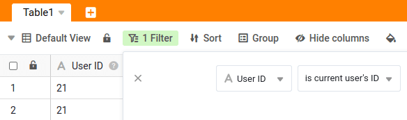

Jedes **Benutzerkonto** in SeaTable hat neben dem Namen und der E-Mail-Adresse auch eine **ID**, welche für [dynamische Filter](https://seatable.io/docs/ansichtsoptionen/was-ist-die-id-des-users-und-warum-kann-man-danach-filtern/) verwendet werden kann. Jede ID kann innerhalb eines Teams nur **einmal** vergeben werden.

Ändern können Sie diese ID in nur wenigen Schritten über die Teamverwaltung.

## Ändern der User-ID

1. Öffnen Sie die **Teamverwaltung**.
   3. Klicken Sie auf den Reiter **Team**.
   5. Wählen Sie einen **Benutzer** aus.
2. Geben Sie eine neue **Benutzer-ID** in das dafür vorgesehene Textfeld ein.
   8. Bestätigen Sie mit **Änderungen speichern**.



Die ID des Users können Sie frei wählen – mit zwei Einschränkungen:

- Die User-ID muss innerhalb eines Teams **einzigartig** sein.
- Die User-ID kann entweder eine **Zahl** oder ein **String** wie z.B. „3XTW4S“ sein. Sonderzeichen sind nicht erlaubt.



## Mit der User-ID filtern

SeaTable gibt Ihnen die Möglichkeit, Tabellenansichten über einen **dynamischen Filter** anhand der User-ID zu individualisieren. Dies bietet mehrere Vorteile für bestimmte Anwendungsfälle. Details dazu finden Sie im entsprechenden [Hilfeartikel](https://seatable.io/docs/ansichtsoptionen/was-ist-die-id-des-users-und-warum-kann-man-danach-filtern/).

