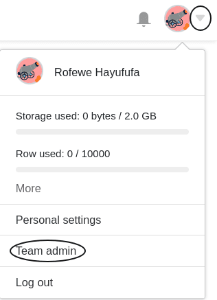
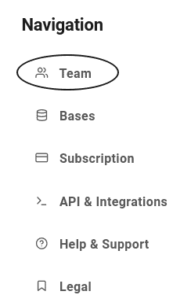
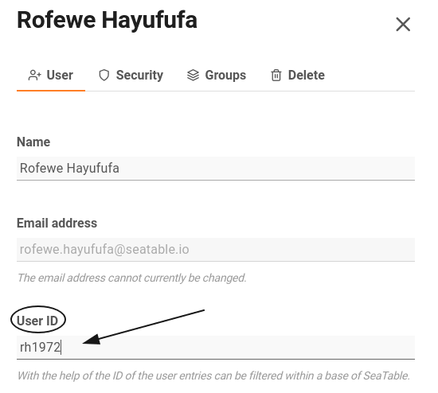
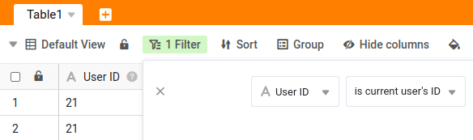

Each **user account** in SeaTable has, in addition to the name and email address, an **ID** that can be used for [dynamic filters](). Each ID can be assigned only **once** within a team.

You can change this ID in just a few steps via the team administration.

## Changing the User ID

1. Open the **Team administration**.

3. Click on the **Team** tab.

5. Select a **user**.
6. Enter a new **user ID** in the text box provided.

8. Confirm with **Save changes**.



You can freely choose the ID of the user - with two restrictions:

- The user ID must be **unique** within a team.
- The user ID can be either a **number** or a **string** like "3XTW4S". Special characters are not allowed.



## Filter with the User ID

SeaTable gives you the ability to customize table views via a **dynamic filter** based on the user ID. This offers several advantages for certain use cases. For details, see the corresponding [help article]().

