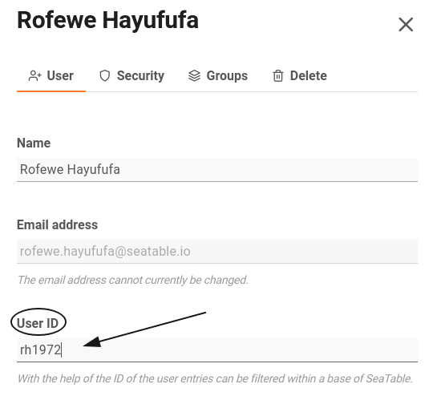

Chaque **compte d'utilisateur** dans SeaTable possède, en plus du nom et de l'adresse e-mail, un **identifiant** qui peut être utilisé pour [des filtres dynamiques](). Chaque ID ne peut être attribué qu'**une seule fois** au sein d'une équipe.

Vous pouvez modifier cet identifiant en quelques étapes seulement via la gestion d'équipe.

## Modifier l'ID utilisateur

1. Ouvrez la **gestion d'équipe**.

3. Cliquez sur l'onglet **Équipe**.

5. Sélectionnez un **utilisateur**.
6. Saisissez un nouvel **ID utilisateur** dans le champ de texte prévu à cet effet.

8. Confirmez en cliquant sur **Enregistrer les modifications**.



Vous pouvez choisir librement l'ID de l'utilisateur - avec deux restrictions :

- L'ID utilisateur doit être **unique** au sein d'une équipe.
- L'ID utilisateur peut être soit un **chiffre**, soit une **chaîne de caractères** comme par exemple "3XTW4S". Les caractères spéciaux ne sont pas autorisés.



## Filtrer avec l'ID utilisateur

SeaTable vous donne la possibilité de personnaliser les vues de tableau grâce à un **filtre dynamique** basé sur l'ID utilisateur. Cela présente plusieurs avantages pour certains cas d'utilisation. Vous trouverez des détails à ce sujet dans l ['article d'aide]() correspondant.

