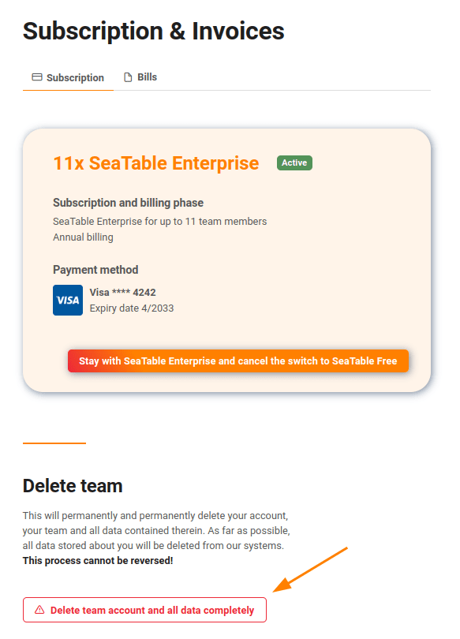

En tant qu'**administrateur d'équipe**, vous pouvez **supprimer complètement** votre équipe avec tous ses membres, ses bases et ses données.

## Pour supprimer votre équipe complète

1. Passez à la **gestion d'équipe**.
2. Cliquez sur l'option **Abonnement** à gauche sous **Navigation**.
3. Faites défiler vers le bas et cliquez sur **Compte d'équipe et supprimer complètement toutes les données**.
4. Confirmez la suppression.

## Que se passe-t-il si vous supprimez votre équipe ?

En confirmant la suppression, vous déclenchez immédiatement les actions suivantes :

- Votre équipe et tous ses membres seront supprimés.
- Toutes les bases et les données qu'elles contiennent sont supprimées.
- Votre abonnement, si vous en avez souscrit un, sera supprimé.
- Dans la mesure du possible, vos données sont supprimées de notre système de paiement Stripe. Si des factures ont été générées, Stripe ne peut cependant pas supprimer complètement votre compte.
- Vos adresses électroniques seront supprimées de notre système de messagerie Sendinblue.



## Résilier l'abonnement et conserver l'équipe

Si vous annulez votre abonnement, mais que vous souhaitez conserver l'équipe créée, vous pouvez revenir à un compte gratuit. Lisez l'article [Résilier l'abonnement]() pour savoir comment procéder.
