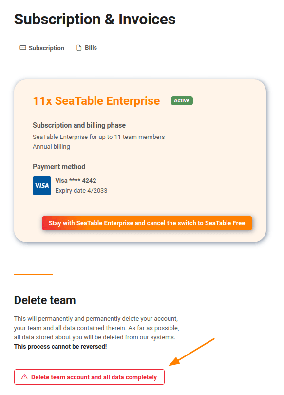

Como **administrador da equipa**, pode **apagar completamente** a sua equipa com todos os seus membros, bases e dados.

## Para apagar toda a sua equipa

1. Mudar para a **administração da equipa**.
2. Clique na opção **Subscrição** em **Navegação** no lado esquerdo.
3. Desça e clique em **Conta de equipa e apague completamente todos os dados**.
4. Confirmar a eliminação.

## O que acontece quando elimina a sua equipa?

Ao confirmar a eliminação, desencadeia imediatamente as seguintes acções:

- A sua equipa com todos os membros da sua equipa será eliminada.
- Todas as bases e os dados nelas contidos são apagados.
- A sua assinatura, se a tiver, será apagada.
- Os seus dados serão removidos do nosso sistema de pagamento Stripe, na medida do possível. No entanto, se tiverem sido geradas facturas, a Stripe não poderá apagar completamente a sua conta.
- Os seus endereços de correio electrónico serão removidos do nosso sistema de correio electrónico Sendinblue.



## Cancelar a subscrição e manter a equipa

Se cancelar a sua subscrição mas quiser manter a equipa que criou, pode regressar a uma conta gratuita. Leia o artigo [Cancelando a sua](https://seatable.io/pt/docs/abo-abrechnung/das-abo-kuendigen/) assinatura para saber exactamente como isto funciona.
