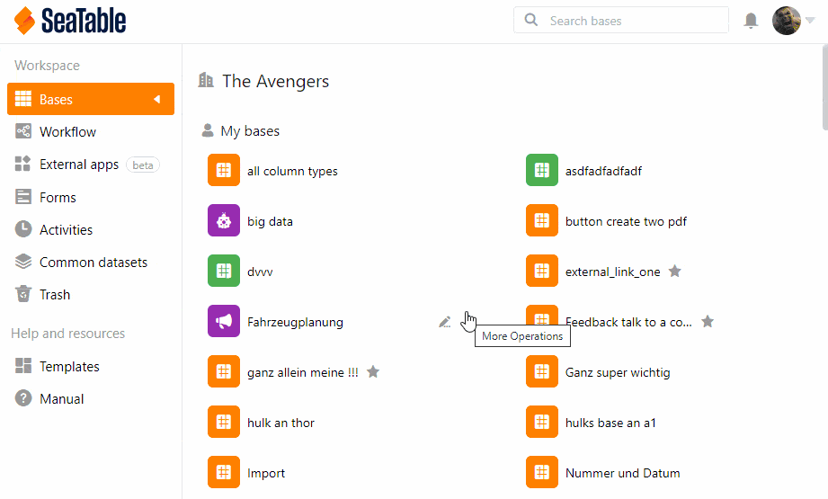
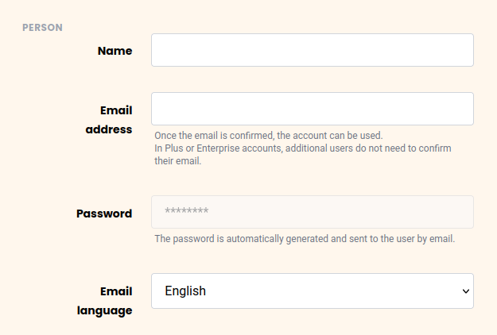
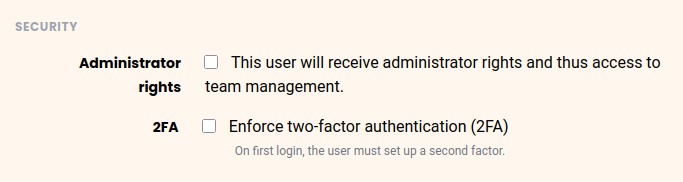
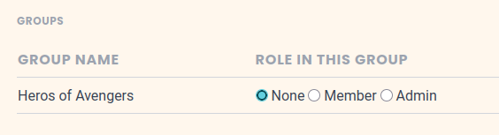

Como **administrador** del equipo, puede crear nuevos miembros del equipo a través de la **administración del equipo** sin que estén ya registrados en SeaTable. Durante el proceso de creación, ya puede asignar a su nuevo miembro del equipo a los grupos iniciales y realizar ajustes relevantes para la seguridad. A continuación, el nuevo miembro de su equipo recibirá sus **datos de acceso por correo electrónico** y podrá trabajar con usted de inmediato.

## Añadir miembros del equipo

1. Haga clic en su **perfil** en la esquina superior derecha.
2. Seleccione **Gestión de equipos** en el menú desplegable.
3. En **Navegación**, haga clic en el elemento del menú **Equipo**, seleccione la categoría **Usuarios**.
    

4. Haga clic en el botón **Agregar miembro del equipo**.
5. Introduzca el **Nombre** y la **Dirección de correo electrónico** de la persona que desea agregar como miembro del equipo.
    

6. Seleccione el **Idioma** en el que desea recibir correos electrónicos en el futuro.



**No puede** añadir a un **miembro del equipo** que ya haya creado otra cuenta SeaTable **con la misma** dirección de correo electrónico. Para crear una cuenta con esta dirección de correo electrónico, este usuario debe hacer una copia de seguridad de todos sus datos (por ejemplo, [exportar]()) como [archivo DTABLE]() y eliminar su cuenta anterior. Puede encontrar más información al respecto en el artículo ¿Se pueden [fusionar dos cuentas SeaTable?]()



### Opciones de seguridad

Puede establecer adicionalmente las siguientes **opciones de seguridad**:

- Decida si su nuevo miembro del equipo debe convertirse en **Administrador** del equipo.
- Decida si su nuevo miembro del equipo debe pasar por una **Autenticación de 2 factores**.

### Pertenencia a grupos

En la sección **Grupos**, puede seleccionar los grupos respectivos y determinar el rol que debe tener su nuevo miembro del equipo en el grupo: **ninguno**, **Miembro** o **Admin**. Al seleccionar una de las dos últimas opciones, agrega al nuevo miembro del equipo a los grupos.


