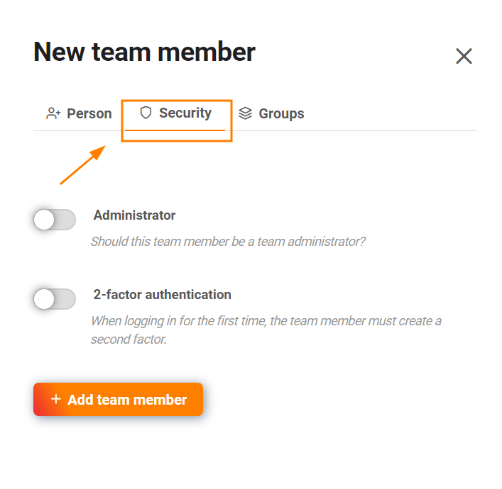
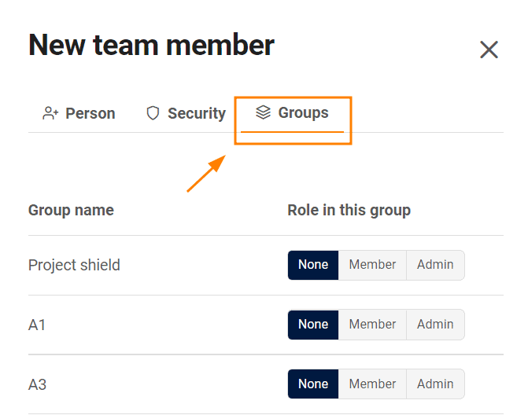

Como **administrador da equipa**, pode criar novos membros da equipa através da **administração da equipa** sem que eles já estejam registados no SeaTable. Durante o processo de criação, já pode designar o seu novo membro de equipa para os grupos iniciais e fazer configurações relevantes em termos de segurança. O seu novo membro da equipa receberá então os seus **dados de acesso por e-mail** e poderá trabalhar consigo imediatamente.

## Adicionar membros da equipa

1. Clique no seu **perfil** no canto superior direito.
2. Seleccione **Gestão de Equipas** a partir do menu pendente.
3. Clique no item do menu **Equipa** em **Navegação**.
4. Clique no botão **Adicionar membro da equipa**.
5. Abre-se uma nova janela. Definir o **nome do utilizador**.
6. Introduza o **endereço de correio electrónico da** pessoa que pretende adicionar como membro da equipa.
7. Definir a sua **própria palavra-passe** ou gerar uma **palavra-passe automática**, deixando a entrada em branco.
8. Seleccionar a **língua** em que o e-mail deve ser escrito.
9. Clique em **Add Team Member (Adicionar membro da equipa**).



**Não é possível** adicionar um **membro da equipa** que já tenha criado outra conta SeaTable **com o mesmo endereço de** correio eletrónico. Para criar uma conta com este endereço de e-mail, este utilizador deve fazer uma cópia de segurança de todos os seus dados (por exemplo, [exportar]() como um [ficheiro DTABLE]() e eliminar a sua conta anterior. Pode obter mais informações sobre este assunto no artigo [É possível fundir duas contas SeaTable?]()



## Outras opções ao criar um membro da equipa

Pode definir as seguintes **opções de segurança**, activando os controlos correspondentes:

- Decidir se o seu novo membro da equipa deve tornar-se um **administrador da** equipa.
- Decidir se o novo membro da sua equipa deve passar por uma **autenticação de 2 factores**.

Sob o separador **Grupos**, pode seleccionar os respectivos grupos e determinar o papel que o seu novo membro de equipa deve ter no grupo: **nenhum**, **membro** ou **administrador**. Se seleccionar uma das duas últimas opções, adiciona o novo membro da equipa aos grupos.


