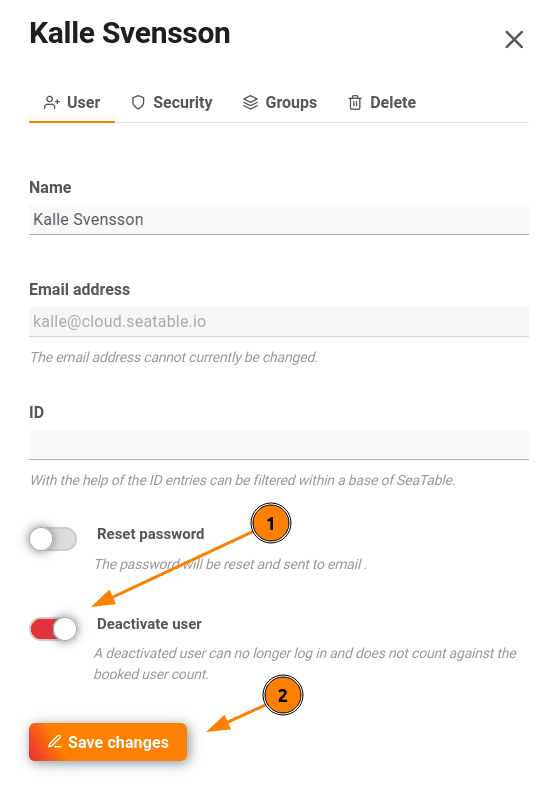

[Заблокированные члены команды]() больше не смогут войти в систему и работать с вами. Однако, будучи **администратором команды**, вы можете разблокировать их.

## Отсутствие входа для деактивированных членов команды

Если заблокированный или деактивированный член команды пытается войти в SeaTable, отображается следующее сообщение об ошибке:

На этом этапе член команды уже не может ничего делать самостоятельно.

## Разблокировка администратором команды

1. Переключитесь на **управление командой**.
2. Нажмите на пункт меню **Команда**.
3. Выберите заблокированного **члена команды**.
4. Выключите элемент управления **Disable User**.

  
После того, как вы внесете изменения **сохранено** член команды может снова войти в SeaTable Cloud или запросить новый пароль.
