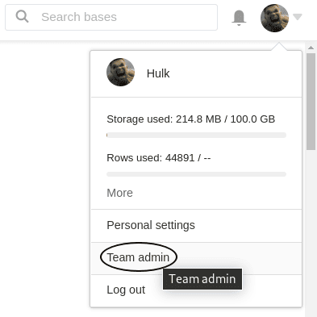
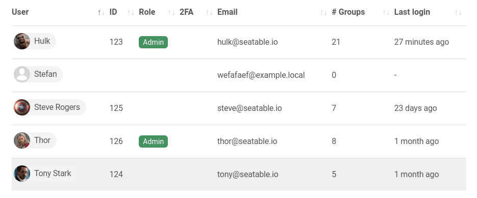
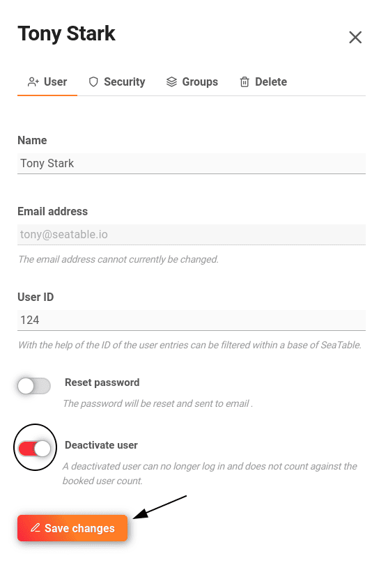
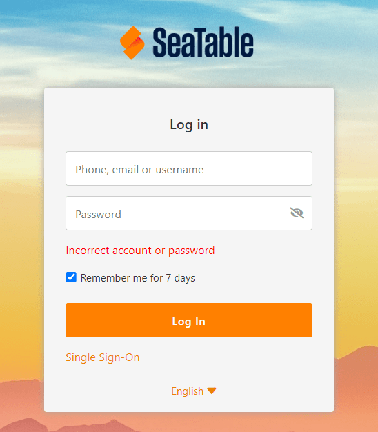

Para bloquear o eliminar miembros de un equipo, debe tener **derechos de administración**.

## Suspender a un miembro del equipo

1. Cambia a la **administración del equipo**.

3. Haga clic en la opción de menú **Equipo**.

5. Seleccione el **miembro del equipo**.

7. Se abre una nueva ventana. Active el control deslizante **Desactivar usuario** en la categoría **Persona** y guarde los cambios.

En cuanto el miembro del equipo bloqueado intenta conectarse, aparece el siguiente mensaje de error:

## Eliminar un miembro del equipo

1. Cambia a la **administración del equipo**.
2. Haga clic en la opción de menú **Equipo**.
3. Seleccione el **miembro del equipo**.
4. Se abre una nueva ventana. Seleccione la categoría **Eliminar**.
5. Active el control deslizante **¿Borrar de verdad?**
6. Haga clic en **Eliminar miembro del equipo**.

## Preguntas frecuentes

La base acaba en la papelera y puede ser [restaurada]() por un administrador del equipo.

En el momento en que se suprime el propietario de una base, la base se **suprime también para todos los demás** que tengan autorización de liberación. La base acaba en la papelera de reciclaje y, por tanto, puede ser [restaurada]() por un administrador.

El grupo del usuario eliminado permanece con todos los demás miembros.


