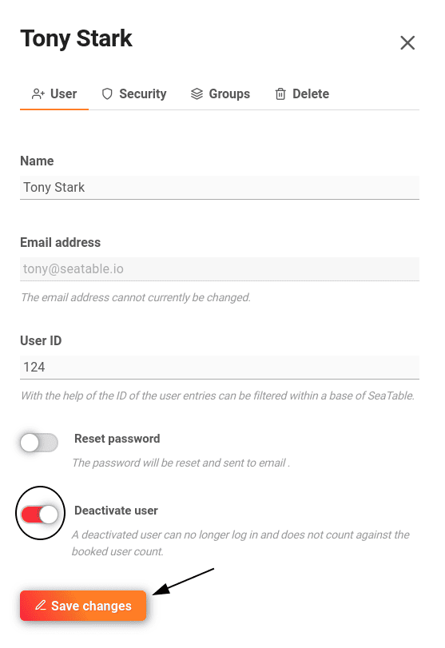

Pour bloquer ou supprimer des membres de l'équipe, vous devez disposer de **droits d'administration**.

## Suspension d'un membre de l'équipe

1. Passez à la **gestion d'équipe**.

3. Cliquez sur l'option de menu **Équipe**.

5. Sélectionnez le **membre de l'équipe**.

7. Une nouvelle fenêtre s'ouvre. Dans la catégorie **Personne**, activez le curseur **Désactiver l'utilisateur** et enregistrez les modifications.

Dès que le membre de l'équipe bloqué essaie de se connecter, le message d'erreur suivant s'affiche :

## Supprimer un membre de l'équipe

1. Passez à la **gestion d'équipe**.
2. Cliquez sur l'option de menu **Équipe**.
3. Sélectionnez le **membre de l'équipe**.
4. Une nouvelle fenêtre s'ouvre. Sélectionnez la catégorie **Supprimer**.
5. Activez le curseur **Supprimer vraiment ?**
6. Cliquez sur **Supprimer un membre de l'équipe**.

## Questions fréquentes

La base atterrit dans la corbeille et peut être [restaurée](https://seatable.io/fr/docs/historie-und-versionen/eine-geloeschte-base-wiederherstellen/) par un administrateur d'équipe.

Au moment où le propriétaire d'une base est supprimé, la base est **également supprimée pour tous les autres** qui ont une autorisation de partage. La base atterrit dans la corbeille et peut donc être [restaurée](https://seatable.io/fr/docs/historie-und-versionen/eine-geloeschte-base-wiederherstellen/) par un administrateur.

Le groupe de l'utilisateur supprimé subsiste avec tous les autres membres.


