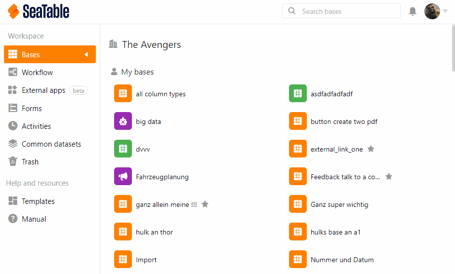

Als Team-Administrator können Sie neue Mitglieder zum Team hinzufügen und diesen Mitgliedern ebenfalls **Administrationsrechte erteilen**.

## Teammitglieder zu Administratoren machen

1. Klicken Sie auf Ihr **Profil** in der rechten oberen Ecke.
2. Wählen Sie im Drop-down-Menü die Option **Teamverwaltung** aus.
3. Gehen Sie unter **Navigation** auf den Menüpunkt **Team**.
4. Klicken Sie auf das **Teammitglied**, dem Sie Administrationsrechte geben möchten.
5. Ein neues Fenster öffnet sich. Aktivieren Sie unter **Sicherheit** den Regler **Administrator**.
6. Klicken Sie auf **Änderungen speichern**.

## Die Rechte eines Team-Administrators

Jeder Team-Administrator erhält **vollen Zugriff** auf die Teamverwaltung und hat **die gleichen Rechte**. Für einen genauen Überblick über alle Funktionen der Teamverwaltung lesen Sie bitte den Artikel [Die Funktionen der Teamverwaltung in der Übersicht]().


