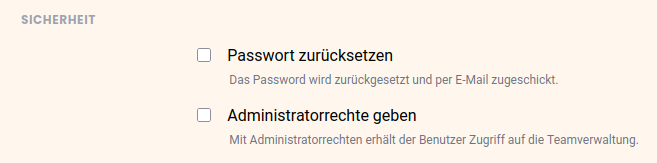

Como administrador da equipa, pode adicionar novos membros à equipa e também **conceder** a estes membros **direitos de administração**.

## Tornar os membros da equipa administradores

1. Clique no seu **perfil** no canto superior direito.
2. Seleccione **Gestão de Equipas** a partir do menu pendente.
3. Ir para o item do menu **Equipa** em **Navegação**.
4. Clique no **membro da equipa** a quem pretende dar direitos de administração.
5. Em **Segurança**, ative a caixa de verificação **Atribuir Direitos de Administrador**.

    

6. Clique em **Guardar Alterações**.

## Os direitos de um administrador de equipa

Cada administrador de equipa tem **pleno acesso à** administração da equipa e tem os **mesmos direitos**. Para uma visão geral detalhada de todas as funções da administração da equipa, leia por favor o artigo [As funções da administração da equipa em visão geral]().


