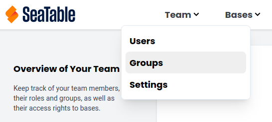
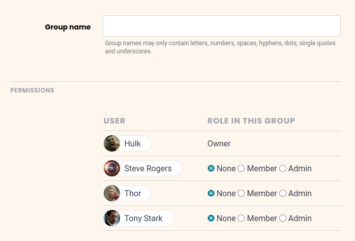

Как администратор команды, вы можете создавать новые группы в администрации команды. Следуйте этим инструкциям:

1. Переключитесь на **управление командой**.
2. В разделе **Навигация** нажмите на пункт меню **Команда**, выберите категорию **Группы**.
    

3. Нажмите на кнопку **Создать группу**.
4. Установите **Название** группы.
5. Выберите **Участников команды**, которые должны входить в группу, изменив их роль с **нет** на **Участник** или **Админ**.
    

6. Нажмите кнопку **Создать группу**.



Прочитайте статью [Члены группы и их разрешения](), чтобы узнать больше о ролях членов группы.
