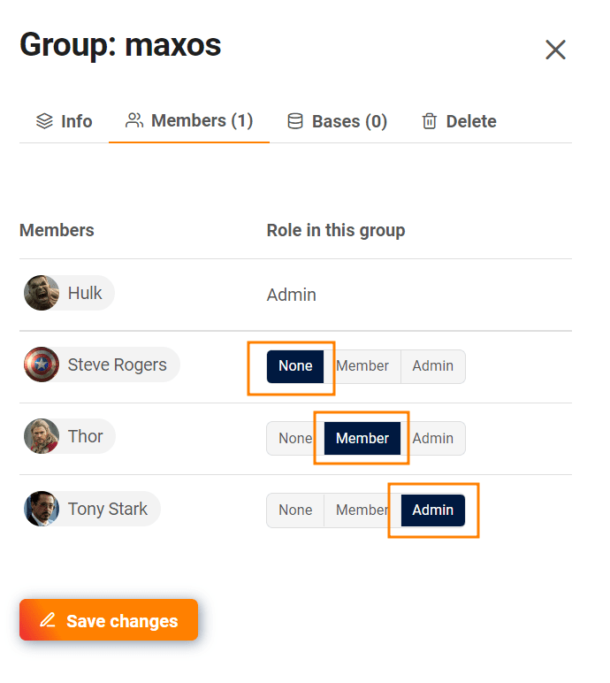

Der **Team-Administrator** hat die Kontrolle darüber, welches Teammitglied Teil welcher Gruppe ist. Sobald jemand **Mitglied** einer Gruppe ist, hat er normalerweise **Lese- und Schreibrechte** für alle Bases in dieser Gruppe.

Erfahren Sie im Artikel [Gruppenmitglieder und ihre Berechtigungen]() alles über die möglichen Rollen in einer Gruppe.

## Die Mitgliedschaft und Rollen in einer Gruppe ändern

1. Wechseln Sie in die **Teamverwaltung**.
2. Klicken Sie auf den Menüpunkt **Team**.
3. Wählen Sie die Kategorie **Gruppen** aus.
4. Wählen Sie eine **Gruppe** aus.
5. Ein neues Fenster öffnet sich. Klicken Sie auf die Kategorie **Mitglieder**.
6. Wählen Sie aus, welche **Rolle** die Mitglieder in der Gruppe einnehmen sollen. Sie haben folgende Optionen:
    - Keine
    - Mitglied
    - Administrator
7. **Speichern** Sie Ihre Änderungen per Klick auf den entsprechenden Button.



## Einem neuen Teammitglied direkt Gruppen zuweisen

Schon beim [Anlegen eines neuen Teammitglieds]() können Sie eine Person direkt verschiedenen Gruppen hinzufügen und ihr Rollen zuweisen.

1. Wechseln Sie in die **Teamverwaltung**.
2. Klicken Sie auf den Menüpunkt **Team**.
3. Klicken Sie auf **Teammitglied hinzufügen**.
4. Ein neues Fenster öffnet sich. Wählen Sie die Kategorie **Gruppen** aus.
5. Hier können Sie alle Gruppen auswählen, denen das neue Mitglied hinzugefügt werden soll, und seine Rolle in der Gruppe bestimmen.
