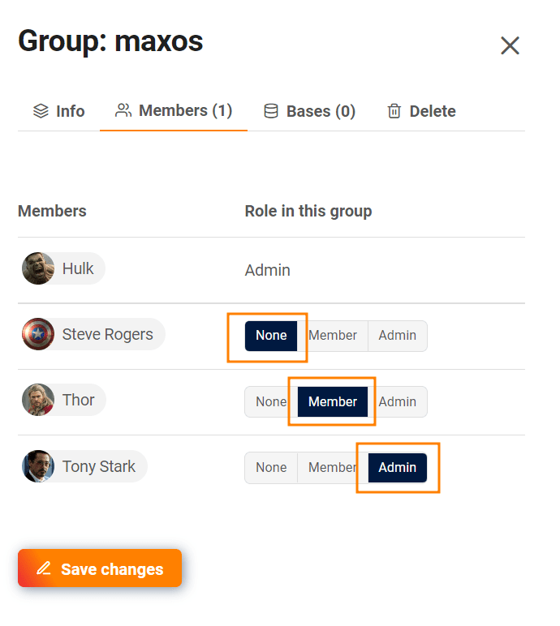

El **administrador del equipo** tiene el control sobre qué miembro del equipo forma parte de qué grupo. Una vez que alguien es **miembro de** un grupo, normalmente tiene **acceso de lectura y escritura** a todas las bases de ese grupo.

Aprende todo sobre los posibles roles en un grupo en el artículo [Miembros del grupo y sus permisos](https://seatable.io/es/docs/gruppenmitglieder-und-berechtigungen/gruppenmitglieder-und-ihre-berechtigungen/).

## Modificar los miembros y las funciones de un grupo

1. Cambia a la **administración del equipo**.
2. Haga clic en la opción de menú **Equipo**.
3. Seleccione la categoría **Grupos**.
4. Selecciona un **grupo**.
5. Se abre una nueva ventana. Haga clic en la categoría **Miembros**.
6. Seleccione **Rollo** que los miembros deben tomar en el grupo. Tienes las siguientes opciones:
    - Ninguno
    - Miembro
    - Administrador
7. **Guarde** los cambios haciendo clic en el botón correspondiente.



## Asignar grupos directamente a un nuevo miembro del equipo

Ya al [crear un nuevo miembro del equipo](https://seatable.io/es/docs/teamverwaltung/ein-neues-teammitglied-hinzufuegen/), puede añadir directamente a una persona a diferentes grupos y asignarle funciones.

1. Cambia a la **administración del equipo**.
2. Haga clic en la opción de menú **Equipo**.
3. Haga clic en **Añadir miembro del equipo**.
4. Se abre una nueva ventana. Seleccione la categoría **Grupos**.
5. Aquí puede seleccionar todos los grupos a los que se añadirá el nuevo miembro y determinar su función en el grupo.
