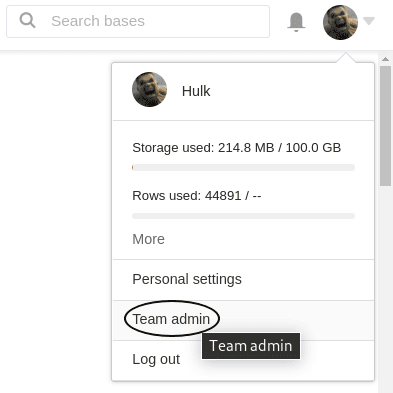



Users with **administrator rights** can change the team logo on their SeaTable home page at any time with just a few clicks via the team administration. By default, the SeaTable logo is displayed here.

By placing their company logo, Enterprise subscription users can customize the user interface to match their company's corporate design.

## Replace the team logo on the SeaTable home page

1. Switch to the **team administration**.

3. Click on the **Team** menu item.

5. Open the **settings**.

7. In the **Team Logo** section, upload the desired logo and save the changes with **Save Settings**.

