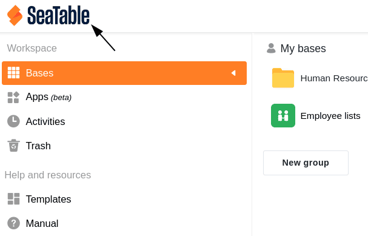
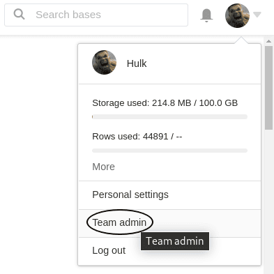
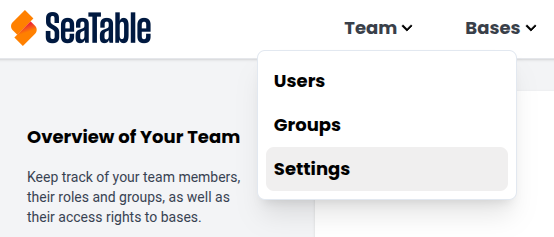
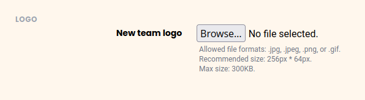



Los usuarios con **derechos de administrador** pueden cambiar el logotipo del equipo en su página de inicio de SeaTable en cualquier momento con sólo unos clics a través de la administración del equipo. El logotipo de SeaTable se muestra aquí por defecto.

Colocando el logotipo de su empresa, los usuarios con una suscripción Enterprise pueden adaptar la interfaz de usuario al diseño corporativo de su empresa.

## Sustituir el logotipo del equipo en la página de inicio de SeaTable

1. Cambia a la **administración del equipo**.

3. Haga clic en la opción de menú **Equipo**.

5. Abre los **ajustes**.

7. Cargue el logotipo deseado en el área **Logotipo del equipo** y guarde los cambios con **Guardar configuración**.

