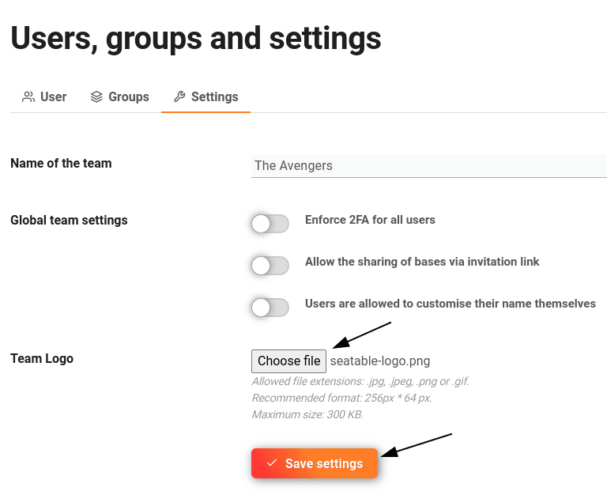



Les utilisateurs disposant de **droits d'administrateur** peuvent à tout moment changer le logo de l'équipe sur leur page d'accueil SeaTable en quelques clics via l'administration d'équipe. Par défaut, le logo SeaTable est affiché ici.

En plaçant le logo de leur entreprise, les utilisateurs disposant d'un abonnement Enterprise peuvent adapter l'interface utilisateur à l'identité visuelle de leur entreprise.

## Remplacer le logo de l'équipe sur la page d'accueil de SeaTable

1. Passez à l'**administration d'équipe**.

3. Cliquez sur l'option de menu **Équipe**.

5. Ouvrez les **paramètres**.

7. Dans la zone **Logo de l'équipe**, téléchargez le logo souhaité et enregistrez les modifications en cliquant sur **Enregistrer les paramètres**.

