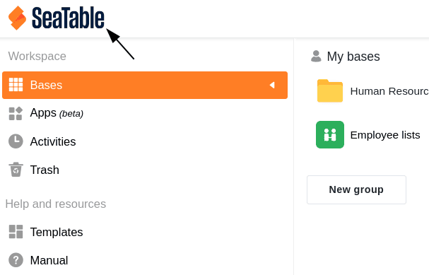



Os utilizadores com **direitos de administrador** podem alterar o logótipo da equipa na sua página inicial do SeaTable em qualquer altura, com apenas alguns cliques, através da administração da equipa. O logótipo SeaTable é apresentado aqui por defeito.

Ao colocar o logótipo da sua empresa, os utilizadores com uma subscrição Enterprise podem adaptar a interface do utilizador ao design corporativo da sua empresa.

## Substituir o logótipo da equipa na página inicial do SeaTable

1. Mudar para a **administração da equipa**.

3. Clique no item do menu **Equipa**.

5. Abrir as **definições**.

7. Carregue o logótipo pretendido na área **Logótipo da equipa** e guarde as alterações com **Guardar definições**.

