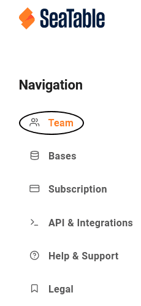



Пользователи с **правами администратора** могут в любое время изменить логотип команды на стартовой странице SeaTable всего несколькими щелчками мыши через администрацию команды. По умолчанию здесь отображается логотип SeaTable.

Разместив логотип своей компании, пользователи с подпиской Enterprise могут адаптировать пользовательский интерфейс к корпоративному дизайну своей компании.

## Заменить логотип команды на домашней странице SeaTable

1. Перейдите в **Управление командой**.

  

2. Нажмите на пункт меню **Команда**, затем на **Настройки**.

  

3. В разделе **Логотип команды** загрузите нужный логотип и сохраните изменения с помощью **Сохранить настройки**.

  

