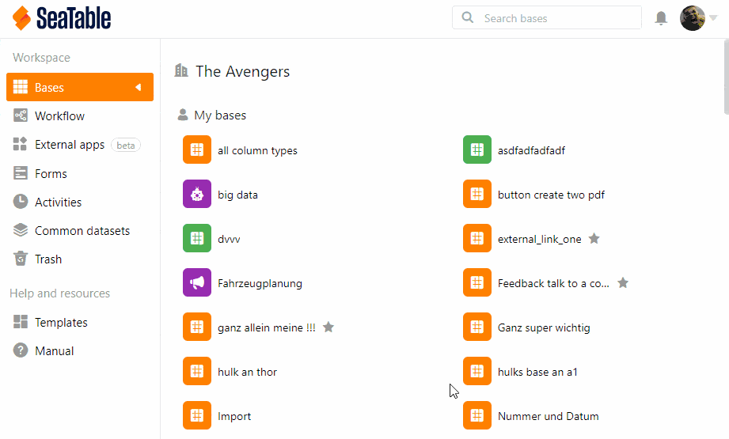
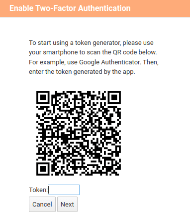

**Two-factor authentication** lets you set a second security barrier in addition to members' personal passwords. It also ensures that only each team member can personally access their account, even if someone else knows the password.

## To set 2FA for all team members

1. Go to the **Team administration**.
2. Click on the **Team** option.
3. Click **Settings**.
4. Turn on the **Enforce 2FA** slider **for all team members**.
5. Click **Save Settings**.

## How two-factor authentication works

SeaTable supports **two-factor authentication for** improved protection of your accounts against hacking attempts and brute force attacks. Two-factor authentication requires a second factor in addition to the username and password when logging in. This second factor is generated using an app on the smartphone of the respective team member. The second factor is a _six-digit numerical code that changes every 30 seconds_.

## Two-factor authentication setup

Once you have _activated the protection function_, all team members must _create_ a _second factor_ the next time they log in. A **QR code** is generated for this purpose. Team members must use a two-factor app on their smartphone to photograph the QR code so that a six-digit code is displayed to them. It looks like this:

Your team members need to set up two-factor authentication once. To do this, they scan the QR code with their respective smartphone, which establishes a link between the smartphone and SeaTable.

## Recommended 2FA app for your smartphone

Basically, any app should work for two-factor authentication. In the following article you will find an overview of the most popular apps: https://www.datamate.org/die-7-besten-2fa-apps-fuer-android-und-ios/.

Our personal favorite is [2FA Authenticator](https://2fas.com/).



If you only want to add two-factor authentication for **a single team member**, see the [Enable two-factor authentication for a team member]() article.


