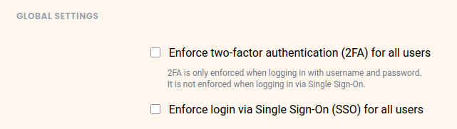

**La autenticación de dos factores** le permite establecer una segunda barrera de seguridad además de las contraseñas personales de los miembros. También garantiza que sólo cada miembro del equipo pueda acceder personalmente a su cuenta, aunque otra persona conozca la contraseña.

## Para establecer la 2FA para todos los miembros del equipo

1. Vaya a la **Gestión de equipo**.
2. Haga clic en la opción **Equipo** y seleccione **Configuración**.
    

3. Active la casilla **Forzar 2FA para todos los miembros del equipo**.
    

4. Haga clic en **Guardar configuración**.

## Cómo funciona la autenticación de doble factor

SeaTable admite la **autenticación de dos factores para** mejorar la protección de sus cuentas frente a intentos de pirateo y ataques de fuerza bruta. Con la autenticación de dos factores, se requiere un segundo factor además del nombre de usuario y la contraseña al iniciar sesión. Este segundo factor se genera mediante una aplicación en el smartphone del miembro del equipo en cuestión. El segundo factor es un _código numérico de seis cifras que cambia cada 30 segundos_.

## Configurar la autenticación de dos factores

Una vez _activada la función de protección_, todos los miembros del equipo deberán _crear_ un _segundo factor_ la próxima vez que se conecten. Para ello se genera un **código QR**. Los miembros del equipo deben utilizar una aplicación de dos factores en su smartphone para fotografiar el código QR de modo que se les muestre un código de seis dígitos. Se parece a esto:

Los miembros de tu equipo tienen que configurar la autenticación de dos factores una vez. Para ello, escanean el código QR con sus respectivos smartphones, lo que establece un vínculo entre el smartphone y SeaTable.

## Aplicación 2FA recomendada para su smartphone

Básicamente, todas las aplicaciones deberían funcionar para la autenticación de dos factores. En el siguiente artículo encontrará un resumen de las aplicaciones más populares: https://www.datamate.org/die-7-besten-2fa-apps-fuer-android-und-ios/.

Nuestro favorito es [2FA Authenticator](https://2fas.com/).



Si sólo desea añadir la [autenticación de doble factor]() para un **único miembro del** equipo, consulte el artículo [Activación de la autenticación de doble factor para un miembro del]() equipo.


