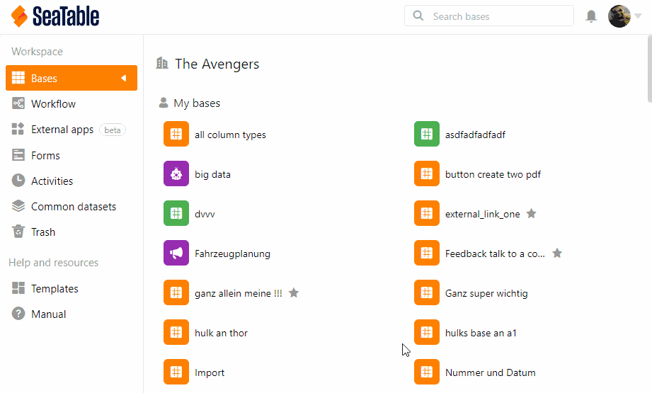
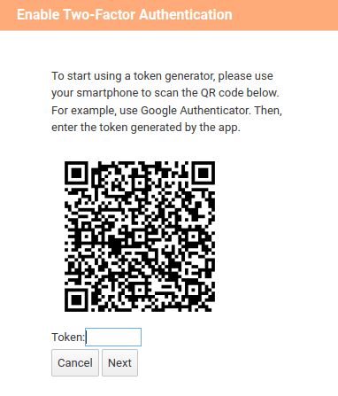

L'**authentification à deux facteurs** permet de définir une deuxième barrière de sécurité en plus du mot de passe personnel des membres. De plus, elle garantit que seul chaque membre de l'équipe peut accéder personnellement à son compte, même si une autre personne connaît son mot de passe.

## Pour configurer 2FA pour tous les membres de l'équipe, procédez comme suit

1. Allez sur l'**administration d'équipe**.
2. Cliquez sur l'option **Équipe**.
3. Cliquez sur **Paramètres**.
4. Activez le curseur **Forcer 2FA pour tous les membres de l'équipe**.
5. Cliquez sur **Enregistrer les paramètres**.

## Fonctionnement de l'authentification à deux facteurs

SeaTable prend en charge l'**authentification à deux facteurs** pour améliorer la protection de vos comptes contre les tentatives de piratage et les attaques par force brute. Avec l'authentification à deux facteurs, un deuxième facteur est demandé lors de la connexion, en plus du nom d'utilisateur et du mot de passe. Ce deuxième facteur est généré à l'aide d'une application sur le smartphone du membre de l'équipe concerné. Le deuxième facteur est un _code numérique à six chiffres qui change toutes les 30 secondes_.

## Configuration de l'authentification à deux facteurs

Dès que vous avez _activé_ la _fonction de protection_, tous les membres de l'équipe doivent _créer_ un _deuxième facteur_ lors de leur prochaine connexion. Un **code QR** est généré à cet effet. Les membres de l'équipe doivent utiliser une application à deux facteurs sur leur smartphone pour photographier le code QR afin qu'un code à six chiffres s'affiche. Cela ressemble à ceci :

Les membres de votre équipe doivent configurer l'authentification à deux facteurs une seule fois. Pour ce faire, ils scannent le code QR avec leur smartphone respectif, ce qui crée un lien entre le smartphone et SeaTable.

## Application 2FA recommandée pour votre smartphone

En principe, chaque app devrait fonctionner pour l'authentification à deux facteurs. Dans l'article suivant, vous trouverez un aperçu des apps les plus connues : https://www.datamate.org/die-7-besten-2fa-apps-fuer-android-und-ios/.

Notre favori personnel est [2FA Authenticator](https://2fas.com/).



Si vous souhaitez uniquement ajouter une authentification à deux facteurs **pour un seul membre de l'équipe**, consultez l'article [Activer l'authentification à deux facteurs pour un membre de l'équipe]().


