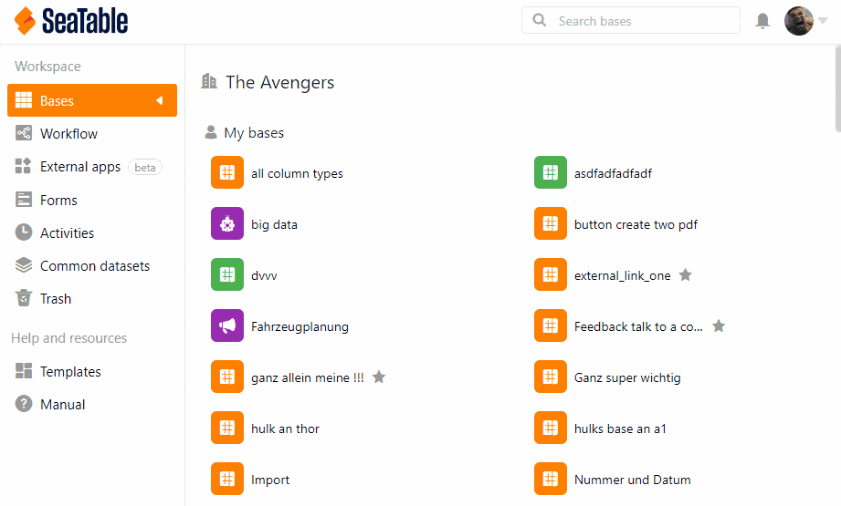

Als Team-Administrator können Sie die Zwei-Faktor-Authentifizierung sowohl für das gesamte Team als auch für einen einzelnen Account aktivieren. Sämtliche Details zur Zwei-Faktor-Authentifizierung finden Sie im Artikel [Zwei-Faktor-Authentifizierung für das gesamte Team erzwingen](https://seatable.io/docs/teamverwaltung/zwei-faktor-authentifizierung-fuer-das-gesamte-team-erzwingen/).

Im Folgenden wird nur beschrieben, wie Sie diesen zusätzlichen Schutz bei einem einzelnen Teammitglied aktivieren.

## Aktivierung der 2FA für ein Teammitglied

1. Wechseln Sie in die **Teamverwaltung**.
2. Klicken Sie auf die Option **Team**.
3. Wählen Sie das **Teammitglied** aus.
4. Aktivieren Sie unter **Sicherheit** die Option **2-Faktor Authentifizierung**.
5. Klicken Sie auf **Änderungen speichern**.
