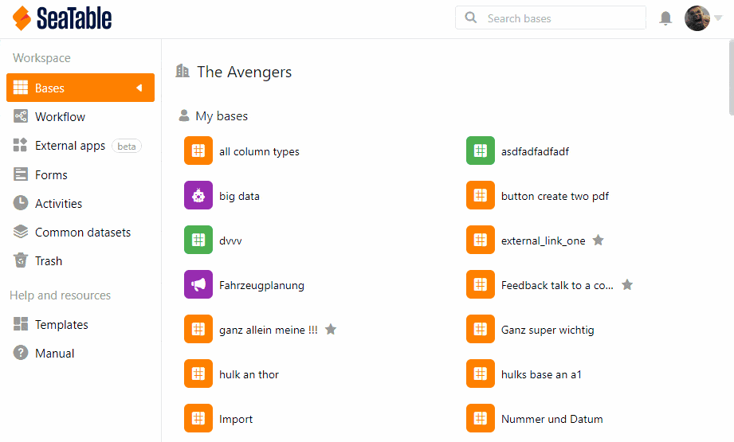

Como administrador de equipo, puede activar la autenticación de doble factor para todo el equipo, así como para una cuenta individual. Encontrará todos los detalles sobre la autenticación [de dos factores en el artículo Aplicar la autenticación de dos factores a todo el equipo]()).

A continuación sólo se describe cómo activar esta protección adicional en un miembro individual del equipo.

## Activación de la 2FA para un miembro del equipo

1. Cambia a la **administración del equipo**.
2. Haga clic en la opción **Equipo**.
3. Seleccione el **miembro del equipo**.
4. En **Seguridad**, active la opción de **autenticación de 2 factores**.
5. Haga clic en **Guardar cambios**.
