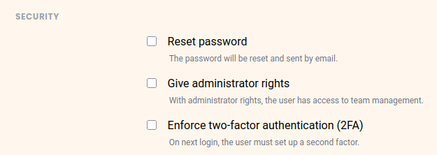

En tant qu'administrateur d'équipe, vous pouvez activer l'authentification à deux facteurs aussi bien pour l'ensemble de l'équipe que pour un seul compte. Vous trouverez tous les détails sur l'authentification à deux facteurs dans l'article [Forcer l'authentification à deux facteurs pour l'ensemble de l'équipe]().

Les paragraphes suivants décrivent uniquement comment activer cette protection supplémentaire pour un seul membre de l'équipe.

## Activation de 2FA pour un membre de l'équipe

1. Passez à l'**administration d'équipe**.
2. Cliquez sur l'option **Équipe**, puis **Utilisateurs**
    

3. Sélectionnez le **Membre d'équipe**.
4. Sous **Sécurité**, activez l'option **Forcer l'authentification à deux facteurs (2FA)**.
    

5. Cliquez sur **Enregistrer les modifications**.
