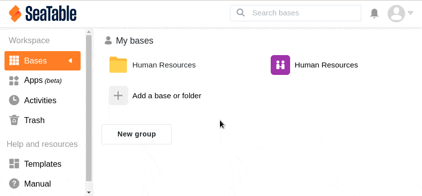

Für eine bessere Übersicht über Ihre Bases haben Sie die Möglichkeit, sowohl unter **Meine Bases** als auch unter **Für mich freigegeben** und in den einzelnen **Gruppen** neue **Ordner** anzulegen. Die Ordner können Sie beispielsweise verwenden, um verschiedene Bases zu einem Thema zu speichern. Hier erfahren Sie, wie Sie einen Ordner in SeaTable anlegen können:

## Einen Ordner über die Startseite anlegen

2. Wechseln Sie zur **Startseite** von SeaTable. 3. Je nachdem, ob Sie unter **Meine Bases**, **Für mich freigegeben** oder in einer bestimmten **Gruppe** einen Ordner anlegen möchten, klicken Sie im entsprechenden Bereich auf **Eine Base oder Ordner hinzufügen.** 4. Klicken Sie im sich öffnenden Drop-down-Menü auf **Ordner erstellen**. 5. Geben Sie dem Ordner einen beliebigen **Namen** und bestätigen Sie diesen mit einem Klick auf den grünen Haken. 6. Der **Ordner** erscheint nun im entsprechenden Abschnitt und Sie können diesen nach Belieben mit [Bases](https://seatable.io/docs/arbeiten-mit-bases/bases/) füllen.

Wichtiger Hinweis

Um innerhalb einer **Gruppe** einen Ordner anzulegen, müssen Sie entweder **Eigentümer** oder **Administrator** der Gruppe sein. Nutzern, die lediglich **Mitglieder** einer Gruppe sind, steht diese Funktion **nicht** zur Verfügung.

## Einen Ordner in der Ordner-Übersicht anlegen

Neben dem im ersten Abschnitt beschriebenen Weg können Sie ebenso einen Ordner über die **Ordner-Übersicht** anlegen. Diese wird in einem neuen Fenster automatisch geöffnet, wenn Sie einen bestehenden Ordner auf der **Startseite** anklicken.

2. Wechseln Sie zur **Startseite** von SeaTable. 3. Klicken Sie auf einen bereits bestehenden **Ordner**. 4. Klicken Sie im sich öffnenden Fenster auf **Neuen Ordner**. 5. Geben Sie dem Ordner einen beliebigen **Namen** und bestätigen Sie diesen mit einem Klick auf den **grünen Haken** oder mit der **Enter-Taste**. 6. Der Ordner erscheint nun sowohl in der geöffneten **Ordner-Übersicht** als auch im entsprechenden **Abschnitt** auf der Startseite und Sie können diesen nach Belieben mit Bases füllen.

Wichtiger Hinweis

Um innerhalb einer **Gruppe** einen Ordner anzulegen, müssen Sie entweder **Eigentümer** oder **Administrator** der Gruppe sein. Nutzern, die lediglich **Mitglieder** einer Gruppe sind, steht diese Funktion **nicht** zur Verfügung.
