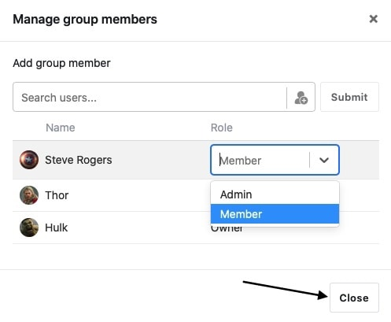

Innerhalb einer SeaTable Gruppe können Sie Berechtigungen vergeben, indem Sie Gruppenmitgliedern eine bestimmte Rolle zuweisen. Zu unterscheiden gilt es dabei zwischen den Rollen **Eigentümer**, **Administrator** und **Mitglied**, welche allesamt über unterschiedliche [Berechtigungen](https://seatable.io/docs/gruppenmitglieder-und-berechtigungen/gruppenmitglieder-und-ihre-berechtigungen/) verfügen.

Wichtig ist, dass Sie lediglich als **Eigentümer** oder **Administrator** einer Gruppe die Berechtigungen der anderen Mitglieder ändern können. Hier erfahren Sie, wie Sie Berechtigungen in einer Gruppe vergeben können:

## Berechtigungen in einer Gruppe vergeben

1. Wechseln Sie zur **Startseite** von SeaTable.
1. Klicken Sie auf das **Dreieck-Symbol** rechts neben dem Namen der Gruppe, für die Sie Berechtigungen vergeben möchten.
1. Gehen Sie auf **Mitglieder verwalten**.
   
1. Klicken Sie zum Bearbeiten auf das **Stift-Symbol** rechts neben der aktuellen Rolle des jeweiligen Gruppenmitglieds.
   
1. Wählen Sie mit einem Klick auf das Auswahlfeld die **Rolle** aus, die Sie dem jeweiligen Nutzer geben möchten.
1. Bestätigen Sie Ihre Auswahl mit einem Klick auf das Feld **Schließen**.
   

Wichtiger Hinweis

Wenn Sie sich nicht mehr ganz sicher sind, welche der drei Rollen über welche Berechtigungen verfügt, hilft Ihnen diese [Tabelle zu den Rollenberechtigungen](https://seatable.io/docs/gruppen/gruppenmitglieder-und-ihre-berechtigungen/) weiter.
