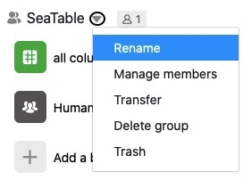
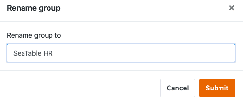

Bestehende Gruppen in SeaTable können von ihrem Eigentümer jederzeit umbenannt werden. Gruppenadministratoren und Gruppenmitglieder sind hingegen nicht dazu berechtigt. Hier erfahren Sie, wie Sie als Eigentümer den Namen einer Gruppe bearbeiten können.

## Gruppen-Namen bearbeiten in SeaTable

1. Wechseln Sie zur **Startseite** von SeaTable.
2. Klicken Sie auf das **Dreieck-Symbol** rechts neben dem Gruppen-Namen, den Sie ändern wollen.
3. Klicken Sie auf **Umbenennen**.
   5. Geben Sie einen beliebigen Namen ein.
4. Bestätigen Sie mit **Absenden**.
   

Kleiner Tipp

Der Name einer Gruppe darf nur aus _Buchstaben_, _Zahlen_, _Leerzeichen_, _Punkten_, _Bindestrichen_, _Unterstrichen_ und dem _#-Zeichen_ bestehen. Andere Zeichen sind aktuell nicht erlaubt.
