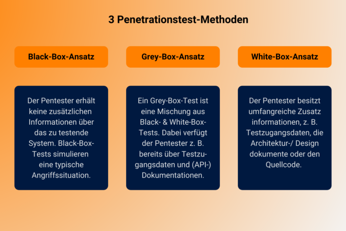

Datensicherheit ist heute in aller Munde und insbesondere im digitalen Raum gebührt dem Schutz sensibler Daten besondere Aufmerksamkeit. Für SeaTable ist ein **hoher Datenschutz- und Sicherheitsstandard** mehr als eine Floskel, er ist ein wesentliches Element hinter dem Gründungsgedanken der Firma, man könnte sogar sagen, ein Teil der Unternehmens-DNA. Damit haben die Gründer frühzeitig einen Bedarf erkannt, suchen doch immer mehr europäische Unternehmen und Einrichtungen nach europäischen Alternativen zu den großen US-amerikanischen Anbietern. Aus diesem Grund werden alle Daten der Cloud-Lösung konsequent auf deutschen Servern eines zertifizierten Schweizer Unternehmens gespeichert. Weitere Sicherheitsmaßnahmen sind u. a. HTTPS-Verschlüsselung, sichere Cookie-Verwaltung, eine Eingabevalidierung sowie das Prinzip der minimalen Berechtigungen, das sicherstellt, dass jeder Nutzer nur die notwendigen Zugriffsrechte erhält.

## So einfach wie ein Spreadsheet mit der Power eine Datenbank

SeaTable ist die **innovative No Code Lösung** für effizientes Datenmanagement und mit einem benutzerfreundlichen [App-Builder](). Dadurch ist jeder in der Lage, digitale Lösungen für seinen individuellen Bedarf zu erstellen – auch ohne Programmierkenntnisse. Mit SeaTable können Unternehmen die digitale Innovation und Transformation vorantreiben und gleichzeitig einen hohen Standard bei Datenschutz und Datensicherheit gewährleisten.

## Pentest bestätigt guten Schutz vor Cyberangriffen

In der ersten Hälfte 2024 haben Cyberangriffe auf Unternehmen gegenüber dem gleichen Zeitraum 2023 im DACH-Raum um 40 % zugenommen. Um im Wettlauf mit den stetig wachsenden digitalen Bedrohungen nicht den Anschluss zu verlieren, müssen Unternehmen potentiellen Hackerangriffen immer einen Schritt voraus sein. Aus diesem Grund hat SeaTable 2024 die SRC Security Research & Consulting GmbH damit beauftragt, einen Penetrationstest durchzuführen, um potentielle Schwachstellen zu identifizieren und zu bewerten. **Im Rahmen des mehrwöchigen Pentests wurden keine hohen Risiken erkannt.** Das Sicherheitsniveau von SeaTable wurde als „gut“ bewertet.

In einem nächsten Schritt strebt die SeaTable GmH in der zweiten Jahreshälfte 2025 die „[Beschleunigte Sicherheitszertifizierung](https://www.bsi.bund.de/DE/Themen/Unternehmen-und-Organisationen/Standards-und-Zertifizierung/Zertifizierung-und-Anerkennung/Zertifizierung-von-Produkten/Beschleunigte-Sicherheitszertifizierung/beschleunigte-sicherheitszertifizierung_node.html)“ (BSZ) durch das Bundesamt für Sicherheit in der Informationstechnik (BSI) an. Ralf Dyllick-Brenzinger, CEO der SeaTable GmbH, äußert sich im Interview zum Ergebnis und den weiteren Plänen des Unternehmens.

 Ralf Dyllick-Brenzinger, CEO der SeaTable GmbH

### Datenschutz und IT-Sicherheit sind wichtige Themen für SeaTable. Wie stellen Sie einen hohen Datenschutz bei Ihrer Cloud-Lösung sicher?

**RDB:** Unsere Server befinden sich ausschließlich in Deutschland. Wir arbeiten hier mit dem Schweizer Anbieter Exoscale zusammen. Die Nutzer unserer Cloud-Lösung können sich also darauf verlassen, dass Ihre Daten datenschutzkonform gespeichert und verarbeitet werden. Wem dies nicht ausreicht, der kann auf die On-Premises-Variante ausweichen und SeaTable selbst hosten. Um die Sicherheit unserer Cloud-Lösung von unabhängiger Stelle zu prüfen, haben wir in diesem Jahr einen Pentest in Auftrag gegeben.

### SeaTable existiert seit 2020. Warum haben Sie den Pentest erst jetzt durchführen lassen?

**RDB:** Unser Unternehmen und unsere Software sind in den letzten Jahren stetig gewachsen, mit inzwischen **über 150.000 Nutzern in über 50 Ländern** – und damit natürlich auch die Anforderungen an unsere IT-Sicherheitsumgebung. Zudem stehen wir jetzt an einer wichtigen Wegmarke. Immer mehr große Unternehmen und auch staatliche Einrichtungen bekunden Interesse an unserem Angebot und wir möchten gezielt international expandieren. Der Pentest hilft uns dabei, aktiv mögliche Schwachstellen zu erkennen und zu beseitigen – eine wichtige Voraussetzung für die von uns angestrebte **BSI-Zertifizierung** – und ist auch ein Signal an unsere bestehenden und potentiellen Kunden, dass Ihr Vertrauen in uns gerechtfertigt ist. 

### Es gibt auf dem Markt ja auch einige Security Scanner, welche die Sicherheit von Software prüfen und teilweise kostenlos sind. Warum war das keine Option?

**RDB:** Die Sicherheit der Daten unserer Kunden hat oberste Priorität und da wollten auf jeden Fall eine belastbare Experteneinschätzung. Die derzeit verfügbaren Tools bieten schon eine gewisse Unterstützung und wir setzen sie auch ein. Doch die meisten Scanner sind für eine echte Sicherheitseinschätzung nicht ausreichend. Sie basieren auf standardisierten Techniken, verstehen aber die Logik komplexer Prozesse nicht, z. B. wenn eine Kontoerstellung eine Zwei-Faktor-Authentifizierung erfordert. Es bedarf schon noch menschliche Pentester, um zu überlegen, wie man durch gezielte Maßnahmen andere, eigentlich geschützte Folgeschritte ausführen kann. Und wenn ein automatisiertes Tool Schwachstellen identifiziert, dann bewertet es in der Regel für jeden Fund separat, wie gefährlich die Sicherheitslücke ist. Pentester können dagegen auch beurteilen, ob verschiedene niedrige Schwachstellen kombiniert zu einem hohen Sicherheitsrisiko führen.

### Wie genau wurde der PenTest durchgeführt?

**RDB:** Getestet wurde die [Version 5.0]() von SeaTable. Das System wurde durch uns nach der offiziellen Anleitung installiert. Die Sicherheitseinstellungen waren mit denen unseres Cloud-Systems äquivalent. Vor allem ging es um **die Sicherheit der API und der Webanwendung**. Wir haben vorher gemeinsam mit SRC Security über die Ziele des Tests gesprochen und vereinbart, einen Cyberangriff mit Insiderwissen zu simulieren, einen sog. Grey-Box-Ansatz. Dabei verfügt der Angreifer über begrenzte Informationen über das System.

### Was war das Ergebnis?

**RDB:** Das Ergebnis fiel sogar noch etwas besser aus, als wir erwartet hatten. Wir hatten in der Vergangenheit kontinuierlich daran gearbeitet, unser System vor Cyberangriffen zu schützen und ein hohes Schutzniveau erreicht, aber schon damit gerechnet, dass die Pentester noch Schwachstellen erkennen würden. Im Ergebnis wurden zwei Schwachstellen identifiziert, aber keine mit hohem Risiko. Beide Schwachstellen werden mit einem der nächsten Updates beseitigt.

### Sie erwähnten die BSI-Zertifizierung. Wie geht es jetzt weiter?

**RDB:** SRC Security orientiert sich bei Pentests am „Durchführungskonzept für Penetrationstests“ des Bundesamts für Sicherheit in der Informationstechnik, kurz BSI. Mit dem erfolgreich durchgeführten Test sind wir daher gut vorbereitet, **um im nächsten Jahr eine BSI-Zertifizierung zu beantragen** und uns quasi amtlich die Sicherheit unserer Software bestätigen zu lassen. Staatliche Institutionen und auch viele große Unternehmen legen Wert auf eine solche Zertifizierung oder erwarten sie sogar. Es ist also ein wichtiger Vorteil im Wettbewerb, auch international, denn die BSI-Zertifizierung wird u. a. in Frankreich, Großbritannien, Kanada, Spanien, Israel und der Türkei anerkannt.

### SeaTable wurde durch eine chinesische Firma entwickelt, deren Eigentümer auch an Ihrer Firma beteiligt sind. China-Connections werden heute ja kritisch beäugt, insbesondere wenn es um den Schutz sensibler Daten und geistigen Eigentums geht. Wie gehen Sie damit um?

**RDB:** Unsere Partnerschaft mit Seafile Ltd., der Firma, die SeaTable entwickelt, ist kein Geheimnis und auch auf unserer Website zu finden. Den Punkt kommunizieren wir auch proaktiv im Gespräch mit Kunden. Wir kennen unsere Partner bereits seit mehreren Jahren und haben einvertrauensvolles Verhältnis aufgebaut. Aber wie gesagt, nehmen wir den Schutz der Daten unserer Kunden sehr ernst. Die Administration unseres Cloud-Dienstes erfolgt ausschließlich durch unser europäischen Admins. Die Seafile Ltd. und deren Mitarbeiter haben keinen Zugriff auf das System. **Wir übertragen keine Daten aus Europa heraus** und erst recht nicht nach China. Mit einem US-amerikanischen Dienst ist das nicht so. Und wer trotzdem noch Bedenken hat, kann SeaTable problemlos auf seinen eigenen Servern hosten. 

## Fazit

Der simulierte Cyberangriff hat bestätigt, dass SeaTable eine Anwendung mit hohem Sicherheitsstandard ist. Dabei sind die konkreten Anwendungsfälle nahezu unbegrenzt – ob als Bugtracker, IT Roadmap oder Ticketingsystem. Probieren Sie es einfach unverbindlich aus und [registrieren]() sich kostenlos.
