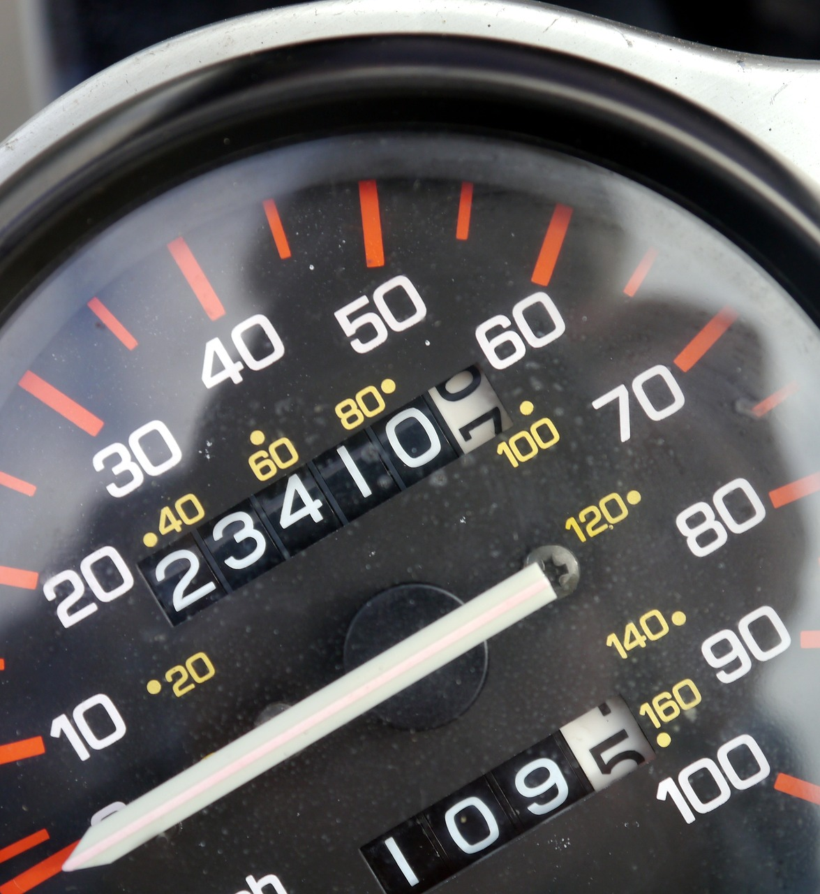
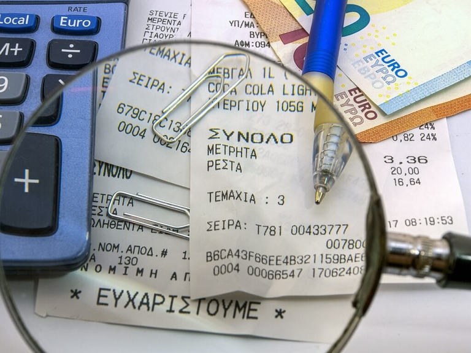

## Cómo convertir tu cuaderno de bitácora en una ventaja fiscal

A primera vista, un diario de a bordo puede parecer un simple registro de los trayectos realizados. Pero para muchos conductores tiene una importancia mucho mayor. Ya sea para autónomos con su propio **coche de empresa** o para empresarios con empleados que utilizan un coche de empresa, el cuaderno de bitácora no sólo sirve para documentar las distancias recorridas, sino que también aporta **ventajas fiscales**.

Aunque en general no es obligatorio llevar un cuaderno de a bordo, la Agencia Tributaria u otra autoridad puede exigirlo en determinados casos. Además, un cuaderno de viaje bien llevado ayuda a evitar la llamada **regla del 1%** y a demostrar claramente la proporción de viajes privados y de negocios. Por lo tanto, un diario de a bordo puede serle útil aunque no sea obligatorio.

Este artículo muestra lo que hay que tener en cuenta a la hora de llevar un diario de a bordo y ofrece una visión general informativa de las **herramientas más populares para la gestión digital de diarios de a bordo**.

## Si tiene más sentido un cuaderno de bitácora o la regla del 1

### ¿Qué es la regla del 1% para los coches de empresa?

La regla del 1% es un **método de tributación a tanto alzado para vehículos de empresa** que ofrece la Agencia Tributaria para calcular fácilmente el beneficio no monetario de un vehículo de empresa de uso privado. Esto significa que el uno por ciento del precio de catálogo bruto de su vehículo en Alemania se grava mensualmente como prestación por uso privado. Esto se aplica independientemente de la frecuencia con la que utilice realmente el coche para fines privados o profesionales.

Si merece más la pena un libro de registro o la regla del 1% para su coche de empresa **depende en gran medida del tipo de uso que haga el conductor**. Una regla práctica es la siguiente: Si utiliza el coche de empresa tanto para fines privados como profesionales, la tributación a tanto alzado suele ser la opción más favorable y sencilla.

.

### De cuándo merece la pena un diario de a bordo

La situación es distinta si utiliza el coche **menos de la mitad del tiempo con fines privados**. En este caso, el diario de a bordo puede ser ventajoso. Al documentar detalladamente cuándo y para qué utiliza el vehículo, puede demostrar a la Agencia Tributaria exactamente qué proporción de sus viajes es privada y cuál es profesional. De este modo, sólo puede declarar el uso privado real y posiblemente reducir significativamente el beneficio no monetario por el que tiene que pagar impuestos. En última instancia, los conductores de coches de empresa corren con los gastos, aunque no puedan reclamar sus propias deducciones fiscales. Sin embargo, si el coche se utiliza principalmente con fines profesionales, a largo plazo puede resultar rentable para la empresa.

**Nota**: Si documenta el uso de un coche de empresa con un libro de registro, lamentablemente no es posible cambiar al método a tanto alzado del 1% en el año en curso, y viceversa. En ese caso, el método elegido seguirá siendo vinculante durante todo el año.

## Requisitos legales y aspectos a tener en cuenta

Si también utiliza un coche de empresa de forma privada, es importante documentar concienzudamente **cada trayecto** para poder gravar correctamente el beneficio no monetario. Lo ideal es que anote los datos inmediatamente después de cada viaje o, como muy tarde, al final de la jornada. De este modo, evitará errores y manipulaciones y siempre tendrá constancia de sus desplazamientos.

.

Un cuaderno de bitácora que cumpla los requisitos del GoBD (principios de una contabilidad correcta) exige que se documente la siguiente información para los **viajes de negocios**:

- **fecha, hora y kilometraje**: Anote estos datos al principio y al final de cada viaje de negocios.
- Destino y motivo del viaje**: Anote adónde viajó y por qué. Si se ha desviado, anote también el itinerario seguido.
- Socios comerciales o clientes**: Si tenía una cita de negocios, debe anotar el nombre de la persona en cuestión.

Para los **viajes privados**, basta con indicar los kilómetros recorridos. Los desplazamientos entre el domicilio y el lugar de trabajo sólo requieren una breve anotación, ya que se producen con regularidad y no son necesarios más detalles. Al documentar cuidadosamente sus desplazamientos, no sólo satisface a la Agencia Tributaria, sino que usted mismo controla el uso de su coche de empresa.

## Qué busca la Agencia Tributaria en su cuaderno de a bordo

La Agencia Tributaria examina minuciosamente los cuadernos de ruta, ya que constituyen la base para las deducciones fiscales y la distinción entre el uso privado y profesional de los vehículos de empresa. Las autoridades fiscales no sólo comprueban las anotaciones del propio cuaderno, sino que a menudo también las comparan con otros documentos como **facturas de combustible y registros de mantenimiento**. Por ejemplo, el recibo de la gasolina de una ciudad determinada debe coincidir con los trayectos anotados en el cuaderno diario. De lo contrario, la Agencia Tributaria podría dudar de la **plausibilidad de sus datos**.

.

Incluso los pequeños **desfases o discrepancias**, como una distinción poco clara entre viajes profesionales y privados, pueden ser problemáticos. Si la Agencia Tributaria tiene conocimiento de tales errores, puede rechazar el cuaderno de bitácora y aplicar automáticamente la regla del 1%. Esta imposición a tanto alzado suele ser más cara y corre a cargo del propietario del vehículo. Por lo tanto, es especialmente importante tener cuidado al llevar un diario de a bordo.

Al llevar un libro de registro, ya sea manuscrito o digital, se aplica el principio de **trazabilidad**. Los cambios posteriores no deben en ningún caso ocultar las huellas u oscurecer las anotaciones originales. En un **cuaderno de a bordo manuscrito**, esto significa que sólo se pueden tachar las entradas incorrectas para que sigan siendo legibles; el uso de Tipp-Ex o medios similares está prohibido. En un **cuaderno de a bordo electrónico**, deben registrarse todos los cambios para garantizar un historial completo de los viajes en todo momento.

## Analógico frente a digital: ¿qué diario de a bordo le conviene más?

La elección del cuaderno de a bordo analógico o digital depende de sus preferencias y necesidades. Ambas variantes ofrecen ventajas específicas, pero también desventajas, que deberá sopesar en función del uso y la finalidad del diario.

### Cuaderno de bitácora analógico

El cuaderno de bitácora analógico, es decir, el clásico registro manuscrito, tiene ventajas sobre todo por su **independencia y sencillez**. Es accesible **en cualquier momento** (independientemente de un dispositivo técnico) y no requiere fuente de alimentación ni conexión a internet. Esta opción suele ser **inexpensive**, ya que sólo hay que comprar el propio diario de a bordo. Por lo tanto, un cuaderno de bitácora analógico es especialmente adecuado para usuarios ocasionales o personas que sólo tienen necesidades de documentación reducidas.

Sin embargo, la desventaja del cuaderno analógico es que requiere **más tiempo**, ya que hay que introducir manualmente cada viaje. Este esfuerzo manual también aumenta la **susceptibilidad a los errores**: La letra ilegible, la falta de datos o el olvido de entradas pueden hacer que los registros del diario de a bordo queden rápidamente inutilizables. También existe el **riesgo** de que el diario de a bordo se **dañe o se pierda por completo** debido al desgaste diario y a las inclemencias del tiempo.

### Llevar un cuaderno de bitácora digital

Los diarios de a bordo digitales son cada vez más populares, ya que ofrecen una **alternativa cómoda y moderna**. Una clara ventaja de los diarios de a bordo digitales es que **no pueden perderse ni dañarse**, lo cual es un problema con los diarios de a bordo físicos. Como las soluciones digitales suelen basarse en tecnologías en la nube, **sus datos se almacenan de forma segura y se puede acceder a ellos en línea en cualquier momento**. Además, los diarios digitales suelen estar equipados con herramientas de análisis que permiten **evaluar con precisión las rutas recorridas y los patrones de uso**. Por ejemplo, puedes evaluar y hacer un seguimiento de los kilómetros recorridos en relación con la finalidad de uso.

Un aspecto frecuentemente discutido de los diarios de a bordo digitales es la **protección de datos**. Aquí se aplican normas estrictas, especialmente si se procesan datos personales. Los buenos sistemas digitales encriptan y anonimizan sus datos y cumplen así los requisitos del Reglamento General de Protección de Datos (RGPD). Otro punto es el coste: los cuadernos de bitácora digitales suelen estar asociados a suscripciones continuas y los **costes del software o las apps** pueden variar en función del alcance de las funciones. En la práctica, sin embargo, el valor añadido del **ahorro de tiempo** y los análisis precisos de los datos pueden compensar a menudo estos costes.

## Comparación de cuadernos de bitácora digitales de Vimcar, Excel y SeaTable

Si quieres llevar un diario de a bordo, ahora hay una gran variedad de soluciones digitales, desde prácticas aplicaciones hasta completos programas informáticos. El mercado ofrece tanto versiones totalmente automatizadas como alternativas con entrada manual: hay algo para cada necesidad y cada presupuesto. Hemos puesto a prueba algunas de las herramientas más populares. Nos hemos centrado en los criterios de facilidad de uso, seguridad jurídica, protección de datos, costes, funciones de análisis y esfuerzo manual necesario.

### Vimcar diario de a bordo

Vimcar es un software de cuaderno de bitácora digital especial para empresas y autónomos que necesitan una documentación completa y conforme a la ley. Con funciones fáciles de usar como el **reconocimiento y categorización automáticos de viajes** y una integración perfecta en los flujos de trabajo existentes, Vimcar facilita la gestión del diario de a bordo.

* Facilidad de uso**: Gran facilidad de uso, app fácil de usar y manejo sencillo.
* Seguridad jurídica**: Legalmente conforme y reconocido a efectos fiscales.
* Protección de datos Los datos se almacenan encriptados en la nube
* **Costes**: Costes corrientes mediante suscripción mensual a partir de 13,90 euros al mes/vehículo
**Función de análisis**: Amplias funciones de análisis
**Esfuerzo manual**: Esfuerzo mínimo gracias al registro automatizado

**Nota**: Si ya utiliza Lexware como software de contabilidad, puede utilizar el libro de registro de Vimcar a través de Lexware, ya que ambas empresas cooperan entre sí.

### Libro de registro del conductor con Excel

Crear el diario de conducción con una plantilla de Excel es barato y flexible, pero **requiere todo un esfuerzo manual y alberga incertidumbres fiscales**. Aunque este método puede ser adecuado para fines internos, no suele ser reconocido por las autoridades. La razón de ello es la falta de un historial de cambios a prueba de manipulaciones, que impida que las entradas puedan ser manipuladas posteriormente. Este es un punto importante que a menudo descalifica a Excel como libro de registro fiscal.

* Facilidad de uso: Flexible, pero sin una interfaz prefabricada.
* Seguridad jurídica**: No es seguro desde el punto de vista legal, ya que la falta de un historial de cambios puede dar lugar a manipulaciones.
* Protección de datos**: Almacenamiento local, favorable a la protección de datos, pero sin cifrado.
**Costes**: Sin costes adicionales para los usuarios de Microsoft 365, ya que Excel ya está disponible.
**Función de análisis**: Flexible, pero sólo se puede analizar con mucho esfuerzo por su parte.
**Esfuerzo manual**: Esfuerzo manual muy elevado, ya que se gestiona de forma completamente manual

## Plantilla gratuita: Lleve un diario de a bordo digital y eficiente con SeaTable

Si busca una aplicación de cuaderno de bitácora que sea gratuita y le facilite el trabajo diario, SeaTable es una excelente elección. SeaTable ofrece una **plantilla de cuaderno de bitácora** flexible y personalizable (https://seatable.io/vorlage/gzggmm9nrqohu-ygi3fwrg/), que le permite registrar sus viajes digitalmente y gestionarlos cómodamente en línea.

SeaTable tiene una alta puntuación en **protección de datos** y te ofrece la posibilidad de elegir entre alojamiento [cloud]() y [On-Premises](), para que puedas decidir tú mismo dónde guardas tus datos. Otra ventaja: el **formulario web** integrado te permite introducir entradas de forma rápida y sencilla. Este formulario puede solicitar toda la información necesaria, incluida una **firma digital**, lo que hace que el proceso sea especialmente eficaz y seguro.

Destaca especialmente la posibilidad de generar un **código QR** directamente en SeaTable, que puede adjuntar, por ejemplo, al vehículo de su empresa. Esto le permite acceder cómodamente al formulario web del diario de a bordo en cualquier momento. SeaTable también permite realizar sencillos **análisis y evaluaciones** para que pueda hacer un seguimiento preciso del uso de su vehículo.



Después de enviar el formulario, los conductores ya no tienen acceso a sus entradas y, por lo tanto, no pueden realizar cambios o manipulaciones posteriores. Aunque tiene la opción de realizar ajustes directamente en la tabla, todos los cambios se registran detalladamente y, por tanto, permanecen localizables en todo momento.

* Facilidad de uso: Flexible, con plantilla preparada incl. formulario web.
* Seguridad jurídica**: Legalmente conforme con el historial de cambios
* Protección de datos Conforme a GDPR, en la nube o en las instalaciones, ubicación del servidor en Alemania.
* Costes**: Versión básica gratuita, más funciones a partir de 7 euros al mes/usuario
**Función de análisis**: Análisis exhaustivo con poco esfuerzo
**Esfuerzo manual**: Esfuerzo moderado debido a la introducción manual en el formulario

**Nota:** Con SeaTable no sólo puede llevar un cuaderno de bitácora individual, sino también gestionar toda su [gestión de flotas](https://seatable.io/vorlage/qsxitf8ktcojsuivrormnq/) de forma eficiente.

Si desea utilizar el cuaderno de bitácora digital de SeaTable, [simplemente regístrese]() y comience con la plantilla gratuita.

## Preguntas frecuentes



¿Tengo que documentar cada viaje?|||

Sí, si lleva un cuaderno de a bordo, debe documentar cada viaje para poder separar correctamente el uso privado del profesional y declararlo a efectos fiscales.

---

¿Qué debe figurar en un diario de a bordo?|||

En el cuaderno de a bordo debe constar toda la información necesaria para cada viaje:

- Fecha del viaje
- Hora de inicio y fin del viaje
- Kilometraje al principio y al final del viaje
- Destino y propósito del viaje
- Nombre del socio comercial o cliente (para viajes de negocios)

---

¿Qué ocurre si pierdo mi cuaderno de viaje?|||

Si pierde su cuaderno de pesca, las consecuencias dependerán de si estaba obligado a conservarlo:

**Si estaba obligado a llevarlo:** Perderlo le supondrá una multa de 100 euros. Además, la obligación de llevar el cuaderno de conducción puede ampliarse al no poder presentarlo.  

**Por libro de registro voluntario para la Agencia Tributaria**: En este caso, se aplica la regla del 1%, lo que suele conllevar costes más elevados, ya que el uso privado se grava a tanto alzado.

---

¿Es más favorable la norma del 1% o el libro de registro?|||

Cuanto menor sea la proporción de viajes privados, más vale la pena llevar un diario de a bordo; sin embargo, el método del 1% suele ser más favorable para el uso privado frecuente. En caso de duda, puedes calcularlo fácilmente online con una calculadora de vehículos de empresa.

---

¿Cuáles son las ventajas del diario de a bordo?|||

En resumen, puede decirse que un libro de registro para vehículos de empresa ofrece ventajas sobre todo si el uso privado del vehículo es escaso y el esfuerzo que supone un libro de registro parece justificado.  

Las alternativas digitales permiten acceder al cuaderno de a bordo en línea y simplifican considerablemente la administración, lo que las hace especialmente atractivas para las empresas y los autónomos que dan prioridad a la precisión y la eficacia.  

La posibilidad de documentar los viajes al detalle y con seguridad jurídica te permite maximizar los beneficios fiscales al tiempo que mantienes una visión clara del uso de tu vehículo.


