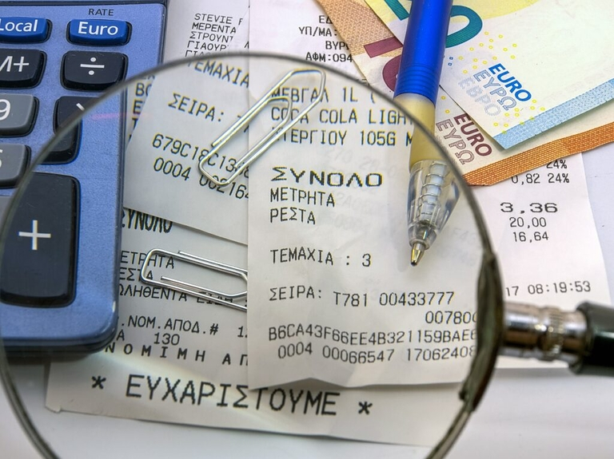

## Как превратить свой журнал в налоговое преимущество

На первый взгляд может показаться, что бортовой журнал - это просто запись пройденного расстояния. Но для многих водителей он имеет гораздо большее значение. Будь то индивидуальные предприниматели с собственным служебным автомобилем или предприниматели с сотрудниками, использующими служебный автомобиль, - журнал не только служит для документирования пройденных расстояний, но и дает налоговые преимущества.

Хотя ведение журнала не является обязательным, налоговая инспекция или другой орган может потребовать его в определенных случаях. Кроме того, правильно веденный журнал помогает избежать так называемого правила 1 % и предоставляет четкое доказательство соотношения частных и деловых поездок. Таким образом, ведение журнала может быть полезным для вас, даже если оно не является обязательным.

В этой статье мы расскажем вам о том, что необходимо учитывать при ведении журнала, а также представим информационный обзор наиболее популярных инструментов для ведения цифрового журнала.

## Что важнее - журнал или правило 1 %?

### Что такое правило 1 % для служебных автомобилей?

Правило 1 процента - это метод налогообложения служебных автомобилей по единой ставке, который налоговое ведомство предлагает для того, чтобы легко рассчитать неденежную выгоду от использования служебного автомобиля в личных целях. Это означает, что один процент от общей прейскурантной цены вашего автомобиля в Германии ежемесячно облагается налогом в качестве льготы на частное использование. Это происходит независимо от того, как часто вы используете автомобиль в личных или деловых целях.

Целесообразность использования журнала учета или правила 1 % для служебного автомобиля во многом зависит от типа использования автомобиля водителем. Полезное эмпирическое правило гласит: если вы используете служебный автомобиль как в личных, так и в деловых целях, налогообложение по единой ставке обычно является более дешевым и простым выбором.

Если же вы используете служебный автомобиль в основном в личных целях, то выгоднее использовать правило 1 %.](Ob-sich-ein-Fahrtenbuch-oder.jpg)

### Когда стоит вести бортовой журнал

Ситуация меняется, если вы используете автомобиль в личных целях менее половины времени. В этом случае журнал учета может стать преимуществом. Подробно документируя, когда и с какой целью вы используете автомобиль, вы можете доказать налоговой службе, какая часть ваших поездок является частной, а какая - деловой. Таким образом, вы сможете декларировать только фактическое частное использование и, возможно, значительно сократите неденежную выгоду, с которой вам придется платить налог. В конечном счете, расходы несут водители служебных автомобилей, даже если они не могут заявить о своих налоговых вычетах. Однако если автомобиль используется в основном в деловых целях, в долгосрочной перспективе это может оказаться выгодным для компании.

**Примечание:** Если вы документируете использование служебного автомобиля с помощью журнала учета, то, к сожалению, в текущем году невозможно перейти на метод фиксированной ставки 1% - и наоборот. Выбранный метод остается обязательным для применения в течение всего года.

## Требования законодательства и то, что вам нужно учесть

Если вы также используете служебный автомобиль в личных целях, важно добросовестно документировать каждую поездку, чтобы правильно уплатить налог на неденежные льготы. Очень важна оперативность: в идеале вы должны записывать детали сразу после каждой поездки или не позднее конца рабочего дня. Таким образом, вы сможете избежать ошибок и манипуляций и всегда будете в курсе своих поездок.

Журнал учета, отвечающий требованиям GoBD (принципы правильного ведения бухгалтерского учета), требует, чтобы в деловых поездках фиксировалась следующая информация:

- Дата, время и пробег: Отмечайте эти моменты в начале и в конце каждой командировки.
- Пункт назначения и цель поездки: Запишите, куда и зачем вы поехали. Если вы едете в объезд, запишите также маршрут.
- Деловые партнеры или клиенты: Если у вас была деловая встреча, запишите имя и фамилию собеседника.

Для частных поездок достаточно указать количество пройденных километров. Поездки между вашим домом и местом работы требуют лишь краткой записи, поскольку они совершаются регулярно и не требуют дополнительных подробностей. Тщательно документируя свои поездки, вы не только удовлетворяете требования налоговой инспекции, но и сами следите за использованием служебного автомобиля.

## Что налоговая инспекция ищет в вашем журнале учета

Налоговые органы тщательно проверяют журналы учета, поскольку они служат основанием для налоговых вычетов и разграничения частного и служебного использования служебного автомобиля. Налоговые органы проверяют не только записи в самом журнале, но и часто сравнивают их с другими квитанциями, такими как **счета за топливо и журналы технического обслуживания**. Например, ваш чек на топливо из определенного города должен соответствовать поездкам, записанным в журнале. В противном случае налоговая служба может усомниться в **правдоподобности ваших данных**.

Даже небольшие **пробелы или несоответствия**, например, нечеткое разграничение между деловыми и частными поездками, могут стать проблемой. Если налоговая служба узнает о таких ошибках, она может отклонить журнал и автоматически применить правило 1%. Такое налогообложение по единой ставке обычно обходится дороже и осуществляется за счет владельца транспортного средства. Поэтому ведение журнала особенно важно.

При ведении журнала, будь то рукописный или цифровой, действует принцип **отслеживаемости**. Последующие изменения ни в коем случае не должны скрывать следы или затушевывать первоначальные записи. В **рукописном бортовом журнале** это означает, что вы можете только зачеркивать неправильные записи, чтобы они оставались разборчивыми - использование Tipp-Ex или аналогичных средств запрещено. В **электронном журнале** необходимо регистрировать все изменения, чтобы обеспечить полную историю поездок в любое время.

## Аналоговый и цифровой журнал - какой журнал лучше выбрать

Подходит ли вам аналоговый или цифровой бортовой журнал, зависит от ваших индивидуальных предпочтений и требований. Оба варианта имеют определенные преимущества, но также и недостатки, которые вы должны взвесить в зависимости от использования и назначения журнала.

### Аналоговый журнал

Аналоговый журнал, то есть классическая рукописная запись, имеет преимущества, прежде всего, благодаря своей **независимости и простоте**. К нему **можно получить доступ в любое время** (независимо от технического устройства), он не требует источника питания или подключения к Интернету. Этот вариант часто является **экономичным**, поскольку вам нужно приобрести только сам журнал. Поэтому аналоговый журнал особенно подходит для случайных пользователей или тех, кто предъявляет лишь небольшие требования к документации.

Однако недостатком аналогового журнала является то, что он **более трудоемок**, так как каждую поездку приходится записывать вручную. Кроме того, ручной труд увеличивает **восприимчивость к ошибкам**: неразборчивый почерк, пропущенная информация или забытые записи могут быстро вывести журнал из строя. Существует также **риск** того, что ваш журнал будет **поврежден или полностью утерян из-за** повседневного износа и воздействия погодных условий.

### Ведение цифрового журнала

Цифровые бортовые журналы становятся все более популярными, поскольку они представляют собой **удобную и современную альтернативу**. Несомненным преимуществом цифровых журналов является то, что их **невозможно потерять или повредить**, что является проблемой для физических журналов. Поскольку цифровые решения обычно основаны на облачных технологиях, **ваши данные хранятся в безопасности и могут быть доступны в любое время в режиме онлайн**. Кроме того, цифровые журналы часто оснащены инструментами анализа, которые позволяют точно **оценить пройденные маршруты и особенности использования**. Например, вы можете оценивать и отслеживать пройденные километры в зависимости от цели использования.

**Защита данных** - часто обсуждаемый аспект цифровых журналов. Здесь действуют строгие правила, особенно если вы обрабатываете персональные данные. Хорошие цифровые системы шифруют и анонимизируют ваши данные и, таким образом, отвечают требованиям Общего регламента по защите данных (GDPR). Еще один момент - стоимость: цифровые журналы обычно связаны с постоянной подпиской, а **стоимость программного обеспечения или приложений** может варьироваться в зависимости от объема функций. Однако на практике дополнительные преимущества в виде **экономии времени** и точного анализа данных часто компенсируют эти расходы.

## Сравнение цифровых бортовых журналов Vimcar, Excel и SeaTable

Если вы хотите вести бортовой журнал, сегодня существует широкий выбор цифровых решений, от практичных приложений до комплексного программного обеспечения. На рынке представлены как полностью автоматические версии, так и альтернативные варианты с ручным вводом данных - найдется что-то для любых потребностей и любого бюджета. Мы проверили на практике некоторые из самых популярных инструментов. Мы ориентировались на такие критерии, как простота использования, юридическая безопасность, защита данных, стоимость, функции анализа и требуемые ручные усилия.

### Vimcar logbook

Vimcar - это цифровое программное обеспечение для ведения журнала, специально разработанное для компаний и индивидуальных предпринимателей, которым требуется полная и соответствующая законодательству документация. Благодаря таким удобным функциям, как **автоматическое распознавание и категоризация поездок**, а также беспрепятственной интеграции в существующие рабочие процессы, Vimcar облегчает ведение журнала.

- **Простота использования**: Высокая простота использования, удобное приложение и простое управление
- **Юридическая уверенность**: юридическая безопасность и признание для целей налогообложения
- **Защита данных**: Данные хранятся в зашифрованном виде в облаке
- **Затраты**: Текущие расходы за счет ежемесячной подписки от €13,90 в месяц за транспортное средство
- **Аналитические функции**: Широкие функции анализа
- **Ручные усилия**: Минимальные усилия благодаря автоматизированной записи

**Примечание**: Если вы уже используете Lexware в качестве бухгалтерского программного обеспечения, вы можете использовать журнал Vimcar через Lexware, так как обе компании сотрудничают друг с другом.

### Журнал учета с помощью Excel

Если вы создаете журнал учета с помощью шаблона Excel, это недорогой и гибкий способ, **но он требует больших ручных усилий и связан с налоговыми неясностями**. Хотя этот метод может подойти для внутренних целей, он обычно не признается властями. Причиной тому является отсутствие защищенной от взлома истории изменений, которая не позволяет манипулировать записями в ретроспективе. Это важный момент, который часто дисквалифицирует Excel как журнал учета, отвечающий требованиям налогового законодательства.

- **Простота использования**: Гибкость, но отсутствие готового интерфейса
- **Юридическая определенность**: Юридически не уверен, так как отсутствие истории изменений может привести к манипуляциям
- **Защита данных**: Локальное хранилище, защита данных, но без шифрования
- **Затраты**: Никаких дополнительных затрат для пользователей Microsoft 365, поскольку Excel уже доступен.
- **Аналитическая функция**: Гибкая, но анализ возможен только при больших личных усилиях
- **Ручные усилия**: Очень высокая трудоемкость, так как управление осуществляется полностью вручную

## Бесплатный шаблон: Ведите цифровой и эффективный бортовой журнал с помощью SeaTable

Если вы ищете бесплатное приложение для ведения журнала, которое облегчит вашу повседневную работу, SeaTable - отличный выбор. SeaTable предлагает **гибко настраиваемый** [шаблон журнала] (), позволяющий записывать ваши поездки в цифровом виде и удобно управлять ими в режиме онлайн.

SeaTable высоко оценивает **защиту данных** и предлагает выбор между [облаком]() и [локальным хостингом](), так что вы сами можете решить, где хранить свои данные. Еще одно преимущество: записи можно вводить быстро и легко с помощью встроенной **веб-формы**. Эта форма может запрашивать всю необходимую информацию, включая **цифровую подпись**, что делает процесс особенно эффективным и безопасным.

Особого внимания заслуживает возможность генерирования **QR-кода** непосредственно в SeaTable, который можно прикрепить, например, к служебному автомобилю. Это позволит вам в любой момент получить удобный доступ к веб-форме журнала. SeaTable также позволяет проводить простые **анализы и оценки**, чтобы вы могли точно отслеживать использование вашего автомобиля.



После отправки формы водитель больше не имеет доступа к своим записям и, следовательно, не может вносить в них какие-либо последующие изменения или манипуляции. Хотя у вас есть возможность вносить коррективы непосредственно в таблицу, все изменения подробно регистрируются и таким образом всегда отслеживаются.

- **Простота использования**: Гибкость, готовый шаблон, включая веб-форму.
- **Юридическая уверенность**: Юридическая безопасность благодаря истории изменений
- **Защита данных**: GDPR-совместимость, облако или локальное размещение, сервер в Германии
- **Цены**: Бесплатная базовая версия, дополнительные функции - от €7 в месяц/пользователь
- **Функция анализа**: Всесторонний анализ без особых усилий
- **Ручные усилия**: Умеренные усилия, связанные с ручным вводом данных в форму

**Примечание:** С помощью SeaTable вы можете не только вести индивидуальный бортовой журнал, но и эффективно управлять всем вашим [флотом]().

Если вы хотите использовать цифровой журнал SeaTable, [просто зарегистрируйтесь]() и начните с бесплатного шаблона.

## Часто задаваемые вопросы


Да, если вы ведете бортовой журнал, вы должны документировать каждую поездку, чтобы правильно разделить частное и деловое использование и заявить об этом для целей налогообложения.


Следующие сведения должны быть полностью занесены в журнал для каждой поездки:

- Дата поездки
- Время в начале и конце поездки
- Пробег на начало и конец поездки
- Пункт назначения и цель поездки
- Имя делового партнера или клиента (для деловых поездок)
  
  
  Если вы потеряете свой журнал, последствия будут зависеть от того, обязаны ли вы были его хранить:

**Если вы обязаны** вести бортовой журнал: Потеря влечет за собой штраф в размере 100 евро. Кроме того, срок действия требования о наличии журнала может быть продлен, так как журнал больше не может быть предъявлен.

**Если у вас есть добровольный журнал для налоговой инспекции**: В этом случае действует правило 1%, что часто приводит к увеличению расходов, так как частное использование облагается налогом по единой ставке.


Чем меньше доля частных поездок, тем целесообразнее вести журнал учета; однако метод 1% обычно более выгоден при частом частном использовании. Если вы сомневаетесь, вы можете легко рассчитать это онлайн с помощью калькулятора автомобилей компании.


Подводя итог, можно сказать, что журнал учета служебных автомобилей дает преимущества, прежде всего, в том случае, если частное использование автомобиля невелико, а усилия, которые требует журнал учета, кажутся оправданными.

Цифровые альтернативы делают журнал доступным в режиме онлайн и значительно упрощают администрирование, что делает их особенно привлекательными для компаний и индивидуальных предпринимателей, которые стремятся к точности и эффективности.

Возможность подробного и юридически обоснованного документирования поездок позволит вам получить максимальные налоговые льготы, сохраняя при этом четкий контроль за использованием автомобиля.


