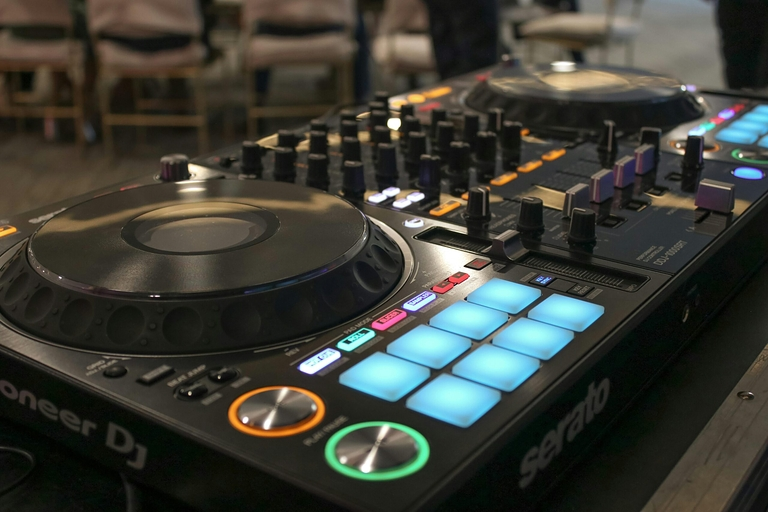

## Comment faire de votre événement un succès

Si vous souhaitez gérer des événements parfaits, vous devez tenir compte de certaines choses. Mais par où commencer si l'on ne s'y connaît pas en planification d'événements ? Comment éviter les erreurs de planification, les collisions de dates et les annulations ? Et quel outil d'inscription en ligne pour les événements peut vous aider au mieux à planifier un événement ?

Il n'existe pas de feuille de route universelle pour la multitude d'événements possibles - ils se distinguent tous par leurs détails. Néanmoins, cet article offre une vue d'ensemble des étapes incontournables à prendre en compte lors de la planification d'un événement.

Dans cet article, vous découvrirez quel outil d'inscription à un événement est gratuit et convient le mieux à vos besoins. Vous apprendrez également comment planifier un **événement et comment le réaliser de manière optimale grâce à une check-list**.

## Comment les outils en ligne facilitent la planification de votre événement

Les outils en ligne ont révolutionné la planification des événements et offrent de nombreux avantages par rapport aux méthodes analogiques traditionnelles. Auparavant, d'interminables listes sur papier, des tableaux confus dans Excel et d'innombrables e-mails déterminaient la planification d'un événement. Mais aujourd'hui, les outils numériques permettent une gestion centralisée et automatisée de toutes les tâches. Ce qui est particulièrement pratique, c'est que les équipes peuvent **gérer simultanément leurs événements, quel que soit l'endroit où elles se trouvent** - un avantage inestimable à une époque où le travail à distance est de plus en plus fréquent.

Les modifications peuvent être effectuées en temps réel, de sorte que toutes les personnes concernées voient immédiatement ce qui a changé. C'est particulièrement avantageux pour la gestion des listes d'invités ou l'adaptation des plans de salle. Les tâches répétitives telles que l'envoi d'e-mails peuvent être automatisées avec des solutions numériques, ce qui permet non seulement de gagner du temps, mais aussi d'éviter les erreurs manuelles.

La clarté est également un grand avantage. Toutes les informations sont regroupées en un seul endroit, ce qui vous évite de devoir passer d'un tableau ou d'un document à l'autre. Vous gardez ainsi beaucoup plus facilement une vue d'ensemble des tâches, des délais et des coûts - un véritable gamechanger pour les grands et petits événements.

## 5 outils de planification d'événements en comparaison

Les outils de planification d'événements sont légion. Choisir le logiciel qui convient le mieux à vos besoins peut donc être un véritable défi. Pour vous aider à faire votre choix, nous avons examiné de plus près cinq outils qui vous permettent de gérer vos événements. Dans notre comparaison, nous avons notamment pris en compte les critères suivants : facilité d'utilisation, fonctionnalité, protection des données et coûts.

### LineUpr

[LineUpr](https://lineupr.com/) est une application événementielle allemande basée sur un navigateur, qui est appréciée pour sa convivialité et sa flexibilité depuis sa création en 2016. Même sans installation, elle offre une solution simple pour fournir aux participants toutes les informations pertinentes - des programmes et des détails sur les lieux aux profils des groupes, en passant par les pages d'information et les actualités.

Un point fort particulier est la possibilité de saisir différentes statistiques à l'aide de l'application. Il est ainsi possible d'obtenir des informations importantes et d'analyser le succès de l'événement de manière transparente par la suite.

- **Facilité d'utilisation** : Très intuitive, aucune expertise technique requise.
- **Fonctionnalité** : Focalisation sur l'application mobile pour événements avec des fonctions de base.
- **Protection des données** : Les données sont traitées conformément au RGPD et stockées sur des serveurs allemands.
- **Coût** : À partir de 99 euros par événement ou à partir de 1.999 euros par an.

### idloom

[Idloom](https://www.idloom.com/) est une plateforme de gestion d'événements complète qui couvre tous les aspects de votre événement, de la planification de l'agenda à la billetterie, en passant par la facturation et le traitement des taxes. Fondée en 2015 en Belgique, l'entreprise accorde une grande importance à la sécurité, comme en témoigne notamment sa certification ISO-27001.

Une caractéristique particulière d'idloom est la flexibilité de l'inscription : des listes d'attente et des inscriptions de groupe à l'accès exclusif, la plateforme offre de nombreuses possibilités pour répondre à vos besoins individuels lorsque vous gérez des événements. En outre, idloom marque des points avec des intégrations, la possibilité de créer des certificats et une adaptation flexible aux exigences spécifiques de l'entreprise.

- **Facilité d'utilisation** : Intuitive, mais vaste, donc courte formation nécessaire.
- **Fonctionnalité** : Gestion complète des événements.
- **Protection des données** : Conforme au RGPD, offre de nombreuses fonctions de sécurité et de conformité.
- **Coût** : À partir de 150 euros par mois.

### SCOOCS

[Scoocs](https://scoocs.co/) est une plateforme communautaire et événementielle complète, fondée en Allemagne en 2019. Sa caractéristique unique est l'accent clairement mis sur les événements hybrides et virtuels. Avec Scoocs, vous disposez d'une solution flexible qui couvre tous les aspects de la gestion d'événements. De l'inscription aux possibilités de réseautage en passant par le streaming vidéo, la plateforme offre une expérience sans faille aux organisateurs comme aux participants.

L'offre est complétée par une application mobile qui peut être adaptée individuellement aux exigences de votre entreprise. Un autre point fort est la fonction d'analyse complète qui permet d'évaluer en détail le succès de la planification d'un événement.

- **Facilité d'utilisation** : Moderne, mais les fonctions complexes nécessitent une formation.
- **Fonctionnalité** : Événements virtuels/hybrides axés sur le réseautage, le matchmaking et la gamification.
- **Protection des données** : Serveurs dans l'UE, respect de la vie privée
- **Coût** : Une fois à partir de 4.500 euros pour 500 visiteurs, annuellement à partir de 3.000 euros.

### Converve

[Converve](https://www.converve.com/) est un logiciel d'organisation d'événements B2B polyvalent qui, depuis sa création en 2000 en Allemagne, aide les entreprises à gérer leurs événements. Converve est particulièrement fort dans le domaine du réseautage et de la génération de leads, ce qui fait de la plateforme un choix idéal pour les événements professionnels.

Le logiciel offre un large éventail de fonctions allant de la gestion des données et de l'inscription à une application ou un site web personnalisable, en passant par des options de réseautage et de matchmaking. Un autre point fort de Converve est la possibilité d'analyser les données de manière ciblée et de créer des rapports détaillés.

- **Facilité d'utilisation** : Flexible, mais complexe ; bien pensé pour les événements de réseautage.
- **Fonctionnalité** : Networking, génération de leads, matchmaking.
- **Protection des données** : Conforme au RGPD, bonnes mesures pour un transfert de données sécurisé.
- **Coût** : 4.190 euros pour 1 à 100 participants

### SeaTable

[SeaTable](), fondé en 2020 en Allemagne, est une base de données no-code innovante avec un app-builder intégré. Cet outil vous offre une gestion flexible des données et de multiples possibilités de collaboration, non seulement pour gérer des événements, mais aussi pour de nombreux domaines d'application. Grâce à son interface conviviale, vous pouvez créer en un clin d'œil votre propre système de gestion des données et des apps personnalisées.

SeaTable est particulièrement utile pour vos événements : Planifier un événement devient un jeu d'enfant avec le modèle de SeaTable. Vous pouvez par exemple garder un œil sur vos dépenses, générer des factures et gérer votre liste de participants en ligne - gratuitement et sans connaissances techniques préalables.

SeaTable propose également des fonctions d'automatisation, comme l'envoi automatique d'e-mails. Même plusieurs événements peuvent être gérés de manière centralisée au même endroit, sans perdre la vue d'ensemble. Planifiez les budgets, suivez les coûts et envoyez les factures en un seul clic.

- **Philarité d'utilisation** : Intuitif et facile à utiliser.
- **Fonctionnalité** : Gestion flexible, y compris fonctions de collaboration et d'automatisation.
- **Protection des données** : Conforme au RGPD, serveurs allemands, installation sur site en option pour une souveraineté totale des données.
- **Coût** : Version de base gratuite, plus de fonctions à partir de 7 € par utilisateur/mois.

## Comment gérer parfaitement des événements en 10 étapes\*\*\*.

Gérer des événements avec succès est souvent un défi. Dans le tourbillon de l'organisation, il est facile de passer à côté de quelque chose, même avec des outils intelligents. Pour vous aider à vous préparer au mieux, nous avons créé pour vous une liste de contrôle utile pour les événements.

**1\. Définir l'objectif de l'événement**.

La toute première chose à faire lors de la planification d'un événement est de formuler clairement l'objectif de l'événement. Quelle est la raison pour laquelle vous planifiez cet événement ? Visez-vous des revenus ? Souhaitez-vous renforcer la notoriété de votre marque ou la fidélisation de vos clients ? Peut-être lancez-vous un nouveau produit et utilisez-vous l'événement comme plate-forme pour le présenter à vos clients ?

Il est également important de définir dès le départ le type d'événement que vous prévoyez. Gardez toujours à l'esprit si vous gérez un événement pour vos collaborateurs, un événement pour vos clients ou des événements publics. Grâce à ces informations, vous pouvez prendre des décisions éclairées pendant la phase de planification et mieux adapter l'événement à votre public cible.

Conseil : un objectif spécifique et mesurable vous aidera à évaluer le succès de votre événement après celui-ci.

**2\. Développer le concept**

Lorsque vous développez votre concept, vous devez vous concentrer sur deux points principaux : l'organisation et le contenu. Pour la partie organisationnelle, déterminez par exemple la taille de votre événement et sa durée. Dès le début, répartissez les responsabilités au sein de votre équipe afin qu'aucune tâche ne soit négligée ou oubliée.

Pour le concept de contenu, il est d'abord important de développer une idée de manifestation et de la compléter éventuellement par un slogan approprié. Le thème peut ensuite avoir une influence sur la décoration, le code vestimentaire et le programme de divertissement. En outre, vous devez développer le programme avec soin afin de vous assurer que vos invités sont toujours divertis et ne s'ennuient pas. Un fil rouge continu est à cet égard essentiel pour donner à votre événement une note professionnelle et convaincre vos invités.

**3\. Planifier le budget**

Pour éviter de gérer des événements qui dépassent votre budget, il est essentiel, dans la gestion des événements, d'effectuer au préalable une [planification budgétaire] détaillée (). Prenez en compte non seulement les dépenses évidentes, mais aussi les coûts moins évidents tels que les licences, les frais de déplacement, les invitations ainsi que les frais de démontage et de nettoyage.

Les principaux postes de dépenses à prendre en compte :

- **Lieu** : Coûts de location des lieux, y compris les éventuels frais annexes tels que le nettoyage ou les services de sécurité.
- **Technique** : Dépenses pour la location de matériel audio, vidéo et d'éclairage, ainsi que les coûts salariaux des techniciens ou du personnel de support.
- **Catering** : Budget pour la nourriture et les boissons, y compris les frais de service, les pourboires et les éventuelles dépenses supplémentaires pour des demandes de repas spéciales.
- **Marketing** : Coûts de publicité, d'impression d'invitations ou de flyers, ainsi que de publicité en ligne ou de promotion sur les réseaux sociaux.
- **Spectacle** : Budget pour des prestations en direct, des DJ, des artistes ou d'autres formes de divertissement événementiel.

En planifiant et en budgétant soigneusement ces principaux postes de dépenses ainsi que les dépenses supplémentaires pour votre événement, vous pouvez vous assurer que votre événement reste dans les limites financières et qu'il n'y a pas de coûts imprévus. Si vous gérez des événements commerciaux, vous pouvez calculer sur cette base le montant des entrées que vous devrez demander pour couvrir les frais.

Conseil : vous pouvez peut-être réduire les coûts en faisant appel à des bénévoles ou à des sponsors.

**4\. Créer un calendrier**.

Le B.A.-BA de la planification d'un événement est de s'y prendre à l'avance. En effet, les réservations de lieux ou les prises de rendez-vous avec les entreprises de restauration nécessitent un délai considérable. Pour éviter tout stress lors de la planification, il est donc recommandé d'établir un calendrier détaillé.

Un tel calendrier vous permet non seulement de déterminer exactement quand telle ou telle étape doit être franchie, mais aussi d'identifier à temps les retards potentiels. Il est important de prévoir une marge de manœuvre afin de pouvoir compenser les changements de plan imprévus et de minimiser ainsi les éventuelles contraintes de temps et le stress.

Conseil : vérifiez au préalable que votre rendez-vous ne coïncide pas avec d'autres dates importantes, des jours fériés ou des vacances scolaires.

**5\. Trouver un lieu**

Pour pouvoir gérer et planifier des événements réussis, vous avez besoin de lieux adaptés. Vous avez la possibilité de louer un lieu ou d'utiliser vos propres locaux. Il est important de s'assurer qu'il y a suffisamment de place pour tous les invités, le traiteur, la scène et la technique.

Lors du choix du bon lieu, il est essentiel de garder à l'esprit les besoins de votre groupe cible. Vérifiez par exemple s'il y a suffisamment de places de parking ou si le lieu est accessible aux personnes à mobilité réduite. Il se peut également que vous ayez besoin d'un jardin ou d'autres exigences spécifiques que vos invités apprécieraient.

**6\. Réserver un traiteur et un programme**

Le principe de base est le suivant : des invités affamés sont des invités mécontents. C'est pourquoi il est important, dans la mesure du possible, de prévoir un service de restauration. Pour cela, vous avez le choix entre différentes options, des buffets aux menus en passant par les fingerfoods ou même les food trucks. Veillez toutefois à proposer également des alternatives végétariennes et végétaliennes afin de répondre aux besoins de tous les invités.

Pour rendre votre programme-cadre plus intéressant et vous assurer que vos invités passent un bon moment, il existe de nombreuses possibilités. Outre les artistes de spectacle, des groupes de musique ou des DJ peuvent créer une bonne ambiance. Les orateurs et les présentateurs offrent une possibilité élégante de guider les visiteurs de votre événement tout au long de la journée ou de la soirée. Avec une garde d'enfants, vous veillez à ce que les invités de tous âges puissent profiter de votre événement.

**7\. Envoyer des invitations**.

Lorsque vous gérez des événements, les invitations jouent un rôle crucial dans votre succès. L'utilisation d'invitations personnalisées vous permet d'augmenter efficacement le nombre de participants. En outre, l'envoi de notifications "Save the Date" pendant la phase de planification peut contribuer à susciter l'intérêt à un stade précoce et à garantir que vos invités réservent la date.

N'oubliez pas d'inclure dans les invitations des informations importantes telles que la date, l'heure, le lieu et le programme. Pour faciliter le processus de réservation pour vos invités, l'intégration d'un système de réservation de billets est une bonne solution. Grâce à un [formulaire web]() dans le [modèle] préfabriqué() de SeaTable, vous pouvez facilement réaliser cette étape et créer une liste de participants de manière totalement automatisée.

**8\. Faire du marketing**

Pour que votre événement soit bien fréquenté et que sa planification en vaille la peine, il est essentiel d'en faire la promotion. Pour ce faire, utilisez tous les canaux qui vous permettent d'atteindre au mieux votre groupe cible.

Pour les événements internes au personnel, vous pouvez par exemple utiliser des affiches dans l'entreprise, des annonces via la newsletter ou des invitations par e-mail. Vous pouvez également demander aux cadres d'évoquer l'événement lors des réunions d'équipe afin que la nouvelle se répande dans les couloirs.

Pour les événements commerciaux tels que les festivals, une publicité ciblée via les plateformes de médias sociaux, des annonces dans des magazines pertinents et une mention sur votre propre site web sont utiles. Si vous prévoyez une [exposition d'art](), vous pouvez miser sur des affiches, des flyers, des communiqués de presse et l'intégration de magazines d'art et de culture.

Il est important de lancer les mesures publicitaires à temps et de présenter les messages de manière attrayante et informative afin d'éveiller l'intérêt de votre groupe cible et d'atteindre un nombre élevé de visiteurs.

_Conseil : en publiant les temps forts, les photos et les vidéos sur [les médias sociaux](), vous pouvez prolonger la présence et l'impact de votre événement au-delà de la date prévue._

**9\. Attention à la sécurité et aux aspects juridiques**.

Afin de ne pas vous attirer d'ennuis, vous devez accorder une importance particulière aux aspects juridiques et à un concept de sécurité adéquat lors de la gestion de vos manifestations. Vérifiez au préalable si des autorisations administratives ou des assurances sont nécessaires pour votre événement. Si vous proposez de la nourriture, vous devez respecter la loi sur les denrées alimentaires. Si vous utilisez de la musique, vérifiez si une licence GEMA est nécessaire. Si vous utilisez des systèmes d'enregistrement ou de billetterie, assurez-vous qu'ils respectent le règlement général sur la protection des données (RGPD).

Lors de grands événements, il est important d'avoir, en plus du personnel de sécurité, des plans pour la protection contre les incendies ou les urgences médicales, afin de ne pas mettre inutilement vos invités en danger en cas d'urgence.

**10\. Avoir un plan d'urgence**

Un plan d'urgence est d'une importance capitale lorsque vous gérez des événements. Malgré une préparation minutieuse, des obstacles imprévus peuvent survenir, comme par exemple des conditions météorologiques extrêmes ou des problèmes de circulation. Il est donc indispensable d'avoir un plan B bien conçu pour pouvoir réagir de manière adéquate aux annulations ou aux changements spontanés, sans être pressé par le temps ou stressé.

Le jour de l'événement, il est conseillé de téléphoner une dernière fois à vos prestataires pour vérifier que tout se déroule comme prévu. Il est également important de maintenir une communication régulière avec toutes les personnes concernées et de s'assurer que votre équipe est au courant du plan. Une communication claire et une équipe bien coordonnée sont essentielles pour pouvoir réagir rapidement et efficacement aux situations imprévues et mener à bien l'événement.

### Conclusion

Pour que votre événement soit un succès, il est essentiel d'avoir à tout moment une vue d'ensemble claire de votre planification passée et des étapes à venir. Le modèle gratuit de SeaTable vous permet non seulement de gérer vos événements en détail, mais aussi de garder une vue d'ensemble des coûts, des recettes et du budget.

L'utilisation du formulaire web intégré permet aux participants de s'inscrire facilement à votre événement. Vous pouvez créer et envoyer des factures en un seul clic, sans avoir à fournir de gros efforts. En outre, le modèle offre la possibilité d'utiliser le plug-in Timeline pour la planification du temps ou le plug-in Card pour garder une trace visuelle des lieux de l'événement.

Grâce à ces fonctions, SeaTable offre la solution idéale pour optimiser la planification d'un événement. Tout ce que vous avez à faire pour utiliser le modèle est de vous inscrire avec votre adresse e-mail.

## Questions fréquentes

Les outils en ligne facilitent considérablement la planification des événements en permettant une gestion centralisée et automatisée de toutes les tâches. Ils offrent une interface conviviale qui vous permet d'apporter des modifications en temps réel et d'automatiser différentes tâches telles que l'envoi d'e-mails ou l'adaptation des listes d'invités. Cela permet de gagner du temps, de minimiser les erreurs et de permettre aux équipes de collaborer quel que soit l'endroit où elles se trouvent.

Lors du choix d'un logiciel, vous devez tenir compte des critères suivants : La facilité d'utilisation, les fonctionnalités, la protection des données (notamment la conformité au RGPD) et le coût. Réfléchissez aux fonctionnalités dont vous avez besoin et à la capacité du logiciel à s'adapter à vos besoins spécifiques.

Un budget d'événement détaillé doit inclure des coûts évidents tels que la location de salles, la restauration et la technique, ainsi que des dépenses moins évidentes telles que les frais de déplacement, les licences et les frais de nettoyage. Il est également important de prendre en compte les éventuelles économies réalisées grâce aux bénévoles ou aux sponsors.

Pour maximiser le nombre de participants, il est important de commencer à promouvoir l'événement suffisamment tôt et d'utiliser tous les canaux pertinents pour atteindre votre groupe cible. Des invitations personnalisées, le marketing des médias sociaux et une inscription facile via un outil en ligne peuvent augmenter de manière significative le taux de participation.


