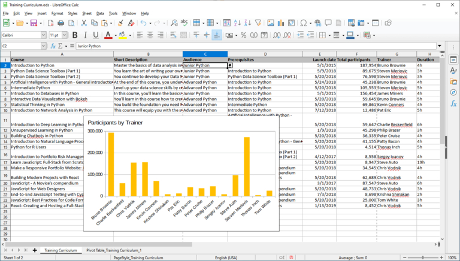
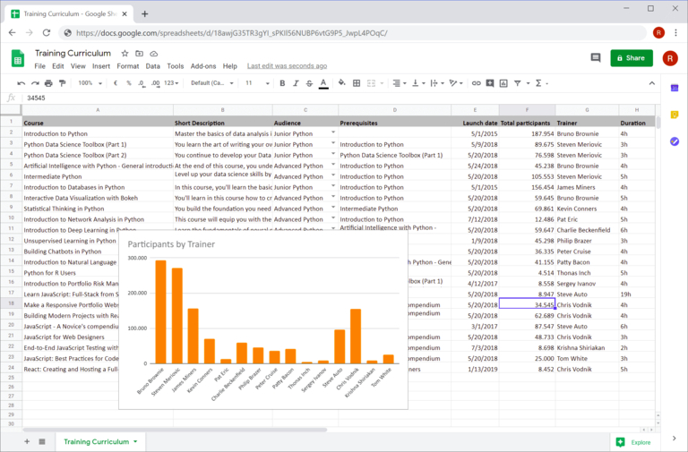

## Konkurrenz für den Marktführer: Wer Excel kostenlos anbietet

Obwohl als **Tabellenkalkulation** konzipiert, wird heute wohl kaum ein anderes Computerprogramm für so viele unterschiedliche Anwendungsfälle genutzt wie **Microsoft Excel**: Schätzungen zufolge sollen bis zu eine Milliarde Menschen regelmäßig Spreadsheets mit Excel online bearbeiten! Dabei kann man mit gewissen Einschränkungen sogar Excel kostenlos nutzen. Wenn Sie sich jedoch nicht an den US-amerikanischen Quasi-Monopolisten binden wollen, haben Sie die Qual der Wahl: **Google Sheets, Apple Numbers, Calc und SeaTable** sind nur die bekanntesten unter den zahlreichen Excel Konkurrenten.

Erfahren Sie im Folgenden, wie Sie Excel kostenlos nutzen und welche anderen Tabellenkalkulationsprogramme kostenlos sind.

## Wie Sie Excel kostenlos nutzen können

Excel ist das Tabellenkalkulationsprogramm des US-amerikanischen Tech-Riesen Microsoft und gehört zu den Microsoft-365-Anwendungen. Mit einem **kostenlosen Microsoft-Konto** können Sie Excel ausschließlich online verwenden – samt 5 Gigabyte Cloudspeicher. Da Microsoft auch die mobile Excel App kostenlos anbietet, können Sie Excel gratis auf Android- und iOS-Geräten installieren. Für manche Anwendungsfälle mag dies bereits ausreichen.

Wenn Sie stattdessen aber die Desktop-Vollversion für Windows oder macOS benötigen, müssen Sie tief in die Tasche greifen. Ein **Microsoft-365-Abonnement** für eine Person kostet für zu Hause 69 Euro im Jahr bzw. 7 Euro im Monat und für Unternehmen sogar 11,70 Euro zzgl. MwSt. pro Benutzer und Monat. Daher lohnt es sich auf jeden Fall, sich mit anderen Anbietern zu beschäftigen und das ein oder andere Tabellenprogramm kostenlos zu testen.

## Tabellenkalkulationen, die im Gegensatz zu Excel kostenlos sind

Wenn Sie sich nur einen schnellen Überblick verschaffen wollen, schauen Sie in die nachfolgende Tabelle, welche die wichtigsten Tabellenkalkulationen gegenüberstellt. Eine detaillierte Beschreibung folgt weiter unten im Anschluss an eine Kategorisierung der hier betrachteten Tabellenkalkulationsprogramme.

| **Software**  | **Entwickelt von**       | **Betriebssysteme** |
| ------------- | ------------------------ | ------------------- |
| Calc          | LibreOffice / OpenOffice | Windows, Mac, Linux |
| PlanMaker     | SoftMaker                | Windows, Mac, Linux |
| Google Sheets | Google                   | Browser-basiert     |
| Zoho Sheet    | Zoho                     | Browser-basiert     |
| Ethercalc     | Open-Source-Projekt      | Browser-basiert     |
| SeaTable      | Seafile                  | Browser-basiert     |

In diesem Vergleich wurden nur lokale Anwendungen berücksichtigt, die mindestens zwei Betriebssystemfamilien unterstützen. Aus diesem Grund ist Apple Numbers als reine Tabellenkalkulation für MacOS/iOS genauso wenig dabei wie Gnumeric, das seit 2014 eine reine Anwendung für Linux ist.

Ein aufstrebender Player unter den Tabellenkalkulationen ist SeaTable, das als [No-Code-Datenbank und App-Builder]() einen deutlich erweiterten Funktionsumfang gegenüber Excel und anderen Lösungen aufweist und damit den Wettbewerb neu belebt. Wie die anderen in diesem Artikel vorgestellten Lösungen ist auch die Free-Version von SeaTable im Gegensatz zu Excel kostenlos.

### Einordnung der Tabellenkalkulationen

Nicht in der tabellarischen Gegenüberstellung enthalten sind die beiden Eigenschaften **Betriebsart** und **Verfügbarkeit des Quellcodes**. Dies holen wir nun nach! Eine über diese beiden Kriterien aufgespannte Matrix verschafft Ihnen eine Grundlage für Ihre Entscheidung.

Ein Vergleich von Tabellenkalkulationen hätte vor 15 Jahren ausschließlich **lokale Anwendungen** wie Calc und Apple Numbers aus den beiden unteren Quadranten gezeigt. Mit dem Siegeszug von Cloud Computing haben **Browser-basierte Tabellenkalkulationen** enorme Marktanteile gewonnen und sind mehr und mehr zu den führenden Anwendungen geworden. Nicht ohne Grund gibt es neben der klassischen Desktop-Version mittlerweile auch Excel kostenlos als Webanwendung des Microsoft-365-Pakets.

### Vorteile von Cloud-Lösungen

Die Vorteile der servergehosteten Lösungen sind nicht von der Hand zu weisen. Da ist zum einen die **Orts- und Geräteunabhängigkeit** von Cloud-Anwendungen. Ein Browser ist alles, was Sie benötigen! Das Endgerät und dessen Betriebssystem spielen keine Rolle mehr. Egal, ob Desktop oder Mobilgerät, am Arbeitsplatz oder unterwegs: Sie haben immer Zugriff auf Ihre Daten.

Ebenso wichtig ist das Thema **Zusammenarbeit**. Änderungen durch einen Benutzer werden sofort für andere sichtbar – man arbeitet zusammen, als ob man gemeinsam vor der Tabelle sitzt. Alle Cloud-Lösungen unterstützen die gemeinschaftliche Zusammenarbeit an Tabellen **in Echtzeit**. Last, but not least: Cloud-Lösungen sind für Administratoren wie für Benutzer beispiellos **komfortabel**, da die dezentrale Installation und Wartung der Software auf den Arbeitsplätzen entfällt.

### Vorteile von lokalen Lösungen

Zwar sind lokale Tabellenprogramme angezählt, dennoch haben sie weiterhin ihre Existenzberechtigung. Das wichtigste Argument auf ihrer Seite ist die **Unabhängigkeit vom Internetzugang**. Wer auf Reisen mit instabiler Internetverbindung ein paar Änderungen machen will, wird bis auf Weiteres nicht an ihnen vorbeikommen. Ein weiteres, wenn auch an Bedeutung verlierendes Argument ist die breitere Verfügbarkeit von Erweiterungen, wie z. B. die in vielen Unternehmen unverzichtbaren **Makros**. In vielen Fällen sind diese nur für die Desktop-Versionen verfügbar.

## Calc

### Die Open-Source-Tabellenkalkulation der LibreOffice und OpenOffice Suite

Vor dem Boom der Cloud-basierten Tabellenlösungen war **Calc** die unangefochtene Nummer 2 nach Excel und bei privaten Benutzern erfreut sich Calc auch heute noch großer Beliebtheit. Calc überzeugte damals wie heute mit vielen Funktionen, einer breiten Plattformunterstützung mit Installationsmedien für Windows, Mac und Linux sowie einer großen Nutzergemeinschaft, die eine umfangreiche Dokumentation bietet. Ein weiteres Plus für Calc: Sie können es privat wie gewerblich und anders als Excel kostenlos nutzen.

Calc finden Sie in ähnlicher, aber nicht identischer Form in der **OpenOffice** und der **LibreOffice Suite**. Der Grund dafür liegt in der gemeinsamen Vergangenheit der beiden Suiten. Im Jahr 2010 spaltete sich LibreOffice als separates Projekt von OpenOffice ab, das damals von Oracle dominiert wurde und dem Projekt wenig Aufmerksamkeit widmete. Die Entwicklung von LibreOffice wird seither unabhängig von The Document Foundation weitergetrieben. Oracle zog sich wenig später vollständig aus dem Projekt zurück und übergab es an die Apache Software Foundation, die seitdem für OpenOffice namensgebend ist.

### Funktionsumfang: Vollwertige Tabellenkalkulation

Bei den Kernfunktionen steht Calc seinem Vorbild Excel in nichts nach! Bei genauem Hinsehen findet man auch einige Features, die Excel kostenlos nicht im Angebot hat. Eine besondere Stärke zeigt Calc im Bereich **Formeln**. Der Formel-Assistent von Calc kennt rund 30 Funktionen mehr als der Konkurrent von Microsoft. Darüber hinaus bietet Calc als Open-Source-Alternative eine gute Unterstützung des OpenFormula Standards. Flexibel zeigt sich Calc auch beim Thema **Formatierungen**. In Ergänzung zu den üblichen Zellformatierungen kennt Calc Zell- und Seitenstile, mit den sich Tabellen schnell ansehnlich und einheitlich gestalten lassen.

Dem Open-Source-Paradigma folgend fördert Calc auch die **Datenportabilität**: Apple-Numbers- und Gnumeric-Dateien lassen sich ebenso importieren wie zahlreiche ältere Formate (z. B. MS Works, Lotus 1-2-3). Die Möglichkeit, zwei Tabellendateien zu vergleichen, ist eine weitere Calc Funktion, auf die Excel Nutzer bisher vergeblich warten. Administratoren schätzen außerdem die Möglichkeit, OpenOffice wie LibreOffice ohne Installation direkt von einem USB-Stick starten und ausführen zu können.

### Nachteile von Calc im Vergleich zu Excel

Zur Wahrheit gehört aber auch, dass Calc nur eine **eingeschränkte Makro-Unterstützung** mitbringt und sich nicht flexibel bei der Anbindung externer Datenquellen zeigt. Damit fällt es für viele gewerbliche Nutzer aus. Für Heavy User ist weiterhin die **fehlende Multithreading-Fähigkeit** und das Fehlen von **Power Pivot** ein gewichtiges Argument gegen Calc. Weniger ambitionierten Benutzern wird am ehesten die **reduzierte Auswahl an Diagrammtypen** auffallen. Wasserfall-Charts und Histogramme stehen beispielsweise nicht zur Verfügung.

Wenn Sie mit den fortgeschrittenen Funktionen nur wenig arbeiten, werden Sie beim Einstieg bzw. Umstieg auf Calc keine Probleme haben. Die Benutzeroberfläche von Calc ist übersichtlich und die Menüs sind logisch strukturiert. Etwas Anderes ist es bei erfahrenen Excel Usern. Diese werden zu Beginn ihre Arbeitseffizienz abwärts gehen sehen, da sie häufiger nach den gewünschten Funktionen suchen müssen. Dabei ist nicht die weniger modern wirkende Optik der **Benutzeroberfläche** entscheidend, sondern die abweichende Organisation von Funktionen und deren Funktionsweise.

Ein weiteres Hindernis für den Wechsel auf Calc ist die unvollständige Unterstützung des von Excel verwendeten XLSX-Dateiformats. **XLSX-Dokumente** lassen sich in Calc öffnen, Formatierungen und Funktionen können dabei jedoch verloren gehen. Die LibreOffice Entwickler selbst bezeichnen die [Unterstützung des Imports von und des Exports in Microsofts OOXML-Dateien](https://wiki.documentfoundation.org/Feature_Comparison:_LibreOffice_-_Microsoft_Office) als “partial”. Das Standarddateiformat von LibreOffice und OpenOffice ist ODS, ein herstellerunabhängiges Dokumentenformat nach dem Open Document Standard.

## PlanMaker

### Excel Konkurrenz aus dem Hause SoftMaker

**PlanMaker** ist die Tabellenkalkulation der SoftMaker Office Suite, die von der Nürnberger SoftMaker Software GmbH entwickelt wird. Die Office Suite aus deutschen Landen enthält neben PlanMaker auch die Textverarbeitung **TextMaker** und die Anwendung **Presentations**.

Wenn Sie eine Tabellenkalkulation suchen, die Sie anders als Excel kostenlos nutzen können, werden Sie mit PlanMaker zunächst enttäuscht: Das jährliche Abonnement für fünf Arbeitsplätze kostet rund 200 Euro, die Lizenz für fünf private Computer desselben Haushalts oder einen geschäftlichen Computer liegt bei 29,90 Euro pro Jahr oder 2,99 Euro pro Monat. Wenn Sie partout nichts ausgeben wollen, finden Sie unter dem Namen **FreeOffice** eine funktionseingeschränkte Version der SoftMaker Office Suite, mit der Sie dauerhaft eine Abwandlung von Excel kostenlos nutzen können.

### Gleicher Funktionsumfang wie Excel

Wenn Sie jedoch von Microsoft wegwollen und eine leistungsfähige, komfortable Excel Variante suchen, sind Sie mit PlanMaker hervorragend bedient. PlanMaker bietet ein umfangreiches Funktionspaket, eine ansprechende, sehr eng an Excel angelehnte Benutzeroberfläche und eine **exzellente Kompatibilität mit dem XLSX-Dateiformat** von Excel. Tatsächlich können die Anwendungen der SoftMaker Suite standardmäßig Microsofts OOXML-Dateiformate für die Dateispeicherung verwenden. Insofern fallen bei PlanMaker viele der Nachteile weg, die gegen Calc als Excel Ersatz sprechen.

PlanMaker kann aber auch noch an einer anderen Stelle gegen Excel punkten: PlanMaker läuft auf allen wichtigen Desktop-Plattformen und stellt damit eine attraktive Tabellenkalkulation für Mac und Linux dar. Auch das kostenlose FreeOffice gibt es für die drei Betriebssystem-Familien.

## Google Sheets

### Die Online-Tabellenkalkulation von Google

**Sheets** ist die Tabellen-Webanwendung aus dem Hause Alphabet. Es bietet eine ansprechende Benutzeroberfläche, reichhaltige Datenanalyse-Funktionen sowie praktische Teamfunktionen. Alles, was Sie brauchen, um mit Sheets loszulegen, ist ein **kostenloser Google Account** – und wer hat den nicht? Kein Wunder also, dass viele derzeit wohl am liebsten Google Sheets als Ersatz für Excel kostenlos nutzen!

### Kollaborative Tabellenkalkulation für den Browser

Die Entwickler von Google haben mit Sheets eine Anwendung geschaffen, in der sich Einsteiger wie anspruchsvolle Nutzer gleichermaßen wohlfühlen. Einfach eine Tabelle erstellen, kostenlos speichern und mit anderen teilen! Das webbasierte **Interface läuft flüssig**, die Menüs sind gut organisiert und auch engagierte Benutzer werden kaum funktionale Wünsche offen haben. Andererseits ist es gerade der Verzicht auf einige Funktionen, der Google Sheets für Einsteiger attraktiv macht.

Insbesondere, wenn die **gemeinsame Arbeit** an Tabellen im Vordergrund steht, kann Sheets seine Trümpfe als Webanwendung ausspielen. Tabellen von Google Sheets werden in Google Drive, das ebenfalls mit dem Google Konto verknüpft ist, gespeichert. Von dort können Sie die Tabellen mit wenigen Klicks mit anderen Benutzern teilen. Bei gleichzeitiger Bearbeitung sehen alle Benutzer die Cursor-Positionen und die Eingaben der anderen **in Echtzeit**. Ein integrierter Chat erlaubt den direkten Austausch mit Kollegen.

### Nur kleine Abstriche und im Vergleich zu Excel kostenlos

Während Google Sheets bei der Zusammenarbeit glänzt, so muss man bei erweiterten Funktionen gegenüber Excel gewisse Einschränkungen hinnehmen. Gerade bei der Visualisierung sind die Möglichkeiten noch nicht ganz auf dem Niveau des Originals. Die Optionen zur Erstellung hochwertiger, einheitlicher Diagramme sind bei Excel ein Stück vielseitiger.

Google ist auf einem guten Weg, den Abstand zu Microsoft aufzuholen. Seit den bescheidenen Anfängen im Jahr 2006 hat sich Sheets rasant entwickelt. Und die Entwicklung geht weiter. Anfang 2020 wurde z. B. ein **Versionsverlauf der Änderungen** integriert. Wenn Ihnen die bestehenden Funktionen von Sheets nicht ausreichen, können Sie weitere Features wie Zielwertfunktion und Solver als Add-on aus dem G Suite Marketplace nachrüsten.

Neueinsteiger werden sich mit Sheets vermutlich leichter tun als mit Excel. Umsteiger werden sich nach kurzer Kennenlernphase ebenfalls schnell zurechtfinden. Das Problem beim Wechsel präsentiert sich weniger bei der Nutzung als bei der **Datenmigration**. Es ist zwar beeindruckend, wie viele Excel Features Google Sheets erkennt und importiert; Berichte von nicht mehr funktionierenden Formeln oder zerstörten Diagrammen nach dem Import gibt es jedoch weiterhin.

## Zoho Sheet

### Die Online-Tabellenkalkulation der Zoho Office Suite

**Zoho Sheet** ist die Web-Tabellenkalkulation der indischen Zoho Corporation und Bestandteil der Zoho Office Suite. Diese hat in den letzten Jahren einige Aufmerksamkeit auf sich gezogen – nicht zuletzt, weil Privatpersonen sie als Ersatz für Excel kostenlos nutzen können. Weitere Teile der Office Suite sind **Zoho Writer** (Textverarbeitung), **Zoho Show** (Präsentationen) und **Zoho Notebook** (Notizen). Darüber hinaus umfasst das Angebot von Zoho mehr als 40 integrierte, webbasierte Office Apps und präsentiert sich damit selbst als G Suite Alternative. Ein genauer Blick lohnt sich also in jedem Fall.

### Deutliche Orientierung an Google Sheets

Wenn Sie aufgrund des Namens und des Anspruchs als G Suite Killer weitere Ähnlichkeiten zu Google Sheets vermuten, liegen Sie richtig: Auf den ersten Blick erscheint Zoho Sheet wie ein Klon von Google Sheets. Die **Menüstruktur ist quasi identisch**; Unterschiede zeigen sich erst auf den zweiten Blick. Auch beim direkten Funktionsvergleich sind Zoho Sheet und Google Sheets nah beieinander. Webformulare, Pivot-Tabellen, bedingte Formatierung, Versionierung sowie **umfangreiche Kollaborationsfunktionen** inklusive Sharing, Echtzeit-Zusammenarbeit und Chat gibt es in beiden. Wer mit Google Sheets zurechtkommt, wird auch mit Zoho Sheet keine Mühe haben, Excel kostenlos zu ersetzen.

Man tut Zoho Sheet aber Unrecht, wenn man ihm komplett die Individualität abspricht! Im Bereich Datenanalyse bietet es mit einem Solver und einer Zielwertfunktion mehr als das Google Pendant. Aufgrund seiner weniger marktdominierenden Rolle zeigt es sich auch erfreulich **integrativ**. In Zoho Sheet angelegte Tabellen können Sie in einem eigenen Online-Speicher – **Zoho Docs** für Privatpersonen, **Zoho WorkDrive** für Teams – oder in einem eingebundenen Account von Google Drive, OneDrive oder Dropbox abspeichern. Der Dateiexport ist in Dateien vom Typ .csv, .xlsx und .ods möglich.

### Vor- und Nachteile, wenn Sie es als Ersatz für Excel kostenlos nutzen möchten

Eine Stärke von Zoho Sheet, die es insbesondere für Umsteiger von Excel empfehlenswert macht, ist seine **Makro-Unterstützung**, die auch eine solche für Visual Basic for Applications (VBA) beinhaltet. Die leistungsfähige Scripting Engine von Google Sheets benötigt für Makros Google Apps Skripte, die auf JavaScript basieren. Für Excel Benutzer, die bisher in VBA entwickelten, bedeutet das eine massive Umgewöhnung bzw. das Erlernen einer neuen Programmiersprache.

Das Rennen zwischen Zoho Sheet und Google Sheets ist ein enges und die Frage nach der überlegenen Tabellenkalkulation lässt sich nicht ohne den Kontext der konkreten Anwendung beantworten. Gerade bei der **Datenvisualisierung** bietet Zoho Sheet weniger Optionen als Google Sheets. Auch wird das Zeichnen von Zoho nicht unterstützt. Für einige Benutzer ist eventuell auch die **Limitierung auf 65.000 Zeilen und 256 Spalten** eine maßgebliche Einschränkung. Ein gutes Tabellenprogramm ist Zoho Sheet in jedem Fall für all die Umsteiger, die ein Excel Sheet ohne Makro nicht als echtes Excel Spreadsheet betrachten.

## Ethercalc

### Die Open-Source-Tabellenkalkulation für einfache Zusammenarbeit

Das weniger bekannte **Ethercalc** ist eine simple, webbasierte Spreadsheet-Anwendung, die von einer kleinen Community entwickelt wird. Da es eine Open Source Software ist, können Sie sich Ethercalc als Ersatz für Excel **kostenlos** herunterladen und es uneingeschränkt nutzen. Die Entwickler stellen Pakete für alle wichtigen Serverplattformen inkl. eines Docker Images zur Verfügung. [Hier](https://ethercalc.net) können Sie die Anwendung ohne Benutzeranmeldung testen und nutzen.

### Geringer Funktionsumfang

Auf den ersten Blick fällt bei Ethercalc die rudimentäre, etwas verstaubt aussehende Benutzeroberfläche auf. Auch die von Ethercalc bereitgestellten Funktionen sind im Vergleich zu Excel und den anderen Cloud-basierten Tabellenkalkulationen eher gering. Dies fällt schon bei der Formatierung und einfachen Datenanalysen wie z. B. beim Sortieren auf. Während die Assistenten bei Excel und Konsorten diese Arbeiten einfach und komfortabel machen, ist dies bei Ethercalc über die dazugehörigen Menüs mit einigem Klickaufwand verbunden. Die Möglichkeiten zur Datenvisualisierung sind sehr eingeschränkt, eine Filterfunktion fehlt vollständig.

Vom Funktionsumfang und Komfort ist Ethercalc den anderen Tabellenprogrammen nicht ebenbürtig. Dies ist zum einen auf die kleine Entwickler-Community zurückzuführen, zum anderen aber auch auf die generelle Zielsetzung des Projekts. Im Vordergrund steht bei Ethercalc nicht die Auswertung großer Datensätze, sondern die **Zusammenarbeit** und die **ortsungebundene Datenerfassung** im Browser.

Für die Web-Tabelle benötigt man kein installiertes Programm, sondern kann von unterwegs per Handy oder Tablet Anpassungen machen und dank **Echtzeitunterstützung** sind in Ethercalc alle Änderungen sofort für alle anderen Nutzer sichtbar. Für die Auswertung der erfassten Daten steht dann eine Exportfunktion zur Verfügung, die den einfachen Transfer in XLSX, ODS, CSV und HTML ermöglicht.

## SeaTable

### Die kollaborative No-Code-Datenbank für mehr als Zahlen und Text

SeaTable ist die jüngste Anwendung im Kreis der hier betrachteten Tabellenprogramme. Wie Google Sheets, Zoho Sheet und Ethercalc ist SeaTable eine **webbasierte Tabellenkalkulation**, die Sie im Gegensatz zu Excel kostenlos nutzen können. Die No-Code-Datenbank kombiniert eine ansprechende Benutzeroberfläche in Spreadsheet-Optik mit leistungsfähigen Analyse- und Kollaborationsfunktionen. Darüber hinaus ermöglicht SeaTable viele neue Anwendungsfälle, die so in Excel und Co. nicht möglich sind.

Dass SeaTable einiges anders macht als die anderen Tabellenkalkulationen, fällt schon beim ersten Öffnen einer Tabelle ins Auge. Anstelle eines uniformen Tabellenrasters, das nur Text, Zahlen und Formeln versteht, können Sie in einer SeaTable Tabelle auch **Bilder und Dateien**, Checkboxen, Positionsdaten sowie Benutzerverweise speichern. Weitere [Spaltentypen](https://seatable.io/docs/arbeiten-mit-spalten/uebersicht-alle-spaltentypen/), die SeaTable anbietet, sind **Einfach- und Mehrfachauswahlen**.

Einfachauswahlfelder sind den Drop-down-Listen, die Sie in Excel via Datenvalidierung abbilden können, ähnlich, aber flexibler und einfacher zu bedienen. Mehrfachauswahlfelder, die keine Entsprechung in Excel haben, helfen bei der Kategorisierung und Verschlagwortung von Daten. Mit diesen erweiterten Spaltentypen lassen sich alle erdenklichen Informationstypen in einer Tabelle ablegen. **Unterschiedliche Speicherorte** für unterschiedliche Datentypen gehören damit der Vergangenheit an.

### Tabellenkalkulation mit der Power von No-Code-Datenbanken und App-Buildern

Eine weitere Funktion von SeaTable, die in keiner der anderen Anwendungen zur Verfügung steht, sind **Verknüpfungen**. Mit Verknüpfungen lassen sich Datensätze miteinander in Beziehung setzen und Abhängigkeiten sowie Zugehörigkeiten abbilden (nicht zu verwechseln mit Zellverweisen in Excel). Dies geht sowohl innerhalb einer Tabelle als auch über alle Tabellen in einer Datenbank hinweg. Über dazugehörige **Analysefunktionen** lassen sich die verknüpften Daten in der Browser-basierten Tabellenkalkulation spielend einfach grafisch und tabellarisch auswerten. SeaTable bringt Funktionalitäten mit, die man sonst nur aus Datenbanken kennt, und ist die optimale Lösung, um Spreadsheets wie in Excel kostenlos nutzen zu können.

SeaTable Einsteiger werden sich zunächst daran gewöhnen müssen, vor der Datenerfassung die Spaltentypen zu definieren und tabellenübergreifend in einer **Datenbank-Logik** zu denken. Die **intuitive Benutzeroberfläche** macht diese Herausforderung jedoch überschaubar. Die Migration von Excel wird mit [Importfunktionen für CSV- und XLSX-Dateien](https://seatable.io/docs/import-von-daten/import-von-excel-dateien-in-seatable/) erleichtert. Aufgrund der von SeaTable verwendeten Datenformate können beim Import aber Informationsverluste entstehen.

### Mehr Optionen zur Visualisierung als andere Tabellenkalkulationen

Natürlich verfügt SeaTable auch über die klassischen Funktionen einer Tabellenkalkulation: **Filter**, **Sortierungen** und **Gruppierungen** bringen Daten in die gewünschte Ordnung, mit **Pivot-Tabellen** lassen sich auch große Datensätze rasch auswerten und die diversen **Diagrammtypen** stellen Daten visuell dar. Aber wie schon bei den unterstützten Datentypen geht SeaTable auch bei den Darstellungsoptionen einen Schritt weiter als die anderen Excel Konkurrenten.

SeaTables [Plugins](https://seatable.io/docs/plugins/alle-plugins-in-der-uebersicht/) bieten erweiterte Visualisierungsoptionen für nicht-numerische Datentypen: Im Karten-Plugin lassen sich Adress- und Geopositionsdaten auf einer Karte darstellen und das Galerie-Plugin zeigt die in einer Tabelle abgelegten Bilddaten übersichtlich in Alben an. In einer Tabelle erfasste Termindaten lassen sich im Kalender- oder im Timeline-Plugin anzeigen und das Kanban-Plugin stellt Workflows mit verschiedenen Phasen dar, wie man es sonst nur aus [Projektmanagement]()\-Anwendungen kennt.

Zudem können Sie mit SeaTable ohne Programmierkenntnisse eigene Apps erstellen. Eine App besteht aus Seiten, die Sie im integrierten [No-Code-App-Builder](https://seatable.io/docs/apps/universelle-app/) mithilfe verschiedener Seitentypen zusammenstellen können. Eine App greift dabei auf die Daten in SeaTable zu und stellt diese für die Benutzer optimal dar. Der Vorteil: Über das App-Design lässt sich präzise steuern, welche Daten ein Benutzer sieht, wie die Daten visualisiert werden und wie er mit den Daten interagieren kann. Dadurch lassen sich Workflows akkurat abbilden.

### In der Cloud oder auf eigenen Servern

Als flexible Allzweckwaffe macht SeaTable auch beim Thema **Betriebsart** keine Kompromisse. SeaTable lässt sich komfortabel in der [Cloud]() oder als [selbstgehostete Lösung]() verwenden. Anders als die anderen webbasierten Excel Konkurrenten gibt es SeaTable also auch als Software für den eigenen Server. Auf diese Weise bietet sich SeaTable für all diejenigen an, die mit strikten Datenschutzanforderungen konfrontiert sind.

Das [Free Abonnement]() ist dauerhaft kostenlos und für den privaten Gebrauch ausreichend. Die kostenpflichtigen Versionen Plus und Enterprise bieten erweiterte Funktionen für den Unternehmenseinsatz wie z. B. benutzerdefinierte Freigaben, Automationen und Customizing. Die [Dedicated Cloud]() verfügt zudem über eine zentrale Benutzer-Authentifizierung und Objektspeicher-Unterstützung.

Einen ähnlichen Weg wie Google Sheets – für Entwickler angenehm konventionell – geht SeaTable bei den Erweiterungen. Per API und SDK lassen sich Erweiterungen wie Automatisierungen, Integrationen und Funktionsergänzungen mit überschaubarem Aufwand entwickeln. Angesichts des jungen Alters der Lösung wird es spannend sein zu sehen, welche Neuerungen in Zukunft dazukommen werden.

## Nutzen Sie Tabellenkalkulationen, die im Vergleich zu Excel kostenlos sind

Wenn Sie eine leistungsfähige Tabellenkalkulation haben möchten, müssen Sie nicht zu Excel greifen! Die verfügbaren Tabellenkalkulationsprogramme müssen sich weder hinsichtlich ihrer Funktionalität noch hinsichtlich ihrer Bedienbarkeit verstecken. Viele davon können Sie anders als Excel kostenlos nutzen.

Die bekannten Tabellenprogramme in diesem Vergleich sind Excel funktional ähnlich und bieten eine ähnliche Benutzererfahrung. Die Cloud-Lösungen sind ausgewachsene Excel Konkurrenten, die das Gros der Excel Funktionen abbilden und darüber hinaus mit Kollaborationsfunktionen punkten.

Aus der Masse sticht SeaTable durch die erweiterten Datenformate, die Datenbank-Funktionen und den App-Builder heraus. Als einzige Anwendung in diesem Vergleich ist SeaTable gleichermaßen als Cloud- und als selbstgehostete Anwendung verfügbar. Die Entscheidung zwischen Datenhoheit und Komfort kann so jeder Nutzer frei treffen.

[Jetzt kostenlos registrieren und SeaTable ausprobieren]()
