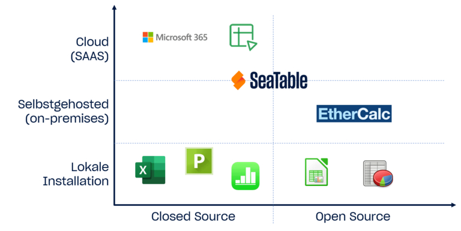
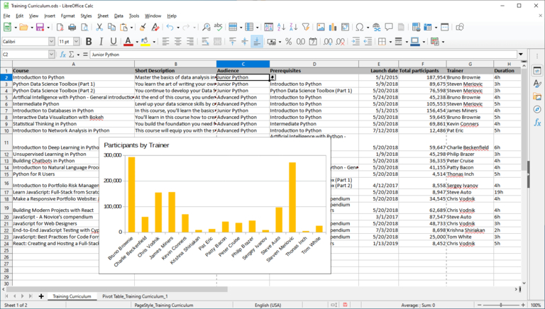
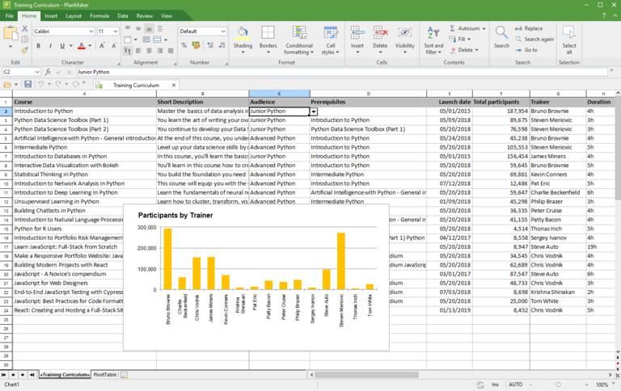
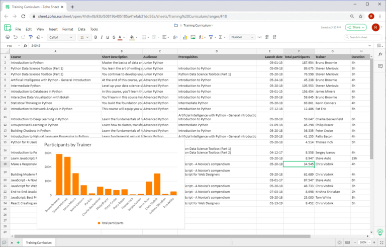
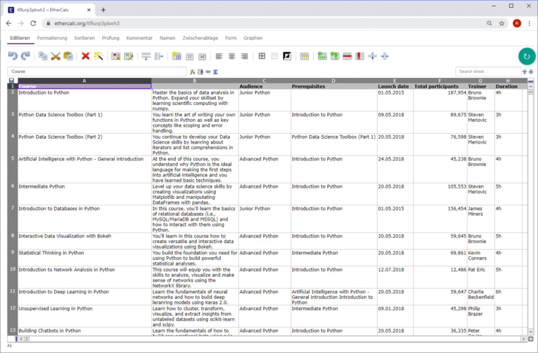
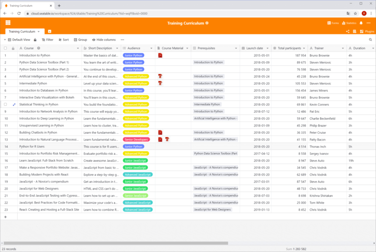
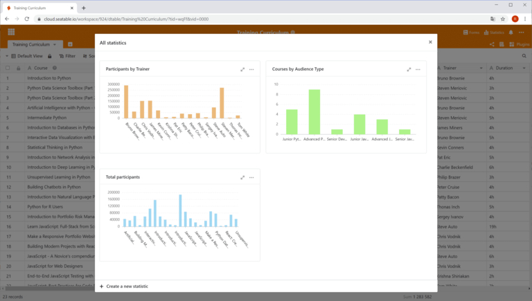

## Competition for the market leader: Who offers Excel for free

Although designed as a **spreadsheet calculation**, hardly any other computer program is used today for as many different applications as **Microsoft Excel**: It is estimated that up to one billion people regularly edit spreadsheets online using Excel! With certain restrictions, you can even use Excel for free. However, if you don't want to be tied to the US quasi-monopolist, you are spoiled for choice: **Google Sheets**, **Apple Numbers**, **Calc** and **SeaTable** are just the best known among the numerous Excel competitors.

Find out below how to use Excel for free and which other spreadsheet programs are free.

## How you can use Excel for free

Excel is the spreadsheet program from US tech giant Microsoft and is one of the Microsoft 365 applications. With a **free Microsoft account**, you can use Excel exclusively online - including 5 gigabytes of cloud storage. As Microsoft also offers the mobile Excel app for free, you can install Excel on Android and iOS devices for free. This may be sufficient for some applications.

However, if you need the full desktop version for Windows or macOS instead, you will have to dig deep into your pockets. A **Microsoft 365 subscription** for one person costs 69 euros per year or 7 euros per month for home users and as much as 11.70 euros plus VAT per user and month for companies. It is therefore definitely worth looking at other providers and testing one or other spreadsheet program free of charge.

## Spreadsheets that are free of charge, unlike Excel

If you just want to get a quick overview, take a look at the following table, which compares the most important spreadsheet programs. A detailed description follows below after a categorization of the spreadsheet programs considered here.

| **Software**  | **Developed by**         | **Operating systems** |
| ------------- | ------------------------ | --------------------- |
| Calc          | LibreOffice / OpenOffice | Windows, Mac, Linux   |
| PlanMaker     | SoftMaker                | Windows, Mac, Linux   |
| Google Sheets | Google                   | Browser-based         |
| Zoho Sheet    | Zoho                     | Browser-based         |
| Ethercalc     | Open source project      | Browser-based         |
| SeaTable      | Seafile                  | Browser-based         |

In this comparison, only local applications that support at least two operating system families were considered. For this reason, Apple Numbers as a pure spreadsheet application for MacOS/iOS is not included, nor is Gnumeric, which has been a pure application for Linux since 2014.

An up-and-coming player among spreadsheets is SeaTable, which as a [no-code database and app builder](https://seatable.com/) has a significantly expanded range of functions compared to Excel and other solutions, thus revitalizing the competition. Like the other solutions presented in this article, the free version of SeaTable is also free of charge, unlike Excel.

### Classification of spreadsheets

Not included in the tabular comparison are the two properties **operating mode** and **availability of source code**. We will now make up for this! A matrix covering these two criteria will provide you with a basis for your decision.

A comparison of spreadsheets 15 years ago would have shown only **local applications** such as Calc and Apple Numbers in the bottom two quadrants. With the triumph of cloud computing, **browser-based spreadsheets** have gained enormous market share and have increasingly become the leading applications. It is not without reason that Excel is now also available free of charge as a web application of the Microsoft 365 package in addition to the classic desktop version.

### Advantages of cloud solutions

The advantages of server-hosted solutions cannot be denied. Firstly, cloud applications are **independent of location and device**. A browser is all you need! The end device and its operating system no longer play a role. Whether desktop or mobile device, at work or on the move: you always have access to your data.

Equally important is the issue of **collaboration**. Changes made by one user are immediately visible to others - you work together as if you were sitting in front of the spreadsheet together. All cloud solutions support collaborative work on spreadsheets **in real time**. Last but not least: Cloud solutions are unprecedentedly **convenient** for administrators and users alike, as there is no need for decentralized installation and maintenance of the software on the workstations.

### Advantages of local solutions

Although local spreadsheet programs may be a thing of the past, they still have a right to exist. The most important argument on their side is **independence from Internet access**. Anyone who wants to make a few changes while traveling with an unstable Internet connection will not be able to avoid them for the time being. Another, albeit less important, argument is the wider availability of extensions, such as the **macros** that are indispensable in many companies. In many cases, these are only available for the desktop versions.

## Calc

### The open source spreadsheet of the LibreOffice and OpenOffice Suite

Before the boom in cloud-based spreadsheet solutions, **Calc** was the undisputed number 2 after Excel and Calc is still very popular with private users today. Then as now, Calc impressed with its many functions, broad platform support with installation media for Windows, Mac and Linux and a large user community that offers extensive documentation. Another plus for Calc: you can use it privately and commercially and, unlike Excel, free of charge.

Calc can be found in a similar but not identical form in **OpenOffice** and **LibreOffice Suite**. The reason for this lies in the shared past of the two suites. In 2010, LibreOffice split off as a separate project from OpenOffice, which was dominated by Oracle at the time and paid little attention to the project. Since then, the development of LibreOffice has continued independently of The Document Foundation. Oracle withdrew completely from the project shortly afterwards and handed it over to the Apache Software Foundation, which has since given OpenOffice its name.

### Range of functions: Fully-fledged spreadsheet application

When it comes to core functions, Calc is in no way inferior to its role model Excel! If you take a closer look, you will also find some features that Excel does not offer for free. Calc shows a particular strength in the area of **formulas**. Calc's formula wizard knows around 30 more functions than its Microsoft competitor. As an open source alternative, Calc also offers good support for the OpenFormula standard. Calc is also flexible when it comes to **formatting**. In addition to the usual cell formatting, Calc knows cell and page styles, which can be used to quickly create attractive and uniform tables.

In keeping with the open source paradigm, Calc also promotes **data portability**: Apple Numbers and Gnumeric files can be imported as well as numerous older formats (e.g. MS Works, Lotus 1-2-3). The ability to compare two spreadsheet files is another Calc function that Excel users have been waiting for in vain. Administrators also appreciate the ability to start and run OpenOffice and LibreOffice directly from a USB stick without installation.

### Disadvantages of Calc compared to Excel

The truth is, however, that Calc only offers **limited macro support** and is not flexible when it comes to connecting external data sources. This makes it unsuitable for many commercial users. For heavy users, the **lack of multithreading capability** and the absence of **Power Pivot** are further weighty arguments against Calc. Less ambitious users will most likely notice the **reduced selection of chart types**. Waterfall charts and histograms, for example, are not available.

If you only work a little with the advanced functions, you will have no problems getting started or switching to Calc. Calc's user interface is clear and the menus are logically structured. It is a different story for experienced Excel users. They will see their work efficiency decrease at the beginning as they have to search for the desired functions more frequently. It is not the less modern look of the **user interface** that is decisive here, but the different organization of functions and how they work.

Another obstacle to switching to Calc is the incomplete support of the XLSX file format used by Excel. **XLSX documents** can be opened in Calc, but formatting and functions may be lost. The LibreOffice developers themselves describe the [support for importing from and exporting to Microsoft OOXML files](https://wiki.documentfoundation.org/Feature_Comparison:_LibreOffice_-_Microsoft_Office) as "partial". The standard file format of LibreOffice and OpenOffice is ODS, a manufacturer-independent document format according to the Open Document Standard.

## PlanMaker

### Excel competition from SoftMaker

**PlanMaker** is the spreadsheet application in the SoftMaker Office Suite, which is developed by Nuremberg-based SoftMaker Software GmbH. In addition to PlanMaker, the Office Suite from Germany also includes the word processor **TextMaker** and the **Presentations** application.

If you are looking for a spreadsheet application that you can use free of charge, unlike Excel, you will be disappointed with PlanMaker at first: the annual subscription for five workstations costs around 200 euros, the license for five private computers in the same household or one business computer is 29.90 euros per year or 2.99 euros per month. If you don't want to spend anything at all, you can find a limited-function version of the SoftMaker Office Suite under the name **FreeOffice**, which allows you to use a modification of Excel permanently free of charge.

### Same range of functions as Excel

However, if you want to move away from Microsoft and are looking for a powerful, convenient Excel version, PlanMaker is the perfect choice. PlanMaker offers a comprehensive feature set, an appealing user interface that closely resembles Excel and **excellent compatibility with Excel's XLSX file format**. In fact, SoftMaker Suite applications can use Microsoft's OOXML file formats for file storage by default. In this respect, PlanMaker eliminates many of the disadvantages that speak against Calc as an Excel replacement.

However, PlanMaker can also score points against Excel in another area: PlanMaker runs on all major desktop platforms, making it an attractive spreadsheet application for Mac and Linux. The free FreeOffice is also available for the three operating system families.

## Google Sheets

### The online spreadsheet from Google

**Sheets** is the spreadsheet web application from Alphabet. It offers an attractive user interface, rich data analysis functions and practical team functions. All you need to get started with Sheets is a **free Google account** - and who doesn't have one? So it's no wonder that many people currently prefer to use Google Sheets as a free replacement for Excel!

Google Sheets is free compared to Excel](Screenshot_Google_Sheets.jpg)

### Collaborative spreadsheet for the browser

With Sheets, the developers at Google have created an application in which both beginners and demanding users feel equally at home. Simply create a spreadsheet, save it for free and share it with others! The web-based **interface runs smoothly**, the menus are well organized and even dedicated users will hardly have any functional wishes unfulfilled. On the other hand, it is precisely the lack of some functions that makes Google Sheets attractive for beginners.

Especially when the focus is on **shared work** on spreadsheets, Sheets can play its trump cards as a web application. Google Sheets spreadsheets are stored in Google Drive, which is also linked to the Google account. From there, you can share the spreadsheets with other users with just a few clicks. When editing simultaneously, all users can see the cursor positions and the entries of others **in real time**. An integrated chat allows direct exchange with colleagues.

### Only small compromises and free of charge compared to Excel

While Google Sheets shines when it comes to collaboration, there are certain limitations compared to Excel when it comes to advanced functions. Especially when it comes to visualization, the possibilities are not quite at the level of the original. The options for creating high-quality, standardized charts in Excel are much more versatile.

Google is well on the way to catching up with Microsoft. Since its humble beginnings in 2006, Sheets has developed rapidly. And the development continues. At the beginning of 2020, for example, a **Version history of changes** was integrated. If the existing functions of Sheets are not enough for you, you can add further features such as target value function and solver as an add-on from the G Suite Marketplace.

Newcomers will probably find Sheets easier to use than Excel. New users will also quickly find their way around after a short familiarization phase. The problem with switching is less to do with usage than with **data migration**. Although it is impressive how many Excel features Google Sheets recognizes and imports, there are still reports of formulas that no longer work or broken charts after importing.

## Zoho Sheet

### The online spreadsheet of the Zoho Office Suite

**Zoho Sheet** is the web spreadsheet application from the Indian Zoho Corporation and part of the Zoho Office Suite. It has attracted a lot of attention in recent years - not least because private individuals can use it free of charge as a replacement for Excel. Other parts of the Office Suite are **Zoho Writer** (word processing), **Zoho Show** (presentations) and **Zoho Notebook** (notes). In addition, Zoho's offering includes more than 40 integrated, web-based Office apps and thus presents itself as a G Suite alternative. So it's definitely worth taking a closer look.

### Clear orientation towards Google Sheets

If you suspect further similarities to Google Sheets based on the name and the claim to be a G Suite killer, you are right: at first glance, Zoho Sheet appears to be a clone of Google Sheets. The **menu structure is virtually identical**; differences only become apparent at second glance. Zoho Sheet and Google Sheets are also close to each other in a direct comparison of functions. Web forms, pivot tables, conditional formatting, versioning and **extensive collaboration functions** including sharing, real-time collaboration and chat are available in both. If you're comfortable with Google Sheets, you'll have no trouble replacing Excel with Zoho Sheet for free.

But you would be doing Zoho Sheet an injustice if you denied it complete individuality! In the area of data analysis, it offers more than its Google counterpart with a solver and a target value function. Due to its less market-dominating role, it is also pleasingly **integrative**. You can save spreadsheets created in Zoho Sheet in your own online storage - **Zoho Docs** for individuals, **Zoho WorkDrive** for teams - or in an integrated Google Drive, OneDrive or Dropbox account. File export is possible in .csv, .xlsx and .ods files.

### Advantages and disadvantages if you want to use it as a free replacement for Excel

One of Zoho Sheet's strengths, which makes it particularly recommendable for people switching from Excel, is its **macro support**, which also includes support for Visual Basic for Applications (VBA). The powerful scripting engine of Google Sheets requires JavaScript-based scripts for Google Apps macros. For Excel users who previously developed in VBA, this means a massive adjustment or learning a new programming language.

The race between Zoho Sheet and Google Sheets is a close one and the question of which spreadsheet is superior cannot be answered without the context of the specific application. Especially when it comes to **data visualization**, Zoho Sheet offers fewer options than Google Sheets. Zoho also does not support drawing. For some users, the **limit of 65,000 rows and 256 columns** may also be a significant limitation. In any case, Zoho Sheet is a good spreadsheet program for all those new users who do not consider an Excel sheet without a macro to be a real Excel spreadsheet.

## Ethercalc

### The open source spreadsheet program for easy collaboration

The lesser known **Ethercalc** is a simple, web-based spreadsheet application developed by a small community. As it is open source software, you can download Ethercalc as a replacement for Excel **for free** and use it without restrictions. The developers provide packages for all major server platforms including a Docker image. [Here](https://ethercalc.net) you can test and use the application without user registration.

### Small range of functions

At first glance, Ethercalc's rudimentary, somewhat dusty-looking user interface is noticeable. The functions provided by Ethercalc are also rather limited compared to Excel and other cloud-based spreadsheets. This is already noticeable when it comes to formatting and simple data analyses such as sorting. While the wizards in Excel and the like make this work simple and convenient, Ethercalc requires a lot of clicking via the associated menus. The options for data visualization are very limited and there is no filter function at all.

In terms of functionality and convenience, Ethercalc is not on a par with the other spreadsheet programs. This is partly due to the small developer community, but also to the general objective of the project. Ethercalc does not focus on the evaluation of large data sets, but on **collaboration** and **location-independent data collection** in the browser.

No installed program is required for the web table; instead, adjustments can be made on the move using a cell phone or tablet and, thanks to **real-time support**, all changes in Ethercalc are immediately visible to all other users. An export function is then available for evaluating the recorded data, which enables simple transfer to XLSX, ODS, CSV and HTML.

## SeaTable

### The collaborative no-code database for more than just numbers and text

SeaTable is the latest application in the group of spreadsheet programs considered here. Like Google Sheets, Zoho Sheet and Ethercalc, SeaTable is a **web-based spreadsheet** that, unlike Excel, you can use for free. The no-code database combines an appealing spreadsheet-style user interface with powerful analysis and collaboration features. In addition, SeaTable enables many new use cases that are not possible in Excel and the like.

The fact that SeaTable does things differently from other spreadsheets is immediately apparent when you first open a table. Instead of a uniform table grid that only understands text, numbers and formulas, you can also save **images and files**, checkboxes, position data and user references in a SeaTable table. Other [column types](https://seatable.io/docs/arbeiten-mit-spalten/uebersicht-alle-spaltentypen/) that SeaTable offers are **single and multiple selections**.

Single selection fields are similar to the drop-down lists that you can display in Excel via data validation, but are more flexible and easier to use. Multiple selection fields, which have no equivalent in Excel, help with the categorization and keywording of data. With these extended column types, all conceivable types of information can be stored in a table. **Different storage locations** for different data types are now a thing of the past.

### Spreadsheets with the power of no-code databases and app builders

Another function of SeaTable that is not available in any of the other applications is **links**. With links, data records can be related to each other and dependencies and affiliations can be mapped (not to be confused with cell references in Excel). This is possible both within a table and across all tables in a database. The linked data can be easily analyzed graphically and tabularly in the browser-based spreadsheet using the associated **analysis functions**. SeaTable offers functionalities that are otherwise only known from databases and is the ideal solution for using spreadsheets like Excel free of charge.

SeaTable beginners will first have to get used to defining the column types before entering data and to thinking in terms of **database logic** across tables. However, the **intuitive user interface** makes this challenge manageable. Migration from Excel is made easier with [import functions for CSV and XLSX files](https://seatable.io/docs/import-von-daten/import-von-excel-dateien-in-seatable/). However, due to the data formats used by SeaTable, information may be lost during import.

### More visualization options than other spreadsheets

Of course, SeaTable also has the classic functions of a spreadsheet: **filters**, **sorting** and **grouping** bring data into the desired order, **pivot tables** allow even large data sets to be evaluated quickly and the various **chart types** present data visually. But as with the supported data types, SeaTable also goes one step further than the other Excel competitors when it comes to display options.

SeaTables [Plugins](https://seatable.io/docs/plugins/alle-plugins-in-der-uebersicht/) offer advanced visualization options for non-numeric data types: In the map plugin, address and geoposition data can be displayed on a map and the gallery plugin displays the image data stored in a table clearly in albums. Appointment data entered in a table can be displayed in the calendar or timeline plugin and the Kanban plugin displays workflows with different phases, as is otherwise only known from [project management]()\ applications.

You can also create your own apps with SeaTable without any programming knowledge. An app consists of pages that you can put together in the integrated [No-Code-App-Builder](https://seatable.io/docs/apps/universelle-app/) using various page types. An app accesses the data in SeaTable and displays it optimally for the user. The advantage: The app design can be used to precisely control which data a user sees, how the data is visualized and how they can interact with the data. This allows workflows to be mapped accurately.

### In the cloud or on your own servers

As a flexible all-purpose weapon, SeaTable also makes no compromises when it comes to **operating mode**. SeaTable can be conveniently used in the [cloud]() or as a [self-hosted solution](). Unlike the other web-based Excel competitors, SeaTable is also available as software for your own server. In this way, SeaTable is ideal for all those who are confronted with strict data protection requirements.

The [Free Subscription]() is permanently free and sufficient for private use. The paid versions Plus and Enterprise offer extended functions for corporate use, such as user-defined approvals, automations and customizing. The [Dedicated Cloud]() also has central user authentication and object storage support.

SeaTable follows a similar path to Google Sheets - pleasantly conventional for developers - when it comes to extensions. Extensions such as automations, integrations and functional additions can be developed with manageable effort via API and SDK. Given the young age of the solution, it will be exciting to see what new features will be added in the future.

## Use spreadsheets that are free of charge compared to Excel

If you want a powerful spreadsheet, you don't have to use Excel! The available spreadsheet programs have nothing to hide in terms of functionality or ease of use. Unlike Excel, you can use many of them free of charge.

The well-known spreadsheet programs in this comparison are functionally similar to Excel and offer a similar user experience. The cloud solutions are full-fledged Excel competitors that map the majority of Excel functions and also score points with collaboration functions.

SeaTable stands out from the crowd thanks to its extended data formats, database functions and app builder. SeaTable is the only application in this comparison that is available both as a cloud and self-hosted application. This means that every user is free to choose between data sovereignty and convenience.

[Register now for free and try SeaTable]()
