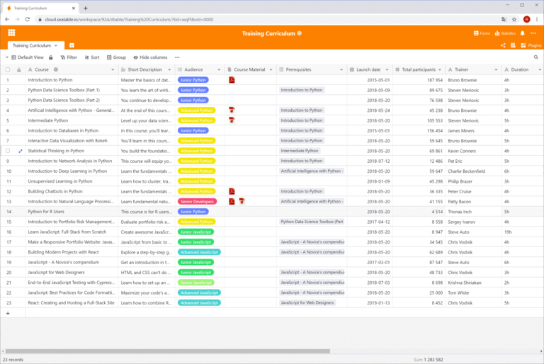

## Competencia para el líder del mercado: ¿Quién ofrece Excel gratis?

Aunque fue diseñado como **hoja de cálculo**, casi ningún otro programa informático se utiliza hoy en día para tantas aplicaciones diferentes como **Microsoft Excel**: Se calcula que hasta mil millones de personas editan regularmente hojas de cálculo en línea con Excel. Con ciertas restricciones, puedes incluso utilizar Excel gratis. Sin embargo, si no quieres estar atado al cuasi monopolio estadounidense, tienes donde elegir: **Google Sheets, Apple Numbers, Calc y SeaTable** son sólo los más conocidos entre los numerosos competidores de Excel.

Descubre a continuación cómo utilizar Excel gratis y qué otros programas de hojas de cálculo son gratuitos.

## Cómo usar Excel gratis

Excel es el programa de hojas de cálculo del gigante tecnológico estadounidense Microsoft y es una de las aplicaciones de Microsoft 365. Con una **cuenta Microsoft gratuita**, puedes utilizar Excel exclusivamente en línea, incluidos 5 gigabytes de almacenamiento en la nube. Como Microsoft también ofrece gratuitamente la aplicación móvil Excel, puedes instalar Excel en dispositivos Android e iOS de forma gratuita. Esto puede ser suficiente para algunas aplicaciones.

Sin embargo, si en cambio necesitas la versión completa de escritorio para Windows o macOS, tendrás que rebuscar en tus bolsillos. Una **suscripción a Microsoft 365** para una persona cuesta 69 euros al año o 7 euros al mes para usuarios domésticos y hasta 11,70 euros más IVA por usuario y mes para empresas. Por lo tanto, merece la pena buscar otros proveedores y probar gratuitamente uno u otro programa de hoja de cálculo.

## Hojas de cálculo gratuitas, a diferencia de Excel

Si sólo quieres tener una visión general rápida, echa un vistazo a la siguiente tabla, que compara los programas de hojas de cálculo más importantes. A continuación se ofrece una description: detallada tras una categorización de los programas de hojas de cálculo aquí considerados.

| **Software**  | **Desarrollado por**       | **Sistemas operativos** |
| ------------- | -------------------------- | ----------------------- |
| Calc          | LibreOffice / OpenOffice   | Windows, Mac, Linux     |
| PlanMaker     | SoftMaker                  | Windows, Mac, Linux     |
| Google Sheets | Google                     | basado en navegador     |
| Zoho Sheet    | Zoho                       | basado en navegador     |
| Ethercalc     | Proyecto de código abierto | basado en navegador.    |
| SeaTable      | Seafile                    | Basado en navegador     |

En esta comparación, sólo se han tenido en cuenta las aplicaciones locales compatibles con al menos dos familias de sistemas operativos. Por este motivo, no se incluye Apple Numbers como aplicación pura de hoja de cálculo para macOS/iOS, ni tampoco Gnumeric, que es una aplicación pura para Linux desde 2014.

Un actor emergente entre las hojas de cálculo es SeaTable, que como [no-code database and app builder]() tiene una gama de funciones significativamente ampliada en comparación con Excel y otras soluciones, revitalizando así la competencia. Al igual que las demás soluciones presentadas en este artículo, la versión gratuita de SeaTable también es gratuita, a diferencia de Excel.

### Clasificación de las hojas de cálculo

En la comparación tabular no se han incluido las dos propiedades **modo de funcionamiento** y **disponibilidad del código fuente**. Ahora lo compensaremos. Una matriz con estos dos criterios le servirá de base para tomar una decisión.

Hace 15 años, una comparación de las hojas de cálculo sólo habría mostrado **aplicaciones locales** como Calc y Apple Numbers en los dos cuadrantes inferiores. Con el triunfo de la computación en nube, las **hojas de cálculo basadas en navegador** han ganado enormes cuotas de mercado y se han convertido cada vez más en las aplicaciones líderes. No en vano, ahora Excel también está disponible gratuitamente como aplicación web del paquete Microsoft 365, además de la versión clásica de escritorio.

### Ventajas de las soluciones en la nube

No se pueden negar las ventajas de las soluciones alojadas en servidores. En primer lugar, las aplicaciones en la nube son **independientes de la ubicación y el dispositivo**. Basta con un navegador. El dispositivo final y su sistema operativo ya no desempeñan ningún papel. Ya sea un ordenador de sobremesa o un dispositivo móvil, en el trabajo o de viaje: siempre tendrá acceso a sus datos.

Igualmente importante es la cuestión de la **colaboración**. Los cambios realizados por un usuario son inmediatamente visibles para los demás: se trabaja conjuntamente como si se estuviera sentado frente a la hoja de cálculo. Todas las soluciones en la nube permiten la colaboración conjunta en hojas de cálculo **en tiempo real**. Por último, pero no por ello menos importante: las soluciones en la nube son **convenientes** sin precedentes tanto para los administradores como para los usuarios, ya que no hay necesidad de instalar y mantener el software de forma descentralizada en las estaciones de trabajo.

### Ventajas de las soluciones locales

Aunque los programas locales de hojas de cálculo son cosa del pasado, siguen teniendo derecho a existir. El argumento más importante a su favor es la **independencia del acceso a Internet**. Quien quiera hacer algunos cambios mientras viaja con una conexión a Internet inestable no podrá evitarlos por el momento. Otro argumento, aunque menos importante, es la mayor disponibilidad de extensiones, como las **macros**, indispensables en muchas empresas. En muchos casos, éstas sólo están disponibles para las versiones de escritorio.

## Calc

### La hoja de cálculo de código abierto de la Suite LibreOffice y OpenOffice

Antes del auge de las soluciones de hoja de cálculo basadas en la nube, **Calc** era el número 2 indiscutible después de Excel y Calc sigue siendo muy popular entre los usuarios privados hoy en día. Entonces como ahora, Calc impresionaba por sus numerosas funciones, su amplio soporte de plataformas con medios de instalación para Windows, Mac y Linux y una gran comunidad de usuarios que ofrece una extensa documentación. Otro punto a favor de Calc: se puede utilizar de forma privada y comercial y, a diferencia de Excel, es gratuito.

Calc puede encontrarse de forma similar, aunque no idéntica, en **OpenOffice** y **LibreOffice Suite**. Esto se debe al pasado común de ambas suites. En 2010, LibreOffice se separó como proyecto independiente de OpenOffice, que en ese momento estaba dominado por Oracle y prestó poca atención al proyecto. Desde entonces, el desarrollo de LibreOffice ha continuado independientemente de The Document Foundation. Oracle se retiró completamente del proyecto poco después y lo cedió a la Apache Software Foundation, que desde entonces da nombre a OpenOffice.

### Gama de funciones: Aplicación de hoja de cálculo completa

En lo que respecta a las funciones básicas, Calc no tiene nada que envidiar a su modelo Excel. Si te fijas bien, también encontrarás algunas funciones que Excel no ofrece de forma gratuita. Calc destaca especialmente en el área de las **fórmulas**. El asistente de fórmulas de Calc reconoce unas 30 funciones más que su competidor de Microsoft. Como alternativa de código abierto, Calc también ofrece un buen soporte para el estándar OpenFormula. Calc también es flexible en lo que respecta al **formateo**. Además del formato de celda habitual, Calc reconoce estilos de celda y página, con los que se pueden crear rápidamente tablas atractivas y uniformes.

Siguiendo el paradigma del código abierto, Calc también fomenta la **portabilidad de datos**: Se pueden importar archivos de Apple Numbers y Gnumeric, así como numerosos formatos antiguos (por ejemplo, MS Works, Lotus 1-2-3). La posibilidad de comparar dos archivos de hoja de cálculo es otra función de Calc que los usuarios de Excel han estado esperando en vano. Los administradores también aprecian la posibilidad de iniciar y ejecutar OpenOffice y LibreOffice directamente desde una memoria USB sin necesidad de instalación.

### Desventajas de Calc frente a Excel

La verdad es, sin embargo, que Calc sólo ofrece **soporte de macros limitado** y no es flexible a la hora de conectar fuentes de datos externas. Esto lo hace inadecuado para muchos usuarios comerciales. Para los usuarios más exigentes, la **falta de capacidad multihilo** y la ausencia de **Power Pivot** son otros argumentos de peso en contra de Calc. Los usuarios menos ambiciosos probablemente notarán la **reducida selección de tipos de gráficos**. Los gráficos en cascada y los histogramas, por ejemplo, no están disponibles.

Si sólo trabajas un poco con las funciones avanzadas, no tendrás problemas para empezar o cambiar a Calc. La interfaz de usuario de Calc es clara y los menús están estructurados de forma lógica. Para los usuarios experimentados de Excel la historia es diferente. Verán que su eficiencia de trabajo disminuye al principio, ya que tienen que buscar las funciones deseadas con más frecuencia. Lo decisivo en este caso no es el aspecto menos moderno de la **interfaz de usuario**, sino la diferente organización de las funciones y su funcionamiento.

Otro obstáculo para pasarse a Calc es la compatibilidad incompleta con el formato de archivo XLSX utilizado por Excel. **Los documentos XLSX** pueden abrirse en Calc, pero el formato y las funciones pueden perderse en el proceso. Los propios desarrolladores de LibreOffice describen el [soporte para importar desde y exportar a archivos OOXML de Microsoft](https://wiki.documentfoundation.org/Feature_Comparison:_LibreOffice_-_Microsoft_Office) como "parcial". El formato de archivo estándar de LibreOffice y OpenOffice es ODS, un formato de documento independiente del fabricante según el Open Document Standard.

## PlanMaker

### Competencia de Excel de SoftMaker

**PlanMaker** es la aplicación de hoja de cálculo de SoftMaker Office Suite, desarrollada por SoftMaker Software GmbH, con sede en Nuremberg. Además de PlanMaker, el paquete Office de Alemania también incluye el procesador de textos **TextMaker** y la aplicación **Presentaciones**.

Si busca una aplicación de hoja de cálculo que, a diferencia de Excel, pueda utilizar gratuitamente, PlanMaker le decepcionará al principio: la suscripción anual para cinco estaciones de trabajo cuesta unos 200 euros, la licencia para cinco ordenadores privados en el mismo hogar o un ordenador de empresa cuesta 29,90 euros al año o 2,99 euros al mes. Si no quiere gastarse nada, puede encontrar una versión con funciones limitadas del paquete ofimático SoftMaker bajo el nombre **FreeOffice**, con la que podrá utilizar una modificación de Excel de forma permanente y gratuita.

### La misma gama de funciones que Excel

Sin embargo, si desea alejarse de Microsoft y busca una versión de Excel potente y cómoda, PlanMaker es una opción excelente. PlanMaker ofrece un amplio conjunto de funciones, una atractiva interfaz de usuario que se asemeja mucho a Excel y **excelente compatibilidad con el formato de archivo XLSX de Excel**. De hecho, las aplicaciones de SoftMaker Suite pueden utilizar por defecto los formatos de archivo OOXML de Microsoft para el almacenamiento de archivos. En este sentido, PlanMaker elimina muchas de las desventajas que hablan en contra de Calc como sustituto de Excel.

Sin embargo, PlanMaker también puede ganar puntos a Excel en otra área: PlanMaker funciona en las principales plataformas de escritorio, lo que lo convierte en una atractiva aplicación de hoja de cálculo para Mac y Linux. El programa gratuito LibreOffice también está disponible para las tres familias de sistemas operativos.

## Hojas de cálculo de Google

### La hoja de cálculo en línea de Google

**Sheets** es la aplicación web de hojas de cálculo de Alphabet. Ofrece una interfaz de usuario atractiva, amplias funciones de análisis de datos y prácticas funciones de equipo. Todo lo que necesitas para empezar a utilizar Sheets es una **cuenta gratuita de Google**, ¿y quién no tiene una? Así que no es de extrañar que mucha gente prefiera utilizar Google Sheets como sustituto gratuito de Excel.

### Hoja de cálculo colaborativa para el navegador

Con Sheets, los desarrolladores de Google han creado una aplicación en la que tanto los principiantes como los usuarios más exigentes se sienten igual de cómodos. Basta con crear una hoja de cálculo, guardarla gratuitamente y compartirla con los demás. La **interfaz basada en web se ejecuta sin problemas**, los menús están bien organizados e incluso los usuarios dedicados apenas tendrán deseos funcionales sin cumplir. Por otro lado, es precisamente la falta de algunas funciones lo que hace que Google Sheets resulte atractivo para los principiantes.

Hojas de cálculo puede jugar sus bazas como aplicación web, especialmente cuando la atención se centra en el **trabajo compartido** en hojas de cálculo. Las hojas de cálculo de Google Sheets se guardan en Google Drive, que también está vinculado a la cuenta de Google. Desde allí, puedes compartir las hojas de cálculo con otros usuarios con solo unos clics. Al editar simultáneamente, todos los usuarios pueden ver las posiciones del cursor y las entradas de los demás **en tiempo real**. Una función de chat integrada permite el diálogo directo con los compañeros.

### Sólo pequeños compromisos y gratuito en comparación con Excel

Aunque Google Sheets brilla en lo que respecta a la colaboración, existen ciertas limitaciones en comparación con Excel en lo que respecta a las funciones avanzadas. Las opciones de visualización, en particular, no están al mismo nivel que el original. Las opciones para crear diagramas estandarizados de alta calidad son mucho más versátiles en Excel.

Google está a punto de alcanzar a Microsoft. Desde sus humildes comienzos en 2006, Sheets se ha desarrollado rápidamente. Y el desarrollo continúa. A principios de 2020, por ejemplo, se integró un **historial de cambios de versión**. Si las funciones existentes de Sheets no son suficientes para ti, puedes añadir otras características como la función de valor objetivo y el solucionador como complementos desde G Suite Marketplace.

Los recién llegados probablemente encontrarán Sheets más fácil de usar que Excel. Los nuevos usuarios también se orientarán rápidamente tras una breve fase de familiarización. El problema del cambio no tiene tanto que ver con la utilización como con la **migración de datos**. Aunque es impresionante la cantidad de funciones de Excel que Google Sheets reconoce e importa, sigue habiendo informes de fórmulas que ya no funcionan o diagramas rotos tras la importación.

## Zoho Sheet

### La hoja de cálculo en línea de Zoho Office Suite

**Zoho Sheet** es la aplicación web de hojas de cálculo de la corporación india Zoho y forma parte de la suite Zoho Office. Ha atraído mucha atención en los últimos años, sobre todo porque los particulares pueden utilizarla gratuitamente como sustituto de Excel. Otros componentes de la suite son **Zoho Writer** (procesador de textos), **Zoho Show** (presentaciones) y **Zoho Notebook** (notas). Además, la gama de Zoho incluye más de 40 aplicaciones Office integradas y basadas en web, por lo que se presenta como una alternativa a G Suite. Así que merece la pena echarle un vistazo.

### Claramente orientado a Google Sheets

Si sospechas más similitudes con Google Sheets basado en el nombre y la afirmación de ser un asesino de G Suite, estás en lo cierto: a primera vista, Zoho Sheet parece ser un clon de Google Sheets. La **estructura del menú es prácticamente idéntica**; las diferencias sólo se hacen evidentes en un segundo vistazo. Zoho Sheet y Google Sheets también están muy cerca cuando se trata de una comparación directa de las funciones. Formularios web, tablas dinámicas, formato condicional, versionado y **amplias funciones de colaboración** incluyendo compartir, colaboración en tiempo real y chat están disponibles en ambos. Cualquiera que se lleve bien con Google Sheets no tendrá ningún problema en reemplazar Excel de forma gratuita con Zoho Sheet.

Pero se cometería una injusticia con Zoho Sheet si se le negara toda su individualidad. En el ámbito del análisis de datos, ofrece más que su homólogo de Google con un solucionador y una función de valor objetivo. Debido a su papel menos dominante en el mercado, también es agradablemente **integrativo**. Puede guardar las hojas de cálculo creadas en Zoho Sheet en su propio almacenamiento en línea - **Zoho Docs** para individuos, **Zoho WorkDrive** para equipos - o en una cuenta integrada de Google Drive, OneDrive o Dropbox. La exportación de archivos es posible en archivos .csv, .xlsx y .ods.

### Ventajas y desventajas si quieres usarlo como sustituto gratuito de Excel

Uno de los puntos fuertes de Zoho Sheet, que lo hace especialmente recomendable para las personas que cambian de Excel, es su **soporte de macros**, que también incluye soporte para Visual Basic para Aplicaciones (VBA). El potente motor de scripting de Google Sheets requiere scripts basados en JavaScript para las macros de Google Apps. Para los usuarios de Excel que antes desarrollaban en VBA, esto supone una reorganización masiva o el aprendizaje de un nuevo lenguaje de programación.

La carrera entre Zoho Sheet y Google Sheets está muy reñida y la pregunta de qué hoja de cálculo es superior no puede responderse sin el contexto de la aplicación específica. Zoho Sheet ofrece menos opciones que Google Sheets, especialmente cuando se trata de **visualización de datos**. Zoho tampoco admite el dibujo. Para algunos usuarios, la **limitación a 65.000 filas y 256 columnas** también puede ser una limitación significativa. En cualquier caso, Zoho Sheet es un buen programa de hojas de cálculo para todos aquellos nuevos usuarios que no consideran una hoja Excel sin macro como una verdadera hoja Excel.

## Ethercalc

### La hoja de cálculo de código abierto para colaborar fácilmente

La menos conocida **Ethercalc** es una sencilla aplicación web de hoja de cálculo desarrollada por una pequeña comunidad. Como es software de código abierto, puedes descargarte Ethercalc como sustituto de Excel **gratis** y utilizarlo sin restricciones. Los desarrolladores proporcionan paquetes para las principales plataformas de servidor, incluyendo una imagen Docker. [Aquí](https://ethercalc.net) puedes probar y usar la aplicación sin registro de usuario.

### Pequeña gama de funciones

A primera vista, llama la atención la interfaz de usuario rudimentaria y de aspecto algo polvoriento de Ethercalc. Las funciones proporcionadas por Ethercalc también son bastante limitadas en comparación con Excel y otras hojas de cálculo basadas en la nube. Esto ya se nota cuando se trata de formatear y realizar análisis sencillos de datos, como ordenar. Mientras que los asistentes de Excel y aplicaciones similares hacen que este trabajo sea sencillo y cómodo, Ethercalc requiere hacer muchos clics en los menús asociados. Las opciones de visualización de datos son muy limitadas y no existe ninguna función de filtro.

En términos de funcionalidad y comodidad, Ethercalc no está a la altura de otros programas de hojas de cálculo. Esto se debe en parte a la reducida comunidad de desarrolladores, pero también al objetivo general del proyecto. Ethercalc no se centra en el análisis de grandes conjuntos de datos, sino en la **colaboración** y la **recopilación de datos independiente de la ubicación** en el navegador.

No se requiere ningún programa instalado para la tabla web; en su lugar, los ajustes pueden realizarse sobre la marcha utilizando un teléfono móvil o una tableta y, gracias al **soporte en tiempo real**, todos los cambios son visibles inmediatamente para el resto de usuarios en Ethercalc. Para analizar los datos registrados se dispone de una función de exportación que permite transferirlos fácilmente a XLSX, ODS, CSV y HTML.

## SeaTable

### La base de datos colaborativa sin código para algo más que números y texto

SeaTable es la última aplicación del grupo de programas de hojas de cálculo aquí considerados. Al igual que Google Sheets, Zoho Sheet y Ethercalc, SeaTable es una **hoja de cálculo basada en web** que, a diferencia de Excel, se puede utilizar de forma gratuita. Esta base de datos sin código combina una atractiva interfaz de usuario al estilo de una hoja de cálculo con potentes funciones de análisis y colaboración. Además, SeaTable permite muchos nuevos casos de uso que no son posibles en Excel y similares.

El hecho de que SeaTable haga las cosas de forma diferente a otras hojas de cálculo se aprecia inmediatamente al abrir una tabla por primera vez. En lugar de una cuadrícula de tabla estandarizada que sólo entiende texto, números y fórmulas, también puede guardar **imágenes y archivos**, casillas de verificación, datos de posición y referencias de usuario en una tabla SeaTable. Otros [tipos de columna]() que ofrece SeaTable son **selecciones simples y múltiples**.

Los campos de selección simple son similares a las listas desplegables que puede asignar en Excel mediante la validación de datos, pero son más flexibles y fáciles de usar. Los campos de selección múltiple, que no tienen equivalente en Excel, ayudan a categorizar y clasificar los datos. Con estos tipos de columnas ampliados, se pueden almacenar en una tabla todos los tipos de información imaginables. **Se acabaron las distintas ubicaciones de almacenamiento** para distintos tipos de datos.

### Hojas de cálculo con la potencia de las bases de datos sin código y los creadores de aplicaciones

Otra función de SeaTable que no está disponible en ninguna de las otras aplicaciones son los **enlaces**. Con los enlaces, los registros de datos se pueden relacionar entre sí y se pueden asignar dependencias y afiliaciones (no confundir con las referencias de celdas en Excel). Esto es posible tanto dentro de una tabla como entre todas las tablas de una base de datos. Las **funciones de análisis** asociadas permiten analizar fácilmente los datos vinculados de forma gráfica y tabular en la hoja de cálculo basada en navegador. SeaTable ofrece funcionalidades que de otro modo sólo conocerían las bases de datos y es la solución ideal para utilizar hojas de cálculo como Excel de forma gratuita.

Los principiantes en SeaTable tendrán que acostumbrarse primero a definir los tipos de columnas antes de introducir los datos y a pensar en términos de **lógica de base de datos** entre tablas. Sin embargo, la **interfaz de usuario intuitiva** hace que este reto sea manejable. La migración desde Excel se facilita con [funciones de importación para archivos CSV y XLSX](). Sin embargo, debido a los formatos de datos utilizados por SeaTable, puede perderse información durante la importación.

### Más opciones de visualización que otras hojas de cálculo

Por supuesto, SeaTable también dispone de las funciones clásicas de una hoja de cálculo: **filtros**, **clasificación** y **agrupación** ordenan los datos como se desee, con las **tablas dinámicas** se pueden analizar rápidamente incluso grandes conjuntos de datos y los distintos **tipos de gráficos** presentan los datos visualmente. Pero al igual que con los tipos de datos soportados, SeaTable también va un paso más allá que los demás competidores de Excel en lo que respecta a las opciones de visualización.

SeaTables [Plugins]() ofrece opciones de visualización ampliadas para tipos de datos no numéricos: En el plugin de mapa, los datos de dirección y geoposición pueden mostrarse en un mapa y el plugin de galería muestra los datos de imagen almacenados en una tabla claramente en álbumes. Los datos de citas introducidos en una tabla pueden mostrarse en el plugin de calendario o línea de tiempo y el plugin Kanban muestra flujos de trabajo con diferentes fases, como sólo se conoce en aplicaciones de [gestión de proyectos]()\-Conoce las aplicaciones.

También puede crear sus propias aplicaciones con SeaTable sin ningún conocimiento de programación. Una app consiste en páginas que puede compilar en el [No-Code-App-Builder]() integrado utilizando varios tipos de páginas. Una app accede a los datos de SeaTable y los optimiza para el usuario. La ventaja: el diseño de la aplicación permite controlar con precisión qué datos ve el usuario, cómo se visualizan y cómo puede interactuar con ellos. De este modo, los flujos de trabajo pueden trazarse con precisión.

### En la nube o en sus propios servidores

Como arma polivalente flexible, SeaTable tampoco hace concesiones en lo que respecta al **modo de funcionamiento**. SeaTable puede utilizarse cómodamente en la [nube]() o como [solución autoalojada](). A diferencia de otros competidores de Excel basados en web, SeaTable también está disponible como software para su propio servidor. De este modo, SeaTable es ideal para todos aquellos que se enfrentan a estrictos requisitos de protección de datos.

La [Suscripción gratuita]() es permanentemente gratuita y suficiente para el uso privado. Las versiones de pago Plus y Enterprise ofrecen funciones ampliadas para uso corporativo, como aprobaciones definidas por el usuario, automatizaciones y personalización. La [Nube Dedicada]() también cuenta con autenticación centralizada de usuarios y soporte de almacenamiento de objetos.

SeaTable sigue un camino similar al de Google Sheets -agradablemente convencional para los desarrolladores- en lo que respecta a las extensiones. Extensiones como automatizaciones, integraciones y adiciones funcionales pueden desarrollarse con un esfuerzo manejable a través de la API y el SDK. Dada la juventud de la solución, será emocionante ver qué nuevas funciones se añadirán en el futuro.

## Utiliza hojas de cálculo gratuitas en comparación con Excel

Si quieres una hoja de cálculo potente, ¡no tienes por qué usar Excel! Los programas de hojas de cálculo disponibles no tienen nada que ocultar en cuanto a funcionalidad o facilidad de uso. A diferencia de Excel, muchos de ellos son gratuitos.

Los conocidos programas de hojas de cálculo de esta comparativa son funcionalmente similares a Excel y ofrecen una experiencia de usuario parecida. Las soluciones en la nube son competidores de Excel en toda regla que reproducen la mayoría de las funciones de Excel y también ganan puntos con las funciones de colaboración.

SeaTable destaca por sus formatos de datos ampliados, sus funciones de base de datos y su creador de aplicaciones. SeaTable es la única aplicación de esta comparativa que está disponible tanto como aplicación en la nube como autoalojada. Esto significa que cada usuario es libre de elegir entre soberanía de datos y comodidad.

[Regístrese ahora gratuitamente y pruebe SeaTable]()
