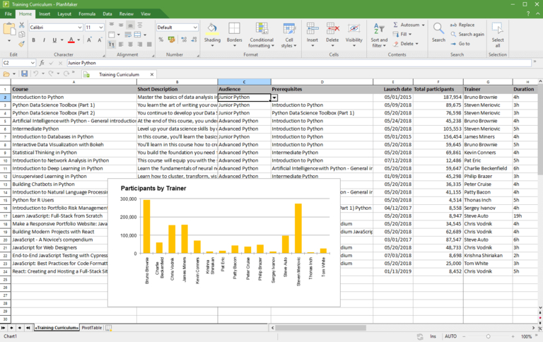
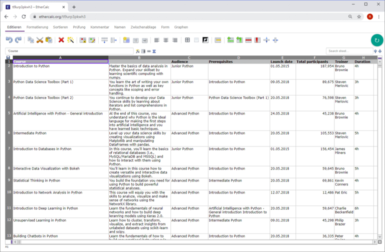

## Concurrence pour le leader du marché : celui qui propose Excel gratuitement

Bien qu'il ait été conçu comme **calculateur de table**, il n'y a guère d'autre programme informatique qui soit utilisé aujourd'hui pour autant de cas d'application différents que **Microsoft Excel** : Selon les estimations, jusqu'à un milliard de personnes travaillent régulièrement sur des feuilles de calcul en ligne avec Excel ! Avec certaines restrictions, il est même possible d'utiliser Excel gratuitement. Mais si vous ne voulez pas vous lier au quasi-monopole américain, vous avez l'embarras du choix : **Google Sheets, Apple Numbers, Calc et SeaTable** ne sont que les plus connus parmi les nombreux concurrents d'Excel.

Découvrez ci-dessous comment utiliser Excel gratuitement et quels autres tableurs sont gratuits.

## Comment utiliser Excel gratuitement

Excel est le tableur du géant américain de la technologie Microsoft et fait partie des applications Microsoft 365. Avec un **compte Microsoft gratuit**, vous pouvez utiliser Excel exclusivement en ligne - y compris 5 gigaoctets de mémoire cloud. Comme Microsoft propose également l'application mobile Excel gratuitement, vous pouvez installer Excel gratuitement sur les appareils Android et iOS. Pour certaines applications, cela peut suffire.

Mais si vous avez besoin de la version de bureau complète pour Windows ou macOS, vous devrez mettre la main à la poche. Un abonnement \*\*Microsoft 365 pour une personne coûte 69 euros par an ou 7 euros par mois à la maison et même 11,70 euros HT par utilisateur et par mois pour les entreprises. Il vaut donc en tout cas la peine de s'intéresser à d'autres fournisseurs et de tester gratuitement l'un ou l'autre des tableurs.

## Tableurs qui, contrairement à Excel, sont gratuits

Si vous souhaitez simplement avoir un aperçu rapide, consultez le tableau ci-dessous, qui compare les principaux tableurs. Une description détaillée suit plus loin, après une catégorisation des tableurs considérés ici.

| **Logiciel**  | **Développé par**        | **Systèmes d'exploitation** |
| ------------- | ------------------------ | --------------------------- |
| Calc          | LibreOffice / OpenOffice | Windows, Mac, Linux         |
| PlanMaker     | SoftMaker                | Windows, Mac, Linux         |
| Google Sheets | Google                   | basé sur le navigateur      |
| Zoho Sheet    | Zoho                     | basé sur le navigateur      |
| Ethercalc     | projet open source       | basé sur un navigateur      |
| SeaTable      | Seafile                  | basé sur un navigateur      |

Dans cette comparaison, seules les applications locales supportant au moins deux familles de systèmes d'exploitation ont été prises en compte. C'est la raison pour laquelle Apple Numbers, qui est un simple tableur pour MacOS/iOS, n'y figure pas, pas plus que Gnumeric, qui est depuis 2014 une simple application pour Linux.

Un acteur émergent parmi les tableurs est SeaTable, qui, en tant que [base de données No-Code et App-Builder](), présente une gamme de fonctions nettement plus étendue qu'Excel et d'autres solutions, ce qui relance la concurrence. Comme les autres solutions présentées dans cet article, la version gratuite de SeaTable est également gratuite, contrairement à Excel.

### Classement des tableurs

Les deux propriétés **Mode d'exploitation** et **Disponibilité du code source** ne figurent pas dans la comparaison sous forme de tableau. Nous allons maintenant nous en occuper ! Une matrice couvrant ces deux critères vous donnera une base pour votre décision.

Il y a 15 ans, une comparaison des tableurs aurait montré exclusivement des **applications locales** comme Calc et Apple Numbers dans les deux quadrants inférieurs. Avec le triomphe du cloud computing, les **tableurs basés sur un navigateur** ont gagné d'énormes parts de marché et sont devenus de plus en plus les applications leaders. Ce n'est pas sans raison qu'Excel est désormais disponible gratuitement en tant qu'application web du package Microsoft 365, en plus de la version de bureau classique.

### Avantages des solutions Cloud

Les avantages des solutions hébergées sur serveur ne sont pas à négliger. Il y a d'abord la **indépendance du lieu et de l'appareil** des applications en nuage. Un navigateur est tout ce dont vous avez besoin ! Le terminal et son système d'exploitation ne jouent plus aucun rôle. Que ce soit sur un ordinateur de bureau ou un appareil mobile, au travail ou en déplacement, vous avez toujours accès à vos données.

Le thème de la **collaboration** est tout aussi important. Les modifications apportées par un utilisateur sont immédiatement visibles pour les autres - on travaille ensemble comme si l'on était assis devant le tableau. Toutes les solutions cloud permettent la collaboration sur les tableaux **en temps réel**. Enfin, et ce n'est pas le moins important, les solutions cloud sont d'une **convivialité** sans précédent, tant pour les administrateurs que pour les utilisateurs, car l'installation et la maintenance décentralisées du logiciel sur les postes de travail ne sont plus nécessaires.

### Avantages des solutions locales

S'il est vrai que les tableurs locaux ont fait leur temps, ils n'en conservent pas moins leur raison d'être. Le principal argument de leur côté est l'**indépendance de l'accès à Internet**. Celui qui veut faire quelques modifications lors d'un voyage avec une connexion Internet instable ne pourra plus s'en passer jusqu'à nouvel ordre. Un autre argument, même s'il perd de son importance, est la plus large disponibilité des extensions, comme par exemple les **macros**, indispensables dans de nombreuses entreprises. Dans de nombreux cas, celles-ci ne sont disponibles que pour les versions de bureau.

## Calc

### Le tableur open source de la suite LibreOffice et OpenOffice

Avant le boom des solutions de tableur basées sur le cloud, **Calc** était le numéro 2 incontesté après Excel et chez les utilisateurs privés, Calc jouit encore aujourd'hui d'une grande popularité. À l'époque comme aujourd'hui, Calc a su convaincre par ses nombreuses fonctions, son large support de plateforme avec des supports d'installation pour Windows, Mac et Linux ainsi qu'une grande communauté d'utilisateurs qui offre une documentation complète. Un autre avantage de Calc : vous pouvez l'utiliser à titre privé ou professionnel et, contrairement à Excel, gratuitement.

Vous trouverez Calc sous une forme similaire, mais pas identique, dans **OpenOffice** et **LibreOffice Suite**. La raison en est le passé commun des deux suites. En 2010, LibreOffice s'est séparé en tant que projet séparé d'OpenOffice, qui était alors dominé par Oracle et n'accordait que peu d'attention au projet. Depuis lors, le développement de LibreOffice se poursuit indépendamment de The Document Foundation. Peu après, Oracle s'est complètement retiré du projet et l'a transmis à l'Apache Software Foundation, qui a depuis donné son nom à OpenOffice.

### Fonctionnalités : tableur complet

En ce qui concerne les fonctions de base, Calc n'a rien à envier à son modèle Excel ! En y regardant de plus près, on trouve aussi quelques fonctionnalités qu'Excel gratuit ne propose pas. Calc montre une force particulière dans le domaine des **formules**. L'assistant de formules de Calc connaît environ 30 fonctions de plus que son concurrent de Microsoft. De plus, en tant qu'alternative open source, Calc offre un bon support du standard OpenFormula. Calc se montre également flexible en matière de **formatage**. En plus des formatages de cellules habituels, Calc connaît des styles de cellules et de pages qui permettent d'obtenir rapidement des tableaux attrayants et homogènes.

Suivant le paradigme de l'open source, Calc favorise également la **portabilité des données** : Les fichiers Apple Numbers et Gnumeric peuvent être importés, tout comme de nombreux formats plus anciens (par ex. MS Works, Lotus 1-2-3). La possibilité de comparer deux fichiers de tableau est une autre fonction Calc que les utilisateurs d'Excel attendaient en vain jusqu'à présent. Les administrateurs apprécient également la possibilité de lancer et d'exécuter OpenOffice comme LibreOffice directement à partir d'une clé USB sans installation.

### Inconvénients de Calc par rapport à Excel

La vérité, c'est que Calc n'offre qu'un **support macro limité** et n'est pas flexible pour la connexion de sources de données externes. Il ne convient donc pas à de nombreux utilisateurs professionnels. Pour les utilisateurs intensifs, le **manque de capacité multithreading** et l'absence de **Power Pivot** sont des arguments de poids contre Calc. Les utilisateurs moins ambitieux remarqueront surtout le **choix réduit de types de graphiques**. Les graphiques en cascade et les histogrammes, par exemple, ne sont pas disponibles.

Si vous ne travaillez que très peu avec les fonctions avancées, vous n'aurez aucun problème à vous lancer ou à passer à Calc. L'interface utilisateur de Calc est claire et les menus sont structurés de manière logique. Il en va tout autrement pour les utilisateurs expérimentés d'Excel. Ceux-ci verront leur efficacité de travail diminuer au début, car ils devront chercher plus souvent les fonctions souhaitées. Ce n'est pas l'aspect moins moderne de l'interface utilisateur qui est déterminant, mais l'organisation différente des fonctions et de leur fonctionnement.

Un autre obstacle au passage à Calc est la prise en charge incomplète du format de fichier XLSX utilisé par Excel. Les documents **XLSX** peuvent être ouverts dans Calc, mais le formatage et les fonctions peuvent être perdus. Les développeurs de LibreOffice eux-mêmes qualifient de "partiel" le [support de l'importation et de l'exportation vers les fichiers OOXML de Microsoft](https://wiki.documentfoundation.org/Feature_Comparison:_LibreOffice_-_Microsoft_Office). Le format de fichier standard de LibreOffice et d'OpenOffice est ODS, un format de document indépendant du fabricant et conforme à l'Open Document Standard.

## PlanMaker

### Excel concurrent de la maison SoftMaker

**PlanMaker** est le tableur de la suite bureautique SoftMaker, développée par la société SoftMaker Software GmbH de Nuremberg. Outre PlanMaker, la suite bureautique des pays germaniques contient également le traitement de texte **TextMaker** et l'application **Presentations**.

Si vous cherchez un tableur que vous pouvez utiliser gratuitement, contrairement à Excel, vous serez d'abord déçu par PlanMaker : l'abonnement annuel pour cinq postes de travail coûte environ 200 euros, la licence pour cinq ordinateurs privés du même ménage ou un ordinateur professionnel est de 29,90 euros par an ou 2,99 euros par mois. Si vous ne voulez absolument rien dépenser, vous trouverez sous le nom de **FreeOffice** une version à fonctions limitées de SoftMaker Office Suite, qui vous permet d'utiliser gratuitement et durablement une modification d'Excel.

### Mêmes fonctionnalités qu'Excel

Si vous souhaitez toutefois vous éloigner de Microsoft et que vous recherchez une variante Excel performante et confortable, vous serez parfaitement servi par PlanMaker. PlanMaker offre un ensemble complet de fonctions, une interface utilisateur attrayante et très proche d'Excel, ainsi qu'une **excellente compatibilité avec le format de fichier XLSX** d'Excel. En effet, les applications de la suite SoftMaker peuvent utiliser par défaut les formats de fichiers OOXML de Microsoft pour le stockage des fichiers. Dans cette mesure, PlanMaker élimine de nombreux inconvénients qui s'opposent à ce que Calc remplace Excel.

Mais PlanMaker peut aussi marquer des points contre Excel sur un autre point : PlanMaker fonctionne sur toutes les principales plates-formes de bureau et constitue ainsi un tableur attrayant pour Mac et Linux. Le logiciel gratuit FreeOffice est également disponible pour les trois familles de systèmes d'exploitation.

## Google Sheets

### Le tableur en ligne de Google

**Sheets** est l'application web de tableur de la maison Alphabet. Il offre une interface utilisateur attrayante, des fonctions d'analyse de données riches ainsi que des fonctions d'équipe pratiques. Tout ce dont vous avez besoin pour commencer à utiliser Sheets, c'est d'un **compte Google gratuit** - et qui n'en a pas ? Il n'est donc pas étonnant que de nombreuses personnes préfèrent actuellement utiliser Google Sheets gratuitement en remplacement d'Excel !

### Tableur collaboratif pour le navigateur

Avec Sheets, les développeurs de Google ont créé une application dans laquelle les débutants comme les utilisateurs exigeants se sentent à l'aise. Il suffit de créer un tableau, de l'enregistrer gratuitement et de le partager avec d'autres ! L'interface **basée sur le web fonctionne de manière fluide**, les menus sont bien organisés et même les utilisateurs engagés n'auront guère de souhaits fonctionnels non satisfaits. D'autre part, c'est justement le fait de renoncer à certaines fonctions qui rend Google Sheets attractif pour les débutants.

C'est surtout lorsque le **travail en commun** sur les tableaux est au premier plan que Sheets peut faire valoir ses atouts en tant qu'application web. Les tableaux de Google Sheets sont enregistrés dans Google Drive, qui est également lié au compte Google. De là, les tableaux peuvent être partagés avec d'autres utilisateurs en quelques clics. En cas de traitement simultané, tous les utilisateurs voient **en temps réel** la position du curseur et les saisies des autres. Un chat intégré permet d'échanger directement avec des collègues.

### Seuls quelques petits sacrifices et gratuit par rapport à Excel

Alors que Google Sheets brille dans le domaine de la collaboration, il faut accepter certaines restrictions par rapport à Excel en ce qui concerne les fonctions avancées. En particulier pour la visualisation, les possibilités ne sont pas encore tout à fait au niveau de l'original. Les options permettant de créer des graphiques de haute qualité et homogènes sont un peu plus variées dans Excel.

Google est en bonne voie pour combler l'écart avec Microsoft. Depuis ses débuts modestes en 2006, Sheets a connu un développement fulgurant. Et le développement se poursuit. Début 2020, un **historique des modifications** a par exemple été intégré. Si les fonctions existantes de Sheets ne vous suffisent pas, vous pouvez ajouter d'autres fonctionnalités telles que la fonction de valeur cible et le solveur sous forme de module complémentaire à partir de G Suite Marketplace.

Les débutants auront probablement plus de facilité avec Sheets qu'avec Excel. Les débutants s'y retrouveront également rapidement après une courte phase de découverte. Le problème lors du changement se présente moins au niveau de l'utilisation que de la **migration des données**. Il est certes impressionnant de voir à quel point Google Sheets reconnaît et importe de nombreuses fonctionnalités d'Excel, mais il existe toujours des rapports de formules qui ne fonctionnent plus ou de diagrammes détruits après l'importation.

## Zoho Sheet

### Le tableur en ligne de la suite Zoho Office

**Zoho Sheet** est le tableur web de la société indienne Zoho Corporation et fait partie de la suite bureautique Zoho Office. Celle-ci a attiré l'attention ces dernières années, notamment parce que les particuliers peuvent l'utiliser gratuitement en remplacement d'Excel. D'autres éléments de la suite Office sont **Zoho Writer** (traitement de texte), **Zoho Show** (présentations) et **Zoho Notebook** (notes). En outre, l'offre de Zoho comprend plus de 40 applications Office intégrées et basées sur le web et se présente ainsi comme une alternative à G Suite. Cela vaut donc la peine d'y regarder de plus près.

### Une orientation claire vers Google Sheets

Si, en raison du nom et de la prétention à être le tueur de G Suite, vous supposez d'autres similitudes avec Google Sheets, vous avez raison : à première vue, Zoho Sheet apparaît comme un clone de Google Sheets. La **structure des menus est quasiment identique** ; les différences n'apparaissent qu'au deuxième coup d'œil. Même en comparant directement les fonctions, Zoho Sheet et Google Sheets sont proches l'une de l'autre. Formulaires web, tableaux croisés dynamiques, mise en forme conditionnelle, versionnement et **nombreuses fonctions de collaboration**, y compris le partage, la collaboration en temps réel et le chat, sont disponibles dans les deux. Ceux qui s'en sortent avec Google Sheets n'auront aucun mal à remplacer Excel gratuitement avec Zoho Sheet.

Mais c'est faire injure à Zoho Sheet que de lui dénier toute individualité ! Dans le domaine de l'analyse des données, il offre plus que son équivalent Google avec un solveur et une fonction de valeur cible. En raison de son rôle moins dominant sur le marché, il se montre aussi agréablement **intégratif**. Les tableaux créés dans Zoho Sheet peuvent être sauvegardés dans un propre espace de stockage en ligne - **Zoho Docs** pour les personnes privées, **Zoho WorkDrive** pour les équipes - ou dans un compte intégré de Google Drive, OneDrive ou Dropbox. L'exportation de fichiers est possible dans des fichiers de type .csv, .xlsx et .ods.

### Avantages et inconvénients si vous souhaitez l'utiliser gratuitement en remplacement d'Excel

L'un des points forts de Zoho Sheet, qui le rend particulièrement recommandable pour les personnes qui passent d'Excel à Excel, est son **support de macros**, qui en comprend également un pour Visual Basic for Applications (VBA). Le puissant moteur de script de Google Sheets nécessite des scripts basés sur JavaScript pour les macros Google Apps. Pour les utilisateurs d'Excel qui développaient jusqu'à présent en VBA, cela signifie un changement d'habitude massif ou l'apprentissage d'un nouveau langage de programmation.

La course entre Zoho Sheet et Google Sheets est très serrée et la question de la supériorité du tableur ne peut pas être résolue sans tenir compte du contexte de l'application concrète. C'est justement pour la **visualisation de données** que Zoho Sheet offre moins d'options que Google Sheets. Le dessin n'est pas non plus pris en charge par Zoho. Pour certains utilisateurs, la **limitation à 65.000 lignes et 256 colonnes** peut également constituer une restriction importante. En tout cas, Zoho Sheet est un bon programme de tableur pour tous ceux qui changent de méthode et qui ne considèrent pas une feuille Excel sans macro comme un véritable tableur Excel.

## Ethercalc

### Le tableur open source pour une collaboration facile

Moins connu, **Ethercalc** est une application de tableur simple basée sur le web et développée par une petite communauté. Comme il s'agit d'un logiciel open source, vous pouvez télécharger **gratuitement** Ethercalc en remplacement d'Excel et l'utiliser sans restriction. Les développeurs mettent à disposition des paquets pour toutes les plates-formes de serveurs importantes, y compris une image Docker. [Ici](https://ethercalc.net) vous pouvez tester et utiliser l'application sans inscription d'utilisateur.

### Fonctionnalités réduites

Au premier coup d'œil, on remarque chez Ethercalc une interface utilisateur rudimentaire, à l'aspect un peu poussiéreux. De même, les fonctions mises à disposition par Ethercalc sont plutôt limitées par rapport à Excel et aux autres tableurs basés sur le cloud. Cela se remarque déjà au niveau du formatage et des analyses de données simples comme le tri. Alors que les assistants d'Excel et de ses semblables rendent ces travaux simples et confortables, ceux d'Ethercalc nécessitent un certain nombre de clics via les menus correspondants. Les possibilités de visualisation des données sont très limitées, il manque complètement une fonction de filtrage.

En termes de fonctionnalités et de confort, Ethercalc n'est pas à la hauteur des autres tableurs. Cela s'explique d'une part par la petite communauté de développeurs, mais aussi par l'objectif général du projet. L'objectif principal d'Ethercalc n'est pas l'évaluation de grands ensembles de données, mais la **collaboration** et la **collecte de données sans contrainte de lieu** dans le navigateur.

Pour le tableau web, on n'a pas besoin d'un programme installé, mais on peut faire des adaptations en déplacement via un téléphone portable ou une tablette et grâce au **support en temps réel**, toutes les modifications sont immédiatement visibles dans Ethercalc pour tous les autres utilisateurs. Pour l'analyse des données saisies, une fonction d'exportation est ensuite disponible, permettant un transfert simple vers XLSX, ODS, CSV et HTML.

## SeaTable

### La base de données collaborative no-code pour plus que des chiffres et du texte

SeaTable est l'application la plus récente dans le cercle des tableurs considérés ici. Comme Google Sheets, Zoho Sheet et Ethercalc, SeaTable est un **tableur basé sur le web** que vous pouvez utiliser gratuitement, contrairement à Excel. La base de données No-Code associe une interface utilisateur attrayante à l'aspect d'une feuille de calcul à de puissantes fonctions d'analyse et de collaboration. De plus, SeaTable permet de nombreux nouveaux cas d'utilisation qui ne sont pas possibles dans Excel et autres.

La différence entre SeaTable et les autres tableurs saute aux yeux dès la première ouverture d'un tableau. Au lieu d'une grille de tableau uniforme qui ne comprend que du texte, des chiffres et des formules, vous pouvez également enregistrer des **images et des fichiers**, des cases à cocher, des données de position ainsi que des références utilisateur dans un tableau SeaTable. Les autres [types de colonnes](https://seatable.io/docs/arbeiten-mit-spalten/uebersicht-alle-spaltentypen/) proposés par SeaTable sont les **sélections simples et multiples**.

Les sélections simples sont similaires aux listes déroulantes que vous pouvez mapper dans Excel via la validation des données, mais elles sont plus flexibles et plus faciles à utiliser. Les sélections multiples, qui n'ont pas d'équivalent dans Excel, aident à catégoriser et à indexer les données. Ces types de colonnes avancés permettent de stocker tous les types d'informations imaginables dans un tableau. **Les différents emplacements** pour les différents types de données appartiennent ainsi au passé.

### Tableur avec la puissance des bases de données No-Code et des constructeurs d'applications

Une autre fonction de SeaTable, qui n'est disponible dans aucune autre application, est celle des **concaténations**. Les jointures permettent de mettre en relation des ensembles de données et de représenter des dépendances et des appartenances (à ne pas confondre avec les références de cellules dans Excel). Cela est possible aussi bien à l'intérieur d'une table qu'à travers toutes les tables d'une base de données. Grâce aux **fonctions d'analyse** correspondantes, les données liées peuvent être facilement évaluées sous forme de graphiques et de tableaux dans le tableur basé sur un navigateur. SeaTable apporte des fonctionnalités que l'on ne trouve habituellement que dans les bases de données et constitue la solution optimale pour pouvoir utiliser gratuitement des feuilles de calcul comme dans Excel.

Les débutants de SeaTable devront d'abord s'habituer à définir les types de colonnes avant de saisir les données et à penser en termes de logique **de base de données** pour l'ensemble des tableaux. L'interface utilisateur **intuitive** rend toutefois ce défi gérable. La migration depuis Excel est facilitée par [les fonctions d'importation pour les fichiers CSV et XLSX](https://seatable.io/docs/import-von-daten/import-von-excel-dateien-in-seatable/). En raison des formats de données utilisés par SeaTable, des pertes d'informations peuvent toutefois survenir lors de l'importation.

### Plus d'options de visualisation que les autres tableurs

Bien entendu, SeaTable dispose également des fonctions classiques d'un tableur : **filtres**, **triages** et **groupements** permettent de classer les données dans l'ordre souhaité, les **tableaux croisés dynamiques** permettent d'évaluer rapidement de grands ensembles de données et les divers **types de graphiques** représentent les données de manière visuelle. Mais comme pour les types de données supportés, SeaTable va plus loin que les autres concurrents d'Excel en ce qui concerne les options de représentation.

SeaTables [Plugins](https://seatable.io/docs/plugins/alle-plugins-in-der-uebersicht/) offre des options de visualisation avancées pour les types de données non numériques : Le plug-in de carte permet de représenter les données d'adresse et de géoposition sur une carte et le plug-in de galerie affiche clairement les données d'image stockées dans une table dans des albums. Les données de rendez-vous saisies dans un tableau peuvent être affichées dans le plugin Calendrier ou dans le plugin Ligne de temps et le plugin Kanban représente des flux de travail avec différentes phases, comme on ne le connaît normalement que dans les applications [Gestion de projet]().

De plus, SeaTable vous permet de créer vos propres apps sans connaissances en programmation. Une app se compose de pages que vous pouvez composer dans le [No-Code-App-Builder] intégré (https://seatable.io/docs/apps/universelle-app/) à l'aide de différents types de pages. Une app accède aux données de SeaTable et les présente de manière optimale à l'utilisateur. L'avantage est que la conception de l'application permet de contrôler précisément les données qu'un utilisateur voit, la manière dont les données sont visualisées et la manière dont il peut interagir avec les données. Les flux de travail peuvent ainsi être représentés avec précision.

### Dans le cloud ou sur ses propres serveurs

En tant qu'arme polyvalente et flexible, SeaTable ne fait pas non plus de compromis en matière de **mode d'exploitation**. SeaTable peut être utilisé confortablement dans le [nuage]() ou comme [solution auto-hébergée](). Contrairement aux autres concurrents Excel basés sur le web, SeaTable existe donc aussi en tant que logiciel pour son propre serveur. De cette manière, SeaTable est idéal pour tous ceux qui sont confrontés à des exigences strictes en matière de protection des données.

L'[abonnement gratuit]() est gratuit en permanence et suffit pour un usage privé. Les versions payantes Plus et Enterprise offrent des fonctionnalités avancées pour une utilisation en entreprise, telles que les partages personnalisés, l'automatisation et la personnalisation. Le [nuage dédié]() dispose en outre d'une authentification centrale des utilisateurs et d'une prise en charge du stockage d'objets.

SeaTable suit une voie similaire à celle de Google Sheets - agréablement conventionnelle pour les développeurs - en ce qui concerne les extensions. Grâce à l'API et au SDK, il est possible de développer des extensions telles que des automatisations, des intégrations et des compléments de fonctions à un coût raisonnable. Vu le jeune âge de la solution, il sera intéressant de voir quelles nouveautés seront ajoutées à l'avenir.

## Utiliser des tableurs qui sont gratuits par rapport à Excel

Si vous souhaitez disposer d'un tableur performant, vous n'êtes pas obligé de recourir à Excel ! Les tableurs disponibles n'ont pas à rougir de leurs fonctionnalités ni de leur facilité d'utilisation. Nombre d'entre eux peuvent être utilisés gratuitement, contrairement à Excel.

Les tableurs connus présentés dans ce comparatif sont fonctionnellement similaires à Excel et offrent une expérience utilisateur similaire. Les solutions cloud sont des concurrents d'Excel adultes qui reproduisent l'essentiel des fonctions d'Excel et marquent en outre des points avec des fonctions de collaboration.

SeaTable se distingue de la masse par ses formats de données avancés, ses fonctions de base de données et son constructeur d'applications. SeaTable est la seule application de ce comparatif à être disponible à la fois en tant qu'application en nuage et en tant qu'application auto-hébergée. Chaque utilisateur peut ainsi choisir librement entre la souveraineté des données et le confort.

[S'inscrire gratuitement et essayer SeaTable maintenant]()
