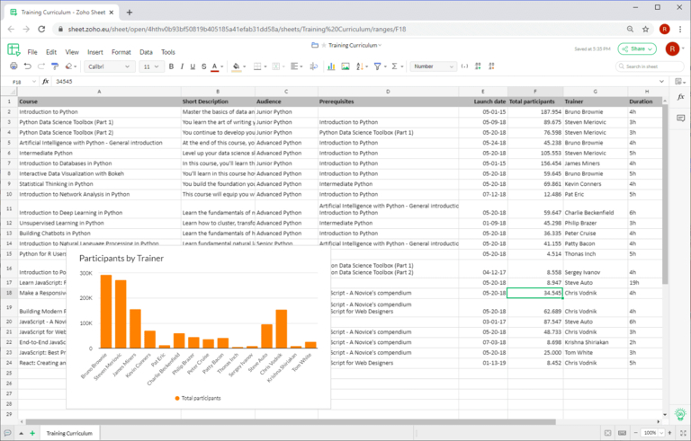

## Concorrência para o líder de mercado: Quem oferece o Excel gratuitamente

Embora concebido como uma **folha de cálculo**, praticamente nenhum outro programa de computador é utilizado atualmente para tantas aplicações diferentes como o **Microsoft Excel**: Estima-se que até mil milhões de pessoas editem regularmente folhas de cálculo online utilizando o Excel! Com algumas restrições, pode até utilizar o Excel gratuitamente. No entanto, se não quiser ficar vinculado ao quase monopolista norte-americano, tem muito por onde escolher: **Google Sheets**, **Apple Numbers**, **Calc** e **SeaTable** são apenas os mais conhecidos entre os numerosos concorrentes do Excel.

Descubra abaixo como utilizar o Excel gratuitamente e que outros programas de folha de cálculo são gratuitos.

## Como utilizar o Excel gratuitamente

O Excel é o programa de folha de cálculo do gigante tecnológico norte-americano Microsoft e é uma das aplicações do Microsoft 365. Com uma **conta Microsoft gratuita**, pode utilizar o Excel exclusivamente online - incluindo 5 gigabytes de armazenamento na nuvem. Como a Microsoft também oferece a aplicação móvel Excel gratuitamente, pode instalar o Excel em dispositivos Android e iOS gratuitamente. Isto pode ser suficiente para algumas aplicações.

No entanto, se necessitar da versão completa para ambiente de trabalho para Windows ou macOS, terá de fazer uma grande aposta. Uma assinatura **Microsoft 365** para uma pessoa custa 69 euros por ano ou 7 euros por mês para utilizadores domésticos e até 11,70 euros mais IVA por utilizador e mês para empresas. Por isso, vale mesmo a pena procurar outros fornecedores e testar gratuitamente um ou outro programa de folha de cálculo.

## Folhas de cálculo gratuitas, ao contrário do Excel

Se quiser apenas ter uma visão geral, consulte a tabela seguinte, que compara os programas de folha de cálculo mais importantes. Segue-se uma descrição detalhada após uma categorização dos programas de folha de cálculo aqui considerados.

| **Software**  | **Desenvolvido por**     | **Sistemas operativos** |
| ------------- | ------------------------ | ----------------------- |
| Calc          | LibreOffice / OpenOffice | Windows, Mac, Linux     |
| PlanMaker     | SoftMaker                | Windows, Mac, Linux     |
| Google Sheets | Google                   | Baseado em navegador    |
| Zoho Sheet    | Zoho                     | Baseado em navegador    |
| Ethercalc     | Projeto de código aberto | Baseado em navegador    |
| SeaTable      | Seafile                  | Baseado em navegador    |

Nesta comparação, apenas foram consideradas as aplicações locais que suportam pelo menos duas famílias de sistemas operativos. Por este motivo, o Apple Numbers, enquanto aplicação pura de folha de cálculo para MacOS/iOS, não está incluído, nem o Gnumeric, que é uma aplicação pura para Linux desde 2014.

Entre as aplicações de folha de cálculo, um jogador em ascensão é o SeaTable, que, como [no-code database and app builder](), tem uma gama de funções significativamente alargada em comparação com o Excel e outras soluções, revitalizando assim a concorrência. Tal como as outras soluções apresentadas neste artigo, a versão gratuita do SeaTable é também gratuita, ao contrário do Excel.

### Classificação das folhas de cálculo

Não estão incluídas na comparação tabular as duas propriedades **modo de funcionamento** e **disponibilidade de código fonte**. Vamos agora compensar este facto! Uma matriz que abrange estes dois critérios fornecer-lhe-á uma base para a sua decisão.

Uma comparação de folhas de cálculo há 15 anos teria mostrado apenas **aplicações locais** como o Calc e o Apple Numbers nos dois quadrantes inferiores. Com o triunfo da computação em nuvem, as **folhas de cálculo baseadas em browsers** ganharam uma enorme quota de mercado e tornaram-se cada vez mais as principais aplicações. Não é sem razão que o Excel está agora também disponível gratuitamente como uma aplicação Web do pacote Microsoft 365, para além da versão clássica para computador.

### Vantagens das soluções na nuvem

As vantagens das soluções hospedadas em servidores não podem ser negadas. Em primeiro lugar, as aplicações na nuvem são **independentes da localização e do dispositivo**. Um navegador é tudo o que precisa! O dispositivo final e o seu sistema operativo já não desempenham qualquer papel. Quer seja um computador de secretária ou um dispositivo móvel, no trabalho ou em viagem: tem sempre acesso aos seus dados.

Igualmente importante é a questão da **colaboração**. As alterações feitas por um utilizador são imediatamente visíveis para os outros - trabalham em conjunto como se estivessem sentados em frente à folha de cálculo. Todas as soluções na nuvem suportam o trabalho colaborativo em folhas de cálculo **em tempo real**. Por último, mas não menos importante: As soluções na nuvem são sem precedentes **convenientes** para administradores e utilizadores, uma vez que não há necessidade de instalação e manutenção descentralizadas do software nas estações de trabalho.

### Vantagens das soluções locais

Embora os programas de folha de cálculo local possam ser uma coisa do passado, ainda têm o direito de existir. O argumento mais importante do seu lado é a **independência do acesso à Internet**. Quem quiser fazer algumas alterações enquanto viaja com uma ligação instável à Internet não poderá evitá-las por enquanto. Outro argumento, embora menos importante, é a maior disponibilidade de extensões, como os **macros** que são indispensáveis em muitas empresas. Em muitos casos, estas só estão disponíveis para as versões desktop.

## Calc

### A folha de cálculo de código aberto do LibreOffice e do OpenOffice Suite

Antes do boom das soluções de folha de cálculo baseadas na nuvem, o **Calc** era o número 2 indiscutível depois do Excel e o Calc continua a ser muito popular entre os utilizadores privados. Tanto nessa altura como agora, o Calc impressionava com as suas muitas funções, o amplo suporte de plataformas com suportes de instalação para Windows, Mac e Linux e uma grande comunidade de utilizadores que oferece uma vasta documentação. Outra vantagem do Calc: pode ser utilizado tanto a nível privado como comercial e, ao contrário do Excel, é gratuito.

O Calc pode ser encontrado de forma semelhante, mas não idêntica, no **OpenOffice** e no **LibreOffice Suite**. A razão para tal reside no passado partilhado das duas suites. Em 2010, o LibreOffice separou-se como um projeto separado do OpenOffice, que na altura era dominado pela Oracle e prestou pouca atenção ao projeto. Desde então, o desenvolvimento do LibreOffice tem continuado de forma independente da The Document Foundation. Pouco depois, a Oracle retirou-se completamente do projeto e entregou-o à Apache Software Foundation, que desde então deu o nome ao OpenOffice.

### Gama de funções: Aplicação de folha de cálculo completa

No que diz respeito às funções principais, o Calc não é de forma alguma inferior ao seu modelo Excel! Se olhar com mais atenção, também encontrará algumas funcionalidades que o Excel não oferece gratuitamente. O Calc mostra uma força particular na área das **fórmulas**. O assistente de fórmulas do Calc conhece mais cerca de 30 funções do que o seu concorrente da Microsoft. Sendo uma alternativa de código aberto, o Calc também oferece um bom suporte para a norma OpenFormula. O Calc também é flexível no que diz respeito à **formatação**. Para além da habitual formatação de células, o Calc conhece estilos de célula e de página, que podem ser utilizados para criar rapidamente tabelas atraentes e uniformes.

De acordo com o paradigma de código aberto, o Calc também promove a **portabilidade de dados**: Os ficheiros Apple Numbers e Gnumeric podem ser importados, bem como vários formatos mais antigos (por exemplo, MS Works, Lotus 1-2-3). A capacidade de comparar dois ficheiros de folhas de cálculo é outra função do Calc que os utilizadores do Excel têm esperado em vão. Os administradores também apreciam a capacidade de iniciar e executar o OpenOffice e o LibreOffice diretamente a partir de uma pen USB sem instalação.

### Desvantagens do Calc em relação ao Excel

A verdade, porém, é que o Calc oferece apenas **suporte limitado a macros** e não é flexível quando se trata de conectar fontes de dados externas. Isto torna-o inadequado para muitos utilizadores comerciais. Para os utilizadores mais exigentes, a **falta de capacidade de multithreading** e a ausência de **Power Pivot** são outros argumentos de peso contra o Calc. Os utilizadores menos ambiciosos irão provavelmente notar a **reduzida seleção de tipos de gráficos**. Os gráficos em cascata e os histogramas, por exemplo, não estão disponíveis.

Se trabalhar apenas um pouco com as funções avançadas, não terá problemas em começar ou mudar para o Calc. A interface de utilizador do Calc é clara e os menus estão estruturados de forma lógica. A história é diferente para os utilizadores experientes do Excel. No início, verão a sua eficiência de trabalho diminuir, uma vez que têm de procurar as funções pretendidas com mais frequência. Não é o aspeto menos moderno da **interface do utilizador** que é decisivo aqui, mas a diferente organização das funções e a forma como funcionam.

Outro obstáculo à mudança para o Calc é o suporte incompleto do formato de ficheiro XLSX utilizado pelo Excel. **Documentos XLSX** podem ser abertos no Calc, mas a formatação e as funções podem ser perdidas. Os próprios desenvolvedores do LibreOffice descrevem o [suporte para importação e exportação de arquivos Microsoft OOXML](https://wiki.documentfoundation.org/Feature_Comparison:_LibreOffice_-_Microsoft_Office) como "parcial". O formato de ficheiro padrão do LibreOffice e do OpenOffice é o ODS, um formato de documento independente do fabricante, de acordo com o Open Document Standard.

## PlanMaker

### Concorrência do Excel com o SoftMaker

O **PlanMaker** é o aplicativo de planilha eletrônica do SoftMaker Office Suite, desenvolvido pela SoftMaker Software GmbH, com sede em Nuremberg. Para além do PlanMaker, o Office Suite da Alemanha também inclui o processador de texto **TextMaker** e a aplicação **Presentations**.

Se procura uma aplicação de folha de cálculo que possa utilizar gratuitamente, ao contrário do Excel, ficará desiludido com o PlanMaker à partida: a subscrição anual para cinco estações de trabalho custa cerca de 200 euros, a licença para cinco computadores privados no mesmo agregado familiar ou um computador empresarial custa 29,90 euros por ano ou 2,99 euros por mês. Se não quiser gastar nada, pode encontrar uma versão de funções limitadas do SoftMaker Office Suite sob o nome **FreeOffice**, que lhe permite utilizar uma modificação do Excel permanentemente de forma gratuita.

### A mesma gama de funções do Excel

No entanto, se quiser afastar-se da Microsoft e estiver à procura de uma versão poderosa e conveniente do Excel, o PlanMaker é a escolha perfeita. O PlanMaker oferece um conjunto abrangente de funções, uma interface de utilizador apelativa que se assemelha muito ao Excel e uma **excelente compatibilidade com o formato de ficheiro XLSX do Excel**. De facto, as aplicações da SoftMaker Suite podem utilizar os formatos de ficheiro OOXML da Microsoft para o armazenamento de ficheiros por defeito. A este respeito, o PlanMaker elimina muitas das desvantagens que falam contra o Calc como um substituto do Excel.

No entanto, o PlanMaker também pode marcar pontos contra o Excel em outra área: O PlanMaker funciona em todas as principais plataformas de desktop, o que o torna uma aplicação de folha de cálculo atractiva para Mac e Linux. O FreeOffice gratuito também está disponível para as três famílias de sistemas operativos.

## Google Sheets

### A folha de cálculo online da Google

**O Google Sheets** é a aplicação Web de folha de cálculo da Alphabet. Oferece uma interface de utilizador atraente, funções de análise de dados ricas e funções de equipa práticas. Tudo o que precisa para começar a utilizar o Sheets é uma **conta Google gratuita** - e quem é que não tem uma? Por isso, não é de admirar que muitas pessoas prefiram atualmente utilizar o Google Sheets como substituto gratuito do Excel!

### Folha de cálculo colaborativa para o browser

Com o Sheets, os programadores da Google criaram uma aplicação na qual tanto os principiantes como os utilizadores mais exigentes se sentem igualmente à vontade. Basta criar uma folha de cálculo, guardá-la gratuitamente e partilhá-la com outras pessoas! A **interface baseada na Web funciona sem problemas**, os menus estão bem organizados e mesmo os utilizadores dedicados dificilmente terão quaisquer desejos funcionais por satisfazer. Por outro lado, é precisamente a falta de algumas funções que torna o Google Sheets atrativo para os principiantes.

Especialmente quando o foco é o **trabalho partilhado** em folhas de cálculo, o Sheets pode jogar os seus trunfos como uma aplicação Web. As folhas de cálculo do Google Sheets são armazenadas no Google Drive, que também está ligado à conta Google. A partir daí, é possível partilhar as folhas de cálculo com outros utilizadores com apenas alguns cliques. Ao editar simultaneamente, todos os utilizadores podem ver as posições do cursor e as entradas dos outros **em tempo real**. Um chat integrado permite o intercâmbio direto com colegas.

### Apenas pequenos compromissos e gratuito em comparação com o Excel

Embora o Google Sheets brilhe quando se trata de colaboração, existem certas limitações em comparação com o Excel quando se trata de funções avançadas. Especialmente quando se trata de visualização, as possibilidades não estão ao nível do original. As opções para criar gráficos padronizados e de alta qualidade no Excel são muito mais versáteis.

A Google está no bom caminho para alcançar a Microsoft. Desde o seu humilde início em 2006, o Sheets desenvolveu-se rapidamente. E o desenvolvimento continua. No início de 2020, por exemplo, foi integrado um **Histórico de versões de alterações**. Se as funções existentes do Sheets não forem suficientes para si, pode adicionar outras funcionalidades, como a função de valor alvo e o solver, como um complemento do G Suite Marketplace.

Os recém-chegados irão provavelmente achar o Sheets mais fácil de utilizar do que o Excel. Os novos utilizadores também encontrarão rapidamente o seu caminho após uma breve fase de familiarização. O problema com a mudança tem menos a ver com a utilização do que com a **migração de dados**. Embora seja impressionante a quantidade de funcionalidades do Excel que o Google Sheets reconhece e importa, ainda existem relatos de fórmulas que deixaram de funcionar ou gráficos danificados após a importação.

## Planilha do Zoho

### A folha de cálculo online do Zoho Office Suite

**A Zoho Sheet** é a aplicação de folha de cálculo web da empresa indiana Zoho Corporation e faz parte do Zoho Office Suite. Tem atraído muita atenção nos últimos anos - sobretudo porque os particulares podem utilizá-la gratuitamente como substituto do Excel. Outras partes do pacote Office são o **Zoho Writer** (processamento de texto), o **Zoho Show** (apresentações) e o **Zoho Notebook** (notas). Além disso, a oferta do Zoho inclui mais de 40 aplicações Office integradas e baseadas na Web, apresentando-se assim como uma alternativa ao G Suite. Por isso, vale a pena dar uma olhadela mais atenta.

### Orientação clara para o Google Sheets

Se suspeitar de mais semelhanças com o Google Sheets com base no nome e na alegação de ser um assassino do G Suite, tem razão: à primeira vista, o Zoho Sheet parece ser um clone do Google Sheets. A estrutura do **menu é praticamente idêntica**; as diferenças só se tornam aparentes à segunda vista. O Zoho Sheet e o Google Sheets também estão próximos um do outro numa comparação direta de funções. Formulários Web, tabelas dinâmicas, formatação condicional, controlo de versões e **funções de colaboração extensivas**, incluindo partilha, colaboração em tempo real e chat, estão disponíveis em ambas. Se se sentir confortável com o Google Sheets, não terá problemas em substituir o Excel pelo Zoho Sheet gratuitamente.

Mas estaria a fazer uma injustiça ao Zoho Sheet se lhe negasse toda a sua individualidade! No domínio da análise de dados, oferece mais do que o seu homólogo do Google, com um solucionador e uma função de valor-alvo. Devido ao seu papel menos dominante no mercado, é também agradavelmente **integrativa**. Pode guardar as folhas de cálculo criadas no Zoho Sheet no seu próprio armazenamento online - **Zoho Docs** para indivíduos, **Zoho WorkDrive** para equipas - ou numa conta integrada do Google Drive, OneDrive ou Dropbox. A exportação de ficheiros é possível em ficheiros .csv, .xlsx e .ods.

### Vantagens e desvantagens se quiser utilizá-lo como um substituto gratuito do Excel

Um dos pontos fortes do Zoho Sheet, que o torna particularmente recomendável para pessoas que estão a mudar do Excel, é o seu **suporte macro**, que também inclui suporte para Visual Basic for Applications (VBA). O poderoso motor de scripting do Google Sheets requer scripts baseados em JavaScript para as macros do Google Apps. Para os utilizadores do Excel que anteriormente desenvolviam em VBA, isto significa um grande ajustamento ou a aprendizagem de uma nova linguagem de programação.

A corrida entre o Zoho Sheet e o Google Sheets é renhida e a questão de qual é a melhor folha de cálculo não pode ser respondida sem o contexto da aplicação específica. Especialmente quando se trata de **visualização de dados**, o Zoho Sheet oferece menos opções do que o Google Sheets. O Zoho também não suporta desenhos. Para alguns utilizadores, o **limite de 65.000 linhas e 256 colunas** também pode ser uma limitação significativa. Em todo o caso, o Zoho Sheet é um bom programa de folhas de cálculo para todos os novos utilizadores que não consideram uma folha de cálculo do Excel sem uma macro como uma verdadeira folha de cálculo do Excel.

## Ethercalc

### O programa de folha de cálculo de código aberto para uma colaboração fácil

O menos conhecido **Ethercalc** é uma aplicação de folha de cálculo simples, baseada na Web, desenvolvida por uma pequena comunidade. Como é um software de código aberto, pode descarregar o Ethercalc como substituto do Excel **de graça** e utilizá-lo sem restrições. Os criadores fornecem pacotes para todas as principais plataformas de servidores, incluindo uma imagem Docker. [Aqui](https://ethercalc.net) pode testar e utilizar a aplicação sem registo de utilizador.

### Pequeno leque de funções

À primeira vista, a interface de utilizador rudimentar do Ethercalc, com um aspeto algo poeirento, é percetível. As funções fornecidas pelo Ethercalc são também bastante limitadas em comparação com o Excel e outras folhas de cálculo baseadas na nuvem. Isto já é percetível quando se trata de formatação e análises de dados simples, como a ordenação. Enquanto os assistentes do Excel e similares tornam este trabalho simples e cómodo, o Ethercalc exige muitos cliques através dos menus associados. As opções de visualização de dados são muito limitadas e não existe qualquer função de filtragem.

Em termos de funcionalidade e conveniência, o Ethercalc não está ao nível dos outros programas de folha de cálculo. Isto deve-se em parte à pequena comunidade de programadores, mas também ao objetivo geral do projeto. O Ethercalc não se concentra na avaliação de grandes conjuntos de dados, mas na **colaboração** e na **recolha de dados independente da localização** no browser.

Não é necessário nenhum programa instalado para a tabela web; em vez disso, os ajustes podem ser feitos em movimento usando um telemóvel ou tablet e, graças ao **suporte em tempo real**, todas as alterações no Ethercalc são imediatamente visíveis para todos os outros utilizadores. Para a avaliação dos dados registados, está disponível uma função de exportação que permite uma transferência simples para XLSX, ODS, CSV e HTML.

## SeaTable

### A base de dados colaborativa sem código para mais do que apenas números e texto

O SeaTable é a mais recente aplicação no grupo de programas de folha de cálculo aqui considerados. Tal como o Google Sheets, o Zoho Sheet e o Ethercalc, o SeaTable é uma **folha de cálculo baseada na Web** que, ao contrário do Excel, pode ser utilizada gratuitamente. A base de dados sem código combina uma interface de utilizador apelativa ao estilo de folha de cálculo com poderosas funcionalidades de análise e colaboração. Além disso, o SeaTable permite muitos casos de utilização novos que não são possíveis no Excel e similares.

O facto de o SeaTable fazer as coisas de forma diferente das outras folhas de cálculo é imediatamente visível quando se abre uma tabela pela primeira vez. Em vez de uma grelha de tabela uniforme que apenas compreende texto, números e fórmulas, também é possível guardar **imagens e ficheiros**, caixas de verificação, dados de posição e referências de utilizador numa tabela SeaTable. Outros [tipos de coluna](https://seatable.io/docs/arbeiten-mit-spalten/uebersicht-alle-spaltentypen/) que o SeaTable oferece são **selecções únicas e múltiplas**.

Os campos de seleção simples são semelhantes às listas pendentes que podem ser apresentadas no Excel através da validação de dados, mas são mais flexíveis e fáceis de utilizar. Os campos de seleção múltipla, que não têm equivalente no Excel, ajudam a categorizar e a escrever os dados. Com estes tipos de colunas alargadas, todos os tipos de informação concebíveis podem ser armazenados numa tabela. **Os diferentes locais de armazenamento** para diferentes tipos de dados são agora uma coisa do passado.

### Folhas de cálculo com o poder das bases de dados sem código e dos criadores de aplicações

Outra função do SeaTable que não está disponível em nenhuma das outras aplicações são as **ligações**. Com as ligações, os registos de dados podem ser relacionados entre si e as dependências e afiliações podem ser mapeadas (não confundir com as referências de células no Excel). Isto é possível tanto dentro de uma tabela como em todas as tabelas de uma base de dados. Os dados ligados podem ser facilmente analisados graficamente e tabularmente na folha de cálculo baseada no browser, utilizando as **funções de análise** associadas. O SeaTable oferece funcionalidades que, de outra forma, só são conhecidas a partir de bases de dados e é a solução ideal para utilizar folhas de cálculo como o Excel gratuitamente.

Os principiantes no SeaTable terão primeiro de se habituar a definir os tipos de colunas antes de introduzir dados e a pensar em termos de **lógica de base de dados** entre tabelas. No entanto, a **interface intuitiva do utilizador** torna este desafio controlável. A migração a partir do Excel é facilitada com [funções de importação para ficheiros CSV e XLSX](https://seatable.io/docs/import-von-daten/import-von-excel-dateien-in-seatable/). No entanto, devido aos formatos de dados utilizados pelo SeaTable, a informação pode perder-se durante a importação.

### Mais opções de visualização do que outras folhas de cálculo

Naturalmente, o SeaTable também tem as funções clássicas de uma folha de cálculo: **filtros**, **classificação** e **agrupamento** colocam os dados na ordem desejada, **tabelas dinâmicas** permitem avaliar rapidamente até grandes conjuntos de dados e os vários **tipos de gráficos** apresentam os dados visualmente. Mas tal como acontece com os tipos de dados suportados, o SeaTable também vai um passo mais além do que os outros concorrentes do Excel no que diz respeito às opções de visualização.

Os [Plugins](https://seatable.io/docs/plugins/alle-plugins-in-der-uebersicht/) do SeaTables oferecem opções de visualização avançadas para tipos de dados não numéricos: No plugin de mapa, os dados de endereço e geoposição podem ser apresentados num mapa e o plugin de galeria apresenta claramente os dados de imagem armazenados numa tabela em álbuns. Os dados de compromissos introduzidos numa tabela podem ser visualizados no plugin de calendário ou de cronologia e o plugin Kanban apresenta fluxos de trabalho com diferentes fases, como só é conhecido nas aplicações de [gestão de projectos]().

Também é possível criar as suas próprias aplicações com o SeaTable sem quaisquer conhecimentos de programação. Uma aplicação é constituída por páginas que pode reunir no [No-Code-App-Builder](https://seatable.io/docs/apps/universelle-app/) integrado, utilizando vários tipos de páginas. Uma aplicação acede aos dados do SeaTable e apresenta-os de forma optimizada para o utilizador. A vantagem: O design da aplicação pode ser utilizado para controlar com precisão os dados que um utilizador vê, a forma como os dados são visualizados e como podem interagir com os dados. Isto permite que os fluxos de trabalho sejam mapeados com precisão.

### Na nuvem ou nos seus próprios servidores

Como uma arma flexível para todos os fins, o SeaTable também não faz concessões no que diz respeito ao **modo de funcionamento**. O SeaTable pode ser convenientemente utilizado na [nuvem]() ou como uma [solução auto-hospedada](). Ao contrário dos outros concorrentes do Excel baseados na Web, o SeaTable também está disponível como software para o seu próprio servidor. Desta forma, o SeaTable é ideal para todos aqueles que são confrontados com requisitos rigorosos de proteção de dados.

A [Subscrição Gratuita]() é permanentemente gratuita e suficiente para utilização privada. As versões pagas Plus e Enterprise oferecem funções alargadas para utilização empresarial, tais como aprovações definidas pelo utilizador, automatizações e personalizações. A [Nuvem Dedicada]() também possui autenticação de utilizador central e suporte para armazenamento de objectos.

O SeaTable segue um caminho semelhante ao do Google Sheets – agradavelmente convencional para os programadores - no que diz respeito às extensões. Extensões como automatizações, integrações e adições funcionais podem ser desenvolvidas com um esforço gerível através da API e do SDK. Dada a pouca idade da solução, será interessante ver que novas funcionalidades serão adicionadas no futuro.

## Utilizar folhas de cálculo que são gratuitas em comparação com o Excel

Se quiser uma folha de cálculo poderosa, não precisa de usar o Excel! Os programas de folha de cálculo disponíveis não têm nada a esconder em termos de funcionalidade ou facilidade de utilização. Ao contrário do Excel, pode utilizar muitos deles gratuitamente.

Os programas de folha de cálculo conhecidos nesta comparação são funcionalmente semelhantes ao Excel e oferecem uma experiência de utilização semelhante. As soluções na nuvem são concorrentes de pleno direito do Excel que mapeiam a maioria das funções do Excel e também ganham pontos com as funções de colaboração.

O SeaTable destaca-se da multidão graças aos seus formatos de dados alargados, funções de base de dados e criador de aplicações. O SeaTable é a única aplicação nesta comparação que está disponível tanto como uma aplicação na nuvem como auto-hospedada. Isto significa que cada utilizador é livre de escolher entre a soberania dos dados e a conveniência.

[Registe-se agora gratuitamente e experimente o SeaTable]()
