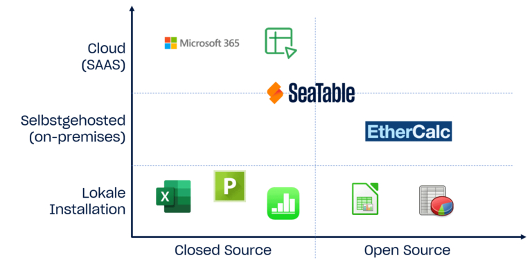
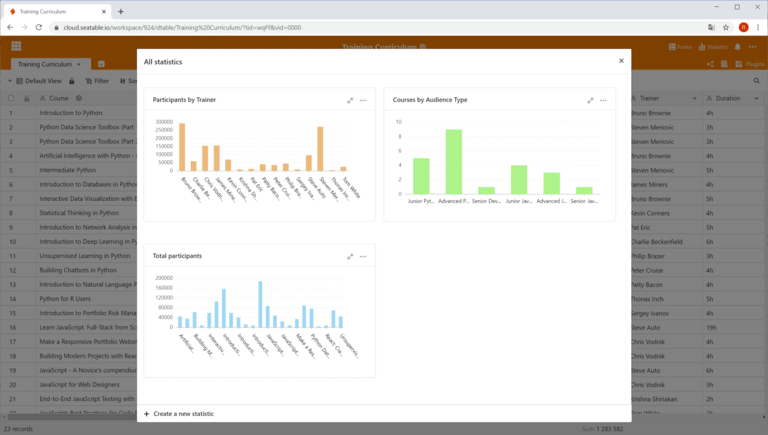

## Конкуренция за лидера рынка: Кто предлагает Excel бесплатно

Несмотря на то, что Excel был разработан как **электронная таблица**, вряд ли какая-либо другая компьютерная программа используется сегодня для такого количества различных приложений, как **Microsoft Excel**: По оценкам, до миллиарда человек регулярно редактируют электронные таблицы в Интернете с помощью Excel! С некоторыми ограничениями вы даже можете использовать Excel бесплатно. Однако если вы не хотите быть привязанным к американскому квазимонополисту, у вас есть выбор: **Google Sheets**, **Apple Numbers**, **Calc** и **SeaTable** - вот лишь самые известные из многочисленных конкурентов Excel.

Ниже вы узнаете, как использовать Excel бесплатно и какие еще программы для работы с электронными таблицами являются бесплатными.

## Как использовать Excel бесплатно

Excel - это программа для работы с электронными таблицами от американского технологического гиганта Microsoft, которая является одним из приложений Microsoft 365. Имея **бесплатную учетную запись Microsoft**, вы можете использовать Excel исключительно в режиме онлайн, включая 5 гигабайт облачного хранилища. Поскольку Microsoft также предлагает бесплатное мобильное приложение Excel, вы можете бесплатно установить Excel на устройствах Android и iOS. Для некоторых приложений этого может быть достаточно.

Однако если вам нужна полноценная настольная версия для Windows или macOS, придется порыться в карманах. Подписка **Microsoft 365** на одного человека стоит 69 евро в год или 7 евро в месяц для домашних пользователей и до 11,70 евро с НДС за пользователя и месяц для компаний. Поэтому стоит обратить внимание на других поставщиков и бесплатно опробовать ту или иную программу для работы с электронными таблицами.

## Электронные таблицы, которые в отличие от Excel бесплатны

Если вы хотите получить лишь краткий обзор, взгляните на следующую таблицу, в которой сравниваются наиболее важные программы для работы с электронными таблицами. Подробное описание следует ниже, после классификации рассмотренных здесь программ электронных таблиц.

| **Программное обеспечение** | **Разработчик**                  | **Операционные системы** |
| --------------------------- | -------------------------------- | ------------------------ | ------------------- |
| Calc                        | LibreOffice                      | OpenOffice               | Windows, Mac, Linux |
| PlanMaker                   | SoftMaker                        | Windows, Mac, Linux      |
| Google Sheets               | Google                           | Browser-based            |
| Zoho Sheet                  | Zoho                             | Browser-based            |
| Ethercalc                   | Проект с открытым исходным кодом | Браузерный               |
| SeaTable                    | Seafile                          | Браузерный               |

В этом сравнении рассматривались только локальные приложения, поддерживающие как минимум два семейства операционных систем. По этой причине Apple Numbers как чистое приложение для работы с электронными таблицами для MacOS/iOS не включена в сравнение, равно как и Gnumeric, которая с 2014 года является чистым приложением для Linux.

Новым игроком среди электронных таблиц является SeaTable, который как [no-code database and app builder]() имеет значительно расширенный набор функций по сравнению с Excel и другими решениями, что оживляет конкуренцию. Как и другие решения, представленные в этой статье, бесплатная версия SeaTable также бесплатна, в отличие от Excel.

### Классификация электронных таблиц

В табличное сравнение не вошли два свойства **режим работы** и **доступность исходного кода**. Сейчас мы это исправим! Матрица, охватывающая эти два критерия, послужит вам основой для принятия решения.

)

Сравнение электронных таблиц 15 лет назад показало бы в двух нижних квадрантах только **локальные приложения**, такие как Calc и Apple Numbers. С триумфом облачных вычислений **браузерные электронные таблицы** завоевали огромную долю рынка и все чаще становятся ведущими приложениями. Недаром Excel теперь доступен бесплатно как веб-приложение пакета Microsoft 365 в дополнение к классической настольной версии.

### Преимущества облачных решений

Преимущества решений, размещенных на серверах, отрицать невозможно. Во-первых, облачные приложения **независимы от местоположения и устройства**. Все, что вам нужно, - это браузер! Конечное устройство и его операционная система больше не играют роли. Будь то настольный компьютер или мобильное устройство, на работе или в дороге: вы всегда имеете доступ к своим данным.

Не менее важен вопрос **коллаборации**. Изменения, внесенные одним пользователем, сразу видны другим - вы работаете вместе, как если бы сидели перед электронной таблицей вдвоем. Все облачные решения поддерживают совместную работу с электронными таблицами **в режиме реального времени**. И последнее, но не менее важное: Облачные решения беспрецедентно **удобны** как для администраторов, так и для пользователей, поскольку нет необходимости в децентрализованной установке и обслуживании программного обеспечения на рабочих станциях.

### Преимущества локальных решений

Хотя локальные программы для работы с электронными таблицами, возможно, уходят в прошлое, они все еще имеют право на существование. Самый важный аргумент на их стороне - **независимость от доступа в Интернет**. Тот, кто захочет внести несколько изменений, находясь в путешествии с нестабильным подключением к Интернету, не сможет обойтись без них до поры до времени. Другой, хотя и менее важный, аргумент - более широкая доступность расширений, таких как **макросы**, без которых не обходится ни одна компания. Во многих случаях они доступны только для настольных версий.

## Calc

### Электронная таблица с открытым исходным кодом из пакета LibreOffice и OpenOffice.

До бума облачных решений для работы с электронными таблицами **Calc** был бесспорным номером 2 после Excel, и Calc по-прежнему очень популярен среди частных пользователей. Как тогда, так и сейчас Calc впечатлял множеством функций, широкой платформенной поддержкой с установочными носителями для Windows, Mac и Linux и большим сообществом пользователей, предлагающих обширную документацию. Еще один плюс Calc: его можно использовать как в частном, так и в коммерческом порядке, и, в отличие от Excel, бесплатно.

В похожем, но не идентичном виде Calc можно найти в **OpenOffice** и **LibreOffice Suite**. Причина этого кроется в общем прошлом двух пакетов. В 2010 году LibreOffice отделился как отдельный проект от OpenOffice, в котором в то время доминировала компания Oracle и уделяла проекту мало внимания. С тех пор разработка LibreOffice продолжается независимо от The Document Foundation. Вскоре после этого Oracle полностью вышла из проекта и передала его Apache Software Foundation, которая с тех пор и дала название OpenOffice.

### Диапазон функций: Полноценное приложение для работы с электронными таблицами

Если говорить об основных функциях, то Calc ни в чем не уступает своему образцу Excel! Если присмотреться, то можно обнаружить и некоторые функции, которые Excel не предлагает бесплатно. Calc демонстрирует особую силу в области **формул**. Мастер формул Calc знает примерно на 30 функций больше, чем его конкурент от Microsoft. Будучи альтернативой с открытым исходным кодом, Calc также предлагает хорошую поддержку стандарта OpenFormula. Calc также гибко подходит к **форматированию**. Помимо обычного форматирования ячеек, Calc знает стили ячеек и страниц, которые можно использовать для быстрого создания привлекательных и единообразных таблиц.

В соответствии с парадигмой открытого исходного кода, Calc также способствует **переносимости данных**: Можно импортировать файлы Apple Numbers и Gnumeric, а также множество старых форматов (например, MS Works, Lotus 1-2-3). Возможность сравнения двух файлов электронных таблиц - еще одна функция Calc, которую тщетно ждали пользователи Excel. Администраторы также оценят возможность запускать и работать с OpenOffice и LibreOffice непосредственно с USB-накопителя без установки.

### Недостатки Calc по сравнению с Excel

Однако на самом деле Calc предлагает лишь **ограниченную поддержку макросов** и не отличается гибкостью при подключении внешних источников данных. Это делает его неподходящим для многих коммерческих пользователей. Для тяжелых пользователей **недостаток многопоточности** и отсутствие **Power Pivot** являются дополнительными весомыми аргументами против Calc. Менее амбициозные пользователи, скорее всего, обратят внимание на **уменьшенный выбор типов диаграмм**. Например, диаграммы водопада и гистограммы недоступны.

Если вы только немного работаете с расширенными функциями, у вас не возникнет проблем с началом работы или переходом на Calc. Пользовательский интерфейс Calc понятен, а меню логично структурированы. Совсем другое дело - опытные пользователи Excel. Поначалу эффективность их работы снизится, поскольку им придется чаще искать нужные функции. Решающим фактором здесь является не менее современный вид **пользовательского интерфейса**, а разная организация функций и их работа.

Еще одним препятствием для перехода на Calc является неполная поддержка формата файлов XLSX, используемого Excel. Документы **XLSX** можно открыть в Calc, но форматирование и функции могут быть потеряны. Сами разработчики LibreOffice описывают [поддержку импорта из и экспорта в файлы Microsoft OOXML](https://wiki.documentfoundation.org/ru/Feature_Comparison:_LibreOffice_-_Microsoft_Office) как "частичную". Стандартным форматом файлов LibreOffice и OpenOffice является ODS, независимый от производителя формат документов в соответствии со стандартом Open Document Standard.

## PlanMaker

### Конкуренция Excel от SoftMaker

**PlanMaker** - это приложение для работы с электронными таблицами в составе офисного пакета SoftMaker Office Suite, разработанного нюрнбергской компанией SoftMaker Software GmbH. Помимо PlanMaker, в пакет Office Suite из Германии также входят текстовый процессор **TextMaker** и приложение **Presentations**.

Если вы ищете приложение для работы с электронными таблицами, которым, в отличие от Excel, можно пользоваться бесплатно, то PlanMaker вас поначалу разочарует: годовая подписка на пять рабочих станций стоит около 200 евро, лицензия на пять частных компьютеров в одном доме или один рабочий компьютер - 29,90 евро в год или 2,99 евро в месяц. Если вы совсем не хотите тратиться, то можете найти ограниченно функциональную версию офисного пакета SoftMaker под названием **FreeOffice**, которая позволяет постоянно бесплатно пользоваться модификацией Excel.

### Тот же набор функций, что и в Excel

Однако если вы хотите отойти от Microsoft и ищете мощную и удобную версию Excel, PlanMaker - идеальный выбор. PlanMaker предлагает обширный набор функций, привлекательный пользовательский интерфейс, очень похожий на Excel, и **отличную совместимость с форматом XLSX файлов Excel**. Более того, приложения SoftMaker Suite по умолчанию могут использовать форматы файлов OOXML от Microsoft для хранения файлов. В этом отношении PlanMaker устраняет многие недостатки, которые говорят против Calc как замены Excel.

Однако PlanMaker может выиграть у Excel и в другой области: PlanMaker работает на всех основных настольных платформах, что делает его привлекательным приложением для работы с электронными таблицами для Mac и Linux. Бесплатный FreeOffice также доступен для этих трех семейств операционных систем.

## Google Sheets

### Онлайновая электронная таблица от Google.

**Sheets** - это веб-приложение для работы с электронными таблицами от компании Alphabet. Оно предлагает привлекательный пользовательский интерфейс, богатые функции анализа данных и практичные командные функции. Все, что вам нужно для начала работы с Sheets, - это **бесплатный аккаунт Google**, а у кого его нет? Поэтому неудивительно, что многие люди предпочитают использовать Google Sheets в качестве бесплатной замены Excel!

### Совместная электронная таблица для браузера

С помощью Sheets разработчики Google создали приложение, в котором одинаково комфортно чувствуют себя как новички, так и требовательные пользователи. Просто создайте электронную таблицу, сохраните ее бесплатно и поделитесь ею с другими! Веб-интерфейс **работает плавно**, меню хорошо организовано, и даже у преданных пользователей вряд ли останутся невыполненными какие-либо функциональные пожелания. С другой стороны, именно отсутствие некоторых функций делает Google Sheets привлекательным для новичков.

Особенно если речь идет о **общей работе** над электронными таблицами, Sheets может сыграть свои козыри в качестве веб-приложения. Электронные таблицы Google Sheets хранятся в Google Drive, который также привязан к аккаунту Google. Оттуда вы можете поделиться электронными таблицами с другими пользователями всего несколькими щелчками мыши. При одновременном редактировании все пользователи могут видеть положение курсора и записи других **в режиме реального времени**. Встроенный чат позволяет напрямую обмениваться сообщениями с коллегами.

### Только небольшие компромиссы и бесплатно по сравнению с Excel

Несмотря на то что Google Таблицы блестяще справляются с задачей совместной работы, по сравнению с Excel здесь есть определенные ограничения, когда речь идет о расширенных функциях. Особенно когда речь идет о визуализации, возможности не дотягивают до уровня оригинала. Возможности создания высококачественных стандартизированных диаграмм в Excel гораздо более разнообразны.

Google уже на пути к тому, чтобы догнать Microsoft. С момента своего скромного появления в 2006 году Sheets стремительно развивался. И это развитие продолжается. В начале 2020 года, например, была интегрирована **история изменений**. Если существующих функций Sheets вам недостаточно, вы можете добавить дополнительные возможности, такие как функция целевого значения и решатель, в качестве дополнения из G Suite Marketplace.

Новичкам, вероятно, будет проще пользоваться Sheets, чем Excel. Новые пользователи также быстро разберутся, что к чему, после короткого этапа ознакомления. Проблема перехода на новую версию связана не столько с использованием, сколько с **миграцией данных**. Хотя впечатляет, как много функций Excel распознает и импортирует Google Sheets, все еще встречаются сообщения о неработающих формулах или сломанных диаграммах после импорта.

## Zoho Sheet

### Онлайн-электронная таблица из пакета Zoho Office Suite.

**Zoho Sheet** - это веб-приложение для работы с электронными таблицами от индийской корпорации Zoho, входящее в состав пакета Zoho Office Suite. В последние годы оно привлекло к себе много внимания - не в последнюю очередь потому, что частные лица могут использовать его бесплатно в качестве замены Excel. Другими частями офисного пакета являются **Zoho Writer** (работа с текстом), **Zoho Show** (презентации) и **Zoho Notebook** (заметки). Кроме того, предложение Zoho включает более 40 интегрированных веб-приложений Office и, таким образом, представляет собой альтернативу G Suite. Так что к нему определенно стоит присмотреться.

### Явная ориентация на Google Sheets

Если вы подозреваете дальнейшее сходство с Google Sheets, исходя из названия и заявления о том, что это убийца G Suite, то вы правы: на первый взгляд Zoho Sheet кажется клоном Google Sheets. Структура **меню практически идентична**; различия становятся очевидными только при втором взгляде. Zoho Sheet и Google Sheets также близки друг к другу при прямом сравнении функций. Веб-формы, поворотные таблицы, условное форматирование, версионирование и **расширенные функции совместной работы**, включая совместное использование, сотрудничество в реальном времени и чат, доступны в обоих случаях. Если вам удобно работать с Google Sheets, вы без труда замените Excel на Zoho Sheet бесплатно.

Но вы поступите несправедливо, если откажете Zoho Sheet в полной индивидуальности! В области анализа данных он предлагает больше, чем его аналог от Google, - решатель и функцию целевого значения. Благодаря тому, что Zoho Sheet не занимает доминирующее положение на рынке, он также приятно **интегрирован**. Созданные в Zoho Sheet электронные таблицы можно сохранять в собственном онлайн-хранилище - **Zoho Docs** для отдельных пользователей, **Zoho WorkDrive** для команд - или в интегрированном аккаунте Google Drive, OneDrive или Dropbox. Возможен экспорт файлов в форматы .csv, .xlsx и .ods.

### Преимущества и недостатки, если вы хотите использовать его в качестве бесплатной замены Excel

Одно из достоинств Zoho Sheet, которое делает его особенно рекомендуемым для людей, переходящих с Excel, - это **макроподдержка**, которая также включает поддержку Visual Basic for Applications (VBA). Мощный механизм сценариев Google Sheets требует сценариев на основе JavaScript для макросов Google Apps. Для пользователей Excel, которые ранее разрабатывали на VBA, это означает серьезную перестройку или изучение нового языка программирования.

Гонка между Zoho Sheet и Google Sheets очень близка, и на вопрос о том, какая электронная таблица лучше, нельзя ответить без учета контекста конкретного приложения. Особенно когда дело доходит до **визуализации данных**, Zoho Sheet предлагает меньше возможностей, чем Google Sheets. Zoho также не поддерживает рисование. Для некоторых пользователей **ограничение в 65 000 строк и 256 столбцов** также может быть существенным ограничением. В любом случае, Zoho Sheet - это хорошая программа для работы с электронными таблицами для тех начинающих пользователей, которые не считают лист Excel без макроса настоящей электронной таблицей Excel.

## Ethercalc

### Программа для работы с электронными таблицами с открытым исходным кодом для удобной совместной работы

Менее известная программа **Ethercalc** - это простое веб-приложение для работы с электронными таблицами, разработанное небольшим сообществом. Поскольку это программное обеспечение с открытым исходным кодом, вы можете скачать Ethercalc в качестве замены Excel **бесплатно** и использовать его без ограничений. Разработчики предоставляют пакеты для всех основных серверных платформ, включая образ Docker. [Здесь](https://ethercalc.net) вы можете протестировать и использовать приложение без регистрации пользователя.

### Небольшой набор функций

С первого взгляда бросается в глаза рудиментарный, немного запыленный пользовательский интерфейс Ethercalc. Функции, предоставляемые Ethercalc, также довольно ограничены по сравнению с Excel и другими облачными электронными таблицами. Это заметно, когда речь идет о форматировании и простом анализе данных, например сортировке. В то время как мастера в Excel и подобных программах делают эту работу простой и удобной, Ethercalc требует много кликов по соответствующим меню. Возможности визуализации данных очень ограничены, а функция фильтрации вообще отсутствует.

По функциональности и удобству Ethercalc не дотягивает до других программ для работы с электронными таблицами. Отчасти это связано с небольшим сообществом разработчиков, но также и с общей целью проекта. Ethercalc ориентирован не на оценку больших массивов данных, а на **сотрудничество** и **независимый от местоположения сбор данных** в браузере.

Для работы с веб-таблицей не требуется установленная программа; вместо этого корректировки можно вносить на ходу с помощью мобильного телефона или планшета, а благодаря **поддержке в режиме реального времени** все изменения в Ethercalc немедленно становятся видны всем остальным пользователям. Для оценки записанных данных доступна функция экспорта, которая обеспечивает простой перенос в форматы XLSX, ODS, CSV и HTML.

## SeaTable

### Совместная база данных без кодов для большего, чем просто цифры и текст.

SeaTable - последнее приложение в группе программ для работы с электронными таблицами, рассматриваемых здесь. Как и Google Sheets, Zoho Sheet и Ethercalc, SeaTable - это **электронная таблица**, которую, в отличие от Excel, можно использовать бесплатно. База данных без кода сочетает в себе привлекательный пользовательский интерфейс в стиле электронных таблиц с мощными функциями анализа и совместной работы. Кроме того, SeaTable позволяет использовать множество новых возможностей, которые невозможны в Excel и других подобных программах.

Тот факт, что SeaTable работает иначе, чем другие электронные таблицы, сразу же бросается в глаза, когда вы впервые открываете таблицу. Вместо унифицированной табличной сетки, которая воспринимает только текст, числа и формулы, в таблице SeaTable можно сохранять **изображения и файлы**, флажки, данные о позиции и пользовательские ссылки. Другие [типы столбцов](https://seatable.io/ru/docs/arbeiten-mit-spalten/uebersicht-alle-spaltentypen/), которые предлагает SeaTable, - это **одиночный и множественный выбор**.

Поля одиночного выбора похожи на выпадающие списки, которые можно отобразить в Excel с помощью проверки данных, но они более гибкие и простые в использовании. Поля множественного выбора, которые не имеют аналогов в Excel, помогают классифицировать и записывать данные в виде ключей. Благодаря этим расширенным типам столбцов в таблице можно хранить все возможные типы информации. **Различные места хранения** для разных типов данных ушли в прошлое.

### Электронные таблицы с возможностями баз данных без кода и конструкторов приложений

Еще одна функция SeaTable, которой нет ни в одном из других приложений, - это **ссылки**. С помощью ссылок записи данных можно связать друг с другом, отобразить зависимости и связи (не путать со ссылками на ячейки в Excel). Это возможно как в пределах одной таблицы, так и между всеми таблицами в базе данных. Связанные данные можно легко анализировать в графическом и табличном виде в электронной таблице на основе браузера с помощью связанных **аналитических функций**. SeaTable предлагает функциональные возможности, которые иначе можно получить только из баз данных, и является идеальным решением для бесплатного использования электронных таблиц типа Excel.

Начинающим пользователям SeaTable придется сначала привыкнуть к определению типов столбцов перед вводом данных и к мышлению в терминах **логики базы данных** между таблицами. Однако **интуитивно понятный пользовательский интерфейс** делает эту задачу преодолимой. Миграция из Excel упрощается благодаря [функциям импорта файлов CSV и XLSX](https://seatable.io/ru/docs/import-von-daten/import-von-excel-dateien-in-seatable/). Однако из-за форматов данных, используемых SeaTable, информация может быть потеряна при импорте.

### Больше возможностей визуализации по сравнению с другими электронными таблицами

Конечно, SeaTable обладает и классическими функциями электронных таблиц: **фильтры**, **сортировка** и **группировка** приводят данные в нужный порядок, **разворотные таблицы** позволяют быстро оценивать даже большие наборы данных, а различные типы **диаграмм** наглядно представляют данные. Но как и в случае с поддерживаемыми типами данных, SeaTable также идет на шаг дальше других конкурентов Excel, когда речь заходит о возможностях отображения.

[Плагины](https://seatable.io/ru/docs/plugins/alle-plugins-in-der-uebersicht/) SeaTables предлагают расширенные возможности визуализации для нечисловых типов данных: В плагине карты данные об адресах и геопозиции могут быть отображены на карте, а плагин галереи отображает данные об изображениях, хранящихся в таблице, в виде альбомов. Данные о назначении, введенные в таблицу, могут быть отображены в календаре или плагине временной шкалы, а плагин Kanban отображает рабочие процессы с различными фазами, что в других случаях известно только из приложений [управления проектами]().

Вы также можете создавать собственные приложения с помощью SeaTable без каких-либо знаний программирования. Приложение состоит из страниц, которые вы можете объединить в интегрированном [No-Code-App-Builder](https://seatable.io/ru/docs/apps/universelle-app/), используя различные типы страниц. Приложение получает доступ к данным в SeaTable и оптимально отображает их для пользователя. Преимущество: Дизайн приложения позволяет точно контролировать, какие данные видит пользователь, как они визуализируются и как они могут с ними взаимодействовать. Это позволяет точно отображать рабочие процессы.

### В облаке или на собственных серверах

Будучи гибким универсальным оружием, SeaTable также не идет на компромиссы, когда речь заходит о **режиме работы**. SeaTable можно удобно использовать в [облаке](https://seatable.com/ru/cloud/) или как [самостоятельное решение](https://seatable.com/ru/on-premises/). В отличие от других веб-конкурентов Excel, SeaTable также доступна в виде программного обеспечения для вашего собственного сервера. Таким образом, SeaTable идеально подходит для всех, кто сталкивается со строгими требованиями к защите данных.

Бесплатная подписка [Free Subscription]() постоянно бесплатна и достаточна для частного использования. Платные версии Plus и Enterprise предлагают расширенные функции для корпоративного использования, такие как пользовательские утверждения, автоматизация и настройка. В [Dedicated Cloud](https://seatable.com/ru/dedicated/) также имеется централизованная аутентификация пользователей и поддержка хранения объектов.

SeaTable идет по тому же пути, что и Google Sheets - что приятно для разработчиков - когда дело доходит до расширений. Такие расширения, как автоматизация, интеграция и функциональные дополнения, могут быть разработаны с минимальными усилиями через API и SDK. Учитывая молодой возраст решения, будет интересно посмотреть, какие новые функции появятся в будущем.

## Использование электронных таблиц, которые бесплатны по сравнению с Excel

Если вам нужна мощная электронная таблица, не обязательно использовать Excel! Доступным программам для работы с электронными таблицами нечего скрывать в плане функциональности и простоты использования. В отличие от Excel, многие из них вы можете использовать бесплатно.

Известные программы для работы с электронными таблицами, представленные в этом сравнении, функционально похожи на Excel и предлагают схожий пользовательский опыт. Облачные решения - это полноценные конкуренты Excel, в которых реализовано большинство функций Excel, а также функции совместной работы.

SeaTable выделяется из толпы благодаря расширенным форматам данных, функциям базы данных и конструктору приложений. SeaTable - единственное приложение в этом сравнении, которое доступно как в виде облака, так и в виде самостоятельного хостинга. Это означает, что каждый пользователь волен выбирать между суверенитетом данных и удобством.

[Зарегистрируйтесь бесплатно и попробуйте SeaTable]()
