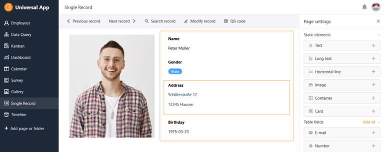

## Di Ciao a la codificación - con Low Code y No Code

¿Alguna vez ha deseado poder desarrollar sus propias soluciones de software con unos pocos clics, sin tener que escribir línea tras línea de código? Imagínese lo fácil y rápido que le resultaría de repente [Desarrollo de software](). ¿Parece ciencia ficción? Pero no lo es: ¡échale un vistazo al mundo del desarrollo de bajo código con nosotros! En el siguiente artículo, también veremos la diferencia entre low code y no code y aclararemos qué es una plataforma no-code/low-code.

## ¿Qué es el low code?

Bajo código es el término técnico para los métodos de desarrollo en los que la programación ya no se lleva a cabo utilizando lenguajes de programación basados en texto, sino sobre la base de ayudas visuales. Las herramientas gráficas intuitivas y los módulos ya preparados permiten crear aplicaciones con poco esfuerzo de programación manual.

> El desarrollo de software siempre es extenuante, lleva mucho tiempo y requiere las habilidades de desarrolladores experimentados. El desarrollo de bajo código promete acelerar y simplificar este largo proceso".
>
> Christoph Dyllick-Brenzinger, Director Técnico de SeaTable

## ¿Qué es una plataforma de bajo código?

Una plataforma de bajo código es un entorno de desarrollo en el que se pueden crear aplicaciones de software en gran medida sin programación basada en texto. En lugar de escribir cientos de líneas de código, se trabaja con una interfaz de usuario visual en la que se pueden ensamblar bloques de construcción prefabricados de forma modular. Estos bloques representan funciones o lógicas específicas que normalmente habría que implementar mediante programación convencional.

## 5 características principales de las plataformas de bajo código

Los rasgos principales de una plataforma de bajo código pueden resumirse con estas características:

1. **Entorno de desarrollo visual**: En lugar de escribir código complejo línea a línea, se utiliza una interfaz gráfica de usuario en la que basta con arrastrar y soltar componentes preconstruidos.
   1 **Bloques de construcción reutilizables**: Las plataformas de bajo código ofrecen una gran variedad de elementos, módulos y plantillas preconstruidos que puedes combinar, reutilizar y adaptar a tus necesidades una y otra vez.
   1 **Integración de código manual**: Aunque la atención se centra en el desarrollo visual, muchas plataformas de bajo código también te permiten integrar tus propios scripts. Esto te da la oportunidad de implementar funciones personalizadas que van más allá de las opciones estándar.
   1 **Despliegue rápido**: Lowcode te permite desarrollar y desplegar prototipos de software y aplicaciones de trabajo en muy poco tiempo, lo que es especialmente beneficioso en entornos de desarrollo ágiles.
   1 **Uso basado en la nube**: En la mayoría de los casos, el desarrollo, despliegue y uso de aplicaciones de software tiene lugar cómodamente a través de un navegador web. Sin embargo, algunas plataformas low-code no sólo pueden utilizarse en la nube, sino que también pueden instalarse localmente como un sistema on-premises.

## ¿Qué es No Code?

No Code va un paso más allá: a diferencia de las plataformas low-code, una **plataforma no-code** está dirigida a usuarios sin conocimientos de programación. En el entorno de desarrollo totalmente visual, se pueden crear aplicaciones principalmente arrastrando y soltando sin tener que escribir ni una sola línea de código. No Code es, por tanto, ideal para crear aplicaciones sencillas y [flujos de trabajo automatizados](). La atención se centra claramente en la velocidad y la facilidad de uso; no se prevé la integración de código escrito por el usuario.

## Low code vs. no code

Sin embargo, las transiciones entre ambos enfoques son fluidas. Por ello, muchas herramientas no pueden clasificarse claramente como No Code o Low Code. La principal diferencia entre low code / no code radica en el grupo destinatario, la flexibilidad y la complejidad de las aplicaciones.

**Grupo objetivo**: Una plataforma de bajo código está dirigida a desarrolladores que quieren disfrutar de las ventajas de un desarrollo rápido y modular, pero que aún desean tener la opción de implementar funciones personalizadas mediante programación manual. En cambio, No Code se dirige principalmente a usuarios sin conocimientos técnicos previos.

**Flexibilidad**: Una plataforma low-code ofrece más flexibilidad y opciones de personalización, ya que los desarrolladores pueden intervenir en el código y programar sus propios componentes si es necesario. Las plataformas sin código están más pensadas para soluciones estándar y ofrecen menos posibilidades de personalización, ya que especifican gran parte del diseño.

**Complejidad de las aplicaciones**: El low-code permite crear aplicaciones más complejas que pueden ampliarse a voluntad, mientras que el no-code es más adecuado para soluciones sencillas y estándar.

## Comparación de las ventajas de las plataformas no-code y low-code

### Ventajas comunes de bajo código y sin código

El bajo código y el no código tienen tres ventajas clave en común:

- **Desarrollo acelerado**: El uso de herramientas visuales y bloques de construcción prefabricados permite crear aplicaciones en una fracción del tiempo que llevaría el desarrollo de software tradicional.
- **Colaboración**: Gracias a la interfaz gráfica de usuario, incluso personas sin conocimientos de programación, por ejemplo [Citizen Developer](https://seatable.com/es/citizen-developer/), pueden participar en el proceso de desarrollo, aportar comentarios o incluso crear sus propias soluciones de forma independiente.
- **Rentabilidad**: Un gasto de tiempo significativamente menor y la posibilidad de que los desarrolladores menos experimentados también puedan programar de forma productiva se traducen en una reducción de los costes de desarrollo.

### Las mayores ventajas de la programación de bajo código

Las plataformas de bajo código suelen ofrecer un equilibrio entre facilidad de uso y flexibilidad. Permiten crear aplicaciones sobre la marcha utilizando herramientas intuitivas y componentes listos para usar, al tiempo que mantienen abierta la opción de integrar código personalizado si es necesario. Esto le permite adaptar las aplicaciones de bajo código con precisión a las necesidades de su organización.

La programación de bajo código le ofrece la posibilidad de realizar personalizaciones específicas en el diseño y añadir sus propios componentes mediante código manual. Como el código subyacente suele estar estandarizado, puede ampliar fácilmente las aplicaciones de bajo código con sus propios scripts. Pero ten cuidado: Las plataformas sin código también suelen ofrecer interfaces de programación para la integración de aplicaciones externas.

## Ámbitos de aplicación del desarrollo low-code

Ambos métodos de desarrollo son especialmente adecuados para empresas que tienen capacidades limitadas de desarrollo, necesitan reaccionar rápidamente a los cambios y buscan una forma eficiente de desarrollar soluciones de software a medida. No code y low code no se limitan a un sector o a unos procesos concretos, sino que pueden utilizarse casi universalmente.

Los casos de uso típicos son

- **Automatización de procesos**: Automatizar flujos de trabajo y procesos para aumentar la eficiencia de su organización.
- **Soluciones estándar personalizables**: Impulsar el desarrollo de soluciones estándar que puedan personalizarse para satisfacer las necesidades empresariales de distintos clientes o departamentos.
- **Desarrollo ciudadano**: Convierta a los usuarios de hoy en los desarrolladores de mañana con la ayuda de no-code. Esto descarga de trabajo a su departamento de TI, que en su lugar puede ocuparse de tareas directivas y estratégicas.
- **Prototipos y MVP (productos mínimos viables)**: Desarrolle rápidamente prototipos de software listos para usar con el fin de probar ideas y recabar opiniones desde el principio.

> "En mi opinión, una plataforma low-code debe verse como un patio de recreo para probar nuevas soluciones de diseño digital y automatización de procesos".
>
> Christoph Dyllick-Brenzinger, Director de Tecnología de SeaTable

### ¿Debería utilizar una plataforma de bajo código o sin código?

La elección entre low code y no code depende de sus necesidades específicas:

- Si necesita una solución rápida para un proceso digital y la aplicación no tiene requisitos muy personalizados, una plataforma **sin código** debería ser suficiente.
- Sin embargo, si necesita una aplicación compleja y personalizada que desea desarrollar usted mismo a lo largo del tiempo, una **plataforma de bajo código** es la mejor opción.

## ¿Es el desarrollo de bajo código el futuro?

En la era digital, las plataformas de bajo código son cada vez más importantes. Esto se debe a que sus tecnologías permiten desarrollar aplicaciones de software de forma más rápida, eficiente y con menos conocimientos técnicos. En comparación con la programación tradicional, el desarrollo de bajo código requiere sólo una fracción del tiempo necesario para entregar el software.

Debido a esta inmejorable eficiencia y ahorro de costes, las plataformas de bajo código interesan naturalmente a muchas empresas y desempeñan un papel clave en la digitalización en curso de los procesos empresariales. Cabe suponer que casi todas las empresas y personas que trabajan con ordenadores tienen necesidad de este tipo de desarrollo y resolución de problemas.

Al mismo tiempo, el gran interés de los clientes hace que cada vez sean más las soluciones de bajo código que entran en el mercado. No es de extrañar que [los análisis de mercado de Gartner](https://www.gartner.com/en/newsroom/press-releases/2021-02-15-gartner-forecasts-worldwide-low-code-development-technologies-market-to-grow-23-percent-in-2021) muestren cómo en 2021 ya se habrán generado casi 14.000 millones de dólares estadounidenses con tecnologías de desarrollo de bajo código. Además, Gartner supone que en 2024 dos tercios de todos los desarrollos de software serán atribuibles a plataformas de bajo código.

## Comparación de tipos de plataformas no-code/low-code

La mayoría de los proveedores de low-code pueden resumirse en cuatro grandes grupos. Como era de esperar, la demanda de plataformas de bajo código es mayor justo donde casi todas las empresas necesitan software: para sitios web, aplicaciones, bases de datos y procesos automatizados.

### Creador de sitios web

Se acabaron los días en los que había que contratar a una agencia o a un diseñador web caros para tener un sitio web elegante. Con estas plataformas de bajo código, puedes diseñar sitios web sencillos sin grandes conocimientos de programación: WordPress, Webflow, Wix, Squarespace, Framer, Dorik y muchos más. Algunos creadores de sitios web como Shopify, Sharetribe, BigCommerce o WooCommerce se han especializado en tiendas online.

### Creador de aplicaciones

Las soluciones de software de esta categoría te ayudan a crear aplicaciones web completas y apps nativas para ordenadores de sobremesa o dispositivos móviles. A menudo se recurre a fuentes de datos externas, como hojas de cálculo o bases de datos. Entre los proveedores de bajo código en este ámbito se encuentran Glide, AppSheet, Softr, Draftbit, Adalo y Zoho Creator.

### Bases de datos

En todo proceso digital es necesario capturar o procesar datos de alguna forma. Por eso existen plataformas low-code basadas en bases de datos que te ayudan a almacenar y visualizar tus datos de forma estructurada. Entre los proveedores más conocidos se encuentran SeaTable, Airtable, Baserow y NoCoDB.

### Plataformas de automatización

Las plataformas de automatización como Zapier, make o n8n se utilizan para intercambiar datos entre dos o más aplicaciones. La lógica de estas soluciones es siempre la misma: En primer lugar, se define un desencadenante, es decir, un evento, que luego activa sus automatizaciones en determinadas condiciones. Esto le permite ejecutar incluso procesos complejos de forma totalmente automática.

Además de estas cuatro categorías, también existen plataformas low-code más especializadas, como los creadores de chatbot. Además, una solución no siempre puede asignarse a una sola categoría, como veremos en el siguiente ejemplo.

## SeaTable: Base de datos sin código con app builder integrado, scripts y automatizaciones.

En SeaTable, puede configurar procesos y aplicaciones cómodamente a través de una interfaz gráfica de usuario en el navegador. Gracias a los elementos visuales, no se necesita ni una sola línea de código, lo que convierte a SeaTable en una [solución sin código](). Sin embargo, SeaTable también permite la ejecución de scripts JavaScript y Python programados manualmente. Esta opción está más en consonancia con el enfoque de bajo código, lo que significa que SeaTable también podría describirse como una plataforma de desarrollo de bajo código.

La clasificación en una categoría tampoco está clara: por un lado, SeaTable es una **base de datos sin código** en la que se puede almacenar, organizar y visualizar casi cualquier tipo de información. Entre otras cosas, tiene a su disposición 25 tipos de columnas diferentes, plugins como galería, Kanban, mapa o calendario, vistas con funciones de filtro, clasificación y agrupación, así como estadísticas y formularios web.

SeaTable también ofrece un **No Code App Builder**, con el que puede crear sus propias aplicaciones sin conocimientos de programación. Una aplicación accede a la información de la base de datos y la muestra de la mejor manera posible para el usuario final. Para el diseño de la aplicación, hay tipos de páginas listas con elementos visuales que puedes simplemente arrastrar y soltar.

Además, SeaTable facilita la creación de automatizaciones que le ahorran clics manuales para procesos que son siempre los mismos y, al mismo tiempo, minimizan la susceptibilidad a errores de las actividades monótonas. Para procesos automatizados con múltiples fuentes de datos, también puede integrar SeaTable con plataformas de automatización como Zapier, make o n8n.

¿Ya estás enganchado y quieres comprobarlo por ti mismo? Entonces [simplemente regístrese gratis]() en SeaTable Cloud y pruebe SeaTable por tiempo ilimitado.

## Conclusión: Éxito sin código y con poco código

Las plataformas presentadas aquí ofrecen valiosas herramientas de bajo código para acelerar y simplificar el desarrollo de aplicaciones y hacerlo más rentable. Por tanto, será difícil imaginar el futuro sin ellas. Mientras que no code abre la puerta al mundo del desarrollo de software a las personas sin conocimientos de programación, las plataformas de bajo código ofrecen la mezcla perfecta de velocidad y flexibilidad para todos los desarrolladores que quieran hacer su vida más fácil. Deberías considerarlo detenidamente de antemano para elegir la plataforma adecuada a tus necesidades.

## FAQ



¿Qué es Low Code? |||

Low code significa "bajo esfuerzo de programación" y se refiere a un tipo específico de método de desarrollo. En estos métodos, la programación ya no se realiza con lenguajes de programación basados en texto, sino a partir de ayudas visuales. Las herramientas gráficas intuitivas y los módulos prefabricados permiten crear aplicaciones con poco esfuerzo de programación manual.

---

¿Cuál es la diferencia entre low code y no code? |||

Una plataforma de bajo código ofrece más **flexibilidad** y **opciones de personalización**, ya que los desarrolladores pueden intervenir en el código y programar sus propios componentes si es necesario. Las plataformas sin código están más pensadas para soluciones estándar y ofrecen menos posibilidades de personalización, ya que especifican gran parte del diseño. Por tanto, una plataforma low-code se dirige a los desarrolladores que desean beneficiarse de un desarrollo rápido y modular, pero que quieren seguir teniendo la posibilidad de aplicar funciones personalizadas mediante programación manual. Sin código, por su parte, se dirige principalmente a usuarios sin conocimientos técnicos previos.

---

¿Es mejor una plataforma "low code" o "no code"? |||

Depende de sus necesidades. Una plataforma sin código proporciona soluciones estándar rápidas, no requiere conocimientos técnicos previos y requiere poco tiempo de formación. Sin embargo, si necesitas una aplicación personalizada en la que quieras programar tú mismo los cambios, una plataforma **low-code** es la mejor opción. Sin embargo, la transición entre no code y low code es fluida para muchas plataformas.


