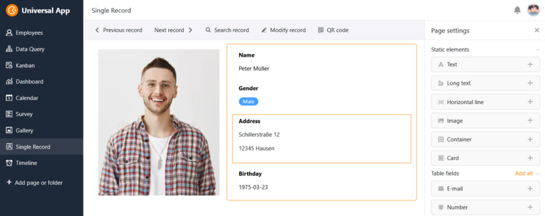

## Diga adeus à codificação – com Low Code e No Code

Já alguma vez desejou poder desenvolver as suas próprias soluções de software com apenas alguns cliques, sem ter de escrever linha após linha de código? Imagine como o [desenvolvimento de software]() seria fácil e rápido para si! Parece ficção científica? Mas não é: Dê uma vista de olhos ao mundo do desenvolvimento com pouco código connosco! No artigo seguinte, também analisamos a diferença entre código reduzido e sem código e esclarecemos o que é uma plataforma sem código/baixo código.

## O que é o baixo código?

Low code é o termo técnico para os métodos de desenvolvimento em que a programação já não é efectuada utilizando linguagens de programação baseadas em texto, mas sim com base em recursos visuais. Ferramentas gráficas intuitivas e módulos prontos a utilizar permitem criar aplicações com pouco esforço de programação manual.

> O desenvolvimento de software é sempre extenuante, demorado e requer as competências de programadores experientes. O desenvolvimento de baixo código promete acelerar e simplificar este processo laborioso."
>
> Christoph Dyllick-Brenzinger, CTO da SeaTable

## O que é uma plataforma de baixo código?

Uma plataforma de baixo código é um ambiente de desenvolvimento no qual é possível criar aplicações de software em grande parte sem programação baseada em texto. Em vez de escrever centenas de linhas de código, trabalha-se com uma interface de utilizador visual na qual se podem montar blocos de construção pré-fabricados de forma modular. Estes módulos representam funções ou lógicas específicas que normalmente teriam de ser implementadas através de programação convencional.

## 5 principais caraterísticas das plataformas de baixo código

As principais caraterísticas de uma plataforma de baixo código podem ser resumidas através destas caraterísticas:

1. **Ambiente de desenvolvimento visual**: Em vez de escrever código complexo linha a linha, utiliza uma interface gráfica de utilizador onde pode simplesmente arrastar e largar componentes pré-construídos.
1. **Blocos de construção reutilizáveis**: As plataformas de baixo código oferecem uma variedade de elementos, módulos e modelos pré-construídos que podem ser combinados, reutilizados e personalizados de acordo com as suas necessidades, uma e outra vez.
1. **Integração manual de código**: Embora a tónica seja colocada no desenvolvimento visual, muitas plataformas de baixo código também permitem integrar os seus próprios scripts. Isto dá-lhe a oportunidade de implementar funções personalizadas que vão para além das opções padrão.
1. **Implementação rápida**: O lowcode permite-lhe desenvolver e implementar protótipos de software e aplicações funcionais num curto espaço de tempo, o que é especialmente vantajoso em ambientes de desenvolvimento ágeis.
1. **Utilização baseada na nuvem**: Na maioria dos casos, as aplicações de software são desenvolvidas, implementadas e utilizadas convenientemente através de um navegador web. No entanto, algumas plataformas de baixo código não só podem ser utilizadas na nuvem, como também podem ser instaladas localmente como um sistema on-premises.

## O que é o No Code?

O No Code vai mais longe: ao contrário das plataformas de baixo código, uma plataforma **no-code** destina-se a utilizadores sem quaisquer conhecimentos de programação. No ambiente de desenvolvimento totalmente visual, é possível criar aplicações principalmente por arrastar e largar, sem ter de escrever uma única linha de código. Por conseguinte, a No Code é ideal para criar aplicações simples e [fluxos de trabalho automatizados](). A tónica é claramente colocada na velocidade e na facilidade de utilização; a integração de código escrito pelo próprio utilizador não está prevista.

## Pouco código vs. nenhum código

No entanto, as transições entre as duas abordagens são fluidas. Por esta razão, muitas ferramentas não podem ser claramente atribuídas à área sem código ou de baixo código. A principal diferença entre o low code e o no code reside no grupo-alvo, na flexibilidade e na complexidade das aplicações.

**Grupo-alvo**: Uma plataforma de baixo código destina-se a programadores que pretendem usufruir de um desenvolvimento rápido e modular, mas que ainda pretendem ter a opção de implementar funções definidas pelo utilizador através de programação manual. O No Code, por outro lado, destina-se principalmente a utilizadores sem conhecimentos técnicos prévios.

**Flexibilidade**: Uma plataforma com pouco código oferece mais flexibilidade e opções de personalização, uma vez que os programadores podem intervir no código e programar os seus próprios componentes, se necessário. As plataformas sem código são concebidas mais para soluções padrão e oferecem menos espaço para personalização individual, uma vez que especificam uma grande parte do design.

**Complexidade das aplicações**: O low-code permite-lhe criar aplicações mais complexas que podem ser alargadas à vontade, enquanto o no-code é mais adequado para soluções simples e prontas a utilizar.

## Comparação das vantagens das plataformas sem código e com pouco código

### Vantagens comuns das plataformas de baixo código e sem código

As plataformas de baixo código e sem código têm três vantagens principais em comum:

- **Desenvolvimento acelerado**: Ao utilizar ferramentas visuais e blocos de construção pré-construídos, é possível criar aplicações numa fração do tempo que levaria com o desenvolvimento tradicional de software.
- **Colaboração**: Graças à interface gráfica do utilizador, mesmo as pessoas sem conhecimentos de programação, por exemplo [Citizen Developer](), podem participar no processo de desenvolvimento, dar feedback ou mesmo criar as suas próprias soluções de forma independente.
- **Eficiência de custos**: Um dispêndio de tempo significativamente menor e a possibilidade de até os programadores menos experientes poderem programar de forma produtiva conduzem a custos de desenvolvimento mais baixos.

### As maiores vantagens da programação low-code

As plataformas de baixo código oferecem geralmente um equilíbrio entre a facilidade de utilização e a flexibilidade. Permitem-lhe criar aplicações em tempo real utilizando ferramentas intuitivas e componentes prontos a utilizar, mantendo a opção de integrar código personalizado, se necessário. Isto permite-lhe adaptar as aplicações de baixo código exatamente às necessidades da sua empresa.

A programação com pouco código dá-lhe a possibilidade de fazer personalizações específicas ao design e adicionar os seus próprios componentes através de código manual. Uma vez que o código subjacente é maioritariamente normalizado, pode facilmente alargar as aplicações com pouco código com os seus próprios scripts. Mas tenha cuidado: As plataformas sem código também oferecem frequentemente interfaces de programação para a integração de aplicações externas.

## Áreas de aplicação para o desenvolvimento low-code

Ambos os métodos de desenvolvimento são particularmente adequados para empresas com capacidades de desenvolvimento limitadas, que precisam de reagir rapidamente às mudanças e que procuram uma forma eficiente de desenvolver soluções de software personalizadas. O No-Code e o Low-Code não se limitam a um sector ou a processos específicos, mas podem ser utilizados quase universalmente.

Os casos de utilização típicos são

- **Automatização de processos**: Automatizar fluxos de trabalho e processos para aumentar a eficiência da sua empresa.
- **Soluções personalizáveis de prateleira**: Impulsionar o desenvolvimento de soluções padrão que podem ser personalizadas para satisfazer as necessidades comerciais de diferentes clientes ou departamentos.
- **Desenvolvimento de cidadãos**: Transforme os utilizadores de hoje nos programadores de amanhã com a ajuda do no-code. Isto alivia o seu departamento de TI, que pode, em vez disso, assumir tarefas de direção e estratégicas.
- **Protótipos e MVPs (Produtos Mínimos Viáveis)**: Desenvolva rapidamente protótipos de software prontos a utilizar para testar ideias e obter feedback inicial.

> "Na minha opinião, uma plataforma de baixo código deve ser vista como um parque de diversões para experimentar novas soluções para conceber e automatizar processos digitalmente."
>
> Christoph Dyllick-Brenzinger, CTO da SeaTable

### Deve utilizar uma plataforma com pouco código ou sem código?

A escolha entre low-code e no-code depende dos seus requisitos específicos:

- Se precisar de uma solução rápida para um processo digital e a aplicação não tiver requisitos altamente personalizados, uma **plataforma sem código** deve ser suficiente.
- No entanto, se precisar de uma aplicação complexa e personalizada que pretenda desenvolver ao longo do tempo, uma **plataforma de baixo código** é a melhor escolha.

## O desenvolvimento low-code é o futuro?

Na era digital, as plataformas de baixo código estão a tornar-se cada vez mais importantes. Isto deve-se ao facto de as suas tecnologias permitirem desenvolver aplicações de software de forma mais rápida, mais eficiente e com menos conhecimentos técnicos. Em comparação com a programação tradicional, o desenvolvimento low-code requer apenas uma fração do tempo para entregar o software.

Devido a esta eficiência e economia de custos imbatíveis, as plataformas de baixo código são naturalmente de interesse para muitas empresas e desempenham um papel fundamental na digitalização contínua dos processos empresariais. Pode presumir-se que quase todas as empresas e pessoas que trabalham com computadores têm necessidade deste tipo de desenvolvimento e de resolução de problemas.

Ao mesmo tempo, o elevado nível de interesse dos clientes significa que cada vez mais soluções de baixo código estão a entrar no mercado. Não é de admirar que [análises de mercado da Gartner](https://www.gartner.com/en/newsroom/press-releases/2021-02-15-gartner-forecasts-worldwide-low-code-development-technologies-market-to-grow-23-percent-in-2021) mostrem como quase 14 mil milhões de dólares americanos já foram gerados com tecnologias de desenvolvimento com pouco código em 2021. Além disso, a Gartner assume que, até 2024, dois terços de todos os desenvolvimentos de software serão atribuíveis a plataformas de baixo código.

## Comparação dos tipos de plataformas sem código/baixo código

A maioria dos fornecedores de plataformas de baixo código pode ser resumida em quatro grandes grupos. Sem surpresa, a procura de plataformas com pouco código é mais elevada exatamente onde quase todas as empresas precisam de software: para sítios Web, aplicações, bases de dados e processos automatizados.

### Construtor de sites

Já lá vai o tempo em que era preciso contratar uma agência ou um web designer caro para criar um sítio Web sofisticado. Com estas plataformas de baixo código, é possível conceber sítios Web simples sem grandes conhecimentos de programação: WordPress, Webflow, Wix, Squarespace, Framer, Dorik e muitos outros. Alguns construtores de sítios Web, como o Shopify, Sharetribe, BigCommerce ou WooCommerce, são especializados em lojas online.

### Construtor de aplicações

As soluções de software desta categoria ajudam-no a criar aplicações Web completas e aplicações nativas para computadores de secretária ou dispositivos móveis. As fontes de dados externas, como folhas de cálculo ou bases de dados, são frequentemente utilizadas. Os fornecedores de baixo código nesta área incluem Glide, AppSheet, Softr, Draftbit, Adalo e Zoho Creator.

### Bases de dados

Em todos os processos digitais, é necessário capturar ou processar dados de alguma forma. É por isso que existem plataformas low-code baseadas em bases de dados que o ajudam a armazenar e visualizar os seus dados de uma forma estruturada. Os fornecedores mais conhecidos incluem SeaTable, Airtable, Baserow e NoCoDB.

### Plataformas de automatização

As plataformas de automatização, como Zapier, make ou n8n, são utilizadas para trocar dados entre duas ou mais aplicações. A lógica destas soluções é sempre a mesma: primeiro define-se um acionador, ou seja, um evento, que depois desencadeia as suas automatizações em determinadas condições. Isto permite-lhe executar até processos complexos de forma totalmente automática.

Para além destas quatro categorias, existem também plataformas low-code mais específicas, como os construtores de chatbots. Além disso, uma solução nem sempre pode ser atribuída a apenas uma categoria, como veremos no exemplo seguinte.

## SeaTable: Base de dados sem código com construtor de aplicações integrado, scripts e automatizações

No SeaTable, é possível configurar processos e aplicações de forma conveniente através de uma interface gráfica do utilizador no browser. Graças aos elementos visuais, não é necessária uma única linha de código, o que faz do SeaTable uma [solução sem código](). No entanto, o SeaTable também permite a execução de scripts JavaScript e Python programados manualmente. Esta opção está mais de acordo com a abordagem de pouco código, o que significa que o SeaTable também pode ser descrito como uma plataforma de desenvolvimento de pouco código.

A classificação numa categoria também não é clara: por um lado, o SeaTable é uma **base de dados sem código** na qual é possível armazenar, organizar e visualizar praticamente qualquer tipo de informação. Pode utilizar 25 tipos de colunas diferentes, plugins como galeria, Kanban, mapa ou calendário, vistas com funções de filtragem, ordenação e agrupamento, bem como estatísticas e formulários Web.

O SeaTable também oferece um **No Code App Builder**, que pode utilizar para criar as suas próprias aplicações sem quaisquer conhecimentos de programação. Uma aplicação acede à informação no backend da base de dados e apresenta-a de forma optimizada para o utilizador final. Para o design da aplicação, existem tipos de páginas prontas com elementos visuais que pode simplesmente arrastar e largar.

Além disso, o SeaTable facilita a criação de automações que poupam cliques manuais para os mesmos processos repetidamente e, ao mesmo tempo, minimizam a suscetibilidade a erros de actividades monótonas. Para processos automatizados com várias fontes de dados, também pode integrar o SeaTable com plataformas de automatização como o Zapier, make ou n8n.

Já está interessado e quer ver com os seus próprios olhos? Então [basta registar-se gratuitamente]() no SeaTable Cloud e experimentar o SeaTable por tempo ilimitado.

## Conclusão: Sucesso sem código e com pouco código

As plataformas aqui apresentadas oferecem ferramentas valiosas de baixo código para acelerar e simplificar o desenvolvimento de aplicações e torná-lo mais económico. Por conseguinte, será difícil imaginar o futuro sem elas. Enquanto o "no code" abre as portas do mundo do desenvolvimento de software a pessoas sem conhecimentos de programação, as plataformas "low-code" oferecem a combinação perfeita de rapidez e flexibilidade a todos os programadores que queiram facilitar a sua vida. Deve ponderar cuidadosamente este aspeto antes de escolher a plataforma certa para as suas necessidades.

## FAQ

Low code significa "baixo esforço de programação" e refere-se a um tipo específico de método de desenvolvimento. Com estes métodos, a programação já não é efectuada com a ajuda de linguagens de programação baseadas em texto, mas sim com base em recursos visuais. As ferramentas gráficas intuitivas e os módulos prontos a utilizar permitem criar aplicações com pouco esforço de programação manual.

Uma plataforma de baixo código oferece mais **flexibilidade** e **opções de personalização**, uma vez que os programadores podem intervir no código e programar os seus próprios componentes, se necessário. As plataformas sem código são concebidas mais para soluções padrão e oferecem menos espaço para personalização individual, uma vez que especificam uma grande parte do design. Uma plataforma com pouco código destina-se, por conseguinte, aos programadores que pretendem beneficiar de um desenvolvimento rápido e modular, mas que ainda pretendem ter a possibilidade de implementar funções definidas pelo utilizador através de programação manual. Por outro lado, a plataforma sem código destina-se principalmente a utilizadores sem conhecimentos técnicos prévios.

Depende das suas necessidades. Uma plataforma sem código fornece soluções padrão rápidas, não requer conhecimentos técnicos prévios e requer pouco tempo de formação. No entanto, se precisar de uma aplicação personalizada em que pretenda programar as alterações, uma plataforma de **código reduzido** é a melhor escolha. No entanto, a transição entre sem código e com pouco código é fluida para muitas plataformas.


