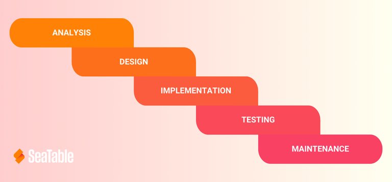

## Warum sind Projektmanagement-Methoden sinnvoll? 

Mithilfe von Projektmanagementmethoden können Sie ein Projekt so strukturieren und steuern, dass ein möglichst **geringer Aufwand an Kosten, Ressourcen und Zeit** entsteht. Darum sind Projektmanagement-Methoden äußerst sinnvoll für Ihr Unternehmen.

Werfen Sie mit uns einen Blick auf die Top 10, um den passenden Ansatz für Ihr Projekt zu bestimmen.

## Was ist der Unterschied zwischen klassischen und agilen Projektmanagement-Methoden?

Die Klassifizierung zwischen klassischen und agilen Projektmanagementmethoden kann Ihnen dabei helfen, schneller eine fundierte Auswahl unter den verfügbaren Methoden zu treffen.

### Klassische Projektmanagement-Methoden 

Klassische Projektmanagement-Methoden entstanden ursprünglich, um Großprojekte von längerer Dauer zu managen. Dabei definiert der Projektleiter vorab die Ziele und legt Verantwortliche für die einzelnen Aufgabenpakete fest. Das Erreichen des Ziels steht im Vordergrund, Änderungen sind nicht vorgesehen.

### Agile Projektmanagement-Methoden

Die agilen Projektmanagement-Methoden kamen über Projekte in der Softwareentwicklung hinzu. Sie stellen den Projektnutzen über die Erreichung eines festgelegten Ziels. Änderungen sind ausdrücklich erwünscht. Die Verteilung der Aufgaben erfolgt über eine Selbstorganisation der Projektbeteiligten.

Neben den klassischen und agilen Methoden finden Sie die hybriden Methoden des Projektmanagements. Als hybride Methode wird einerseits ein Modell bezeichnet, das für beide Arten des Projektmanagements Verwendung finden kann. Andererseits können Sie verschiedene klassische und agile Methoden zu einem neuen, hybriden Ansatz kombinieren.

### So finden Sie die richtige Methode für Ihr Projektmanagement

Welche Methode im [Projektmanagement]() sich am besten für Ihr Projekt eignet, hängt von der Komplexität des Projekts, Ihren verfügbaren Ressourcen, dem Zeitrahmen und der Flexibilität gegenüber Änderungen und Risiken ab.

Stellen Sie sich die folgenden Fragen:

- Welche Methoden des Projektmanagements bietet Ihnen den größten Nutzen?
- Können Sie damit die Bedürfnisse der Stakeholder berücksichtigen?
- Wie gut passt die Projektmanagement-Methode zu Ihren Unternehmenswerten?
- Wie harmonieren die Projektmethoden mit Ihren Geschäftsprozessen?
- Wie groß ist das Projekt?
- Welche Projektkomplexität erwarten Sie?
- Welche Kosten sind mit dem Projekt verbunden?
- Mit welchen Risiken muss die Projektmanagement-Methode fertigwerden können?

Wenn Sie eine Antwort auf alle Fragen haben, geht es an die Wahl der richtigen Projektmanagement-Methode.

## Das sind die 10 beliebtesten Projektmanagement-Methoden

Lassen Sie uns jetzt über die zehn am häufigsten verwendeten Projektmanagement-Modelle sprechen. Wir starten mit drei klassischen Methoden.

### 1\. Wasserfallmodell

Die **Wasserfall-Methode** ist eine Projektmanagement-Methode, bei der es um das **Bearbeiten sequenzieller Aufgaben** geht. Der Name „Wasserfallmodell“ stammt von der grafischen Darstellung der aufeinanderfolgenden Projektphasen, die meist leicht versetzt als **Kaskaden** untereinander angeordnet werden.

Geeignet ist dieses Projektmanagement-Modell für Projekte mit einem klaren zeitlichen Ablauf und Aufgaben, die voneinander abhängen. Da Fehler erst am Ende des Projekts erkennbar werden, sollten Sie das Wasserfallmodell vor allem für vorhersehbare und kurze Projekte einsetzen.

### 2\. PRINCE2

Wenn Sie sich für PRINCE2 entscheiden, erhalten Sie eine klassische Projektmanagement-Methode, die auf dem Wasserfallmodell aufbaut. Die Methode wurde von der britischen Regierung für IT-Projekte entwickelt und steht für „Projects In Controlled Environments“.

[PRINCE2](https://de.wikipedia.org/wiki/PRINCE2) eignet sich für große, vorhersehbare Projekte. Es ermöglicht ein **kontrolliertes Projektmanagement**, das keine Aufgaben dem Zufall überlässt. Dabei unterteilen Sie Ihr Projekt in verschiedene Phasen. Jede dieser Phasen besitzt eigene Pläne und Prozesse, die Sie dem Best-Practice-Leitfaden entnehmen können.

### 3\. Six Sigma

Six Sigma ist ein Managementsystem zur Prozessverbesserung und gehört ebenfalls zu den Top 3 der klassischen Projektmanagement-Methoden. Es hat sich insbesondere in großen Unternehmen bewährt. Jeder Prozess wird hier mit mathematischen Methoden unter dem DMAIC-Zyklus abgebildet:

- **Define**: Welches Problem im Prozess wollen Sie verbessern?
- **Measure**: Inwiefern erfüllt der Prozess die Anforderungen?
- **Analyze**: Was sind die Ursachen des Problems?
- **Improve**: Wie können Sie das Problem beheben?
- **Control**: Wie können Sie den neuen Prozess mit statistischen Methoden überwachen?

### 4\. Agile Projektmanagement-Methoden

Kommen wir jetzt zu den agilen Projektmanagement-Methoden. Das agile Projektmanagement eignet sich besonders für große, unvorhersehbare und komplexe Projekte. Die Methode arbeitet mit flachen Hierarchien, Eigenverantwortung der Teilnehmer, regelmäßigen Feedback-Prozessen und Umsetzungszyklen, die Änderungen ermöglichen.

Aus dem agilen Projektmanagement heraus wurden zwei weitere Projektmanagementmethoden entwickelt – Kanban und Scrum.

### 5\. Kanban

Im Mittelpunkt dieser Methode steht das sogenannte [Kanban-Board](https://seatable.io/vorlage/cwp-nvmltq6chdlesuhfrw/) mit mehreren Spalten, die bestimmte Projektmanagment-Phasen wie „To do“, „Doing“ und „Done“ darstellen. Die Kanban-Karten mit den Aufgaben starten in der To-do-Spalte und wandern von dort aus nach rechts bis hin zu „Done“. Sie können die Aufgaben-Karten priorisieren, um so den Ablauf der Abarbeitung zu beeinflussen.

In kurzen Meetings tauschen sich die Teammitglieder täglich über den Fortschritt, Hindernisse und Erfolge aus. Die Kanban-Methode eignet sich daher für Projekte, die von vielen regelmäßigen Feedbackprozessen und Verbesserungsschleifen profitieren.

### 6\. Scrum

Scrum steht derzeit auf Platz 1 der beliebtesten agilen Projektmanagementmethoden. Es baut auf einem langfristigen, aber flexiblen „Product Backlog“ auf. Aufgaben werden in „Sprints“ gegliedert. In jedem der Sprints entwickeln Sie ein abgeschlossenes Zwischenprodukt. Genau wie bei Kanban finden zusätzlich jeden Tag Feedback-Meetings („Daily Scrums“) statt. Scrum legt außerdem Rollen wie den „Product Owner“ und den „Scrum Master“ fest.

Der langfristige Projektplan mit den festgelegten Rollen verleiht einem komplexen Projekt Struktur. Das Projektmodell lässt zusätzlich Raum zum agilen Handeln, weshalb es perfekt zu Projekten mit unvorhersehbaren Faktoren und Risiken passt.

Kommen wir als nächstes zu den Methoden, die sich nicht eindeutig den Überbegriffen klassisch oder agil zuordnen lassen.

### 7\. Meilensteintrendanalyse (MTA)

Die Meilensteintrendanalyse kann sowohl im klassischen als auch im agilen Projektmanagement Anwendung finden. Von allen Methoden des Projektmanagements eignet sich die MTA besonders für die Terminplanung von Projekten mit hohen Risiken.

Sie überwacht den **zeitlichen Fortschritt** eines Projekts, bei dem zu festgelegten Terminen vorab definierte **Meilensteine** erledigt sein müssen. Erreichen Sie die Meilensteine weit im Voraus oder später als geplant? Anhand eines Zeitstrahls oder Kalenders lassen sich Trends – **zu viele unnötige Zeitpuffer** oder **Terminverzögerungen** –frühzeitig erkennen. So können Sie das Risiko minimieren, stark vom Zeitplan abzuweichen. 

Da die grafische Darstellung der Meilensteintrendanalyse recht simpel ist, wird sie häufig für Projekte mit einer geringen Komplexität und planbaren Abläufen eingesetzt.

### 8\. Lean Project Management

Diese Projektmanagement-Methode hilft Ihnen dabei, Schwachstellen eines Projekts zu identifizieren und für einen kontinuierlichen Fluss von Ergebnissen zu sorgen. Das Konzept basiert auf den Ideen und Prinzipien des [Lean Management](https://de.wikipedia.org/wiki/Lean_Management).

Das Lean Project Management unterscheidet zwischen drei Übeln, die es zu analysieren und zu eliminieren gilt:

- **Muda (Verschwendung)** identifiziert Prozesse, die keinen Wert schöpfen und keinen Nutzen bringen.
- **Mura (Unausgeglichenheit)** konzentriert sich auf unausgewogene Prozesse mit nicht aufeinander abgestimmten Prozessschritten und Störungen, die Warteschlangen oder Leerlauf verursachen.
- **Muri (Überlastung)** bezieht sich auf die Aus- und Entlastung von Teammitgliedern und Maschinen. Es sollen keine Engpässe entstehen, die zu einem hohen Verschleiß oder Krankenstand aufgrund der Überbeanspruchung führen.

Wichtig für diese Methode ist zudem, das optimale Verhältnis zwischen [Kosten und Nutzen](https://seatable.io/kosten-nutzen-analyse-vorlage/) eines Projekts zu finden.

Als Nächstes folgen zwei Projektmanagement-Methoden, die eine grafische Veranschaulichung in den Vordergrund stellen: Der Projektstrukturplan und die Netzplantechnik.

### 9\. Projektstrukturplan

Im [Projektstrukturplan]() erfassen Sie alle Projektaufgaben in einer einzigen Grafik. Anschließend können Sie Arbeitspakete schnüren, Zuständigkeiten verteilen und Termine festlegen.

Der Projektstrukturplan eignet sich dafür, große Projekte im Blick zu behalten. Er stammt aus dem klassischen Projektmanagement und lässt sich mitunter schwer auf agile Methoden anpassen. In Projekten, in denen Sie einen Gesamtüberblick benötigen, können Sie den Plan jedoch entschlacken und vereinfachen, damit er übersichtlich bleibt und Sie leicht Änderungen vornehmen können.

### 10\. Netzplantechnik

Zuletzt können Sie sich für die Netzplantechnik (in klassisch oder agiler Form) entscheiden. Diese Methode des Projektmanagements stellt Teilschritte grafisch oder tabellarisch in einem Netzplan dar. Aus diesem lassen sich

- Abhängigkeiten,
- der früheste und späteste Start- und Endpunkt,
- Pufferzeiten
- sowie der Kritische Pfad (Aufgaben, die aus zeitlicher Sicht wichtig sind)

entnehmen.

Die Netzplantechnik findet vor allem Anwendung in der Beschaffung und Produktion. Ihr Fokus liegt auf einem optimalen Zeitmanagement des Projekts.

## Finden Sie die passende Projektmanagement-Methode

Entscheiden Sie, welche Struktur Ihr Projekt benötigt: Einen hybriden, klassischen oder agilen Ansatz? Die zehn vorgestellten Methoden des Projektmanagements geben Ihnen einen Einblick, wie Sie Ihr Projekt erfolgreich verwirklichen können.

Gerne helfen wir Ihnen dabei, Ihre Projektmanagement-Methode mit SeaTable umzusetzen. [Registrieren Sie sich noch heute kostenlos]() und werfen Sie einen Blick auf unsere Templates.
