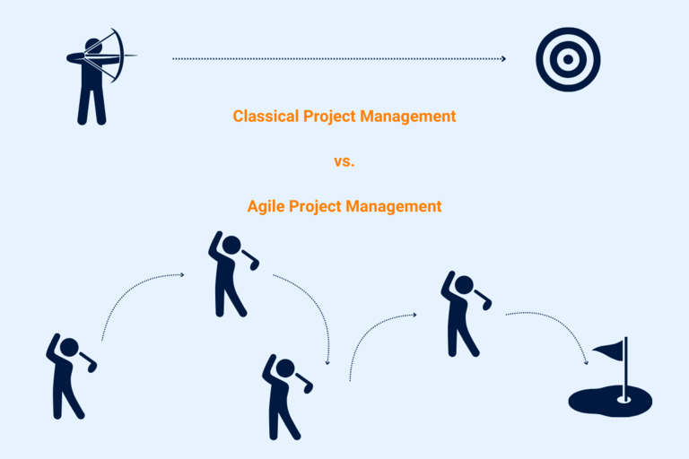
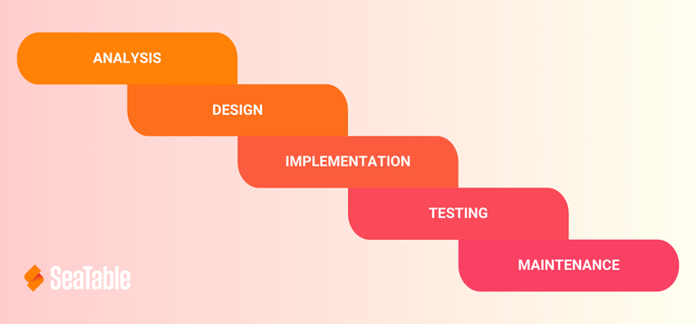
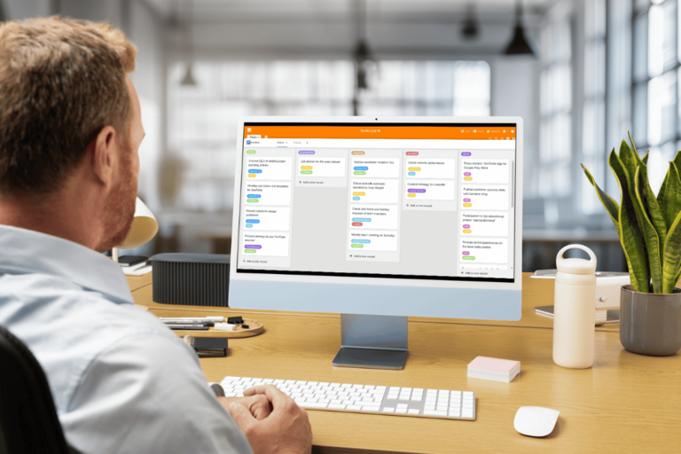
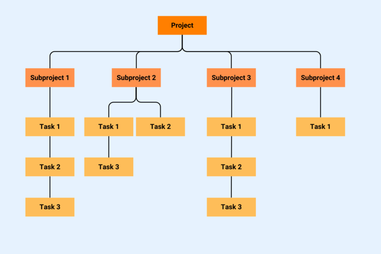

## Why are project management methods useful?

With the help of project management methods, you can structure and control a project in such a way as to **minimize costs, resources and time**. This is why project management methods are extremely useful for your company.

Take a look at the top 10 with us to determine the right approach for your project.

## What is the difference between traditional and agile project management methods?

The classification between classic and agile project management methods can help you to make an informed choice from the available methods more quickly.

### Classic project management methods

Classic project management methods were originally developed to manage large-scale projects of longer duration. The project manager defines the objectives in advance and determines who is responsible for the individual task packages. The focus is on achieving the goal; changes are not planned.

### Agile project management methods

Agile project management methods were added via software development projects. They place the project benefit above the achievement of a defined goal. Changes are expressly encouraged. The distribution of tasks is based on the self-organization of the project participants.

In addition to traditional and agile methods, there are also hybrid methods of project management. On the one hand, a hybrid method is a model that can be used for both types of project management. On the other hand, you can combine various classic and agile methods to create a new, hybrid approach.

### How to find the right method for your project management

Which [project management]() method is best suited to your project depends on the complexity of the project, your available resources, the time frame and the flexibility in the face of changes and risks.

Ask yourself the following questions:

- Which project management method offers you the greatest benefit?
- Can you use it to meet the needs of your stakeholders?
- How well does the project management method fit in with your corporate values?
- How do the project methods harmonize with your business processes?
- How large is the project?
- What project complexity do you expect?
- What costs are associated with the project?
- What risks must the project management method be able to cope with?

Once you have an answer to all these questions, it's time to choose the right project management method.

## These are the 10 most popular project management methods

Let's now talk about the ten most commonly used project management models. We'll start with three classic methods.

### 1\. Waterfall model

The **waterfall method** is a project management method that involves the **processing of sequential tasks**. The name "waterfall model" comes from the graphic representation of the successive project phases, which are usually arranged slightly offset from each other as **cascades**.

This project management model is suitable for projects with a clear timeline and tasks that are interdependent. As errors only become apparent at the end of the project, you should use the waterfall model primarily for predictable and short projects.

### 2\. PRINCE2

If you opt for PRINCE2, you will receive a classic project management method based on the waterfall model. The method was developed by the British government for IT projects and stands for "Projects In Controlled Environments".

[PRINCE2](https://de.wikipedia.org/wiki/PRINCE2) is suitable for large, predictable projects. It enables **controlled project management** that leaves no tasks to chance. You divide your project into different phases. Each of these phases has its own plans and processes, which you can find in the best practice guide.

### 3\. Six Sigma

Six Sigma is a management system for process improvement and is also one of the top 3 classic project management methods. It has proven itself in large companies in particular. Each process is mapped here using mathematical methods under the DMAIC cycle:

- **Define**: Which problem in the process do you want to improve?
- **Measure**: To what extent does the process fulfill the requirements?
- **Analyze**: What are the causes of the problem?
- **Improve**: How can you fix the problem?
- **Control**: How can you monitor the new process using statistical methods?

### 4\. Agile project management methods

Now let's move on to agile project management methods. Agile project management is particularly suitable for large, unpredictable and complex projects. The method works with flat hierarchies, personal responsibility of the participants, regular feedback processes and implementation cycles that enable changes.

Two other project management methods were developed from agile project management - Kanban and Scrum.

### 5\. Kanban

At the center of this method is the so-called [Kanban board]() with several columns that represent certain project management phases such as "To do", "Doing" and "Done". The Kanban cards with the tasks start in the "To do" column and move from there to the right up to "Done". You can prioritize the task cards in order to influence the processing sequence.

In short meetings, the team members discuss progress, obstacles and successes on a daily basis. The Kanban method is therefore suitable for projects that benefit from many regular feedback processes and improvement loops.

### 6\. Scrum

Scrum is currently the most popular agile project management method. It is based on a long-term but flexible "product backlog". Tasks are divided into "sprints". In each of the sprints, you develop a completed intermediate product. As with Kanban, feedback meetings ("daily scrums") also take place every day. Scrum also defines roles such as the "Product Owner" and the "Scrum Master".

The long-term project plan with the defined roles gives structure to a complex project. The project model also leaves room for agile action, which is why it is perfect for projects with unpredictable factors and risks.

Next, we come to the methods that cannot be clearly categorized as classic or agile.

### 7\. Milestone trend analysis (MTA)

Milestone trend analysis can be used in both traditional and agile project management. Of all project management methods, MTA is particularly suitable for scheduling projects with high risks.

It monitors the **temporal progress** of a project in which predefined **milestones** must be completed by set deadlines. Will you reach the milestones far in advance or later than planned? Using a timeline or calendar, trends - **too many unnecessary time buffers** or **deadline delays** - can be identified at an early stage. This allows you to minimize the risk of deviating significantly from the schedule.

As the graphical representation of the milestone trend analysis is quite simple, it is often used for projects with low complexity and predictable processes.

### 8\. Lean Project Management

This project management method helps you to identify weak points in a project and ensure a continuous flow of results. The concept is based on the ideas and principles of [Lean Management](https://de.wikipedia.org/wiki/Lean_Management).

Lean project management distinguishes between three evils that need to be analyzed and eliminated:

- **Muda (waste)** identifies processes that do not create value and bring no benefit.
- **Mura (imbalance)** focuses on unbalanced processes with uncoordinated process steps and disruptions that cause queues or idle time.
- **Muri (overload)** refers to the utilization and relief of team members and machines. There should be no bottlenecks that lead to high levels of wear and tear or sick leave due to overloading.

It is also important for this method to find the optimum ratio between [costs and benefits]() of a project.

Next are two project management methods that focus on graphical illustration: The work breakdown structure and the network technique.

### 9\. Work breakdown structure

In the [work breakdown structure](), you record all project tasks in a single graphic. You can then create work packages, assign responsibilities and set deadlines.

The work breakdown structure is suitable for keeping track of large projects. It originates from classic project management and is sometimes difficult to adapt to agile methods. However, in projects where you need an overall view, you can streamline and simplify the plan so that it remains clear and you can easily make changes.

### 10\. Network planning technique

Finally, you can opt for the network planning technique (in classic or agile form). This project management method presents sub-steps graphically or in tabular form in a network plan. From this you can

- Dependencies,
- the earliest and latest start and end points,
- Buffer times
- and the critical path (tasks that are important from a time perspective)

extract.

The network planning technique is primarily used in procurement and production. It focuses on optimal time management of the project.

## Find the right project management method

Decide what structure your project needs: A hybrid, classic or agile approach? The ten project management methods presented here will give you an insight into how you can successfully implement your project.

We would be happy to help you implement your project management method with SeaTable. [Register for free today]() and take a look at our templates.
