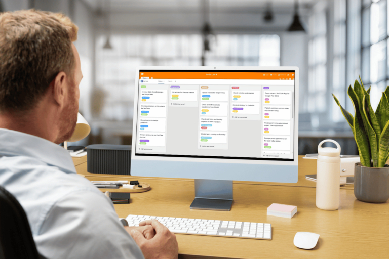

## Porque é que os métodos de gestão de projectos são úteis?

Com a ajuda dos métodos de gestão de projectos, é possível estruturar e controlar um projeto de forma a minimizar os custos, os recursos e o tempo. É por isso que os métodos de gerenciamento de projetos são extremamente úteis para sua empresa.

Veja connosco os 10 principais para determinar a abordagem certa para o seu projeto.

## Qual é a diferença entre os métodos de gestão de projectos tradicionais e ágeis?

A classificação entre os métodos de gestão de projectos clássicos e ágeis pode ajudá-lo a fazer uma escolha informada entre os métodos disponíveis mais rapidamente.

### Métodos clássicos de gestão de projectos

Os métodos clássicos de gestão de projectos foram originalmente desenvolvidos para gerir projectos de grande escala e de longa duração. O gestor do projeto define os objectivos antecipadamente e determina quem é responsável pelos pacotes de tarefas individuais. O foco está em atingir o objetivo; as mudanças não são planeadas.

### Métodos ágeis de gestão de projectos

Os métodos ágeis de gestão de projectos foram adicionados através de projectos de desenvolvimento de software. Colocam o benefício do projeto acima da realização de um objetivo definido. As mudanças são expressamente encorajadas. A distribuição de tarefas é baseada na auto-organização dos participantes do projeto.

Para além dos métodos tradicionais e ágeis, existem também métodos híbridos de gestão de projectos. Por um lado, um método híbrido é um modelo que pode ser utilizado para ambos os tipos de gestão de projectos. Por outro lado, é possível combinar vários métodos clássicos e ágeis para criar uma nova abordagem híbrida.

### Como encontrar o método certo para a gestão do seu projeto

O método [de gestão de projectos]() mais adequado para o seu projeto depende da complexidade do projeto, dos recursos disponíveis, do prazo e da flexibilidade face às mudanças e aos riscos.

Coloque a si próprio as seguintes questões:

- Qual o método de gestão de projectos que lhe oferece mais vantagens?
- Pode utilizá-lo para satisfazer as necessidades das partes interessadas?
- Em que medida é que o método de gestão de projectos se enquadra nos seus valores empresariais?
- Como é que os métodos de projeto se harmonizam com os seus processos empresariais?
- Qual é a dimensão do projeto?
- Qual é a complexidade esperada do projeto?
- Que custos estão associados ao projeto?
- Quais os riscos que o método de gestão de projectos deve ser capaz de enfrentar?

Quando tiver uma resposta a todas estas perguntas, é altura de escolher o método de gestão de projectos adequado.

## Estes são os 10 métodos de gestão de projectos mais populares

Vamos agora falar sobre os dez modelos de gestão de projectos mais utilizados. Começaremos com três métodos clássicos.

### 1\. Modelo em cascata

O **método em cascata** é um método de gestão de projectos que envolve o **processamento de tarefas sequenciais**. O nome "modelo em cascata" provém da representação gráfica das sucessivas fases do projeto, que estão normalmente dispostas ligeiramente afastadas umas das outras como **catas**.

Este modelo de gestão de projectos é adequado para projectos com um calendário claro e tarefas interdependentes. Como os erros só se tornam evidentes no final do projeto, o modelo em cascata deve ser utilizado principalmente para projectos previsíveis e curtos.

### 2\. PRINCE2

Se optar pelo PRINCE2, receberá um método clássico de gestão de projectos baseado no modelo em cascata. O método foi desenvolvido pelo governo britânico para projetos de TI e significa "Projetos em ambientes controlados".

O [PRINCE2](https://de.wikipedia.org/wiki/PRINCE2) é adequado para projectos grandes e previsíveis. Permite uma **gestão controlada do projeto** que não deixa nenhuma tarefa ao acaso. O projeto é dividido em diferentes fases. Cada uma destas fases tem os seus próprios planos e processos, que podem ser consultados no guia de boas práticas.

### 3\. Seis Sigma

O Six Sigma é um sistema de gestão para a melhoria de processos e é também um dos 3 principais métodos clássicos de gestão de projectos. Ele se provou em grandes empresas em particular. Cada processo é mapeado aqui usando métodos matemáticos sob o ciclo DMAIC:

- **Define**: Qual é o problema do processo que pretende melhorar?
- **Medir**: Até que ponto é que o processo cumpre os requisitos?
- **Analisar**: Quais são as causas do problema?
- **Melhorar**: Como é que se pode resolver o problema?
- **Controlar**: Como é que pode monitorizar o novo processo utilizando métodos estatísticos?

### 4\. Métodos ágeis de gestão de projectos

Agora vamos passar para os métodos ágeis de gestão de projectos. A gestão ágil de projectos é particularmente adequada para projectos grandes, imprevisíveis e complexos. O método funciona com hierarquias planas, responsabilidade pessoal dos participantes, processos de feedback regulares e ciclos de implementação que permitem mudanças.

Dois outros métodos de gestão de projectos foram desenvolvidos a partir da gestão ágil de projectos - Kanban e Scrum.

### 5\. Kanban

No centro deste método está o chamado [quadro Kanban]() com várias colunas que representam determinadas fases de gestão de projectos, como "A fazer", "A fazer" e "Feito". Os cartões Kanban com as tarefas começam na coluna "A fazer" e deslocam-se daí para a direita até "Concluído". Pode atribuir prioridades aos cartões de tarefas de modo a influenciar a sequência de processamento.

Em reuniões curtas, os membros da equipa discutem diariamente os progressos, os obstáculos e os sucessos. O método Kanban é, portanto, adequado para projectos que beneficiam de muitos processos regulares de feedback e ciclos de melhoria.

### 6\. Scrum

O Scrum é atualmente o método de gestão de projectos ágil mais popular. Baseia-se numa "lista de pendências do produto" a longo prazo, mas flexível. As tarefas são divididas em "sprints". Em cada um dos sprints, desenvolve-se um produto intermédio completo. Tal como no Kanban, as reuniões de feedback ("daily scrums") também se realizam todos os dias. O Scrum também define funções como o "Product Owner" e o "Scrum Master".

O plano de projeto a longo prazo com as funções definidas dá estrutura a um projeto complexo. O modelo de projeto também deixa espaço para uma ação ágil, razão pela qual é perfeito para projectos com factores e riscos imprevisíveis.

De seguida, chegamos aos métodos que não podem ser claramente categorizados como clássicos ou ágeis.

### 7\. Análise de tendências de marcos (MTA)

A análise de tendências de marcos pode ser usada tanto no gerenciamento de projetos tradicionais quanto ágeis. De todos os métodos de gestão de projectos, a MTA é particularmente adequada para a calendarização de projectos com riscos elevados.

Monitoriza o **progresso temporal** de um projeto em que **marcos** predefinidos devem ser concluídos em prazos definidos. Será que vai atingir os marcos muito antes ou mais tarde do que o planeado? Utilizando uma linha de tempo ou um calendário, as tendências - **muitos buffers de tempo desnecessários** ou **atrasos de prazos** - podem ser identificadas numa fase inicial. Isto permite-lhe minimizar o risco de se desviar significativamente do calendário.

Uma vez que a representação gráfica da análise das tendências das etapas é bastante simples, é frequentemente utilizada em projectos de baixa complexidade e com processos previsíveis.

### 8\. Gestão de Projectos Lean

Este método de gestão de projectos ajuda-o a identificar os pontos fracos de um projeto e a garantir um fluxo contínuo de resultados. O conceito baseia-se nas ideias e princípios do [Lean Management](https://de.wikipedia.org/wiki/Lean_Management).

A gestão de projectos Lean distingue três males que têm de ser analisados e eliminados:

- Muda **(desperdício)** identifica os processos que não criam valor e não trazem qualquer benefício.
- Mura **(desequilíbrio)** centra-se em processos desequilibrados com etapas de processo descoordenadas e interrupções que causam filas de espera ou tempos de inatividade.
- Muri **(sobrecarga)** refere-se à utilização e ao alívio dos membros da equipa e das máquinas. Não devem existir estrangulamentos que provoquem níveis elevados de desgaste ou baixas por doença devido a sobrecarga.

É também importante para este método encontrar o rácio ótimo entre [custos e benefícios]() de um projeto.

Seguem-se dois métodos de gestão de projectos que se centram na ilustração gráfica: A estrutura de decomposição do trabalho e a técnica de rede.

### 9\. Estrutura analítica do trabalho

No [plano de estrutura do projeto](), registam-se todas as tarefas do projeto num único gráfico. Pode então criar pacotes de trabalho, atribuir responsabilidades e estabelecer prazos.

O plano de estruturação do trabalho é adequado para acompanhar grandes projectos. Tem origem na gestão clássica de projectos e é por vezes difícil de adaptar aos métodos ágeis. No entanto, nos projectos em que é necessária uma visão global, é possível racionalizar e simplificar o plano para que este permaneça claro e seja fácil fazer alterações.

### 10\. Técnica de planeamento de rede

Por último, pode optar pela técnica de planeamento de rede (na forma clássica ou ágil). Este método de gestão de projectos apresenta as sub-etapas graficamente ou em forma de tabela num plano de rede. A partir daí, é possível

- Dependências,
- os pontos de início e de fim mais antigos e mais recentes,
- Tempos-tampão
- e o caminho crítico (tarefas que são importantes do ponto de vista temporal)

extrato.

A técnica de planeamento de rede é utilizada principalmente no aprovisionamento e na produção. Centra-se na gestão optimizada do tempo do projeto.

## Encontrar o método de gestão de projectos adequado

Decida qual a estrutura de que o seu projeto necessita: Uma abordagem híbrida, clássica ou ágil? Os dez métodos de gestão de projectos aqui apresentados dar-lhe-ão uma ideia de como pode implementar o seu projeto com sucesso.

Teremos todo o gosto em ajudá-lo a implementar o seu método de gestão de projectos com o SeaTable. [Registe-se gratuitamente hoje]() e dê uma vista de olhos aos nossos modelos.
