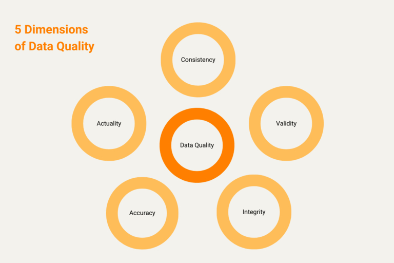
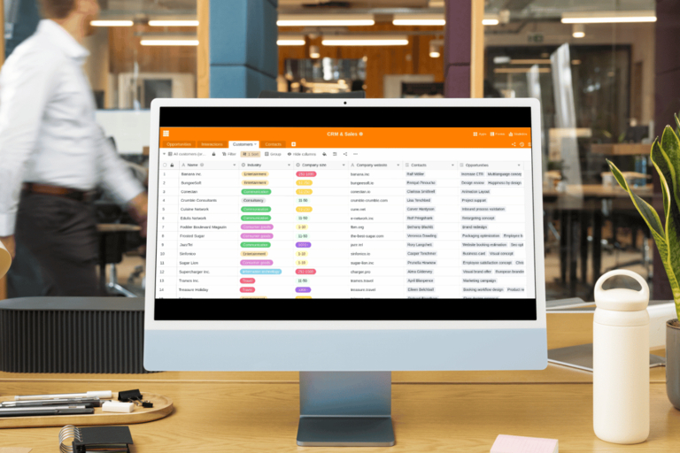

## Erfolgsgarant Datenmanagement

**Daten sind Gold wert**: Ob Kunden-, Mitarbeiter-, Produkt- oder Projektdaten – im digitalen Zeitalter ist die Fähigkeit Ihres Unternehmens, Daten effizient zu verwalten und aufzubereiten, entscheidend für Ihren langfristigen Erfolg. **Datenmanagement** – oft auch als Data Management bezeichnet – ist dabei der Schlüssel, wie Sie die Informationsflut, mit der Ihr Unternehmen tagtäglich konfrontiert ist, in den Griff bekommen. Folglich ist ein gut durchdachtes **Datenmanagementsystem** eine zentrale Voraussetzung für die Digitalisierung in Unternehmen: Nur so können Sie betriebliche Abläufe verbessern und Wettbewerbsvorteile erzielen.

Doch warum ist Datenmanagement so wichtig für die Prozessdigitalisierung? Und welche Herausforderungen und Chancen ergeben sich daraus? Erfahren Sie es in diesem Artikel!

## Was ist Datenmanagement?

Unter **Datenmanagement** (englisch: Data Management) versteht man die Gesamtheit aller Prozesse, Methoden und Technologien, die Unternehmen einsetzen, um ihre Daten systematisch zu erfassen, zu speichern, zu analysieren und zu nutzen. Die Hauptziele sind:

- Verfügbarkeit, Konsistenz und Qualität der Daten sicherstellen
- wertvolle Erkenntnisse aus den Daten gewinnen
- fundierte Geschäftsentscheidungen treffen
- Produktivität und Effizienz steigern

### Was gehört zum Datenmanagement?

Zum **Datenmanagement** gehört eine Vielzahl von Aufgaben wie das Identifizieren, Sammeln und Speichern von Daten, die Datenpflege und -analyse sowie bestimmte Vorkehrungen für die Datensicherheit. Besonders relevant sind diese Teilbereiche:

Alles beginnt mit der Datenerfassung, -erhebung oder -generierung: Während **Datenerfassung** die punktuelle Eingabe von Daten für die elektronische Datenverarbeitung meint, erfolgt die **Datenerhebung** über einen längeren Zeitraum. Unter **Datengenerierung** versteht man das Erzeugen und Sammeln großer Datenmengen mithilfe von Algorithmen.

Die Aufgabe der **Datenintegration** besteht darin, Daten aus verschiedenen Quellen zusammenzuführen und zu harmonisieren. Bei der **Datenmodellierung** strukturieren Sie wiederum die Daten, um sie später einfacher und schneller verarbeiten zu können.

Für die **Datenanalyse** werten Sie die Daten mithilfe verschiedener Analysemethoden wie Statistik, Data Mining, Machine Learning oder Business Intelligence aus, um Muster oder Trends in den Datenbeständen zu erkennen.

Das **Datenqualitätsmanagement** zielt darauf ab, die Datenqualität zu verbessern und sicherzustellen, dass die Daten korrekt, vollständig, aktuell und eindeutig sind.

Wenn Sie Daten langfristig speichern und zugänglich machen möchten, können Sie die **Datenarchivierung** auf leistungsfähigen Datenträgern oder in Cloud-Speichern veranlassen. Beim **Metadatenmanagement** verwalten Sie zudem Metadaten wie den Datentyp oder das Erstellungsdatum.

In Sachen **Datenschutz** und **Datensicherheit** sollten Sie verschiedene Maßnahmen rund um Verschlüsselung, Zugriffsrechte oder Backups ergreifen, um Ihre Daten vor unbefugtem Zugriff oder Verlust zu schützen und gesetzliche Vorgaben einzuhalten.

## Datenmanagement als Grundlage für die Digitalisierung in Unternehmen

Was Technologiekonzerne wie SAP, Google oder Meta schon vor Jahrzehnten erkannt haben: Daten sind von unschätzbarem Wert. In unserer schnelllebigen Welt sind sie das Kapital vieler Unternehmen, um Trends frühzeitig zu erkennen, fundierte Entscheidungen zu treffen und den Wettbewerbern immer einen Schritt voraus zu sein. Für die Digitalisierung in Unternehmen zählen die Verfügbarkeit, Qualität und Nutzung von Daten demnach zu den wichtigsten Faktoren. Datenmanagement umfasst aber nicht nur die Einführung neuer Technologien, sondern auch die Optimierung von Prozessen und Strukturen.

Ohne ein effektives Data Management können Unternehmen die Potenziale der Prozessdigitalisierung nicht voll ausschöpfen, denn eine präzise Datenverarbeitung ist die Basis für digitale und automatisierte Geschäftsprozesse. Dieser hohe Stellenwert von Daten in der Wertschöpfungskette veranlasst mittlerweile auch kleine und mittelständische Unternehmen, ihr Datenmanagement größer aufzuziehen, um mehr aus ihren Daten herauszuholen.

## Prozessdigitalisierung: Vorteile dank Datenmanagement

Bei der Prozessdigitalisierung geht es darum, **analoge Prozesse zu digitalisieren** oder bestehende digitale Prozesse zu verbessern. Ein funktionierendes Datenmanagementsystem spielt eine zentrale Rolle bei dieser Transformation. Es sorgt dafür, dass Ihnen die **notwendigen Daten in guter Qualität, zur richtigen Zeit und am richtigen Ort** vorliegen. Das ermöglicht es Ihnen, Prozesse zu automatisieren und menschliche Fehler zu reduzieren.

Durch ein effektives Datamanagement können Sie eine **höhere Datenintegrität und Datenqualität** erreichen, was wiederum zu fundierten Entscheidungen beiträgt. Zudem können Sie Kosten senken, indem Sie Daten effizient nutzen, redundante Daten vermeiden und auf ebenso preiswerte wie sichere Speichertechnologien setzen. Auch die **Optimierung, Digitalisierung und Automatisierung von Prozessen** sind Vorteile, die sich aus einem guten Datenmanagement ergeben.

Ein konkretes Beispiel hierfür ist der Einsatz von Data Management in der Produktion. Moderne Fertigungsanlagen nutzen große Mengen an Sensordaten, um Produktionsabläufe in Echtzeit zu überwachen und anzupassen. Ohne ein solides Data Management System wären solche fortschrittlichen Produktionsverfahren kaum umsetzbar. Aber auch im [Personalwesen](https://seatable.com/hr-prozesse/), im [Marketing](https://seatable.com/branchenloesung-marketing/) oder der Buchhaltung ist das Datenmanagement für die Digitalisierung in Unternehmen nicht mehr wegzudenken.

### Die Chancen eines effektiven Datenmanagements

- **Effizienzsteigerung**: Automatisierte Prozesse reduzieren den Aufwand für manuelle Tätigkeiten und minimieren menschliche Fehler.
- **Bessere Entscheidungen**: Datengetriebene Entscheidungen sind in der Regel fundierter und führen zu besseren Geschäftsergebnissen.
- **Kosteneinsparungen**: Durch die optimale Nutzung von Daten und Ressourcen können Sie die Kosten senken.
- **Wettbewerbsvorteil**: Unternehmen, die ihre Daten effektiv nutzen, können schneller auf Trends reagieren und so einen Vorsprung gegenüber der Konkurrenz erzielen.

## Herausforderungen beim Datenmanagement

Obwohl das Datenmanagement für die Arbeit und Digitalisierung in Unternehmen unverzichtbar ist, stellt es viele Organisationen vor folgende Herausforderungen:

1. **Skalierbarkeit**: Im Zeitalter von Big Data muss ein Datenmanagementsystem skalierbar sein, um mit den wachsenden Datenmengen Schritt zu halten. Nur so können Sie Daten aus einer Vielzahl an Quellen wie Sensoren, Kameras oder Tastaturen speichern und verwenden.
1. **Datenintegration**: Ein weiteres Problem ist die Komplexität dieser Daten. Wenn Sie Ihre Daten in verschiedenen Systemen und Formaten speichern, müssen Sie sie erst zusammenführen und in Einklang bringen, bevor Sie die Daten effektiv nutzen können. Gerade bei großen Datenmengen aus verschiedenen Quellen kann es aufwändig und schwierig sein, eine einheitliche Struktur zu schaffen.
1. **Datennutzung:** Das Sammeln von Daten allein bietet noch keinen Mehrwert – denn diese Daten sind nicht nützlich, bis Sie sie verwerten. Es kann viel Zeit und Mühe kosten, die Daten so aufzubereiten, wie Sie es für die Analyse benötigen, sei es durch die Standardisierung von Datenformaten, die Aggregation von Datensätzen oder die Entfernung von Duplikaten. Ist das Datenmanagement zu aufwändig, wird keine Analyse stattfinden und der potenzielle Wert dieser Daten geht verloren.
1. **Datenqualität**: Eine der größten Herausforderungen beim Datenmanagement besteht darin, die Datenqualität zu gewährleisten. Wenn Daten veraltet, unvollständig oder fehlerhaft sind, können sie zu falschen Analysen und Entscheidungen führen. Eine kontinuierliche Datenpflege, bei der Sie die Daten aktualisieren und bereinigen, ist daher unerlässlich.
1. **Datensicherheit und Datenschutz**: Datenschutzbestimmungen und Compliance-Regelungen sind multinational und ändern sich regelmäßig. Mit der zunehmenden Menge an gesammelten Daten steigt auch das Risiko von Datenschutzkonflikten. Einerseits müssen Sie sicherstellen, dass personenbezogene Daten vor unbefugtem Zugriff geschützt sind; andererseits müssen Sie die gespeicherten Daten leicht löschen oder an geänderte Nutzungsrichtlinien anpassen können.

## Wie Sie das Datenmanagement für die Digitalisierung in Unternehmen nutzen können

Wenn Sie in ein robustes Datenmanagementsystem investieren, können Sie diesen Herausforderungen beim Datenmanagement begegnen. Dennoch erfordert ein erfolgreiches Datenmanagement eine sorgfältige Planung und eine klare Strategie. Hier sind einige Best Practices, die Sie beim Data Management beachten sollten:

- Schaffen Sie ein Bewusstsein für die Bedeutung von Daten und ermutigen Sie Mitarbeiter dazu, Daten mit Bezug zu ihrer Arbeit zu sammeln, zu analysieren und zu teilen.
- Dementsprechend sollten Sie mit Schulungen sicherstellen, dass ihre Mitarbeiter die notwendigen Fähigkeiten und Kenntnisse besitzen, um sorgsam mit Daten umzugehen und sie effektiv zu nutzen.
- Nicht zuletzt sollten Sie in Tools und Technologien investieren, mit denen Sie Daten effektiv erfassen, speichern und analysieren können.

## Bewährte Datenmanagementsysteme

Im Prinzip ist Big Data genau das, wonach es klingt – eine Unmenge an Daten. Diese Daten müssen Sie strukturieren und aufbereiten, um sie sinnvoll nutzen zu können. In der Regel speichern Sie Daten in Datenbanken, die je nach Zweck unterschiedlich aufgebaut sind. Es kann herausfordernd sein, eine leistungsstarke Infrastruktur bereitzustellen, insbesondere wenn es um die Verarbeitung großer Datenmengen geht.

Datenmanagementsysteme sind grundlegende IT-Systeme, mit denen Sie **Daten in Ihrem Unternehmen erfassen, speichern und analysieren**. Für unterschiedliche Anforderungen existieren diverse Daten-Management-Systeme wie relationale Datenbanken, NoSQL-Datenbanken oder Data Warehouses. Relationale Datenbanken sind am weitesten verbreitet und durch eine tabellenbasierte Struktur gekennzeichnet. NoSQL-Datenbanken eignen sich dagegen besonders für die Verarbeitung großer Datenmengen.

#### Datenmanagementsysteme im Überblick

Es gibt eine Vielzahl an Tools und Software, die Sie für Ihr Datenmanagement einsetzen können. Hier sind einige bewährte Datenmanagementsysteme im Überblick:

- **Relationale Datenbankmanagementsysteme (RDBMS)**: Relationale Datenbanken strukturieren Daten mithilfe von Beziehungen, die sich in Tabellen darstellen lassen. Dies ermöglicht es, die Daten effizient zu speichern, abzurufen und zu verarbeiten. Die meistgenutzte Datenbanksprache heißt SQL, die auch bekannte relationale Datenbankmanagementsysteme wie MySQL, Microsoft SQL Server und PostgreSQL im Namen tragen.
- **NoSQL-Datenbankmanagementsysteme**: Im Vergleich zu RDBMS bieten NoSQL-Datenbanken eine flexible Datenstruktur und eine horizontale Skalierung, die sich besser für große Datenmengen, hohe Leistungsanforderungen und häufige Änderungen eignet. Beispiele für NoSQL-Datenbankmanagementsysteme sind MongoDB, Apache Cassandra und CouchDB.
- **Data Warehouses**: Ein Data Warehouse ist eine auf Analysen spezialisierte Datenbank, die große Mengen an Daten aus verschiedenen Quellen zu einem konsistenten Datenbestand zusammenführt. Diese Daten können Data Manager dann aufbereiten und analysieren, um beispielsweise umfassende Einblicke in die Geschäftsprozesse eines Unternehmens zu gewinnen. Erwähnenswerte Data Warehouse-Systeme sind Oracle Exadata, IBM Netezza, Amazon Redshift und Snowflake.
- **Data Lakes**: Ein Data Lake ist ein Speicher, in dem alle Rohdaten einer Organisation gespeichert sind. Er kann sowohl strukturierte Daten aus relationalen Datenbanken als auch unstrukturierte Daten (zum Beispiel E-Mails, PDF-Dokumente und Bild-Dateien) enthalten. Im Gegensatz zum Data Warehouse werden die Daten im Data Lake erst bei Bedarf für die Analyse oder Visualisierung aufbereitet. Data-Lake-Systeme wie Amazon S3, Microsoft Azure Data Lake oder Google Cloud Storage ermöglichen eine schnelle und flexible Verarbeitung großer Datenmengen.
- **MDM-Tools**: Tools für das Master Data Management (englisch für Stammdatenmanagement) helfen Ihnen die Stammdaten Ihres Unternehmens zu verwalten und zu pflegen. Zu den wichtigsten Stammdaten zählen Informationen über Kunden, Lieferanten, Produkte und Personal. Mit MDM-Tools wie SAP Master Data Governance oder IBM InfoSphere MDM können Sie Inkonsistenzen beseitigen und dafür sorgen, dass Ihre Kerngeschäftsdaten eindeutig, vollständig, fehlerfrei und aktuell sind.

### Was ist das beste Datenmanagementsystem?

Die Wahl einer geeigneten Datenmanagement-Software hängt von den spezifischen Anforderungen ab, die Sie an den Datenzugriff, die Datenspeicherung, -sicherheit, -integration und -analyse stellen. Dabei können Sie entscheiden, ob Sie Ihre Daten auf Ihren eigenen Servern ([On-Premises](https://seatable.com/on-premises/)), in einer Cloud oder in einer hybriden Mischung speichern und analysieren wollen.

Als Trend lässt sich die zunehmende Verwendung von cloudbasierten Datenmanagement-Lösungen beobachten. Eine cloudbasierte Datamanagement-Plattform ermöglicht es Ihnen, Daten sicher zu speichern und effizient zu verarbeiten, ohne in teure Infrastruktur investieren zu müssen.

## Relationale No-Code-Datenbank in der Cloud oder On-Premises

In der tabellenbasierten [No-Code-Datenbank SeaTable](https://seatable.com/) können Sie Ihre Daten effizient speichern, abrufen und analysieren, ohne SQL-Kenntnisse oder sonstige technische Vorerfahrung mitbringen zu müssen. Dabei können Sie nicht nur spielend leicht Daten strukturieren und verknüpfen, sondern auch Dateien, Bilder und Dokumente speichern.

Im Gegensatz zu anderen relationalen Datenbanken können Sie auf der **grafischen Benutzeroberfläche** von SeaTable direkt Auswertungen vornehmen. Für weitergehende Analysen stehen Ihnen zahlreiche Statistiken zur Verfügung. Wenn Ihnen dies noch nicht reicht, können Sie Ihre Daten mithilfe von [Plugins](https://seatable.io/docs/plugins/alle-plugins-in-der-uebersicht/) in Galerien, Kalendern, Organigrammen etc. visualisieren.

Mit dem **No-Code-App-Builder** von SeaTable können Sie ohne Programmierkenntnisse eigene Apps bauen und so den Zugriff auf die Daten in Ihrer Datenbank zielgenau steuern. Für das App-Design gibt es vorgefertigte Seitentypen mit visuellen Elementen, die Sie einfach per Drag-and-Drop zusammenfügen können.

SeaTable überlässt Ihnen die freie Entscheidung zwischen dem Komfort einer [Cloudlösung](https://seatable.com/cloud/) und der Datenhoheit, die Sie mit einem selbstgehosteten System genießen. Sie werden gerade hellhörig? Dann [registrieren Sie sich einfach kostenlos](https://seatable.com/registrierung/) und probieren Sie die SeaTable Cloud zeitlich unbegrenzt aus.

## Treiben Sie die Digitalisierung in Ihrem Unternehmen voran

In einer immer stärker digitalisierten Welt ist Datenmanagement nicht nur eine technologische Herausforderung, sondern auch ein strategischer Erfolgsfaktor für Unternehmen. Ein passendes Datenmanagementsystem bildet die Grundlage für Ihre Prozessdigitalisierung und ermöglicht es Ihnen, die Potenziale der Digitalisierung in Ihrem Unternehmen voll auszuschöpfen. Wer den vollen Überblick über seine Daten hat, trifft die richtigen Entscheidungen und ist auch in Zukunft der Konkurrenz immer einen Schritt voraus. Die Investition in ein ausgefeiltes Datenmanagementsystem ist daher ein Muss für jedes Unternehmen, das wettbewerbsfähig bleiben und die Chancen der Digitalisierung nutzen möchte.

## FAQ



Was versteht man unter Datenmanagement? |||

Unter **Datenmanagement** versteht man die Gesamtheit aller Prozesse, Methoden und Technologien, die Unternehmen einsetzen, um ihre Daten systematisch zu erfassen, zu speichern, zu analysieren und zu nutzen.

---

Was gehört zum Datenmanagement? |||

Zum Datenmanagement gehören vielschichtige Teilbereiche wie die Datenerfassung und -speicherung, die Datenintegration und -modellierung, die Datenpflege und -qualität, die Datenanalyse sowie der Datenschutz.

---

Warum ist Datenmanagement so wichtig? |||

Daten sind von unschätzbarem Wert, um Trends frühzeitig zu erkennen und fundierte Entscheidungen zu treffen. Zudem ist ein funktionierendes Datenmanagementsystem entscheidend, um Prozesse zu digitalisieren und zu automatisieren. Indem Sie Ihre Daten effizient nutzen, können Sie folglich Kosten einsparen und Wettbewerbsvorteile erzielen.

---

Welche Datenmanagementsysteme gibt es? |||

Hauptsächlich haben Sie die Wahl zwischen relationalen Datenbankmanagementsystemen, NoSQL-Datenbanken, Data Warehouses und Data Lakes.

