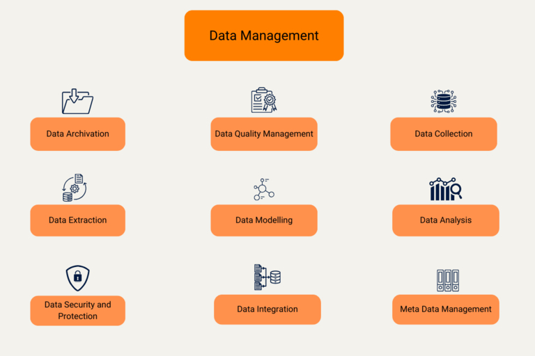

## La gestion des données, gage de succès

**Les données valent de l'or** : Qu'il s'agisse de données sur les clients, les collaborateurs, les produits ou les projets, à l'ère du numérique, la capacité de votre entreprise à gérer et à traiter efficacement les données est déterminante pour votre succès à long terme. **La gestion des données** - souvent appelée gestion des données - est la clé qui vous permettra de maîtriser le flux d'informations auquel votre entreprise est confrontée chaque jour. Par conséquent, un système de gestion des données bien conçu est une condition préalable essentielle à la numérisation des entreprises : C'est la seule façon d'améliorer les processus opérationnels et d'obtenir un avantage concurrentiel.

Mais pourquoi la gestion des données est-elle si importante pour la numérisation des processus ? Et quels sont les défis et les opportunités qui en découlent ? Découvrez-le dans cet article !

## Qu'est-ce que la gestion des données ?

Par **gestion des données** (en anglais : data management), on entend l'ensemble des processus, méthodes et technologies utilisés par les entreprises pour collecter, stocker, analyser et utiliser systématiquement leurs données. Les principaux objectifs sont

- assurer la disponibilité, la cohérence et la qualité des données
- obtenir des connaissances précieuses à partir des données
- prendre des décisions commerciales éclairées
- augmenter la productivité et l'efficacité

### Qu'est-ce qui fait partie de la gestion des données ?

La **gestion des données** comprend un grand nombre de tâches telles que l'identification, la collecte et le stockage des données, la gestion et l'analyse des données ainsi que certaines dispositions pour la sécurité des données. Ces sous-domaines sont particulièrement pertinents :

Tout commence par la saisie, la collecte ou la génération de données : alors que la **collecte de données** désigne l'introduction ponctuelle de données pour le traitement électronique des données, la **collecte de données** s'effectue sur une période plus longue. Par **génération de données**, on entend la création et la collecte de grandes quantités de données à l'aide d'algorithmes.

La tâche d'**intégration de données** consiste à rassembler et à harmoniser des données provenant de différentes sources. La **modélisation des données** consiste à son tour à structurer les données afin de pouvoir les traiter plus facilement et plus rapidement par la suite.

Pour l'**analyse des données**, vous évaluez les données à l'aide de différentes méthodes d'analyse telles que les statistiques, le data mining, le machine learning ou la business intelligence afin d'identifier des modèles ou des tendances dans les stocks de données.

La **gestion de la qualité des données** vise à améliorer la qualité des données et à garantir que les données sont correctes, complètes, à jour et uniques.

Si vous souhaitez stocker des données à long terme et les rendre accessibles, vous pouvez organiser l'**archivage des données** sur des supports de données performants ou dans des espaces de stockage en nuage. La **gestion des métadonnées** vous permet en outre de gérer des métadonnées telles que le type de données ou la date de création.

En matière de **protection des données** et de **sécurité des données**, vous devez prendre différentes mesures concernant le cryptage, les droits d'accès ou les sauvegardes afin de protéger vos données contre tout accès non autorisé ou toute perte et de respecter les dispositions légales.

## La gestion des données comme base de la numérisation dans les entreprises

Ce que des groupes technologiques comme SAP, Google ou Meta ont compris il y a des décennies déjà : Les données sont d'une valeur inestimable. Dans notre monde en perpétuel mouvement, elles constituent le capital de nombreuses entreprises, qui leur permet d'identifier les tendances à temps, de prendre des décisions fondées et d'avoir toujours une longueur d'avance sur leurs concurrents. La disponibilité, la qualité et l'utilisation des données comptent donc parmi les facteurs les plus importants pour la numérisation des entreprises. La gestion des données ne comprend toutefois pas seulement l'introduction de nouvelles technologies, mais aussi l'optimisation des processus et des structures.

Sans une gestion efficace des données, les entreprises ne peuvent pas exploiter pleinement les potentiels de la numérisation des processus, car un traitement précis des données est la base des processus commerciaux numériques et automatisés. Cette grande importance des données dans la chaîne de création de valeur incite désormais aussi les petites et moyennes entreprises à élargir leur gestion des données afin de tirer davantage profit de leurs données.

## Numérisation des processus : les avantages de la gestion des données

La numérisation des processus consiste à **numériser les processus analogiques** ou à améliorer les processus numériques existants. Un système de gestion des données fonctionnel joue un rôle central dans cette transformation. Il veille à ce que vous disposiez des **données nécessaires dans une bonne qualité, au bon moment et au bon endroit**. Cela vous permet d'automatiser les processus et de réduire les erreurs humaines.

Grâce à une gestion efficace des données, vous pouvez atteindre une **intégrité et une qualité des données plus élevées**, ce qui contribue à des décisions plus éclairées. En outre, vous pouvez réduire les coûts en utilisant les données de manière efficace, en évitant les données redondantes et en misant sur des technologies de stockage aussi bon marché que sûres. L'**optimisation, la numérisation et l'automatisation des processus** sont également des avantages qui découlent d'une bonne gestion des données.

Un exemple concret est l'utilisation de la gestion des données dans la production. Les installations de production modernes utilisent de grandes quantités de données de capteurs pour surveiller et adapter les processus de production en temps réel. Sans un système de gestion des données solide, de tels processus de production avancés seraient difficilement réalisables. Mais la gestion des données est également indispensable à la numérisation des entreprises dans le domaine des [ressources humaines](), du [marketing]() ou de la comptabilité.

### Les opportunités d'une gestion des données efficace

- **Augmentation de l'efficacité** : Les processus automatisés réduisent les tâches manuelles et minimisent les erreurs humaines.
- **Meilleures décisions** : Les décisions guidées par les données sont généralement mieux fondées et conduisent à de meilleurs résultats commerciaux.
- **Économies de coûts** : L'utilisation optimale des données et des ressources permet de réduire les coûts.
- **Avantage concurrentiel** : Les entreprises qui utilisent efficacement leurs données peuvent réagir plus rapidement aux tendances et prendre ainsi une longueur d'avance sur leurs concurrents.

## Défis de la gestion des données

Bien que la gestion des données soit indispensable au travail et à la numérisation dans les entreprises, elle pose les défis suivants à de nombreuses organisations :

1. **Evolutivité** : À l'ère du big data, un système de gestion des données doit être évolutif afin de suivre le rythme de l'augmentation des volumes de données. C'est la seule façon de stocker et d'utiliser des données provenant d'une multitude de sources telles que des capteurs, des caméras ou des claviers.
1. **Intégration des données** : La complexité de ces données constitue un autre problème. Si vous stockez vos données dans différents systèmes et formats, vous devez d'abord les rassembler et les harmoniser avant de pouvoir les utiliser efficacement. La création d'une structure uniforme peut s'avérer fastidieuse et difficile, surtout lorsqu'il s'agit de grandes quantités de données provenant de différentes sources.
1. **Utilisation des données:** La collecte de données ne constitue pas en soi une valeur ajoutée - car ces données ne sont pas utiles tant que vous ne les exploitez pas. Il peut falloir beaucoup de temps et d'efforts pour préparer les données de la manière dont vous en avez besoin pour l'analyse, que ce soit en normalisant les formats de données, en agrégeant les ensembles de données ou en supprimant les doublons. Si la gestion des données est trop coûteuse, aucune analyse n'aura lieu et la valeur potentielle de ces données sera perdue.

1) **Qualité des données** : L'un des principaux défis de la gestion des données est de garantir leur qualité. Si les données sont obsolètes, incomplètes ou erronées, elles peuvent conduire à des analyses et des décisions erronées. Il est donc essentiel de gérer les données en permanence, en les actualisant et en les nettoyant.
1) **Sécurité des données et protection des données** : Les règles de protection des données et les règles de conformité sont multinationales et changent régulièrement. Le risque de conflits de protection des données augmente avec la quantité croissante de données collectées. D'une part, vous devez vous assurer que les données personnelles sont protégées contre tout accès non autorisé ; d'autre part, vous devez pouvoir facilement supprimer les données stockées ou les adapter aux changements de politique d'utilisation.

## Comment utiliser la gestion des données pour la numérisation en entreprise

En investissant dans un système de gestion des données robuste, vous pouvez faire face à ces défis de gestion des données. Néanmoins, une gestion des données réussie nécessite une planification minutieuse et une stratégie claire. Voici quelques bonnes pratiques à suivre pour la gestion des données :

- Faites prendre conscience de l'importance des données et encouragez les collaborateurs à collecter, analyser et partager des données en rapport avec leur travail.
- En conséquence, vous devez vous assurer, par le biais de formations, que vos collaborateurs possèdent les compétences et les connaissances nécessaires pour traiter les données avec soin et les utiliser efficacement.
- Enfin, vous devriez investir dans des outils et des technologies qui vous permettent de collecter, de stocker et d'analyser efficacement les données.

## Systèmes de gestion des données éprouvés

En principe, le big data est exactement ce qu'il semble être : une quantité énorme de données. Vous devez structurer et préparer ces données afin de pouvoir les utiliser de manière judicieuse. En règle générale, vous stockez les données dans des bases de données dont la structure varie en fonction de leur finalité. Il peut s'avérer difficile de mettre en place une infrastructure performante, surtout lorsqu'il s'agit de traiter de grandes quantités de données.

Les systèmes de gestion des données sont des systèmes informatiques de base qui vous permettent de **collecter, de stocker et d'analyser les données de votre entreprise**. Il existe divers systèmes de gestion des données pour répondre aux différentes exigences, comme les bases de données relationnelles, les bases de données NoSQL ou les entrepôts de données. Les bases de données relationnelles sont les plus répandues et se caractérisent par une structure basée sur des tableaux. Les bases de données NoSQL, quant à elles, sont particulièrement adaptées au traitement de grandes quantités de données.

#### Aperçu des systèmes de gestion des données

Il existe une multitude d'outils et de logiciels que vous pouvez utiliser pour la gestion de vos données. Voici un aperçu de quelques systèmes de gestion des données qui ont fait leurs preuves :

- **Systèmes de gestion de bases de données relationnelles (SGBDR)** : Les bases de données relationnelles structurent les données à l'aide de relations qui peuvent être représentées dans des tableaux. Cela permet de stocker, d'extraire et de traiter les données de manière efficace. Le langage de base de données le plus utilisé s'appelle SQL, dont le nom désigne également des systèmes de gestion de bases de données relationnelles connus tels que MySQL, Microsoft SQL Server et PostgreSQL.
- **Systèmes de gestion de base de données NoSQL** : Par rapport aux SGBDR, les bases de données NoSQL offrent une structure de données flexible et une mise à l'échelle horizontale, mieux adaptée aux grands volumes de données, aux exigences de performance élevées et aux changements fréquents. Des exemples de systèmes de gestion de base de données NoSQL sont MongoDB, Apache Cassandra et CouchDB.
- **Entrepôts de données** : Un entrepôt de données est une base de données spécialisée dans l'analyse, qui rassemble de grandes quantités de données provenant de différentes sources en un ensemble de données cohérent. Les gestionnaires de données peuvent ensuite préparer et analyser ces données afin d'obtenir, par exemple, des informations complètes sur les processus commerciaux d'une entreprise. Les systèmes d'entrepôts de données à mentionner sont Oracle Exadata, IBM Netezza, Amazon Redshift et Snowflake.
- **Data Lakes** : Un data lake est un entrepôt dans lequel sont stockées toutes les données brutes d'une organisation. Il peut contenir aussi bien des données structurées issues de bases de données relationnelles que des données non structurées (par exemple des e-mails, des documents PDF et des fichiers image). Contrairement à l'entrepôt de données, les données du data lake ne sont préparées qu'en cas de besoin pour l'analyse ou la visualisation. Les systèmes de data lake comme Amazon S3, Microsoft Azure Data Lake ou Google Cloud Storage permettent un traitement rapide et flexible de grandes quantités de données.
- **Outils de gestion des données de référence** : Les outils de Master Data Management (en anglais, gestion des données de base) vous aident à gérer et à entretenir les données de base de votre entreprise. Parmi les données de base les plus importantes figurent les informations sur les clients, les fournisseurs, les produits et le personnel. Les outils MDM tels que SAP Master Data Governance ou IBM InfoSphere MDM vous permettent d'éliminer les incohérences et de veiller à ce que vos données commerciales de base soient claires, complètes, exemptes d'erreurs et à jour.

### Quel est le meilleur système de gestion des données ?

Le choix d'un logiciel de gestion des données approprié dépend des exigences spécifiques que vous avez en matière d'accès, de stockage, de sécurité, d'intégration et d'analyse des données. Vous pouvez décider de stocker et d'analyser vos données sur vos propres serveurs ([sur site](), dans un nuage ou dans un mélange hybride.

La tendance observée est l'utilisation croissante de solutions de gestion des données basées sur le cloud. Une plateforme de gestion des données basée sur le cloud vous permet de stocker des données en toute sécurité et de les traiter efficacement sans devoir investir dans une infrastructure coûteuse.

## Base de données relationnelle no-code dans le cloud ou sur site

La [base de données No-Code SeaTable]() vous permet de stocker, de consulter et d'analyser efficacement vos données sans avoir besoin de connaissances SQL ou d'autres expériences techniques préalables. Vous pouvez non seulement structurer et relier facilement des données, mais aussi stocker des fichiers, des images et des documents.

Contrairement à d'autres bases de données relationnelles, l'interface utilisateur **graphique** de SeaTable vous permet d'effectuer directement des analyses. De nombreuses statistiques sont à votre disposition pour des analyses plus approfondies. Si cela ne vous suffit pas, vous pouvez visualiser vos données à l'aide de [plugins]() dans des galeries, des calendriers, des organigrammes, etc.

Le **No-Code-App-Builder** de SeaTable vous permet de construire vos propres applications sans connaissances en programmation et de contrôler ainsi de manière ciblée l'accès aux données de votre base de données. Pour la conception de l'application, il existe des types de pages prédéfinies avec des éléments visuels que vous pouvez facilement assembler par glisser-déposer.

SeaTable vous laisse le libre choix entre le confort d'une [solution cloud]() et la souveraineté des données dont vous bénéficiez avec un système auto-hébergé. Vous êtes en train de tendre l'oreille ? Alors [inscrivez-vous gratuitement]() et essayez SeaTable Cloud pour une durée illimitée.

## Poussez la numérisation dans votre entreprise

Dans un monde de plus en plus numérisé, la gestion des données n'est pas seulement un défi technologique, mais aussi un facteur de réussite stratégique pour les entreprises. Un système de gestion des données adapté constitue la base de la numérisation de vos processus et vous permet d'exploiter pleinement le potentiel de la numérisation dans votre entreprise. Celui qui a une vue d'ensemble complète de ses données prend les bonnes décisions et aura toujours une longueur d'avance sur la concurrence, même à l'avenir. L'investissement dans un système de gestion des données sophistiqué est donc un must pour toute entreprise qui souhaite rester compétitive et saisir les opportunités de la numérisation.

## FAQ

Par **gestion des données**, on entend l'ensemble des processus, méthodes et technologies utilisés par les entreprises pour saisir, stocker, analyser et utiliser systématiquement leurs données.

La gestion des données comprend de nombreux domaines partiels tels que la saisie et le stockage des données, l'intégration et la modélisation des données, la gestion et la qualité des données, l'analyse des données et la protection des données.

Les données sont d'une valeur inestimable pour identifier les tendances à un stade précoce et prendre des décisions éclairées. De plus, un système de gestion des données efficace est essentiel pour numériser et automatiser les processus. En utilisant vos données de manière efficace, vous pouvez donc réduire les coûts et obtenir un avantage concurrentiel.

Vous avez principalement le choix entre les systèmes de gestion de bases de données relationnelles, les bases de données NoSQL, les entrepôts de données et les lacs de données.


