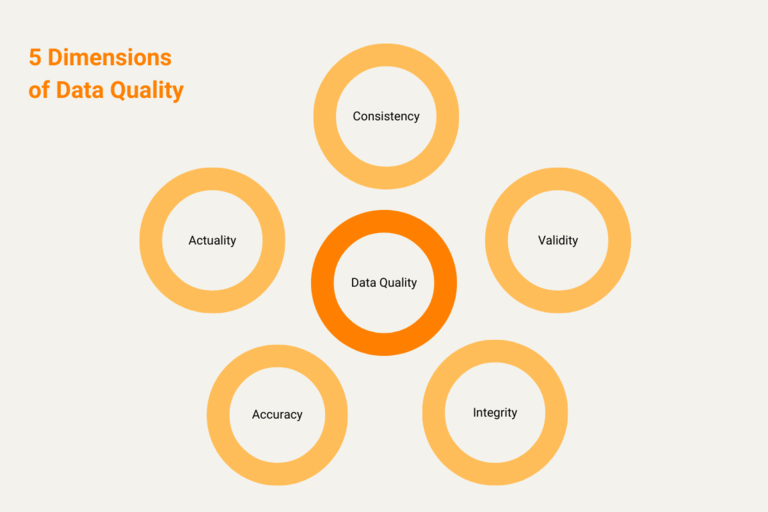
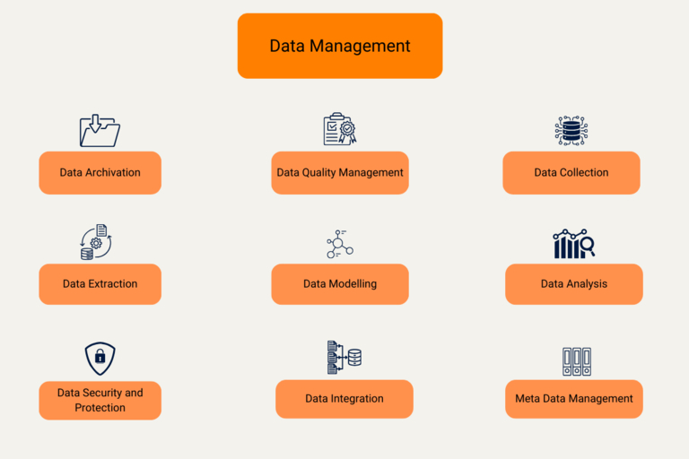
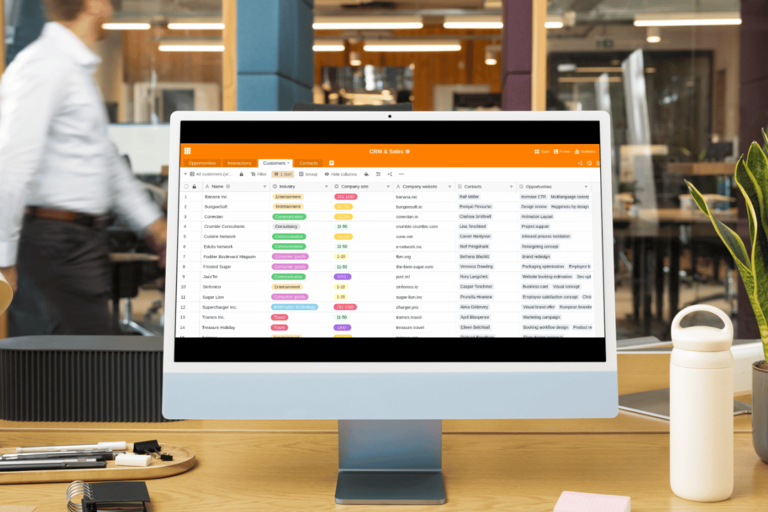

## Управление данными гарантирует успех

**Данные - на вес золота**: Данные о клиентах, сотрудниках, продуктах или проектах - в цифровую эпоху способность вашей компании эффективно управлять данными и обрабатывать их имеет решающее значение для вашего долгосрочного успеха. **Управление данными** - часто называемое управлением данными - это ключ к тому, чтобы справиться с потоком информации, с которым ваша компания сталкивается ежедневно. Следовательно, продуманная система **управления данными** является главным условием оцифровки компаний: Это единственный способ улучшить операционные процессы и получить конкурентное преимущество.

Но почему управление данными так важно для оцифровки процессов? И какие проблемы и возможности оно открывает? Узнайте из этой статьи!

## Что такое управление данными?

Под управлением **данными** понимается совокупность всех процессов, методов и технологий, которые компании используют для систематической записи, хранения, анализа и использования своих данных. Основными целями являются:

- обеспечить доступность, согласованность и качество данных
- получать ценные сведения из данных
- принятие обоснованных бизнес-решений
- повысить производительность и эффективность

### Что включает в себя управление данными?

**Управление данными** включает в себя целый ряд задач, таких как определение, сбор и хранение данных, их обслуживание и анализ, а также определенные меры предосторожности для обеспечения безопасности данных. Особенно актуальными являются следующие подразделы:

Все начинается с захвата, сбора или генерации данных: если **захват данных** означает выборочный ввод данных для электронной обработки, то **сбор данных** происходит в течение более длительного периода времени. Генерация данных\*\* означает создание и сбор больших объемов данных с помощью алгоритмов.

Задача **интеграции данных** заключается в объединении и согласовании данных из разных источников. При **моделировании данных** вы структурируете данные, чтобы впоследствии их можно было легче и быстрее обрабатывать.

При **анализе данных** вы оцениваете данные с помощью различных методов анализа, таких как статистика, интеллектуальный анализ данных, машинное обучение или бизнес-аналитика, чтобы выявить закономерности или тенденции в массивах данных.

**Управление качеством данных** направлено на повышение качества данных и обеспечение их корректности, полноты, актуальности и однозначности.

Если вы хотите хранить данные в течение длительного времени и сделать их доступными, вы можете организовать **архивирование данных** на высокопроизводительных носителях или в облачных хранилищах. С помощью **управления метаданными** вы также управляете такими метаданными, как тип данных или дата создания.

Что касается **защиты данных** и **безопасности данных**, то для защиты данных от несанкционированного доступа или потери, а также для соблюдения требований законодательства вам следует принять различные меры, связанные с шифрованием, правами доступа или резервным копированием.

## Управление данными как основа цифровизации в компаниях

Технологические компании, такие как SAP, Google и Meta, осознали это уже несколько десятилетий назад: Данные бесценны. В нашем быстро меняющемся мире именно данные являются основным капиталом многих компаний, позволяющим своевременно распознавать тенденции, принимать обоснованные решения и всегда быть на шаг впереди конкурентов. Поэтому доступность, качество и использование данных являются одними из важнейших факторов оцифровки компаний. Однако управление данными включает в себя не только внедрение новых технологий, но и оптимизацию процессов и структур.

Без эффективного управления данными компании не смогут полностью использовать потенциал цифровизации процессов, поскольку точная обработка данных является основой для цифровых и автоматизированных бизнес-процессов. Высокая значимость данных в цепочке создания стоимости побуждает малые и средние компании расширять сферу управления данными, чтобы получать от них больше пользы.

## Цифровизация процессов: преимущества благодаря управлению данными

Цифровизация процессов - это **оцифровка аналоговых процессов** или улучшение существующих цифровых процессов. Функционирующая система управления данными играет центральную роль в этой трансформации. Она обеспечивает наличие **необходимых данных в хорошем качестве, в нужное время и в нужном месте**. Это позволяет автоматизировать процессы и сократить количество человеческих ошибок.

Благодаря эффективному управлению данными можно добиться **высокой целостности и качества данных**, что, в свою очередь, способствует принятию более обоснованных решений. Вы также можете сократить расходы, эффективно используя данные, избегая их избыточности и полагаясь на технологии хранения, которые настолько же доступны, насколько и безопасны. Оптимизация, цифровизация и автоматизация процессов\*\* также являются преимуществами правильного управления данными.

Конкретным примером этого является использование управления данными в производстве. Современные производственные предприятия используют большое количество данных с датчиков для мониторинга и корректировки производственных процессов в режиме реального времени. Без надежной системы управления данными такие передовые производственные процессы было бы практически невозможно реализовать. Но управление данными также необходимо для оцифровки в сфере [управления персоналом](), [маркетинга]() и бухгалтерского учета.

### Возможности эффективного управления данными

- **Повышение эффективности**: Автоматизированные процессы сокращают объем ручной работы и сводят к минимуму человеческие ошибки.
- **Лучшие решения**: Решения, основанные на данных, как правило, более обоснованы и приводят к лучшим результатам в бизнесе.
- **Экономия затрат**: Оптимизация использования данных и ресурсов позволяет сократить расходы.
- **Конкурентное преимущество**: Компании, которые эффективно используют свои данные, могут быстрее реагировать на тенденции, что дает им преимущество перед конкурентами.

## Проблемы управления данными

Несмотря на то что управление данными необходимо для работы и цифровизации компаний, для многих организаций оно сопряжено со следующими проблемами:

1. **Масштабируемость**: В эпоху Больших Данных система управления данными должна быть масштабируемой, чтобы успевать за растущими объемами данных. Только в этом случае вы сможете хранить и использовать данные из различных источников, таких как датчики, камеры или клавиатуры.
1. **Интеграция данных**: Еще одна проблема - сложность этих данных. Если вы храните данные в разных системах и форматах, то прежде чем эффективно их использовать, необходимо их объединить и согласовать. Особенно если речь идет о больших объемах данных из разных источников, создание единой структуры может занять много времени и оказаться сложной задачей.
1. **Использование данных:** Сам по себе сбор данных не дает никакой добавленной стоимости - ведь эти данные не будут полезны, пока вы их не используете. Подготовка данных к анализу может занять много времени и сил, будь то стандартизация форматов данных, агрегирование наборов данных или удаление дубликатов. Если управление данными отнимает слишком много времени, анализ не будет проведен, и потенциальная ценность этих данных будет потеряна.
1. **Качество данных**: Одной из самых больших проблем в управлении данными является обеспечение их качества. Если данные устарели, неполны или неверны, это может привести к неправильному анализу и принятию решений. Поэтому постоянное обслуживание данных, при котором вы обновляете и очищаете их, имеет огромное значение.
1. **Безопасность и защита данных**: Правила защиты данных и соблюдения нормативных требований являются многонациональными и регулярно меняются. С увеличением объема собираемых данных возрастает и риск возникновения конфликтов, связанных с защитой данных. С одной стороны, вы должны обеспечить защиту персональных данных от несанкционированного доступа, с другой - иметь возможность легко удалить хранящиеся данные или адаптировать их к изменившимся правилам использования.

## Как вы можете использовать управление данными для оцифровки в компаниях

Если вы инвестируете в надежную систему управления данными, вы сможете преодолеть эти проблемы. Однако успешное управление данными требует тщательного планирования и четкой стратегии. Вот несколько лучших практик, которые следует учитывать, когда речь идет об управлении данными:

- Создайте понимание важности данных и поощряйте сотрудников к сбору, анализу и обмену данными, связанными с их работой.
- Соответственно, вы должны организовать обучение, чтобы ваши сотрудники обладали необходимыми навыками и знаниями для аккуратного обращения с данными и их эффективного использования.
- И последнее, но не менее важное: инвестируйте в инструменты и технологии, которые позволят вам эффективно собирать, хранить и анализировать данные.

## Проверенные системы управления данными

В принципе, большие данные - это именно то, что звучит, - огромный объем данных. Чтобы придать им смысл, необходимо структурировать и обрабатывать эти данные. Как правило, данные хранятся в базах данных, которые структурируются по-разному в зависимости от их назначения. Обеспечить мощную инфраструктуру, особенно когда речь идет об обработке больших объемов данных, бывает непросто.

Системы управления данными - это базовые ИТ-системы, с помощью которых вы **захватываете, храните и анализируете** данные в своей компании. Существуют различные системы управления данными, отвечающие различным требованиям, например реляционные базы данных, базы данных NoSQL или хранилища данных. Реляционные базы данных являются наиболее распространенными и характеризуются табличной структурой. Базы данных NoSQL, с другой стороны, особенно подходят для обработки больших объемов данных.

#### Системы управления данными с первого взгляда

Существует широкий спектр инструментов и программного обеспечения, которые вы можете использовать для управления данными. Здесь представлен обзор некоторых проверенных систем управления данными:

- **Реляционные системы управления базами данных (РСУБД)**: Реляционные базы данных структурируют данные с помощью связей, которые могут быть представлены в таблицах. Это позволяет эффективно хранить, извлекать и обрабатывать данные. Наиболее распространенным языком баз данных является SQL, на котором написаны такие известные системы управления реляционными базами данных, как MySQL, Microsoft SQL Server и PostgreSQL.
- **Системы управления базами данных NoSQL**: По сравнению с РСУБД, базы данных NoSQL предлагают гибкую структуру данных и горизонтальное масштабирование, что лучше подходит для больших объемов данных, высоких требований к производительности и частых изменений. Примерами систем управления базами данных NoSQL являются MongoDB, Apache Cassandra и CouchDB.
- **Хранилища данных**: Хранилище данных - это база данных, специализирующаяся на аналитике, которая консолидирует большие объемы данных из различных источников в единый набор данных. Менеджеры по управлению данными могут обрабатывать и анализировать эти данные, чтобы, например, получить полное представление о бизнес-процессах компании. Среди систем хранения данных стоит упомянуть Oracle Exadata, IBM Netezza, Amazon Redshift и Snowflake.
- **Озера данных**: Озеро данных - это хранилище, в котором хранятся все необработанные данные организации. Оно может содержать как структурированные данные из реляционных баз данных, так и неструктурированные (например, электронную почту, документы PDF и файлы изображений). В отличие от хранилища данных, данные в озере данных обрабатываются для анализа или визуализации только по мере необходимости. Системы озер данных, такие как Amazon S3, Microsoft Azure Data Lake или Google Cloud Storage, позволяют быстро и гибко обрабатывать большие объемы данных.
- Инструменты **MDM**: Инструменты управления основными данными помогают управлять и поддерживать основные данные компании. К наиболее важным основным данным относится информация о клиентах, поставщиках, продуктах и персонале. С помощью таких инструментов MDM, как SAP Master Data Governance или IBM InfoSphere MDM, вы сможете устранить несоответствия и обеспечить уникальность, полноту, отсутствие ошибок и актуальность основных бизнес-данных.

### Какая система управления данными является лучшей?

Выбор правильного программного обеспечения для управления данными зависит от конкретных требований, которые вы предъявляете к доступу к данным, их хранению, безопасности, интеграции и анализу. Вы можете решить, где хранить и анализировать данные - на собственных серверах ([On-Premises](https://seatable.com/ru/on-premises/)), в облаке или в гибридном сочетании.

Одна из тенденций, которую можно наблюдать, - это растущее использование облачных решений для управления данными. Облачная платформа управления данными позволяет надежно хранить данные и эффективно их обрабатывать без необходимости инвестировать в дорогостоящую инфраструктуру.

## Реляционная некодируемая база данных в облаке или в локальной сети

В табличной [бескодовой базе данных SeaTable]() вы можете эффективно хранить, извлекать и анализировать данные, не обладая знаниями SQL или другим предварительным техническим опытом. Вы можете не только легко структурировать и связывать данные, но и хранить файлы, изображения и документы.

В отличие от других реляционных баз данных, **графический пользовательский интерфейс** SeaTable позволяет проводить анализ напрямую. Для дальнейшего анализа доступны многочисленные статистические данные. Если этого недостаточно, вы можете визуализировать данные в виде галерей, календарей, организационных диаграмм и т. д. с помощью [плагинов](https://seatable.io/ru/docs/plugins/alle-plugins-in-der-uebersicht/).

С помощью **no-code app builder** от SeaTable вы можете создавать собственные приложения без каких-либо знаний программирования и, таким образом, точно контролировать доступ к данным в вашей базе. Для дизайна приложения есть готовые типы страниц с визуальными элементами, которые можно просто перетаскивать друг к другу.

SeaTable дает вам свободу выбора между удобством [облачного решения](https://seatable.com/ru/cloud/) и суверенитетом данных, который вы получаете при самостоятельном использовании системы. У вас уже заложило уши? Тогда [зарегистрируйтесь бесплатно]() и попробуйте облако SeaTable в течение неограниченного времени.

## Продвижение цифровых технологий в вашей компании

В мире, который становится все более цифровым, управление данными - это не только технологическая задача, но и стратегический фактор успеха для компаний. Подходящая система управления данными создает основу для оцифровки процессов и позволяет полностью использовать потенциал цифровизации в вашей компании. Если у вас есть полный обзор данных, вы можете принимать правильные решения и в будущем оставаться на шаг впереди конкурентов. Поэтому инвестиции в сложную систему управления данными - обязательное условие для любой компании, которая хочет оставаться конкурентоспособной и использовать возможности, открывающиеся благодаря цифровизации.

## FAQ

Управление данными\*\* - это совокупность всех процессов, методов и технологий, которые компании используют для систематической записи, хранения, анализа и использования своих данных.

Управление данными включает в себя такие сложные области, как сбор и хранение данных, интеграция и моделирование данных, обслуживание и качество данных, анализ данных и их защита.

Данные бесценны для раннего выявления тенденций и принятия обоснованных решений. Кроме того, функционирующая система управления данными имеет решающее значение для оцифровки и автоматизации процессов. Эффективно используя данные, вы сможете сэкономить расходы и получить конкурентное преимущество.

В основном у вас есть выбор между системами управления реляционными базами данных, базами данных NoSQL, хранилищами данных и озерами данных.


