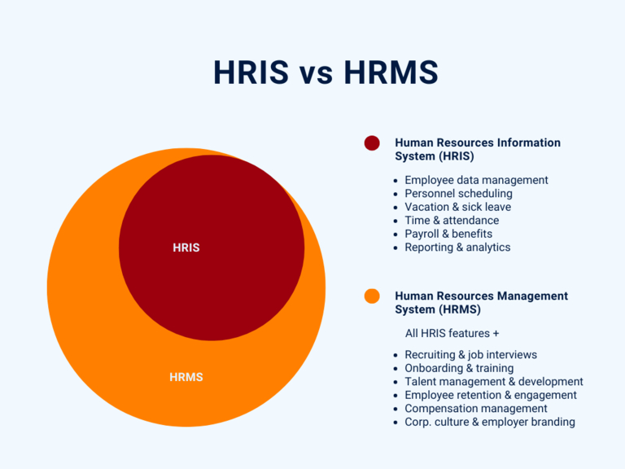

## Was ist ein HRIS?

Ein **Personalinformationssystem (Human Resources Information System, kurz HRIS)** ist eine Softwarelösung, mit der Sie die Mitarbeiterdaten Ihres Unternehmens erfassen, speichern und verwalten können. Auf jeden Fall muss ein HRIS die grundlegenden Funktionen und Prozesse abdecken, die für eine reibungslose Personalverwaltung erforderlich sind. Dazu zählen unter anderem: 

- Verwaltung von Mitarbeiterdaten und Personalakten
- Personaleinsatzplanung und Zeiterfassung
- Urlaubsanträge und Krankmeldungen
- Payroll / Gehaltsabrechnung
- Sozialversicherungen und Benefits
- Berichte und Analysen

## Was unterscheidet ein HRIS von einem HRMS?

Da es sich bei Personalverwaltungssoftware häufig um klassische **All-in-one-Lösungen** handelt, sind die Unterschiede zwischen einem HR-Management-System und einem HRIS nicht auf den ersten Blick ersichtlich. Oft werden die Begriffe daher fälschlicherweise synonym verwendet. Ein HRIS bezieht sich aber lediglich auf die Administration der bestehenden Mitarbeiter und Basisprozesse, die für einen funktionierenden Betrieb unerlässlich sind.

Ein **Personalmanagementsystem (Human Resources Management System, kurz HRMS)** geht hier deutlich weiter. Vereinfacht gesagt umfasst ein HR Management System alle Funktionen eines HRIS und darüber hinaus:

- Recruiting und Bewerbermanagement 
- Onboarding und Offboarding
- Mitarbeiterbindung und -zufriedenheit

Zudem ist manchmal die Rede vom Human Capital Management (HCM). Dieses bezieht zusätzlich zum HR Management / Information System weitere Prozesse auf einer strategischen Ebene mit ein, wie zum Beispiel:

- Talentmanagement und Karrierepfade
- Vergütungsmanagement
- Personalentwicklung und Weiterbildung

Je nach Anbieter unterscheidet sich der Funktionsumfang der Personalverwaltungssoftware erheblich. Achten Sie bei der Auswahl Ihrer HR Management Software also darauf, welche Funktionen Sie benötigen. Während ein HRIS mit einer einfachen Mitarbeiterdatenbank für alltägliche administrative Prozesse überzeugt, bringt ein HRMS komplexere Funktionen für die (qualitative) Personalplanung mit sich.

## Warum ein HRIS unverzichtbar ist

Im Wesentlichen bietet Ihnen ein HRIS die Chance, Prozesse in Ihrer Personalabteilung effizienter zu gestalten und datengestützte Entscheidungen zu treffen. Denn die Personalabteilung ist neben der Buchhaltung eine der **verwaltungsintensivsten** Abteilungen jedes Unternehmens. Deswegen sind Sie nicht nur mit einer enormen Menge an Bürokratie und Unterlagen konfrontiert, sondern Sie verwalten auch besonders wertvolle und **sensible Informationen** über Ihre Beschäftigten und Bewerber. 

Über ein HRIS erhalten Mitarbeiter normalerweise Zugriff auf bestimmte digitale Systeme zur **Arbeitszeiterfassung**, **[Urlaubsplanung]()** und **Krankmeldung**. Das heißt, sie können selbst ihre Daten erfassen und Dokumente hochladen und entlasten damit die Personalabteilung. Über diese HR-Datenbank können Sie Ihren Beschäftigten im Sinne des **Employee Self Service** zudem Gehaltsabrechnungen, Formulare für bestimmte Anträge sowie Infomaterial und Checklisten zu bestimmten Prozessen wie beispielsweise On- und Offboarding zur Verfügung stellen.

Ein modernes Personalinformationssystem kann außerdem Workflows automatisieren, Feedback integrieren und Daten für das Reporting aggregieren. Durch die Synchronisation in Echtzeit, intuitive Benutzeroberflächen und flexible Funktionen ermöglichen moderne HRIS heute äußerst effizient, produktiv und agil zu arbeiten.

## Wie mit einem HRIS der Datenschutz gelingt

Da ein HRIS sensible, persönliche Informationen enthält, ergeben sich hohe Anforderungen an die Sicherheit und Zugriffskontrolle. Die Datenspeicherung erfolgt im Regelfall in einer zentralen **HR-Datenbank**. Wer auf welche Datensätze zugreifen kann, wird meist anhand von Rollen oder individuellen Zugriffsrechten definiert.

### Was ist eine HR Datenbank?

Eine HR- oder Personaldatenbank ist ein IT-System zur Speicherung, Aggregierung und Auswertung von Mitarbeiterdaten.

Dabei sind folgende Punkte zu gewährleisten:

- Einhaltung aller datenschutzrechtlichen Vorschriften (z. B. DSGVO)
- Vertraulichkeit der Personaldaten und Schutz vor unberechtigtem Mitlesen
- Zuverlässige Datensicherung und Schutz vor Datenverlust
- Authentifizierung des Benutzers
- Integrität der Daten und Schutz vor Verfälschung
- Nachvollziehbarkeit der Dateneingabe und Änderungshistorie
- Fristgerechtes Löschen abgelaufener Daten

Früher wurde HRIS Software fast immer [On-Premises]() eingesetzt, was bedeutet, sie lief vor Ort auf der eigenen technischen Infrastruktur des Unternehmens. Heutzutage befindet sich die HR Management Software oft in der [Cloud](). Das hat den großen Vorteil, dass Sie und Ihre Mitarbeiter jederzeit und von überall auf alle Daten zugreifen können.

### Die wichtigsten Vorteile eines HRIS im Überblick

Ein Personalinformationssystem hat Vorteile, die weit über die Möglichkeiten einer Excel Mitarbeiterdatenbank hinausgehen. Dazu zählen im Wesentlichen:

Viele Personalabteilungen sammeln auch heute noch Mitarbeiterdaten in Excel-Tabellen oder heften Dokumente in klassischen Ordnern ab. Mit einem HRIS können Sie hingegen alle relevanten Mitarbeiterdaten und Dokumente digital in einer zentralen HR Datenbank speichern. So haben Sie und Ihre Mitarbeiter (mit der entsprechenden Berechtigung) jederzeit gezielt Zugriff auf den aktuellen Stand. Veraltete Excel-Listen und Datenchaos gehören endlich der Vergangenheit an! Zudem sind die Daten im HR Management System gespeichert, selbst wenn mal ein Firmenhandy oder Laptop verloren geht.

In einer Excel Mitarbeiterdatenbank müssen Sie alle Daten manuell eintragen oder hin und her kopieren, während ein Personalinformationssystem die Daten automatisch für alle synchronisiert und aktualisiert, sobald ein Teammitglied Änderungen vornimmt. Mithilfe Ihrer eigens definierten Automationen können Sie außerdem beispielsweise Urlaubsanträge mit nur einem Knopfdruck genehmigen oder einem erkrankten Mitarbeiter eine vorgefertigte Bestätigungs-E-Mail inklusive „Gute Besserung“ schicken. Das spart nicht nur Zeit, sondern verringert auch fehleranfällige manuelle Prozesse.

Durch digitale und automatisierte Prozesse können Sie und Ihre Mitarbeiter schneller, effizienter und nicht zuletzt kostengünstiger arbeiten, da Sie wertvolle Arbeitszeit sowie Papier- und Druckkosten sparen. Auch, wenn Sie bislang die Personalbuchhaltung an einen externen Dienstleister auslagern, kann Ihnen ein Personalinformationssystem helfen, mit internen Prozessen Geld zu sparen. Andererseits entstehen durch ein HRIS natürlich Kosten, die sich häufig aus einer monatlichen Nutzungsgebühr pro Teammitglied zusammensetzen. Unterm Strich sollte das Kosten-Nutzen-Verhältnis aber positiv sein.

Ein HRIS verschafft Ihnen einen fundierten Überblick über Ihre Mitarbeiterdaten. In digitalen Personalakten können Sie kompakt alle Dokumente und Informationen hinterlegen. Meist gibt es einen übergreifenden Kalender, sodass Sie und Ihre Mitarbeiter stets über alle Abwesenheiten, Urlaube und Krankmeldungen informiert sind. Dies ist für die Personaleinsatzplanung ebenso wichtig. In einem guten HR Management System sind statistische Auswertungen ein Kinderspiel. Beantworten Sie auf einen Blick Fragen wie z. B.: Wie hoch war der Krankenstand im Oktober? Wie viele Einstellungen und Austritte gab es in den letzten zwei Jahren? Und was sind die voraussichtlichen Personalkosten für kommendes Jahr?

Zumeist haben Mitarbeiter in einem HRIS die Möglichkeit, ihre eigenen Daten zu pflegen. Lassen Sie Ihre Beschäftigten möglichst viele HR-Prozesse selbst regeln, z. B. ihre persönlichen Daten aktualisieren, Urlaubsanträge stellen oder Gehaltsabrechnungen herunterladen. Dies entlastet Ihre Personalabteilung und stellt eine Win-win-Situation für alle Beteiligten dar. Eine HR-Datenbank im Sinne einer internen Mitarbeiterübersicht führt ferner zu mehr Transparenz, weil jeder weiß, an wen er sich mit einem bestimmten Anliegen wenden kann. Solche für alle sichtbaren Informationen können zum Beispiel die genaue Position und Abteilung, bisherige Projekte, die berufliche E-Mail-Adresse oder die Firmenhandynummer einer Person sein.



## SeaTable als HRIS oder HRMS

SeaTable ist eine No-Code-Datenbank, die sich hervorragend als HR Management Software für die Cloud oder On-Premises eignet. Dabei bietet SeaTable höchste Flexibilität und Skalierbarkeit – Sie entscheiden selbst, wie Sie Ihre Prozesse in der Software abbilden und welche Funktionen Sie dafür benötigen.

Beispielsweise können Sie mit einer [Mitarbeiterverzeichnis Vorlage]() beginnen, die eine HR-Datenbank in ihrer einfachsten Form darstellt.

Es handelt sich hierbei um ein internes Mitarbeiterverzeichnis mit Informationen, die für alle im Unternehmen sichtbar sind. Solch eine Mitarbeiterliste könnten Sie beispielsweise für Profile im Personalinformationssystem oder zur Erstellung von Visitenkarten verwenden.

Anschließend können Sie Ihre HR-Datenbank beliebig mit weiteren Tabellen und Funktionen ausbauen. Wie wäre es beispielsweise mit einem interaktiven [Arbeitszeitkonto](), um alle Anwesenheiten, Urlaube und Krankheiten zu erfassen? Oder mit digitalen Personalakten, in denen alle Zeugnisse, Lebensläufe und Gehaltsabrechnungen abrufbar sind?

Über die Funktionen eines HRIS hinaus können Sie mit SeaTable aber auch das Recruiting, Bewerbermanagement und Onboarding umsetzen. Sogar die Personalentwicklung und Weiterbildung lässt sich in SeaTable organisieren. Als deutsche HR Datenbank erfüllt SeaTable höchste Datenschutzstandards (DSGVO) und speichert alle Daten sicher in deutschen Rechenzentren. Kaum zu glauben also, dass diese vollwertige Personalmanagement-Software kostenlos ist.

[Registrieren Sie sich noch heute]() und entdecken Sie unsere kostenlosen Vorlagen für HR Manager!
