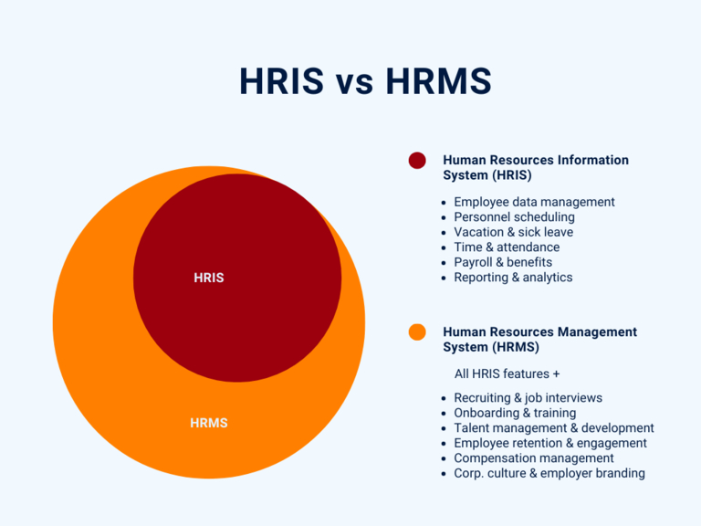

## O que é um HRIS?

Um **Sistema de Informação de Recursos Humanos (HRIS)** é uma solução de software que lhe permite registar, armazenar e gerir os dados dos empregados da sua empresa. Em qualquer caso, um HRIS deve abranger as funções e processos básicos necessários para uma boa administração de pessoal. Estes incluem, entre outros:

- Gestão dos dados dos empregados e dos ficheiros do pessoal
- Programação do pessoal e registo de horas
- Pedidos de férias e notas de doença
- Cálculo dos salários / contabilidade dos salários
- Segurança social e prestações sociais
- Relatórios e análises

## O que distingue um HRIS de um HRMS?

Como o software de gestão de RH é frequentemente uma solução clássica **tudo-em-um**, as diferenças entre um sistema de gestão de RH e um HRIS não são imediatamente óbvias. Por conseguinte, os termos são muitas vezes utilizados erradamente como sinónimos. No entanto, um HRIS refere-se apenas à administração dos empregados existentes e aos processos básicos que são essenciais para o funcionamento de uma empresa.

Um **Sistema de Gestão de Recursos Humanos (SGRH)** vai muito mais longe a este respeito. Em termos simples, um sistema de gestão de recursos humanos engloba todas as funções de um SIRH e muito mais:

- Recrutamento e gestão de candidatos
- Integração e desligamento
- Retenção e satisfação dos empregados

A gestão do capital humano (HCM) é também por vezes mencionada. Para além do sistema de gestão/informação de RH, inclui também outros processos a nível estratégico, tais como

- Gestão de talentos e percursos profissionais
- Gestão das remunerações
- Desenvolvimento do pessoal e formação

O âmbito funcional do software de gestão de RH varia consideravelmente consoante o fornecedor. Por isso, ao escolher o seu software de gestão de RH, preste atenção às funções de que necessita. Enquanto um HRIS convence com uma simples base de dados de empregados para os processos administrativos diários, um HRMS oferece funções mais complexas para o planeamento (qualitativo) do pessoal.

## Porque é que um HRIS é indispensável

Essencialmente, um HRIS oferece-lhe a oportunidade de organizar os processos no seu departamento de RH de forma mais eficiente e tomar decisões com base em dados. Afinal de contas, o departamento de RH é um dos departamentos mais **administrativos intensivos** de qualquer organização, a par da contabilidade. Por conseguinte, não só é confrontado com uma enorme quantidade de burocracia e documentação, como também gere informações particularmente valiosas e **sensíveis** sobre os seus empregados e candidatos.

Um HRIS dá geralmente aos empregados acesso a certos sistemas digitais para **registo do tempo de trabalho**, **[planeamento de férias] ()** e **licença por doença**. Isto significa que podem introduzir os seus próprios dados e carregar documentos, aliviando assim o departamento de RH. Pode também utilizar esta base de dados de recursos humanos para fornecer aos seus empregados folhas de vencimento, formulários para determinadas candidaturas, material informativo e listas de verificação para processos específicos, como a integração e a desinstalação, no âmbito do **autosserviço aos empregados**.

Um sistema de informação de RH moderno pode também automatizar fluxos de trabalho, integrar feedback e agregar dados para relatórios. Graças à sincronização em tempo real, às interfaces de utilizador intuitivas e às funções flexíveis, os SIRH modernos permitem agora trabalhar de forma extremamente eficiente, produtiva e ágil.

## Como a proteção de dados é bem sucedida com um HRIS

Uma vez que um HRIS contém informações sensíveis e pessoais, existem elevados requisitos de segurança e controlo de acesso. Os dados são normalmente armazenados numa **base de dados de RH** centralizada. Quem pode aceder a que registos de dados é normalmente definido com base em funções ou direitos de acesso individuais.

### O que é uma base de dados de RH?

Uma base de dados de RH ou de pessoal é um sistema informático para armazenar, agregar e analisar os dados dos trabalhadores.

Os seguintes pontos devem ser garantidos:

- Conformidade com todos os regulamentos de proteção de dados (por exemplo, o RGPD)
- Confidencialidade dos dados pessoais e proteção contra o acesso não autorizado
- Backup fiável dos dados e proteção contra a perda de dados
- Autenticação do utilizador
- Integridade dos dados e proteção contra a falsificação
- Rastreabilidade da introdução de dados e do historial de alterações
- Eliminação atempada de dados expirados

No passado, o software HRIS era quase sempre utilizado [on-premises](), o que significa que era executado localmente na infraestrutura técnica da própria empresa. Atualmente, o software de gestão de RH está muitas vezes localizado na [nuvem](). Isto tem a grande vantagem de permitir que o utilizador e os seus empregados acedam a todos os dados em qualquer altura e a partir de qualquer lugar.

### As vantagens mais importantes de um HRIS num relance

Um sistema de informação de RH tem vantagens que vão muito além das possibilidades de uma base de dados de empregados em Excel. Estas incluem essencialmente

A gestão de recursos humanos (FIXME:)



Ainda hoje, muitos departamentos de RH continuam a recolher dados dos funcionários em folhas de cálculo Excel ou a arquivar documentos em pastas tradicionais. No entanto, com um HRIS, é possível armazenar digitalmente todos os dados e documentos relevantes dos funcionários numa base de dados central de RH. Isto dá-lhe a si e aos seus empregados (com a devida autorização) um acesso direcionado ao estado atual em qualquer altura. As listas Excel desactualizadas e o caos de dados são finalmente uma coisa do passado! Além disso, os dados são armazenados no sistema de gestão de RH, mesmo em caso de perda de um telemóvel ou portátil da empresa.




Numa base de dados de funcionários em Excel, tem de introduzir todos os dados manualmente ou copiá-los para trás e para a frente, ao passo que um sistema de informação de pessoal sincroniza e actualiza automaticamente os dados de todos assim que um membro da equipa faz alterações. Com a ajuda das suas automatizações especialmente definidas, pode também aprovar pedidos de férias com o toque de um botão, por exemplo, ou enviar a um empregado doente um e-mail de confirmação já preparado, incluindo uma mensagem de "melhoras rápidas". Isto não só poupa tempo, como também reduz os processos manuais propensos a erros.




Os processos digitais e automatizados permitem-lhe a si e aos seus empregados trabalhar mais rapidamente, de forma mais eficiente e, por último, mas não menos importante, de forma mais económica, uma vez que poupa tempo de trabalho valioso, bem como custos de papel e impressão. Mesmo que tenha subcontratado a contabilidade do pessoal a um prestador de serviços externo, um sistema de informação do pessoal pode ajudá-lo a poupar dinheiro com processos internos. Por outro lado, um HRIS incorre naturalmente em custos, que muitas vezes consistem numa taxa de utilização mensal por membro da equipa. No entanto, no cômputo geral, a relação custo-benefício deve ser positiva.




Um HRIS fornece-lhe uma visão geral bem fundamentada dos dados dos seus empregados. Pode armazenar todos os documentos e informações de forma compacta em ficheiros pessoais digitais. Normalmente, existe um calendário completo para que o utilizador e os seus colaboradores estejam sempre informados sobre todas as ausências, férias e baixas médicas. Isto é igualmente importante para a programação do pessoal. Num bom sistema de gestão de RH, as análises estatísticas são uma brincadeira de crianças. Responde a perguntas num relance, tais como: Qual foi a taxa de doença em outubro? Quantas novas contratações e saídas se registaram nos últimos dois anos? E quais são os custos de pessoal previstos para o próximo ano?




Na maioria dos casos, os empregados têm a opção de manter os seus próprios dados num HRIS. Permita que os seus colaboradores gerem eles próprios o maior número possível de processos de RH, por exemplo, atualizar os seus dados pessoais, apresentar pedidos de férias ou descarregar folhas de vencimento. Isto alivia a pressão sobre o departamento de RH e é uma situação vantajosa para todos os envolvidos. Uma base de dados de RH, no sentido de uma visão geral interna dos empregados, também conduz a uma maior transparência, porque todos sabem a quem se dirigir em caso de preocupação específica. Essas informações, que são visíveis para todos, podem incluir, por exemplo, o cargo e o departamento exactos, projectos anteriores, o endereço eletrónico profissional de uma pessoa ou o número de telemóvel da empresa.



## SeaTable como HRIS ou HRMS

O SeaTable é uma base de dados sem código que é ideal como software de gestão de RH para a nuvem ou no local. O SeaTable oferece a máxima flexibilidade e escalabilidade - o utilizador decide como pretende mapear os seus processos no software e quais as funções de que necessita.

Por exemplo, pode começar com um [modelo de diretório de empregados] (https://seatable.io/vorlage/ijapmslssfu7r-6q6x9boq/), que representa uma base de dados de RH na sua forma mais simples.

Este é um diretório interno de empregados com informação visível para todos na empresa. Pode utilizar-se esta lista de empregados para perfis no sistema de informação HR ou para criar cartões de visita, por exemplo.

Pode depois expandir a sua base de dados de RH com tabelas e funções adicionais, conforme desejar. Que tal uma [conta de tempo de trabalho] interactiva (https://seatable.io/vorlage/fyp0x2y-s-ut3m-wcbpzbq/), por exemplo, para registar todas as presenças, férias e doenças? Ou com ficheiros pessoais digitais, nos quais é possível aceder a todos os certificados, CVs e recibos de vencimento?

Para além das funções de um HRIS, também pode utilizar o SeaTable para implementar o recrutamento, a gestão de candidatos e a integração. Até o desenvolvimento do pessoal e a formação contínua podem ser organizados no SeaTable. Enquanto base de dados de RH alemã, o SeaTable cumpre as mais elevadas normas de proteção de dados (RGPD) e armazena todos os dados de forma segura em centros de dados alemães. Por isso, é difícil acreditar que este software de gestão de RH completo é gratuito.

[Registe-se hoje] () e descubra os nossos modelos gratuitos para gestores de RH!
