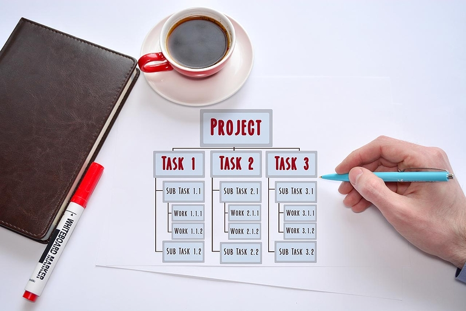
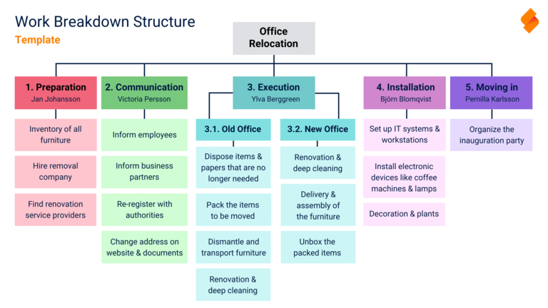
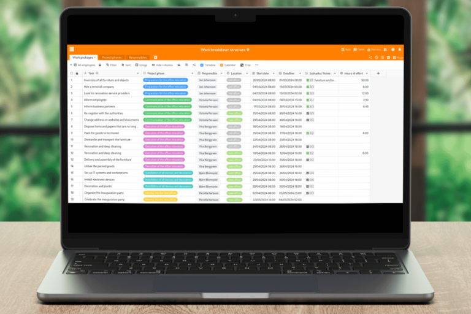

## The work breakdown structure: A structured approach to projects

To break down an initially abstract project into plannable elements, you can use a work breakdown structure to divide your approach into **tasks** and **work packages**. In this article, you will learn about the advantages of work breakdown structure planning with a template. Use our tips to create a work breakdown structure template for free and find the right work breakdown structure software for your company!

## What is a work breakdown structure (WBS)?

Let's start with a **work breakdown structure definition**: A work breakdown structure, or WBS for short, is a core element of project planning and illustrates the sub-projects, dependencies and interrelationships within your project. A work breakdown structure is created at the start of a project and provides all those involved with an overview. How to structure your project successfully!

### What types of presentation are there?

A classic work breakdown structure example is a **tree diagram**. It can also be presented as a mind map, list or indented continuous text.

In all forms of project structure planning based on a template, the elements are **coded**. This step takes into account the aim that each task should only appear once in the work breakdown structure. An example of coding is a number for the level, followed by consecutive numbering for the elements dependent on the level (e.g. 3.1 for the first element of the third level).

### How is the work breakdown structure structured?

In a tree structure, you start with the **superordinate project objective** as the main node. Each subsequent level is organized according to different functions, phases or objects. You must decide on a structuring principle for each level.

- **Function-oriented work breakdown structure**: This type of outline focuses on the people or departments responsible for the tasks. Function-oriented outlines at the second level are ideal if you want regular reporting on the current status by those responsible as the project progresses.
- **Phase-oriented work breakdown structure**: Put all tasks in a logical chronological order by grouping them by project phase. This is particularly useful for very lengthy projects. In this case, the elements on the second level should mark important milestones in your project.
- **Object-oriented work breakdown structure**: Here you organize the tasks according to the individual parts of the end product or according to where the activities take place. In construction projects, for example, it can make sense to divide a work breakdown structure into rooms, assemblies or trades (e.g. shell construction, pipes, bathrooms, roof) in an object-oriented manner.

This is followed at the lowest level by the respective **work packages** including the required resources such as budget, time and manpower. The more detailed you are here, the easier it will be to estimate the work involved. If a work package is formulated too vaguely, it is worth breaking it down further. A work package should always depend on a subtask of the second level. Depending on the complexity, further levels are also conceivable between the second and third levels.

## Why is it useful to create a work breakdown structure?

A work breakdown structure is suitable as a template for all other plans in your project. If you wish, it forms the foundation for your resource, cost and schedule planning as well as risk management. This is why this project plan is often referred to as the "plan of plans".

### What are the advantages of a WBS template?

The work breakdown structure visualizes an entire project and can thus provide you with a basic overview of all upcoming tasks. It makes it easier for you to estimate the workload and plan the rest of the project, as you define the tasks clearly and completely right from the start. This also makes it less likely that you will completely miscalculate and fall behind schedule. As the project progresses, you can tick off completed tasks and document your progress.

## How to create a work breakdown structure in 6 steps

Now it's time for the actual implementation. We will use an office relocation as an example to create a work breakdown structure template and demonstrate the advantages of a work breakdown structure template.

### 1\. Define project objective(s)

In a kick-off workshop with all project participants, you define the project objectives according to the **SMART criteria** (specific, measurable, attractive, realistic, time-bound). Either there is a single objective for the entire project or it must be broken down into sub-projects. In our case, the overarching goal is to move from the previous office to a new office on time.

### 2\. Define subtasks

Next, think about how you want to achieve your goal and which subtasks are required to do so. One option is to organize this level according to phases. Typical project phases are, for example, preparation, planning, implementation, monitoring, evaluation and completion. You can find more information on the structure of the WBS above.

### 3\. Putting together work packages

In the next step, you define the work packages for each of these points in the work breakdown structure. For example, list all tasks and cluster them into subject areas.

### 4\. Assign packages to the subtasks

Next, assign the packages to the appropriate subtasks (here: project phases). At this point, you also have the opportunity to enter the persons responsible for the tasks. You only define start dates and deadlines if you do not select another project plan for the project schedule in addition to the WBS.

### 5\. Review and adjustment

In the first step, check your work breakdown structure template for **completeness**. Have you included all the tasks you need to achieve your goals? As a rule, you will recognize up to 90 percent of all work packages in the first draft of the work breakdown structure. Go through your PSP work breakdown structure template again with all those involved.

To cover any missing aspects in the work breakdown structure template, you can include additional points in the WBS. In the further course, however, it is primarily a matter of checking the **uniqueness of all elements**: Are all tasks at one level unique and different from each other in terms of content? Or can you combine some work packages and eliminate duplications?

### 6\. Detailed planning of the work packages

Finally, you start the detailed planning of the work packages. This is where you define the specific to-dos. Are all processes coherent and are the work packages in the right place in the WBS? Has the project objective been achieved as soon as all defined tasks have been completed? If so, your work breakdown structure is ready for use.

## Work breakdown structure templates and tools

Of course, you can create a work breakdown structure without any digital templates or tools. In the office, simply use **index cards** and masking tape and stick the elements on the wall during a meeting. This also works with a whiteboard and magnets.

However, these methods are tied to the location and are very cumbersome if the plan is later needed in a decentralized manner. Even if you take photos of your work, the work breakdown structure is unchangeable for the other participants: For more flexibility, you should create the work breakdown structure online. This is where various programs and work breakdown structure software come into play.

## Which software you can use to create a work breakdown structure

It is not a good idea to try to create a work breakdown structure with **Excel**. Even if you are familiar with the Excel spreadsheet, it is hardly suitable for agile project management. The same applies if you are considering using a work breakdown structure template from **Word**. Compared to other programs, the well-known Microsoft Office applications are only made for pure text entry and spreadsheets - and not for collaborative project work in real time, the visualization of different data types or the flexible adaptation and structuring of projects.

So do yourself a favor and use suitable software for your work breakdown structure. You can choose between diagram, mind mapping or list tools, depending on the type of presentation you require. Two well-known diagramming tools that are also suitable for creating a work breakdown structure are **Gliffy** and **Lucidchart**. You can use these to display the work breakdown structure as a classic tree diagram, for example.

If you want a mind map, **Miro** is the leading provider. However, there are also a dozen other tools, such as **MindManager**, with which you can achieve comparable results.

If you need an easy to work through list of tasks and more structure than a mind map, [SeaTable](https://seatable.com/) is for you. With this project management and collaboration platform, you can easily assign work packages to responsible parties and sub-projects.

## Advantages of the work breakdown structure template from SeaTable

SeaTable is a **no-code database** that offers an integrated **app builder** and many functions for team collaboration. Thanks to numerous column types, you can also record appointments, working hours, locations, to-dos, e-mail addresses, files and much more.

A work breakdown structure is complex because it has to show everything at a glance. With the help of personal views, you can set **filters** to hide certain task packages or levels. Let's say you want to see an individual **to-do list** per employee in the WBS. No problem: simply filter by the person responsible.

Everything in one place and everyone on the same page: There are no different versions of the work breakdown structure in SeaTable, as the files are not scattered on the computers of those involved. Instead, project participants can access the current work breakdown structure centrally and make changes **in real time** that are immediately visible to everyone. Also useful for collaborating on tasks are **comments** and automatic **notifications**, which you can use to inform everyone involved as soon as something is marked as completed, commented on or changed.



The biggest advantage of SeaTable, however, is the wide range of visualization options. Whether **calendars**, **timelines**, **Kanban boards** or **organizational charts** - there is everything your heart desires and even more: On the separate **whiteboard** you can freely sketch your work breakdown structure and create mind maps similar to those in Miro. Or you can use the brand new **Tree plugin** to show and hide the different levels of your work breakdown structure as you wish.

You can find the work breakdown structure template [here](https://seatable.io/vorlage/ijkegrn3q-ym8arpcq8qia/). Before you can use it, you need to register for free with your e-mail address.

## Create your work breakdown structure now

The concept behind the work breakdown structure sounds simple - but depending on the size of your project, it can quickly become complex and confusing. A work breakdown structure template in a suitable tool will help you to implement your project as efficiently and smoothly as possible.

[Register today](), start your next project and make it a success with SeaTable's free work breakdown structure template.

Do you still need a project plan that shows the chronological sequence of project phases or tasks? Then find out here [how to create a classic project plan](https://seatable.io/vorlage/yio4sr0wrcwuv3-1m0zvkg/).
